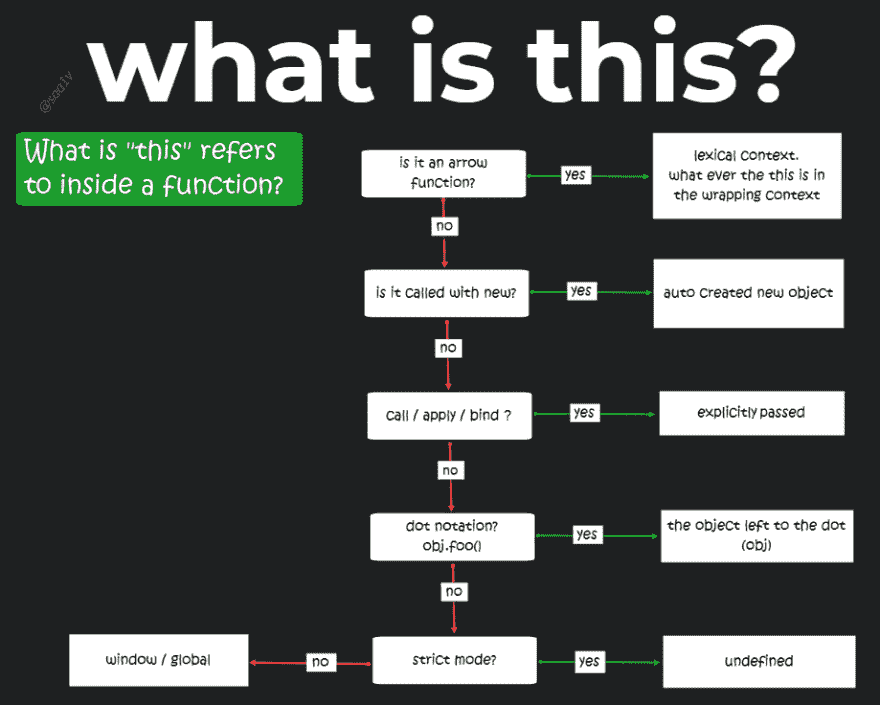

# JavaScript——深度的“这个”关键词

> 原文：<https://dev.to/sag1v/javascript-the-this-key-word-in-depth-4pkm>

最初发布在我的个人博客 [debuggr.io](https://www.debuggr.io/js-this-in-depth/)

在本文中，我们将学习如何在给定的上下文中识别和识别`this`所指的内容，并且我们将探索引擎在确定`this`关键字的引用时所考虑的规则和条件。

你也可以在我的博客[debuggr . io](https://www.debuggr.io/js-this-in-depth/)T3】阅读这篇文章和其他文章

## 挑战

JavaScript 中最具挑战性的概念之一是关键字`this`,可能是因为它与其他语言如此不同，也可能是因为确定其值的规则不是那么清晰。

让我们引用 MDN 的一段话:

> 在大多数情况下，这个值是由调用函数的方式决定的(运行时绑定)。在执行过程中不能通过赋值来设置，每次调用函数时可能都不一样...

的确很有挑战性，一方面它说`this`是在运行时确定的——即动态绑定，但另一方面它又说`In most cases...`，这意味着它可以被静态绑定。doe 的东西如何既可以是静态的又可以是动态的，我们如何在给定的上下文中确定它是哪一个？这正是我们现在要去发现的！

## 什么是静态？

让我们看一个 JavaScript 中静态的例子，比如“局部变量环境”——通常指的是作用域。

每次调用一个函数时，都会创建一个新的执行上下文，并将其推到[调用栈](https://developer.mozilla.org/en-US/docs/Glossary/Call_stack)的顶部(当我们的应用程序启动时，已经有一个默认的执行上下文，通常称为全局上下文)。
每个执行上下文包含一个“局部变量环境”，通常称为局部范围(或全局执行上下文中的全局范围)。

给定以下代码片段:

```
function foo(){
  var message = 'Hello!';
  console.log(message);
}
foo() 
```

只要看看`foo`的声明，我们就知道`message`属于什么作用域——`foo`函数执行的局部作用域——上下文。因为`var`语句[声明了一个函数作用域的变量](https://developer.mozilla.org/en-US/docs/Web/JavaScript/Reference/Statements/var)。

再比如:

```
function foo(){
  var message = 'Hello';
  {
    let message = 'there!'
    console.log(message) // there!
  }
  console.log(message) // Hello
}

foo() 
```

请注意，在块内我们得到的结果与块外不同，这是因为`let`语句[声明了一个块范围局部变量](https://developer.mozilla.org/en-US/docs/Web/JavaScript/Reference/Statements/let)。

我们只要看看函数的减速就知道会发生什么，因为 JavaScript 中的作用域是静态确定的(词法)，或者如果你愿意，也可以在“设计时”确定。无论我们在哪里以何种方式运行这个函数，它的局部作用域都不会改变。
换句话说，我们可以说变量的范围取决于**，其中**变量被**声明为**。

## 什么是动态？

如果静态的意思是"**其中**某个东西**被**声明"，我们可以说动态的意思是"**某个东西**如何**将**运行"。

让我们想象一下 JavaScript 中的作用域是动态的:
*注意，这不是真正的语法* ⚠️

```
function foo(){
  // not a real syntax!!! ⚠️
  let message = if(foo in myObj) "Hello" else "There"
  console.log(message)
}

let myObj = {
  foo
}; 

myObj.foo() // Hello
foo() // There 
```

正如你所看到的，与静态作用域的例子相反，我们现在不能仅仅通过查看`foo`的声明来确定`message`的最终值，我们需要了解它在哪里以及如何被调用。这是因为`message`变量的值是由一组条件下`foo`的执行决定的。
这看起来可能很奇怪，但当我们处理`this`上下文时，这与事实相差不远，每次我们运行一个函数时，JavaScript 引擎都会做一些检查，并有条件地设置`this`的引用。

有一些规则，**顺序问题**。
你知道吗，让我们把它们写出来，就像我们自己写引擎一样:
*注意，这不是真正的语法* ⚠️

```
function foo(){
  // not real syntax!!! ⚠️
  if(foo is ArrowFunction) doNothing;
  else if(foo called with new) this = {};
  else if(
    foo called with apply || 
    foo called with call  ||
    foo called with bind  ||
  ) this = thisArg
  else if(foo called within an object) this = thatObject
  else if(strictMode){
    this = undefined
  } else{
    // default binding, last resort
    this = window;
    // or global in node
  }

  console.log(this); // who knows? we need to see where and how it runs
} 
```

似乎有点麻烦和复杂，也许这个流程图将提供更好的可视化:

[](https://res.cloudinary.com/practicaldev/image/fetch/s--kkP9aMfp--/c_limit%2Cf_auto%2Cfl_progressive%2Cq_auto%2Cw_880/https://thepracticaldev.s3.amazonaws.com/i/jenuvv92wga4zgbq4u2g.png)

如您所见，我们可以将流量分成两部分:

*   静态绑定——箭头函数
*   动态绑定-其余的条件

让我们带他们走一遍:

1.  **是不是一个[箭头功能](https://developer.mozilla.org/en-US/docs/Web/JavaScript/Reference/Functions/Arrow_functions#No_separate_this)？** -如果相关的执行上下文是由箭头函数创建的，那么什么也不做，这意味着`this`将是由包装执行上下文设置的。
2.  **这个函数是用 [`new`](https://developer.mozilla.org/en-US/docs/Web/JavaScript/Reference/Operators/new) 调用的吗？** -
    用`new`关键字调用函数时，引擎会为我们做一些事情:

    *   创建一个新对象，并设置`this`来引用它。
    *   将该对象的`__proto__`(在[规范](https://www.ecma-international.org/ecma-262/10.0/index.html#sec-ordinary-object-internal-methods-and-internal-slots)中称为`[[Prototype]]`)引用到[函数的`prototype`对象](https://developer.mozilla.org/en-US/docs/Web/JavaScript/Reference/Global_Objects/Function/prototype)。
    *   返回新创建的对象(`this`)。

    因此，为了确定`this`是什么，我们知道它将是一个新对象，它是通过调用带有`new`关键字的函数自动创建的。

3.  **这个函数是用 [`call`](https://developer.mozilla.org/en-US/docs/Web/JavaScript/Reference/Global_Objects/Function/call) / [`apply`](https://developer.mozilla.org/en-US/docs/Web/JavaScript/Reference/Global_Objects/Function/apply) 还是 [`bind`](https://developer.mozilla.org/en-US/docs/Web/JavaScript/Reference/Global_objects/Function/bind) 调用的？** -
    然后将`this`设置为作为第一个参数传递的值。

4.  **被函数调用为一个[对象方法](https://developer.mozilla.org/en-US/docs/Web/JavaScript/Reference/Functions/Method_definitions)** -
    然后将`this`设置为对象左边的点或方括号。

5.  **是 [`strict mode`](https://developer.mozilla.org/en-US/docs/Web/JavaScript/Reference/Strict_mode) 开着吗？** -
    那么`this`就是`undefined`

6.  **默认情况下**-
    -`this`会引用全局/窗口。

## 智力竞赛

衡量我们理解的最好方法是测试我们自己，所以让我们做一个小测验。在新选项卡上打开流程图，从上到下浏览每个问题(答案如下):

*试着回答会打印到控制台的内容。*

问题 1

```
function logThis(){
  console.log(this);
}

const myObj = {
  logThis
}

myObj.logThis() 
```

问题 2

```
function logThis(){
  console.log(this);
}

const myObj = {
  foo: function(){
    logThis();
  }
}

myObj.foo() 
```

问题 3

```
const logThis = () => {
  console.log(this);
}

const myObj = {
  foo: logThis
}

myObj.foo() 
```

问题 4

```
function logThis() {
  console.log(this);
}

const myObj = { name: "sag1v" }

logThis.apply(myObj) 
```

问题 5

```
const logThis = () => {
  console.log(this);
}

const myObj = { name: "sag1v" }

logThis.apply(myObj) 
```

问题 6

```
function logThis(){
  console.log(this);
}

const someObj = new logThis() 
```

问题 7

```
function logThis(){
  'use strict'
  console.log(this);
}

function myFunc(){
  logThis();
}

const someObj = new myFunc() 
```

问题 8

```
function logThis(){
  console.log(this);
}

class myClass {
  logThat(){
    logThis()
  }
}

const myClassInstance = new myClass()
myClassInstance.logThat() 
```

问题 9

```
function logThis(){
  console.log(this);
}

class myClass {
  logThat(){
    logThis.call(this)
  }
}

const myClassInstance = new myClass()
myClassInstance.logThat() 
```

问题 10

```
class myClass {
  logThis = () => {
    console.log(this);
  }
}

const myObj = { name: 'sagiv' };

const myClassInstance = new myClass()
myClassInstance.logThis.call(myObj) 
```

### 加分题

问题 11

```
function logThis() {
  console.log(this);
}

const btn = document.getElementById('btn');
btn.addEventListener('click', logThis); 
```

问题 12

```
const logThis = () => {
  console.log(this);
}

const btn = document.getElementById('btn');
btn.addEventListener('click', logThis); 
```

* * *

## 答案

答案 1

```
function logThis(){
  console.log(this);
}

const myObj = {
  logThis
}

myObj.logThis() 
```

结果- `myObj`。
解释:

*   `logThis`是箭头函数吗？-没有。
*   `logThis`是用`new`打的吗？-没有。
*   用 call / apply / bind 调用了`logThis`吗？-没有。
*   `logThis`是作为对象方法调用的吗？——没错，`myObj`就是左边那个点。

答案 2

```
function logThis(){
  console.log(this);
}

const myObj = {
  foo: function(){
    logThis();
  }
}

myObj.foo() 
```

结果- `window`。
解释:

*   `logThis`是箭头函数吗？-没有。
*   `logThis`是用`new`打的吗？-没有。
*   用 call / apply / bind 调用了`logThis`吗？-没有。
*   `logThis`是作为对象方法调用的吗？-没有。
*   `strict mode`开了吗？-没有。
*   默认情况- `window`(或全局)。

答案 3

```
const logThis = () => {
  console.log(this);
}

const myObj = {
  foo: logThis
}

myObj.foo() 
```

结果- `window`。
解释:

*   `logThis`是箭头函数吗？-是的，无论包装上下文中的`this`如何设置。在这种情况下，包装上下文是[“全局执行上下文”](https://developer.mozilla.org/en-US/docs/Web/JavaScript/Reference/Operators/this#Global_context)，其中`this`引用窗口/全局对象。

答案 4

```
function logThis() {
  console.log(this);
}

const myObj = { name: "sag1v" }

logThis.apply(myObj) 
```

结果- `myObj`。
解释:

*   `logThis`是箭头函数吗？-没有。
*   `logThis`是用`new`打的吗？-没有。
*   用 call / apply / bind 调用了`logThis`吗？-是的，无论什么作为第一个参数传入- `myObj`在这种情况下。

答案 5

```
const logThis = () => {
  console.log(this);
}

const myObj = { name: "sag1v" }

logThis.apply(myObj) 
```

结果- `window`。
解释:

*   `logThis`是箭头函数吗？-是的，无论包装上下文中的`this`如何设置。在这种情况下，包装上下文是“全局执行上下文”,其中的`this`指的是窗口/全局对象。

答案 6

```
function logThis(){
  console.log(this);
}

const someObj = new logThis() 
```

结果——由`logThis`创建的对象。
解释:

*   `logThis`是箭头函数吗？-没有。
*   `logThis`是用`new`打的吗？-是的，那么`this`是函数内部自动创建的对象。

答案 7

```
function logThis(){
  'use strict'
  console.log(this);
}

function myFunc(){
  logThis();
}

const someObj = new myFunc() 
```

结果- `undefined`。
解释:

*   `logThis`是箭头函数吗？-没有。
*   `logThis`是用`new`打的吗？-没有。
*   用 call / apply / bind 调用了`logThis`吗？-没有。
*   `logThis`是作为对象方法调用的吗？-没有。
*   `strict mode`开了吗？——没错，`this`就是`undefined`。

答案 8

```
function logThis(){
  console.log(this);
}

class myClass {
  logThat(){
    logThis()
  }
}

const myClassInstance = new myClass()
myClassInstance.logThat() 
```

结果- `window`。
解释:

*   `logThis`是箭头函数吗？-没有。
*   `logThis`是用`new`打的吗？-没有。
*   用 call / apply / bind 调用了`logThis`吗？-没有。
*   `logThis`是作为对象方法调用的吗？-没有。
*   `strict mode`开了吗？-没有。
*   默认情况- `window`(或全局)。

答案 9

```
function logThis(){
  console.log(this);
}

class myClass {
  logThat(){
    logThis.call(this)
  }
}

const myClassInstance = new myClass()
myClassInstance.logThat() 
```

结果——由`myClass`创建的对象。
解释:

*   `logThis`是箭头函数吗？-没有。
*   `logThis`是用`new`打的吗？-没有。
*   用 call / apply / bind 调用了`logThis`吗？-是的，不管第一个参数是什么。好的，但是我们正在通过`this`！`logThat`执行上下文中的`this`指的是什么？让我们检查一下:
    *   `logThat`是箭头函数吗？-没有。
    *   `logThat`是用`new`打的吗？-没有。
    *   用 call / apply / bind 调用了`logThat`吗？-没有。
    *   `logThat`是作为对象方法调用的吗？-是的，`this`是点左边的对象-在本例中是在`myClass`内部自动创建的对象。

答案 10

```
class myClass {
  logThis = () => {
    console.log(this);
  }
}

const myObj = { name: 'sagiv' };

const myClassInstance = new myClass()
myClassInstance.logThis.call(myObj) 
```

结果——由`myClass`创建的对象。
解释:

*   `logThis`是箭头函数吗？-是的，`this`指的是包装上下文设置它的任何内容，在本例中是`myClass`。让我们检查一下`this`在包装上下文中指的是什么:
    *   `myClass`是箭头函数吗？-没有。
    *   `myClass`是用`new`打的吗？——`this`是的，指新创建的对象(实例)。

*请注意，我们使用的是类别字段，这是目前处于第 3 阶段* 的[提案](https://github.com/tc39/proposal-class-fields#class-field-declarations-for-javascript)

答案 11

```
function logThis() {
  console.log(this);
}

const btn = document.getElementById('btn');
btn.addEventListener('click', logThis); 
```

结果——`btn`元素。
解释
这是一个棘手的问题，因为我们从未讨论过附加到`DOM`元素的事件处理程序。您可以查看附加到`DOM`元素的事件处理程序，就好像该函数是元素对象内部的方法，在我们的例子中是`btn`对象。我们可以像看《T4》或《T5》一样看待它。请注意，这并不完全是幕后发生的事情，但是这个处理程序调用的可视化可以帮助我们形成关于`this`设置的“心理模型”。
你可以在 [MDN](https://developer.mozilla.org/en-US/docs/Web/JavaScript/Reference/Operators/this#As_a_DOM_event_handler) 上了解更多信息

现在我们来看一下流程:

*   `logThis`是箭头函数吗？-没有。
*   `logThis`是用`new`打的吗？-没有。
*   用 call / apply / bind 调用了`logThis`吗？-没有。
*   `logThis`是作为对象方法调用的吗？-是的(某种程度上)，在我们的情况下`btn`是留给点。

答案 12

```
const logThis = () => {
  console.log(this);
}

const btn = document.getElementById('btn');
btn.addEventListener('click', logThis); 
```

结果- `window`。
解释

*   `logThis`是箭头函数吗？-是的，无论包装上下文中的`this`如何设置。在这种情况下，包装上下文是“全局执行上下文”,其中的`this`指的是窗口/全局对象。

## 包装完毕

我们现在知道了`this`的赋值可以是动态的也可以是静态的(词法的)。

*   箭头函数将使它成为静态的，甚至根本不用费心去改变`this`。这意味着我们需要理解在包装执行上下文中`this`被设置为什么。
*   普通函数将动态地创建它，这意味着它取决于函数是如何被调用的。

现在看起来可能有点吓人和复杂，你可能会想你会怎么记得流程图。你不需要这样做，你可以保存或打印这个流程图，甚至可以自己制作。每当你需要知道`this`在你的代码中指的是什么时，只要看看它并开始浏览条件。请放心，随着时间的推移，你需要看这个流程图的次数会越来越少。

我希望这是信息丰富和有帮助的，如果你有任何进一步的澄清或更正，请随时在 twitter ( [@sag1v](https://twitter.com/sag1v) )上评论或 DM 我。

你可以在我的博客 [debuggr.io](https://debuggr.io) 上阅读更多我的文章