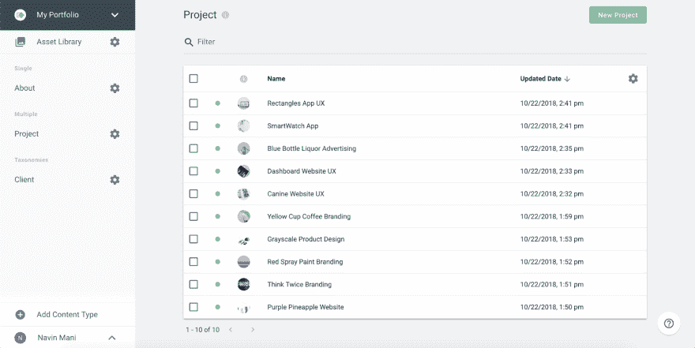
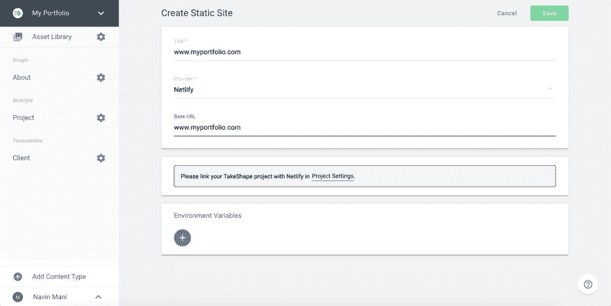
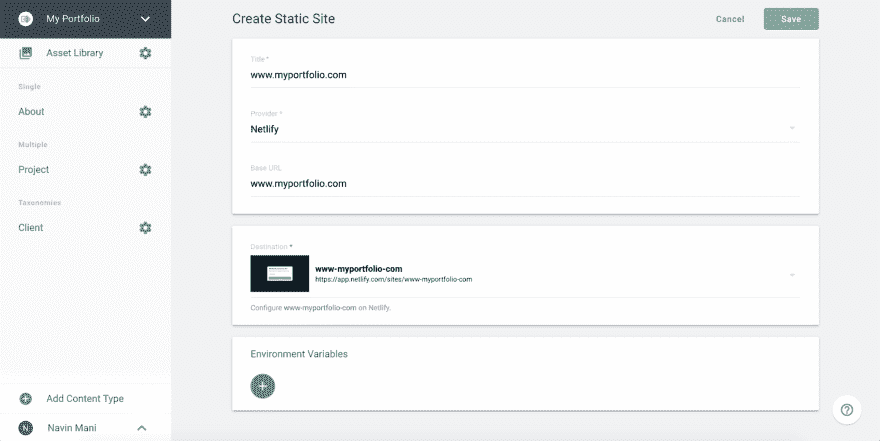
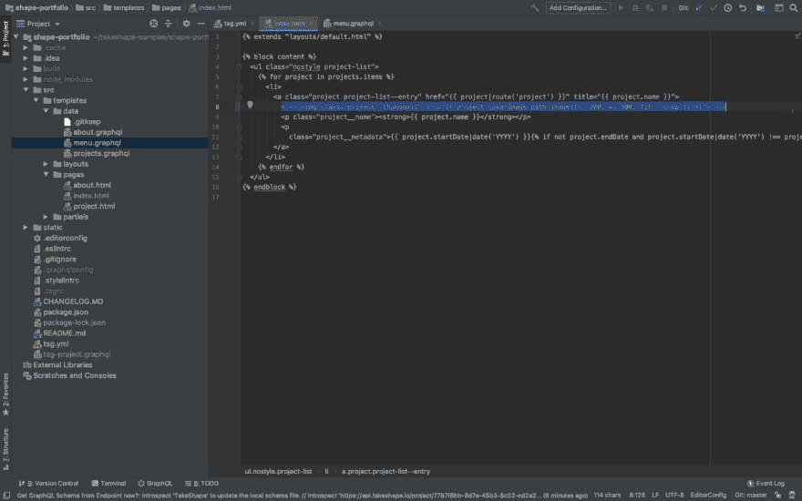

# 开始使用项目组合模板！

> 原文：<https://dev.to/takeshape/getting-started-with-the-portfolio-template-2hio>

### 让我们来看看如何使用 TakeShape 通过几个简单的步骤为你的作品集创建一个[网页。此模板可用于您的开发人员作品集👩‍💻👨‍💻、🖼设计作品集或其他。](https://shape-portfolio.takeshapesampleproject.com/)

1.  在[app.takeshape.io/signup](https://app.takeshape.io/signup)注册账户。通过 TakeShape 的 G-Suite 集成，这一过程只需点击两次鼠标即可完成。
    T3T5】

2.  有许多模板可以帮助你设计网页，我们很快就会用到它们。对于本例，让我们点击“塑造投资组合”然后我们可以命名我们的项目，并单击“创建项目”
    [T3】](https://res.cloudinary.com/practicaldev/image/fetch/s--j4cx9G2p--/c_limit%2Cf_auto%2Cfl_progressive%2Cq_auto%2Cw_880/https://thepracticaldev.s3.amazonaws.com/i/ovsdpevtnjtyxo5gpa4h.png)

3.  如果我们前往左侧的导航栏，我们可以单击“Project”并浏览已经与模板集成的项目。您也可以通过点击右上角的“新建项目”来添加更多项目。
    [T3】](https://res.cloudinary.com/practicaldev/image/fetch/s--dUrkogZv--/c_limit%2Cf_auto%2Cfl_progressive%2Cq_auto%2Cw_880/https://thepracticaldev.s3.amazonaws.com/i/1t6c14uzqndopw3k3xx6.png)

4.  我们还可以通过单击导航栏顶部的“资源库”来浏览图片、视频和其他资源。我们可以通过简单地从桌面拖动或点击右上角的“上传”来上传更多资产。
    [T3】](https://res.cloudinary.com/practicaldev/image/fetch/s--jcEVr_bO--/c_limit%2Cf_auto%2Cfl_progressive%2Cq_auto%2Cw_880/https://thepracticaldev.s3.amazonaws.com/i/urldbmo7tbuunk938jb2.png)

5.  我们有一个好看的网站，让我们让世界看到它。TakeShape 可以将你的网站部署到亚马逊 S3、谷歌云存储、FTP 和 Netlify。对于本例，我们将使用一键式集成部署到 [Netlify](https://www.netlify.com/) 。让我们导航到左上方的项目名称下拉菜单→“静态站点”→“新静态站点”。在这里，我们可以将我们的 TakeShape 项目链接到 Netlify。
    T3T5】

6.  这是它与 Netlify 连接时的样子。
    [T3】](https://res.cloudinary.com/practicaldev/image/fetch/s--rqv1-tal--/c_limit%2Cf_auto%2Cfl_progressive%2Cq_auto%2Cw_880/https://thepracticaldev.s3.amazonaws.com/i/pjssk11qtnq24h7unun7.png)

7.  现在让我们点击“保存”并发布！
    [T3】](https://res.cloudinary.com/practicaldev/image/fetch/s--4GEoePGs--/c_limit%2Cf_auto%2Cfl_progressive%2Cq_auto%2Cw_880/https://thepracticaldev.s3.amazonaws.com/i/r715r6nsk0b52rwn3ug2.png)

8.  看看你的超赞网站！

9.  既然模板已经建立并运行了，是时候进行定制了。让我们克隆 Github 库，这样我们就可以个性化它了！

    ```
    git clone https://github.com/takeshape/takeshape-samples.git takeshape-samples && cd takeshape-samples/shape-portfolio 
    ```

10.  要安装所有依赖项，让我们运行`npm install`。仔细检查您的节点版本`node -v`，确保您使用的是`v10.16.2`。

11.  运行`npx tsg init`并按照命令提示设置本地环境和 TakeShape 之间的通信。

12.  运行`npm start`启动服务器。它将默认运行在 [http://localhost:5000](http://localhost:5000) 上。

13.  现在我们可以进行大量的定制来使用这个模板。为了节省空间，我想从主页上删除项目图像。我们可以很容易地在`index.html`文件中模拟它的样子。这些变化可以立即在本地站点上看到！
    [](https://res.cloudinary.com/practicaldev/image/fetch/s--NOaiK9yx--/c_limit%2Cf_auto%2Cfl_progressive%2Cq_auto%2Cw_880/https://thepracticaldev.s3.amazonaws.com/i/ydp90nhe7ykjtip60ckw.png)

14.  运行`npx tsg deploy`将您的更改部署到 Netlify 上托管的站点。

15.  导航到该网站并实时查看您的更新！
    [T3】](https://res.cloudinary.com/practicaldev/image/fetch/s--p-1mepsf--/c_limit%2Cf_auto%2Cfl_progressive%2Cq_auto%2Cw_880/https://thepracticaldev.s3.amazonaws.com/i/4prfemqrz79b8ii65hls.png)

在这几个步骤中，我们建立了一个初具规模的网站🆙和跑步🏃‍♀️and:我们做了一些改动，可以在网站上看到。从这里开始，♾.的可能性是无限的我们很想看看你们用这个模板创建的网站！🤩