# 使用 Gremlin 和 Grafana 了解您的 Kubernetes 集群如何响应故障

> 原文：<https://dev.to/loopdelicious/learn-how-your-kubernetes-clusters-respond-to-failure-using-gremlin-and-grafana-2l76>

利用混沌工程构建弹性 API。

我不善于处理失败。但是我越来越擅长了，因为我失败了很多次。事实上，我失败得越多，我就越能更好地预见到我可能崩溃和烧毁的所有方式，并支撑起这些弱点。

这种期待可能会让我夜不能寐，但我反而因此变得更加坚强。

在[更好的实践](https://medium.com/better-practices)中，我们之前讨论过随着团队继续采用微服务和分布式架构，在云中工作变得越来越复杂。一些方法是[通过 API 优先的方法](https://medium.com/better-practices/api-first-software-development-for-modern-organizations-fdbfba9a66d3)实现灵活性，或者[通过使用容器和编排引擎](https://dev.to/loopdelicious/deploying-a-scalable-web-application-with-docker-and-kubernetes-2p0k-temp-slug-5480716)提高速度。

另一种方法是混沌工程。

分布式系统本质上是混乱的，许多组织在向云迁移时都在拥抱这种混乱。他们故意将失败注入他们的系统，以便识别以前未知的漏洞。

<figure>[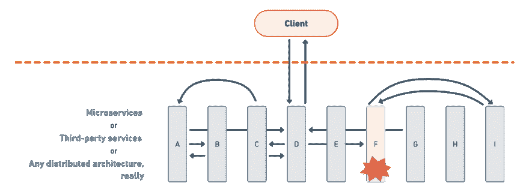](https://res.cloudinary.com/practicaldev/image/fetch/s--xHhFSATf--/c_limit%2Cf_auto%2Cfl_progressive%2Cq_auto%2Cw_880/https://cdn-images-1.medium.com/max/1024/1%2A-z-zoW1bHmA6NOScjpdyeg.png) 

<figcaption>当你的一个依赖失效时会发生什么？</figcaption>

</figure>

当您的一个依赖项失败时会发生什么？通过主动控制故障条件，您可以根据自己的条件从系统的响应中学习，而不是在意外停机期间。

### 什么是混沌工程？

当网飞从单一架构过渡到分布式云架构时，他们担心潜在的停机时间会如何影响他们的用户。网飞团队引入了[混沌猴](https://github.com/Netflix/chaosmonkey)来伪随机杀死实例，以模拟随机服务器故障。

他们希望确保能够经受住这种类型的失败，并更好地了解这种失败对客户的影响。目标是巩固他们的分布式系统，以预期和容忍来自他们所依赖的其他系统的故障。

[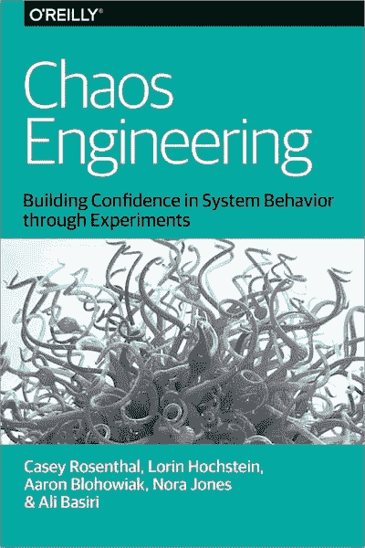](https://www.oreilly.com/ideas/chaos-engineering)

> [【混沌工程】激励工程师构建他们的服务，以预期一些服务器会突然消失…因此他们必须构建冗余、高可用性和容错的服务。](https://youtu.be/9MvcXO4L4Tk)
> 
> [——凯西·罗森塔尔](https://twitter.com/caseyrosenthal?),[威瑞卡](https://www.verica.io/)的首席执行官

此后不久，网飞团队引入了一个虚拟的猿猴部队，每只新猴子的任务都是引发另一种类型的失败——比如降低服务质量或杀死整个区域。从那以后，混乱社区已经开发了[许多工具](https://github.com/dastergon/awesome-chaos-engineering)来更精确地以可控的方式制造混乱。

今天，有许多公司已经接受了混沌工程的原则。一些团队可能专注于失败注入测试或灾难恢复培训，而只采用为他们的特定目标工作的工具和实践。

在所有这些项目中，一种训练有素的方法教会他们如何改进他们的系统，以便他们能够更好地容忍未来的、*计划外的*故障。

> 为什么要担心不会发生的事情呢？
> 
> *   [HBO 迷你剧《切尔诺贝利》](https://www.hbo.com/chernobyl)

### 何必自找麻烦？

混沌实验就像进行消防演习。想象一下，你已经制定了一个火灾应急方案，发给每个人，并且你每个月测试一次火警以确保它正常工作。

当你进行消防演习时会发生什么？你可能会发现有几个房间听不到警报，大多数人不记得他们应该在哪里见面，而其他人则无视训练，呆在自己的办公桌前。

通过主动测试系统如何响应故障条件，您可以在故障变成面向公众的停机之前识别并修复故障。生产中的失败代价高昂，所以混沌工程让你用系统中实际发生的事情来验证你认为会发生的事情。

为了建立更有弹性的系统，“故意打破常规”是为了让你的团队在地震、僵尸袭击或其他任何情况下做好准备。

### 谁负责混沌工程？

在微服务架构中，构建服务的工程师通常负责部署和正常运行时间。在拥有传统开发运维团队的组织中，这些开发运维工程师可能拥有这些服务级别。一些公司有专门的现场可靠性工程师(SRE)或生产工程师(PE)团队，负责持续改进和生产支持。

最初，最有动力实施混沌工程的人是那些感受到生产失败的痛苦的人，比如那些随叫随到的人。

> 我开始做[混沌工程]，这样我就不会在半夜被吵醒，也能更好地理解我的软件。
> 
> 归结起来就是谁被传呼了——如果是 SRE 或运营团队，他们最有动力开始做这项工作，让他们的生活变得更好。
> 
> — [科尔顿·安德鲁斯](https://twitter.com/koltonandrus),[小精灵](https://www.gremlin.com/)的首席执行官

其他有既得利益的人负责事故管理或事后分析。这里的区别在于，事件管理是一个被动的过程，采取措施防止事件再次发生。有了混沌工程，你的实验可以通过预测什么可能会出错来主动进行。

现在，绝大多数实施混沌工程的人倾向于质量驱动和生产为中心的操作工程师。

然而，在开发周期的早期引入弹性的责任也是有意义的，此时 bug 的成本最低，以减少生产中的财务和其他后果。因此，除了传统的预发布测试之外，还有一种测试人员关注产品测试的趋势。

那么谁拥有混沌？

*   **专业角色** —现场可靠性工程师(SRE)、生产工程师(PE)
*   职能团队 —开发、测试和质量保证(QA)、研发(R & D)
*   **领域知识专家** —流量、数据库、数据、存储

混沌工程的最初所有者将由你的团队当前的基础设施、天赋和目标决定。此外，随着越来越多的组织迁移到云，这种责任可能会转移，混沌工程变得更加主流，并开始增强传统测试。

### 怎么能启动混沌程序？

你不需要一个特殊的头衔，甚至不需要网飞级别的流量就可以开始涉足混沌。混沌社区已经开发了[数量的共享资源](https://github.com/dastergon/awesome-chaos-engineering)来帮助推进这个新兴学科。像[谷歌](https://cloud.google.com/solutions/dr-scenarios-planning-guide)、 [Twilio](https://www.twilio.com/blog/2017/11/chaos-engineering-ratequeue-ha.html) 、 [PagerDuty](https://www.pagerduty.com/blog/chaoscat-automating-fault-injection/) 等组织已经采用了他们自己的混沌工程方法。

在某些情况下，是一个好奇的测试者在通知了团队的其他成员后开始了一个混沌实验。也许是几个工程师挤在一起计划他们在[比赛日](https://aws.amazon.com/gameday/)的失败。或者这是高级管理层在一次代价特别高的停机后发出的扩大混乱计划范围的指令。

同样，您选择的实现将由您团队当前的基础设施、人才和目标决定。

> 或许从不同的[弹性工程]框架中收集一些你感兴趣的片段，然后围绕它创建一个实践。你很可能是第一个在你的特定环境下创造类似实践的人。
> 
> 我祝你在那项事业中好运，但我不敢保证你第一次尝试就能成功。或者你的第二个。
> 
> - [凯西·罗森塔尔](https://twitter.com/caseyrosenthal?),[威瑞卡](https://www.verica.io/)的首席执行官

一个常见的陷阱是没有清楚地传达你为什么首先采用混沌工程实践的原因。当组织中的其他人还不理解或不相信这种好处时，就会产生恐惧和困惑。更糟糕的是，人们认为你只是在随意破坏东西，没有合理的假设。

### 如何进行混沌实验？

虽然有许多方法来运行你的混沌实验，但大多数过程都是用假设和实验的连续循环来呼应科学方法。

<figure>[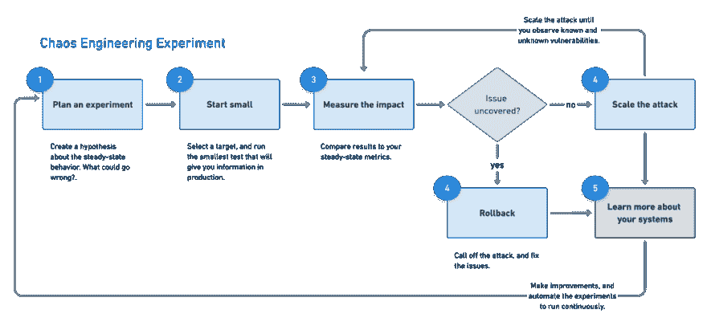](https://res.cloudinary.com/practicaldev/image/fetch/s--V0tC1EYM--/c_limit%2Cf_auto%2Cfl_progressive%2Cq_auto%2Cw_880/https://cdn-images-1.medium.com/max/1024/1%2AwdrHw9NmGHE38TkaeiOMJw.png) 

<figcaption>做出改进，并使实验自动连续运行</figcaption>

</figure>

计划一个实验。首先，创建一个关于系统稳态行为的假设。关注你的系统*是否能*工作，而不是*它们如何*工作。然后想想可能会出什么问题。也许一台服务器停机了(就像他们那样)。可能是您的第三方支付系统、特定的集群或整个地区出现了故障。

**开始小**。发起一次足够小的攻击，让您了解您的系统在生产环境中的反应。你不能总是预测用户的行为。[不是在一个孤立的环境中测试代码，而是在生产环境中测试一个完整的系统](https://techbeacon.com/app-dev-testing/test-production-yes-you-can-you-should)，它包括用户、代码、环境、基础设施、一个时间点等等。

**测量冲击力**。通过将其与您的稳定状态指标进行比较，观察攻击的影响，以揭示任何已知和未知的问题。在这一点上，如果有意想不到的和潜在的有害副作用，你可以增加攻击的能量或者减少攻击。

**了解有关您的系统的更多信息。**验证或更新你的假设，巩固你的弱点。进行这些改进，然后准备好让您的实验自动连续运行。

[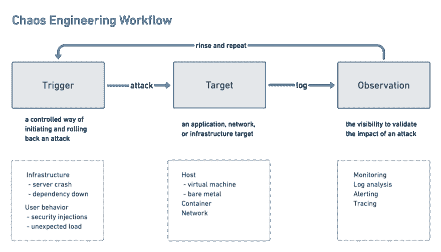](https://res.cloudinary.com/practicaldev/image/fetch/s--XajpLqsf--/c_limit%2Cf_auto%2Cfl_progressive%2Cq_auto%2Cw_880/https://cdn-images-1.medium.com/max/1024/1%2AEuRFRJQ0iqf216oYYIyr_w.png)

就像消防演习一样，你的团队正在通过练习如何在风险可控时做出反应来发展肌肉记忆，而不是在实际紧急情况下进行练习。通过系统地执行这些自动化测试，您可以更多地了解您的系统的真实行为。

如果你刚刚接触混沌工程，考虑从你的 API 开始。我们之前已经讨论过使用 API[来创建额外的负载](https://dev.to/loopdelicious/don-t-get-techcrunched-performance-testing-for-your-http-apis-396a-temp-slug-6713183)或[安全注入和其他用户行为](https://dev.to/loopdelicious/reverse-engineering-an-api-3e3-temp-slug-4060600)。现在，您可以通过模拟外部第三方 API 的中断或终止您自己的内部 API 来测试您的回退。

> 当一个公司衡量他们的关键服务时，API 通常被认为是二等公民。
> 
> 但是 API 是组织基础设施的核心部分，不了解它们的弱点会导致性能问题和停机。
> 
> *   [Tammy Butow](https://twitter.com/tammybutow) ，Gremlin[的首席现场可靠性工程师](https://www.gremlin.com/)

体验 API 中断的一种方法是简单地拔掉服务器的插头。但是如果服务器不是你的，或者很难到达呢？或者你意识到你拔错了电源？哎呀。你不能只是插上电源就指望服务马上恢复。不要那样做。

体验 API 中断的另一种方式是使用[一个邮递员模拟](https://learning.getpostman.com/docs/postman/mock_servers/intro_to_mock_servers)返回一个 500 内部服务器错误。这是可行的，但它仍然只是一个模拟。虽然我们可以在测试环境中模拟停机，但只有一种方法可以捕捉无法在隔离的测试环境中复制的不可量化的情况。

最终我们想在生产中打破一些东西😈

### 用亚马逊 EKS 和小妖精制造混乱的邮差秘方

让我们从一个示例电子商务应用程序开始，用户可以浏览商品，将它们添加到购物车，然后购买它们。然后我们将关闭一个容器，看看接下来会发生什么。

*   **触发:** [Gremlin](https://www.gremlin.com/) 是一个失败即服务，提供有限攻击类型的免费版本。我们将使用 Postman 和 Gremlin API 来触发我们的攻击。*剧透警报*。。。这使得我们可以通过持续集成管道轻松地自动化这些混沌测试。
*   **目标:**我们之前已经讨论过[使用 Docker 和 Kubernetes](https://dev.to/loopdelicious/deploying-a-scalable-web-application-with-docker-and-kubernetes-2p0k-temp-slug-5480716) 部署可扩展应用。[亚马逊 EKS](https://aws.amazon.com/eks/) 是运行在 AWS 上的托管 Kubernetes 服务。这不便宜。如果您已经在主机、容器或另一个云平台上运行，请用您自己的目标替换 EKS。
*   可观察性:我们将使用[普罗米修斯](https://prometheus.io/)作为我们的时间序列数据库，使用[格拉法纳](https://grafana.com/)来可视化我们攻击的效果。两者都是开源的，都有免费版本。如果您已经在使用其他工具进行稳态监控，请用您自己的工具集替换 Prometheus 和 Grafana。

<figure>[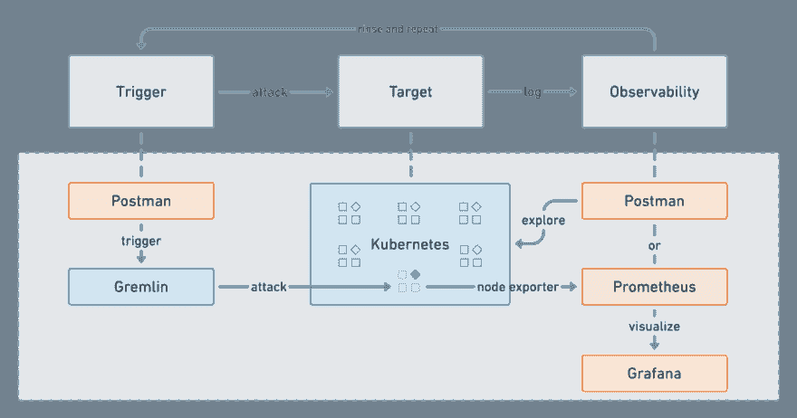](https://res.cloudinary.com/practicaldev/image/fetch/s--SQSsSQMZ--/c_limit%2Cf_auto%2Cfl_progressive%2Cq_auto%2Cw_880/https://cdn-images-1.medium.com/max/1024/1%2A80dJwHJuggQp4G3W_Oh31A.png) 

<figcaption>一个制造混乱的邮递员</figcaption>

</figure>

#### 在 EKS 建立 Gremlin 并创建 Kubernetes 集群

如果你想跳到最后，继续[克隆这个例子](https://github.com/postmanlabs/kubernetes-chaos)。否则，让我们从[这本有用的指南开始，安装 Gremlin，与亚马逊 EKS](https://www.gremlin.com/community/tutorials/how-to-install-and-use-gremlin-with-eks/) 一起使用。您需要一个 AWS 帐户、配置为使用 eksctl 创建 EKS 集群的 AWS CLI 和一个 Gremlin 帐户。

*   步骤 0 — [验证您的帐户 AWS CLI 安装](https://www.gremlin.com/community/tutorials/how-to-install-and-use-gremlin-with-eks/#step-0---verify-your-account-aws-cli-installation)
*   步骤 1 — [使用 eksctl](https://www.gremlin.com/community/tutorials/how-to-install-and-use-gremlin-with-eks/#step-1---create-an-eks-cluster-using-eksctl) 创建一个 EKS 集群
*   步骤 2 — [为集群](https://www.gremlin.com/community/tutorials/how-to-install-and-use-gremlin-with-eks/#step-2---load-up-the-kubeconfig-for-the-cluster)加载 kubeconfig
*   步骤 3 — [部署 Kubernetes 仪表板](https://www.gremlin.com/community/tutorials/how-to-install-and-use-gremlin-with-eks/#step-2---deploy-kubernetes-dashboard)
*   步骤 4 — [部署微服务演示应用](https://www.gremlin.com/community/tutorials/how-to-install-and-use-gremlin-with-eks/#step-4---deploy-a-microservice-demo-application)
*   步骤 5 — [使用 Gremlin](https://www.gremlin.com/community/tutorials/how-to-install-and-use-gremlin-with-eks/#step-5---run-a-shutdown-container-attack-using-gremlin) 运行关闭容器攻击(跳过)

之后，您应该有一个部署在 AWS EKS 和 Gremlin 上的示例应用程序运行在您的 [Kubernetes dashboard](https://github.com/kubernetes/dashboard) 上。

[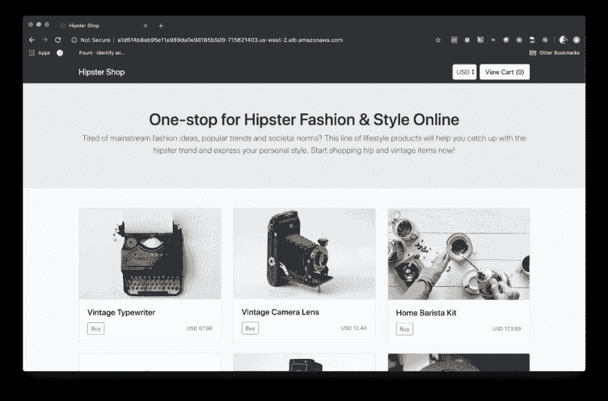](https://res.cloudinary.com/practicaldev/image/fetch/s--PRtUbmLz--/c_limit%2Cf_auto%2Cfl_progressive%2Cq_auto%2Cw_880/https://cdn-images-1.medium.com/max/1024/1%2AbDCR1rpyKYAq5BPATleIGQ.png)

<figure> 

<figcaption>1)部署在 EKS 的示例应用程序，以及 2)使用 Kubernetes Dashboard 安装的 Gremlin</figcaption>

</figure>

#### 成立格拉夫纳和普罗米修斯

如果你还在，让我们用 Grafana 设置[监控 Kubernetes 集群。这个特别的指南从 Google Kubernetes Engine (GKE)开始，而不是从 EKS 开始，但是在创建集群之后，剩下的大部分步骤都是一样的。](https://medium.com/htc-research-engineering-blog/monitoring-kubernetes-clusters-with-grafana-e2a413febefd)

*   步骤 0 —创建 GKE 集群(跳过)
*   步骤 1 —许许多多的 yaml 配置
*   步骤 2 —在 Grafana 上配置集群设置(跳过)

如果您的监控工具正在您的集群上运行，您可以简单地导入现有的仪表板，而不是在 Grafana 上配置您的集群设置。查看示例报告中的自述文件，了解如何管理对集群内部运行的应用程序的外部访问的更多详细信息。

之后，您应该能够观察集群中所有节点的稳定状态指标。

[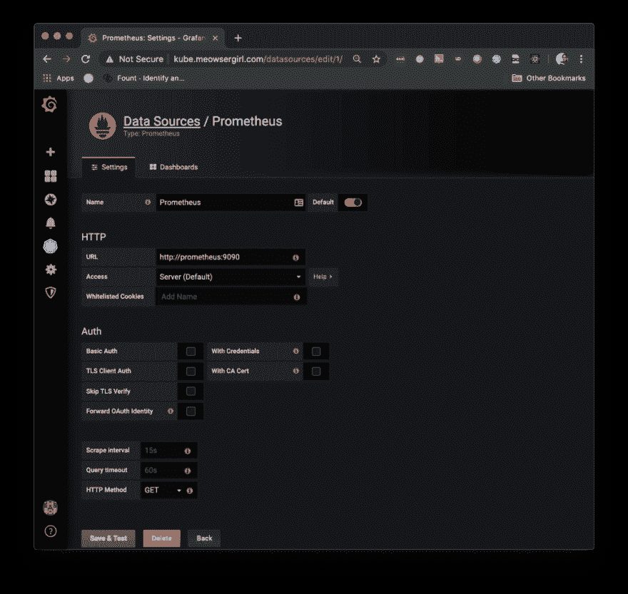](https://res.cloudinary.com/practicaldev/image/fetch/s--w2sTHfAh--/c_limit%2Cf_auto%2Cfl_progressive%2Cq_auto%2Cw_880/https://cdn-images-1.medium.com/max/1024/1%2A5D-3PXllhDYbXKUk2uVISQ.png)

<figure>[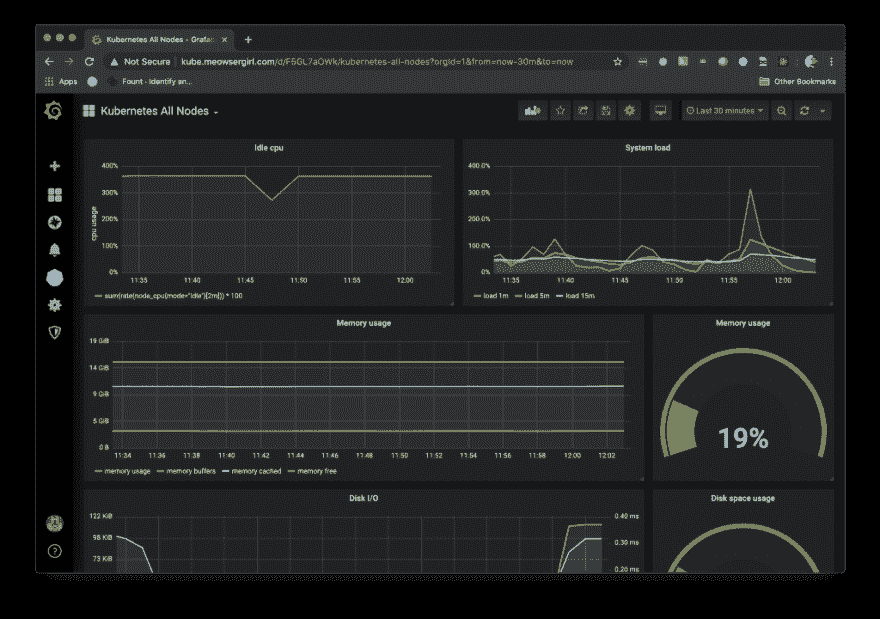](https://res.cloudinary.com/practicaldev/image/fetch/s--1Tfh40IJ--/c_limit%2Cf_auto%2Cfl_progressive%2Cq_auto%2Cw_880/https://cdn-images-1.medium.com/max/1024/1%2ACCFCxwesY3vRLlHHg4jS7g.png) 

<figcaption>1)添加一个普罗米修斯类型的数据源，2)导入仪表板 3131 以查看集群中所有节点的概况</figcaption>

</figure>

#### 程序化地管理你的混沌实验

Kubernetes pod 由一个或多个共享网络堆栈的容器组成。如果我们攻击一个容器中的一个容器，那么应该观察这个容器中所有容器的影响。或者，我们可以进一步指定容器端口来限制攻击的影响。

在 Gremlin 教程的最后一步，我们使用 Gremlin 的 UI 关闭了一个容器。我们也可以使用 API 来运行我们的攻击，这样我们就可以有计划地管理我们的混沌实验。

让我们使用 Postman 通过 [Gremlin API](https://www.gremlin.com/docs/api-reference/overview/) 关闭单个容器。

在 Postman app 中，[导入模板](https://learning.getpostman.com/docs/postman/launching_postman/newbutton/#templates)混沌工程，其中包含相应的环境混沌工程。查看[混沌工程文档](https://documenter.getpostman.com/view/1559645/SVfH1sqD)获得分步说明。

<figure>[](https://app.getpostman.com/run-collection/b07acbdc8e6f2d2b59f8#?env%5BchaosEngineering%5D=W3sia2V5IjoibW9ja191cmwiLCJ2YWx1ZSI6Imh0dHBzOi8vYmQwMTVmMWUtNjQwMS00MzdkLTliYjYtYTk4NDg4MmVlMzNlLm1vY2sucHN0bW4uaW8iLCJlbmFibGVkIjp0cnVlfSx7ImtleSI6ImdyZW1saW5fYXBpIiwidmFsdWUiOiJodHRwczovL2FwaS5ncmVtbGluLmNvbS92MSIsImVuYWJsZWQiOnRydWV9LHsia2V5IjoiZ3JlbWxpbl9hcGlfa2V5IiwidmFsdWUiOiJ5b3VyLWdyZW1saW4tYXBpLWtleSIsImVuYWJsZWQiOnRydWV9LHsia2V5IjoieW91cl9kZXBsb3llZF9hcHBfVVJMIiwidmFsdWUiOiJ5b3VyLWRlcGxveWVkLWFwcC11cmwiLCJlbmFibGVkIjp0cnVlfV0=) 

<figcaption>点击这个诱人的按钮导入模板</figcaption>

</figure>

你首先需要[用你的`gremlin_api_key`和`your_deployed_app_url`更新邮递员环境](https://learning.getpostman.com/docs/postman/environments_and_globals/manage_environments/#editing-an-active-environment)。然后查找名为“关闭容器”的文件夹。

1.  获取我们的活动容器列表
2.  关闭指定的容器
3.  验证我们应用的运行状况
4.  停止攻击(如果需要的话)

我们的假设是，如果我们关闭运行 cartservice 的容器，EKS 会给我们一个新的，我们不会遭受任何停机时间。然而，如果我们经历了意想不到的影响，让我们准备好停止攻击。

[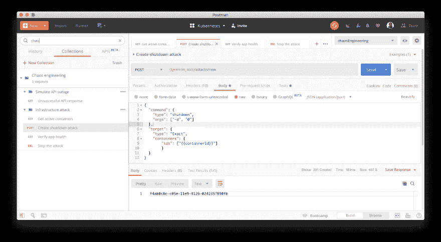](https://res.cloudinary.com/practicaldev/image/fetch/s--ihAIQ_uh--/c_limit%2Cf_auto%2Cfl_progressive%2Cq_auto%2Cw_880/https://cdn-images-1.medium.com/max/1024/1%2Ajh3Qb2fo7KHKsDtwcCdWbw.png)

<figure>[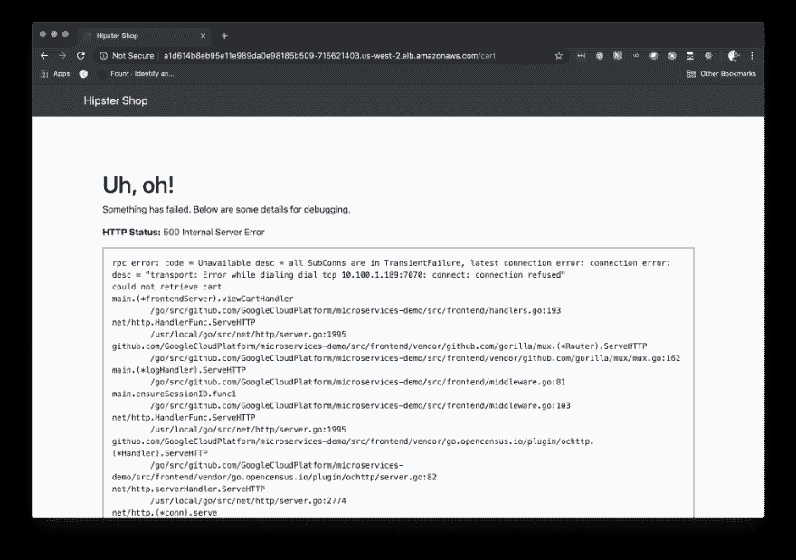](https://res.cloudinary.com/practicaldev/image/fetch/s--8GSPHDsL--/c_limit%2Cf_auto%2Cfl_progressive%2Cq_auto%2Cw_880/https://cdn-images-1.medium.com/max/1024/1%2A02i86pPFsxs3kCgFyfxH4Q.png) 

<figcaption>1)使用 Gremlin API 关闭容器，2)在浏览器中查看效果</figcaption>

</figure>

呀！当我们关闭 cartservice 容器时，我们在购物车页面上看到一个 500 错误。如果我们向部署的应用程序的 URL 发出 GET 请求，我们会在浏览器和 Postman 中看到这种情况。

如果你完成了 Gremlin 教程的最后一步，你已经知道这是因为 cartservice [使用 Redis](https://github.com/GoogleCloudPlatform/microservices-demo/blob/master/kubernetes-manifests/cartservice.yaml) 而不是 Redis Cluster。现在我们已经揭示了这个漏洞，我们可以与其他团队成员就您的数据解决方案进行更广泛的讨论。

与此同时，让我们使用 Gremlin API 发出一个删除请求来阻止我们的攻击，并向 Postman 添加一些代码，以便在我们看到 500 内部服务器错误时 *only* 停止我们的攻击。

[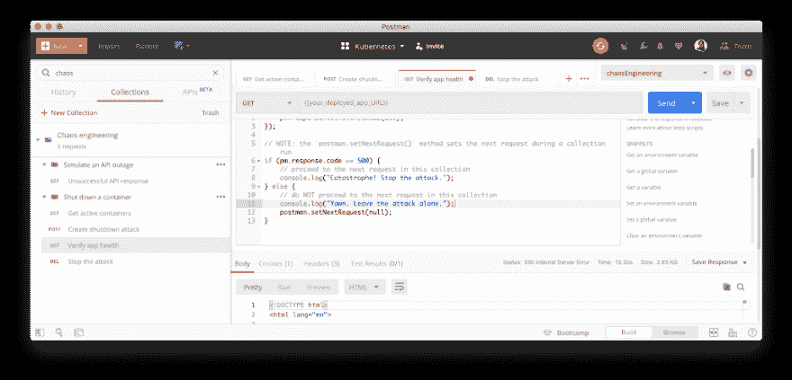](https://res.cloudinary.com/practicaldev/image/fetch/s--AeiSv_Uu--/c_limit%2Cf_auto%2Cfl_progressive%2Cq_auto%2Cw_880/https://cdn-images-1.medium.com/max/1024/1%2AVkhq2tkRf81EnJaTPl-SVQ.png)

<figure>[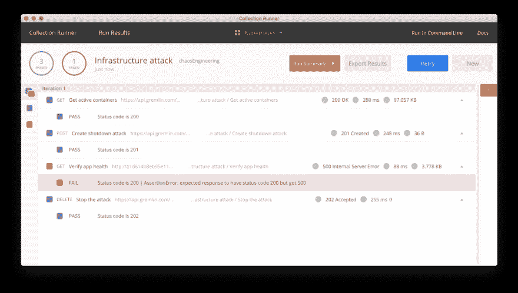](https://res.cloudinary.com/practicaldev/image/fetch/s--9tPmRjUy--/c_limit%2Cf_auto%2Cfl_progressive%2Cq_auto%2Cw_880/https://cdn-images-1.medium.com/max/1024/1%2AE44EAGKik4Bzd-Nmqrru9A.png) 

<figcaption>1)如果我们在 Postman 中看到 500 内部服务器错误，则停止攻击，2)在 collection runner 中自动运行我们的混沌测试</figcaption>

</figure>

以这种方式，我们可以使用 Postman 和 Gremlin API 来探索当我们破坏系统的特定部分时会发生什么。然而，除了手工测试，我们还看到了如何使用收集运行器和一点代码自动运行我们的集成测试[。](https://learning.getpostman.com/docs/postman/collection_runs/starting_a_collection_run)

> 🎓**高级挑战:**现在我们知道了如何使用 Postman 应用程序来管理我们的混沌实验，我们如何利用我们的持续集成(CI)管道或持续测试流程来自动化混沌测试？这里有一条线索[。这里有一个更好的线索](https://gph.is/1sFFzLq)[。](https://medium.com/better-practices/deploying-a-scalable-web-application-with-docker-and-kubernetes-a5000a06c4e9#ed88)

### 关于混沌工程的最后一点思考

那么，当您的一个依赖项失败时会发生什么呢？一次有价值的混沌测试不仅会让你了解你的系统，还会让你了解你的人。人的反应经常是以主动和系统的方式测试的更困难的方面之一。测试服务器崩溃的影响可能更容易。

当混沌实验影响现实生活中的生产流量和用户时，其他团队也会受到影响，希望在任何实验开始之前得到通知。您团队的沟通和协作能力将不可避免地影响您系统的弹性。

> 担心更快地交付软件的最大限制是关注增加更多的预发布测试。
> 
> 混沌工程就是要建立对我们的弹性和平均恢复时间的信任。随着时间的推移，我们不再担心任何一个变化会使我们的产品崩溃，当问题确实发生时，我们会更快地进行分类和部署修复，建立我们不脆弱的信心。
> 
> *   [Abby Bangser](https://twitter.com/a_bangser) ， [MOO](https://www.moo.com) 的平台测试工程师

对于许多团队来说，混沌工程将需要在组织中如何看待失败的思想转变。发现失败并让团队中的其他人注意到它是一件很棒的事情。然而，更好的做法是创建一个流程，预测潜在的失败，然后揭示新的信息来帮助支撑您的漏洞。

混沌工程不仅仅是构建更具弹性的软件，也是在一个组织内建立一种弹性文化。一个真正庆祝失败而不是隐藏失败的团队，将使更广泛的组织能够从这些经历中学习并变得更强大。

* * *