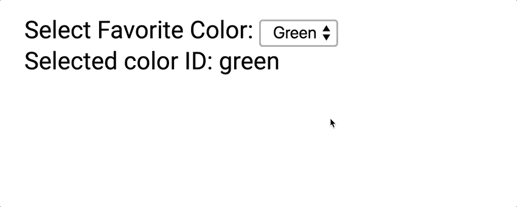

# 在 TypeScript 中管理键值常数

> 原文：<https://dev.to/angular/managing-key-value-constants-in-typescript-221g>

许多应用程序在一个窗体中有一个下拉选择菜单。让我们想象一个如下图的表单控件；

[](https://res.cloudinary.com/practicaldev/image/fetch/s--wOv9IBOK--/c_limit%2Cf_auto%2Cfl_progressive%2Cq_66%2Cw_880/https://thepracticaldev.s3.amazonaws.com/i/l1s38h340la686epz47u.gif)

通常，每个选择菜单的菜单项都有 **ID** 和**标签**。ID 负责与其他组件、服务或服务器端进行通信。标签负责向用户显示文本。

这篇文章解释了如何管理具有 ID 和标签映射的菜单项的常量。它使用从 3.4 版开始引入的 TypeScript 的`as const`特性。

## 定义 colorIDs 元组

在 TypeScript 中，元组是一个数组，但它的长度和项是固定的。可以用数组文字上的`as const`指令定义一个元组。(`as const`指令需要 TypeScript 3.4+)

创建`colors.ts`并将`colorIDs`元组定义如下:

```
export const colorIDs = ['green', 'red', 'blue'] as const; 
```

<svg width="20px" height="20px" viewBox="0 0 24 24" class="highlight-action crayons-icon highlight-action--fullscreen-on"><title>Enter fullscreen mode</title></svg> <svg width="20px" height="20px" viewBox="0 0 24 24" class="highlight-action crayons-icon highlight-action--fullscreen-off"><title>Exit fullscreen mode</title></svg>

`colorIDs`的类型不是`string[]`而是`['green', 'red', 'blue']`。它的长度绝对是 3，`colorIDs[0]`永远是`'green'`。这是一个元组！

## 提取色码型

元组类型可以转换为其项目的**联合类型**。在这种情况下，可以从元组中获取`'green' | 'red' | 'blue'`类型。

如下图给`colors.ts`加一行；

```
export const colorIDs = ['green', 'red', 'blue'] as const;

type ColorID = typeof colorIDs[number]; // === 'green' | 'red' | 'blue' 
```

<svg width="20px" height="20px" viewBox="0 0 24 24" class="highlight-action crayons-icon highlight-action--fullscreen-on"><title>Enter fullscreen mode</title></svg> <svg width="20px" height="20px" viewBox="0 0 24 24" class="highlight-action crayons-icon highlight-action--fullscreen-off"><title>Exit fullscreen mode</title></svg>

困惑了吗？别担心。这不是魔法。

`colorIDs[number]`表示“可通过数字访问的字段”，即`'green'`、`'red'`或`'blue'`。

所以`typeof colorIDs[number]`变成了联合类型`'green' | 'red' | 'blue'`。

## 定义颜色标签图

`colorLabels`地图是一个像下面这样的物体；

```
const colorLabels = {
  blue: 'Blue',
  green: 'Green',
  red: 'Red',
}; 
```

<svg width="20px" height="20px" viewBox="0 0 24 24" class="highlight-action crayons-icon highlight-action--fullscreen-on"><title>Enter fullscreen mode</title></svg> <svg width="20px" height="20px" viewBox="0 0 24 24" class="highlight-action crayons-icon highlight-action--fullscreen-off"><title>Exit fullscreen mode</title></svg>

因为`colorLabels`没有显式类型，所以即使您没有定义`red`的标签，您也不会注意到。

让我们确保`colorLabels`有一个所有颜色的完整标签集！`ColorID`能帮上忙。

TypeScript 给了我们`Record`类型来定义键值映射对象。键是`ColorID`，值是字符串。所以`colorLabels`的类型应该是`Record<ColorID, string>`。

```
export const colorIDs = ['green', 'red', 'blue'] as const;

type ColorID = typeof colorIDs[number];

export const colorLabels: Record<ColorID, string> = {
  green: 'Green',
  red: 'Red',
  blue: 'Blue',
} as const; 
```

<svg width="20px" height="20px" viewBox="0 0 24 24" class="highlight-action crayons-icon highlight-action--fullscreen-on"><title>Enter fullscreen mode</title></svg> <svg width="20px" height="20px" viewBox="0 0 24 24" class="highlight-action crayons-icon highlight-action--fullscreen-off"><title>Exit fullscreen mode</title></svg>

当您错过定义`red`字段时，TypeScript 编译器会在对象上抛出错误。

[](https://res.cloudinary.com/practicaldev/image/fetch/s---O-cZ3yM--/c_limit%2Cf_auto%2Cfl_progressive%2Cq_auto%2Cw_880/https://thepracticaldev.s3.amazonaws.com/i/kl5wx6dfejnfmiicr7ck.png)

对了， **Angular v8.0+兼容 TypeScript v3.4** 。上面的演示应用程序如下:

```
import { Component } from '@angular/core';
import { FormControl } from '@angular/forms';

import { colorIDs, colorLabels } from './colors';

@Component({
  selector: 'app-root',
  template: `
    <label for="favoriteColor">Select Favorite Color:&nbsp;</label>
    <select id="favoriteColor" [formControl]="favoriteColorControl">
      <option *ngFor="let id of colorIDs" [ngValue]="id">
        {{ colorLabels[id] }}
      </option>
    </select>
    <div>Selected color ID: {{ favoriteColorControl.value }}</div>
  `,
})
export class AppComponent {
  readonly colorIDs = colorIDs;
  readonly colorLabels = colorLabels;

  readonly favoriteColorControl = new FormControl(this.colorIDs[0]);
} 
```

<svg width="20px" height="20px" viewBox="0 0 24 24" class="highlight-action crayons-icon highlight-action--fullscreen-on"><title>Enter fullscreen mode</title></svg> <svg width="20px" height="20px" viewBox="0 0 24 24" class="highlight-action crayons-icon highlight-action--fullscreen-off"><title>Exit fullscreen mode</title></svg>

## 结论

*   `as const`将一个数组变成一个**元组**
*   `typeof colorIDs[number]`返回其项目的一个**联合类型**
*   用`Record<ColorID, string>`定义一个对象来保存一个完整的字段集。