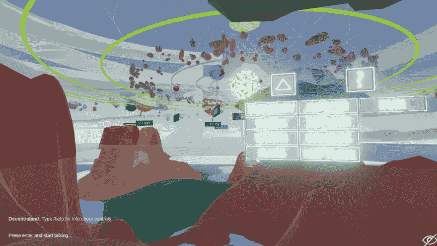
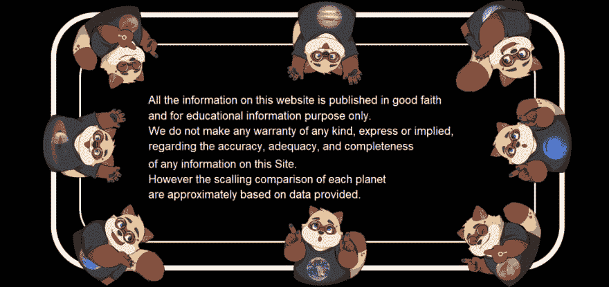
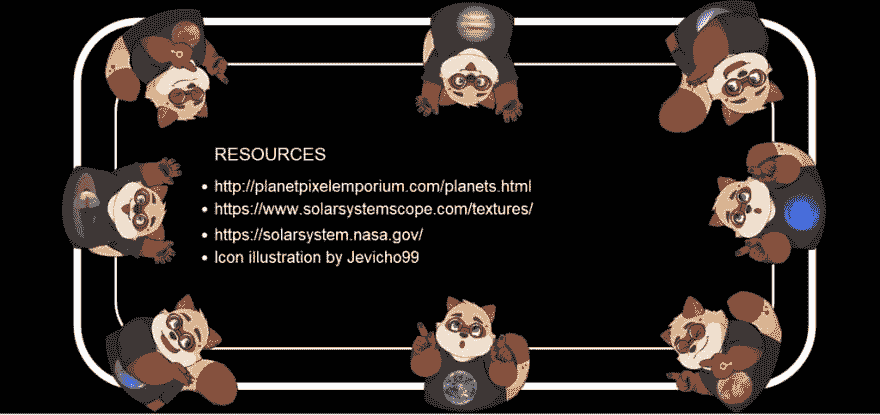
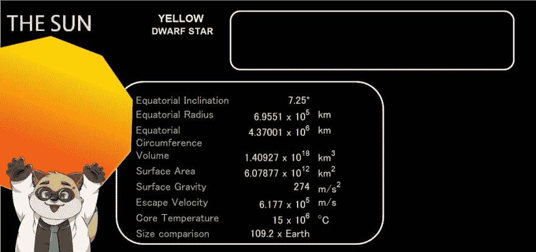
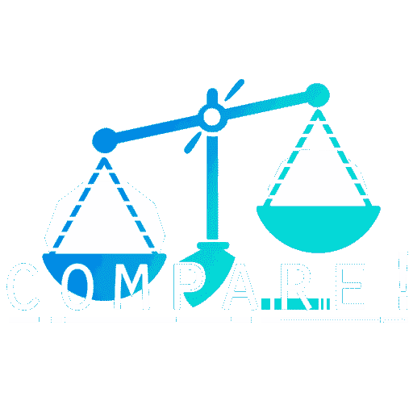
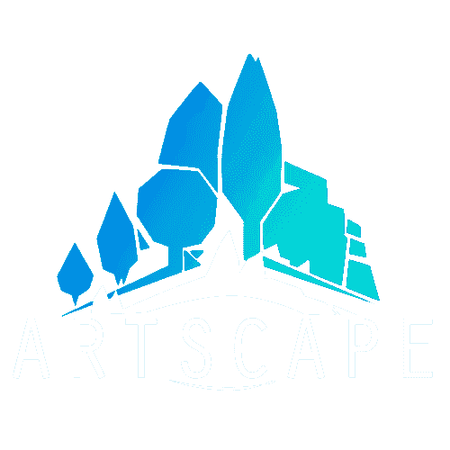

# 给你的分散场景添加一个用户界面——一个基本的动态场景界面的步骤

> 原文：<https://dev.to/decentraland/adding-a-ui-to-your-decentraland-scene-the-steps-to-a-basic-yet-dynamic-in-scene-interface-53gf>

在 9 月 16 日开始的下一次 Game Jam 之前，6 月黑客马拉松的参与者将接管分散博客，并透露他们的设计和建造秘密。本周的客座博主是社区成员 surz。你可以用@surz 找到不和谐或懈怠的 surz。

我在 2018 年发现了分散地，并对该项目采用的清洁、低聚设计感兴趣。一年后，我加入了[创客大赛](https://decentraland.org/blog/platform/creator-contest-highlights/)，更加投入。构建器是使用预制 3D 模型开始和开发的绝佳工具。在创造者大赛之后，我收到了参加六月黑客马拉松的邀请。带着一些 Javascript、Python 和 C++的基础知识(主要是脚本)和我对 3D 建模的兴趣，我决定参加这个活动。

我创建了一个微型太阳系可视化，用于教育和艺术内容。这个想法是创建一个天文馆类型的场景，提供每个星球的基本信息。除了这些信息之外，我想通过创建每个星球表面的简单艺术景观来使它身临其境。通过这种方式，行星之间的比较以及它们与我们自己的不同之处变得更加真实和引人入胜。

你可以在[这个链接](https://export.sceloglaux.now.sh)里看一下现场

或者看看下面的一些截图:

[](https://res.cloudinary.com/practicaldev/image/fetch/s--yvYhnBOv--/c_limit%2Cf_auto%2Cfl_progressive%2Cq_auto%2Cw_880/https://decentraland.org/blimg/posts/2019-08-14/preview1.png)

[](https://res.cloudinary.com/practicaldev/image/fetch/s--r_skjxLe--/c_limit%2Cf_auto%2Cfl_progressive%2Cq_auto%2Cw_880/https://decentraland.org/blimg/posts/2019-08-14/preview2.png)

### 教程

我想分享一下我使用的 UI 以及我是如何构建它的。本教程将集中在我的项目的 UI 的三个部分:太阳，水星和免责声明菜单。

图标的设计和我在 UI 中的角色都归功于我的兄弟 Jevicho99。

你可以从[这个链接](https://github.com/surz90/dcl_UI)下载我在这个
教程中使用的代码、2D 图像和 3D 模型

如果你对 ui 如何在分散式应用中工作有任何疑问，或者对任何代码示例有任何疑问，请查看分散式应用的文档[这里](https://docs.decentraland.org/development-guide/onscreen-ui/)。

所以，让我们开始吧！

### 准备 UI 资产

我们希望在场景中有几个不同的 UI 菜单，可以在不同的时间使用。每个菜单都有一个不可点击的静态部分和一个可点击的动态部分。
你可以在 github 页面的`/images`文件夹下找到本教程的图片。
如果你想的话，下载这些并跟随阅读这篇教程。

以下是免责声明页面的静态不可点击部分:

[](https://res.cloudinary.com/practicaldev/image/fetch/s--28YHQMSO--/c_limit%2Cf_auto%2Cfl_progressive%2Cq_auto%2Cw_880/https://decentraland.org/blimg/posts/2019-08-14/disclaimer1.jpg)

[](https://res.cloudinary.com/practicaldev/image/fetch/s--t3E21Wx0--/c_limit%2Cf_auto%2Cfl_progressive%2Cq_auto%2Cw_880/https://decentraland.org/blimg/posts/2019-08-14/disclaimer2.jpg)

以下是太阳和水星用户界面中不可点击的静态部分:

[](https://res.cloudinary.com/practicaldev/image/fetch/s--d-oCQZED--/c_limit%2Cf_auto%2Cfl_progressive%2Cq_auto%2Cw_880/https://decentraland.org/blimg/posts/2019-08-14/sun-ui.jpg)
[T6】](https://res.cloudinary.com/practicaldev/image/fetch/s--0OS1Jsbk--/c_limit%2Cf_auto%2Cfl_progressive%2Cq_auto%2Cw_880/https://decentraland.org/blimg/posts/2019-08-14/mercury-ui.jpg)

下面是两种用户界面中使用的动态部分。这些被添加到我们刚刚看到的大图中，作为按钮。每个按钮在被点击时执行一个特定的任务。

[](https://res.cloudinary.com/practicaldev/image/fetch/s--Hsnfrflp--/c_limit%2Cf_auto%2Cfl_progressive%2Cq_auto%2Cw_880/https://decentraland.org/blimg/posts/2019-08-14/button-close.png)

关闭按钮:隐藏所有 UI 元素。该按钮将出现在所有屏幕上。

[](https://res.cloudinary.com/practicaldev/image/fetch/s--W9gGVFmH--/c_limit%2Cf_auto%2Cfl_progressive%2Cq_auto%2Cw_880/https://decentraland.org/blimg/posts/2019-08-14/button-next.png)

下一步按钮:在免责声明屏幕之间切换。

[](https://res.cloudinary.com/practicaldev/image/fetch/s--XUo2_Y6x--/c_limit%2Cf_auto%2Cfl_progressive%2Cq_auto%2Cw_880/https://decentraland.org/blimg/posts/2019-08-14/button-facts.png)

事实:展示一个关于这个星球的小事实。再次点击时，它会切换到另一个事实。

[](https://res.cloudinary.com/practicaldev/image/fetch/s--hPCw9bA---/c_limit%2Cf_auto%2Cfl_progressive%2Cq_auto%2Cw_880/https://decentraland.org/blimg/posts/2019-08-14/button-compare.png)

比较:显示当前行星和地球的比较信息。

[](https://res.cloudinary.com/practicaldev/image/fetch/s--Hcp74KfT--/c_limit%2Cf_auto%2Cfl_progressive%2Cq_auto%2Cw_880/https://decentraland.org/blimg/posts/2019-08-14/button-artscape.png)

艺术景观:展示了地球表面的三维景观。

当放在一起时，完整的 UI 布局应该如下所示:

[](https://res.cloudinary.com/practicaldev/image/fetch/s--0tdo22z5--/c_limit%2Cf_auto%2Cfl_progressive%2Cq_auto%2Cw_880/https://decentraland.org/blimg/posts/2019-08-14/full-layout1.png)

[](https://res.cloudinary.com/practicaldev/image/fetch/s--0tdo22z5--/c_limit%2Cf_auto%2Cfl_progressive%2Cq_auto%2Cw_880/https://decentraland.org/blimg/posts/2019-08-14/full-layout1.png)

既然我们对屏幕的设计感到满意，让我们在代码中实现它。

### 添加画布和容器

创建 UI 的第一步是添加一个 canvas 组件，并在其中放置一个容器矩形。该矩形将包裹我们稍后将添加的每个 UI 元素，并使它们更容易定位。

```
// create canvas
const canvas = new UICanvas()
// create container inside canvas
const rect = new UIContainerRect(canvas)
rect.adaptHeight = true
rect.adaptWidth = true
rect.hAlign = 'left'
rect.vAlign = 'top'
rect.opacity = 0.8 
```

请注意，矩形的不透明度为 0.8，因此我们所有的用户界面都是部分透明的。

### 添加静态内容

以下代码添加了 sun UI 的静态部分。

```
let sunUITexture = new Texture("images/UI/UI_sun.jpg")
const sunImgScreen = new UIImage(rect, sunUITexture)
sunImgScreen.hAlign = 'left'
sunImgScreen.vAlign = 'top'
sunImgScreen.sourceLeft = 0
sunImgScreen.sourceTop = 0
sunImgScreen.sourceWidth = 1024
sunImgScreen.sourceHeight = 483
sunImgScreen.width = 1024
sunImgScreen.height = 512 
```

注意，当我们创建`UIImage`组件时，第一个参数是`rect`。这是我们创建来包装所有 UI 的矩形的名称。通过传递这个参数，我们使这个图像成为那个矩形的子对象，并相对于它定位它。

有很多字段，但大多数都是不言自明的。你可能想知道`sourceLeft`、`sourceTop`、`sourceWidth`和`sourceHeight`分别代表什么。这些有时用于显示图像的裁剪部分。因为这里我们使用的是全图，所以我们将它们设置为覆盖全图。

如果你正在跟进，这是一个用`dcl start`尝试你的场景的好时机。现在，您应该会在 UI 上看到这个图像。

由于我们不希望这个 UI 总是打开，我们将添加一行代码，将`visible`属性设置为 false。这将保持图像不可见，直到它的`visible`值被改变，我们将在后面讨论。

```
sunImgScreen.visible = false 
```

为了在我们的场景中添加其余的信息屏幕，我们使用了几乎相同的代码，除了每个都有不同的图像作为纹理。

### 添加关闭按钮

我们添加按钮的方式与我们刚刚添加图像的方式没有太大的不同，我们的按钮将是具有额外功能的图像。例如，这段代码在屏幕上添加了一个“关闭”按钮。

``typescript
let imgCloseBtn = new Texture("images/UI/close.png")
const closeBtn = new UIImage(rect, imgCloseBtn)
closeBtn.name = 'close_btn'
closeBtn.width = '50px'
closeBtn.height = '50px'
closeBtn.sourceWidth = 112
closeBtn.sourceHeight = 112
closeBtn.positionX = 953
closeBtn.positionY = -5
closeBtn.isPointerBlocker = true
closeBtn.onClick = new OnClick(() => {
log("Close Button Clicked")
canvas.visible = false
})`` 

 ``您会注意到代码与我们之前添加的静态图像没有太大的不同。唯一的显著区别是:

*   `isPointerBlocker`属性被设置为`true`，这允许你点击这个组件，而不是它后面的东西
*   `onClick`属性，决定点击时执行的内容。在这种情况下，它将整个 UI 的可见性设置为 false

对于 UI 中的其他按钮，我们使用与上面几乎相同的代码，但是具有不同的 onClick 行为和定位。

### 添加 UI 文本

我们希望我们的 UI 有可以动态改变的文本，不像我们作为图像的一部分导入的固定文本。为此，我们将创建一个`UIText`组件。下面的代码添加了一个显示“WELCOME”的文本组件。我们稍后将使我们的场景改变这个文本，以便它显示关于当前星球的不同事实。

``typescript
const factTxt = new UIText(rect)
factTxt.outlineColor = new Color4(0.7, 1, 0.8, 1)
factTxt.value = 'WELCOME'
factTxt.fontSize = 22
factTxt.width = 500
factTxt.height = 205
factTxt.positionX = 455
factTxt.positionY = 0
factTxt.color = new Color4(0.7, 1, 0.8, 1)
factTxt.textWrapping = true`` 

 ``### 分组 UI 对象

到目前为止，我们所看到的对于许多不同的用例来说可能已经足够好了，在这些用例中，您想要一个简单的 UI，它不会随着使用而改变太多。但是，如果您想要处理几个 UI 屏幕，每个都有不同的组件，并且可以很容易地从一个切换到另一个，该怎么办呢？以下是我想出的一个解决方案，它有助于轻松扩展。

在按照示例创建了每个屏幕所需的所有 UIImage 组件之后，我们可以将它们全部以 JSON 格式列出，并根据功能进行分组。这些将在屏幕之间切换时被调用。

``typescript
const staticScreenGroup = {
"sun": sunImgScreen,
"mercury": merImgScreen,
"disclaimer1": discImgScreen1,
"disclaimer2": discImgScreen2
}
const closeMenuGroup = {
"closeBtn": closeBtn
}
const disclaimerMenuGroup = {
"nextBtn": nextBtn
}
const planetMenuGroup = {
"factBtn": factBtn,
"compareBtn" : compareBtn,
"artscapeBtn" : artscapeBtn,
"factTxt" : factTxt
}`` 

 ``### 处理分组的 UI 对象

为了利用我们刚刚创建的组件列表，我们还将编写一个函数来解析列表，并根据屏幕显示所需的元素。

该函数采用三个参数作为布尔值，每个参数打开或关闭 UI 的不同部分:planetMenu(显示事实、比较和 artscape 按钮，以及事实文本)、disMenu(显示免责声明屏幕中的下一步按钮)和 closeMenu(显示关闭按钮)

`` typescript
function stateDynamicUI(bPlanetMenu:boolean，bDisclaimerMenu: boolean，bCloseMenu: boolean) {`

 `for(let key in planet menu group){
planet menu group[key]。visible = bPlanetMenu
}
for(let key in declaration ermenu group){
declaration ermenu group[key]。visible = bDisclaimerMenu
}
for(let key in closeMenuGroup){
closeMenuGroup[key]。visible = bclose menu
}
}
`

 `缺少的是选择我们想要显示的基本静态图像。我们将创建一个 singleton 对象，该对象包含一个函数，该函数使所有静态 UI 元素不可见，除了我们当前想要显示的元素。

``typescript
const stateInfoUI = (
function () {
let UI_show: UIImage
return {
changeCurrentUI: function(ui_screen) {
if (UI_show) {
UI_show.visible = false
}
UI_show = ui_screen
UI_show.visible = true
canvas.visible = true
},
getCurrentUI: function () {
return UI_show
}
}
}())`` 

 ``### 从现实世界中的物体打开用户界面

我们现在将在场景中添加一个由三个 3D 框组成的基本 3D 菜单。当单击这些框中的每一个时，它将打开一个不同的 UI，包括所有相关的元素。

期望的结果将看起来像下面的 GIF。

[](https://res.cloudinary.com/practicaldev/image/fetch/s--L_UhqEXS--/c_limit%2Cf_auto%2Cfl_progressive%2Cq_66%2Cw_880/https://decentraland.org/blimg/posts/2019-08-14/ui-demo.gif)

粘贴以下代码以添加 3D 实体:

``typescript
//父实体
const menu3D = new Entity()
engine . addentity(menu3D)`

 `const sun menu = new Entity()
sun menu . add component(new box shape())
sun menu . add component(new Transform({
position:new vector 3(8，1.5，8)，
scale: new Vector3(0.1，0.25，0.5)
})
sun menu . set parent(menu3D)
engine . add Entity(sun menu)

const mercury menu = new Entity()
mercury menu . add component(new box shape())
mercury menu . add component(new Transform({
position:new vector 3(8，1，8)，
scale: new Vector3(0.1，0.25，0.5)
})
mercury menu . set parent(menu3D)
engine . add Entity(mercury menu)

const disclaim ermenu = new Entity()
disclaim ermenu . add component(new box shape())
disclaim ermenu . add component(new Transform({
position:new vector 3(8，0.5，8)，
scale: new Vector3(0.1，0.25，0.5)
})
disclaim ermenu . set parent(menu3D)
engine . add Entity(disclaim ermenu)

`

 `现在我们可以向我们的 3D 实体添加一个`OnClick`组件，并引用显示我们在上一步中创建的 UI 元素的函数。

``typescript
menu_sun.addComponent(
new OnClick(e => {
log("sun CLICKED")
planetMenuGroup.factTxt.value = "WELCOME"
stateInfoUI.changeCurrentUI(staticScreenGroup.sun)
stateDynamicUI(true, false, true)
}))`` 

 ``上面的代码适用于“sun”菜单，对于其他菜单，你可以使用几乎相同的代码，在`stateInfoUI.changeCurrentUI()`和`stateDynamicUI()`函数中使用不同的参数。免责声明菜单将使用`(true, true, false)`调用`stateDynamicUI`功能，显示“关闭”和“下一步”按钮，但不显示其他按钮。

现在，当你点击 3D 对象时，它们应该会在屏幕上打开相应的 UI 菜单。

### 添加功能到下一步按钮

现在，我们可以轻松地在每个屏幕及其所有元素之间切换，让我们为 UI 屏幕上的更多按钮添加功能。我们已经演示了如何通过设置整个 UI 的可见性来赋予关闭按钮功能。为了使教程简短，我们将只显示下一步和事实按钮。

下面是“下一步”按钮的`OnClick`函数，它使用我们创建的函数在两个免责声明屏幕之间切换:

【type script】
nextbtn . onclick =新 onclick(()=>
log(" next button click "))
log(state info ui . get current return()。名称)
if(state info ui . get current return()。名称= = ' disclaimer 1 _ screen '){
state info ui . changecurrent ui(statcscreengroup . disclaimer 2)
}
else {
state info ui . changecurrent ui(statcscreengroup . disclaimer 1)
}【T10 } })

`

 `### 给事实按钮添加功能

现在，我们将为“事实”按钮添加功能，以便它显示当前星球的事实:

首先，我们定义一个字符串数组，它列出了我们想要显示的事实。

``typescript
const sun_facts: string[] = [
"Sun's gravity holds the solar system together, keeping everything from the biggest planets to the smallest particles of debris in its orbit",
"At the equator, the Sun spins once about every 25 days, but at its poles the Sun rotates once on its axis every 35 Earth days",
"By mass, the Sun is about 70.6 % Hydrogen and 27.4 % Helium",
"Sun releases a constant stream of particles and magnetic fields called the solar wind that can slams worlds across the solar system with particles and radiation"
]`` 

 ``然后我们将创建一个 singleton 来处理 UI 文本的切换。该对象包含一个函数，该函数循环遍历预定义的字符串并返回其中的一个。

``typescript
const FactsModule = (function () {
let facts_sun_ind = 0, facts_mer_ind = 0
let fact_arr: string[]
let fact_ind: number
return {
setFact: function (ui_screen) {
if (ui_screen.name == "sun_screen") {
log("fact for SUN")
fact_arr = sun_facts
facts_sun_ind = (facts_sun_ind + 1) % sun_facts.length
fact_ind = facts_sun_ind
return fact_arr[fact_ind]
}
}
}
}())`` 

 ``最后一步是从“事实”按钮的`OnClick`属性中调用该函数，并将 UI 中文本组件的值更改为该函数返回的值。

``typescript
factBtn.onClick = new OnClick(() => {
log("Fact Button Clicked")
let factStr = FactsModule.setFact(stateInfoUI.getCurrentUI())
planetMenuGroup.factTxt.value = factStr
})`` 

 ``对于场景的最终完整代码，请查看我的这个项目的 [GitHub 库](https://github.com/surz90/dcl_UI)。

### 一些结束语

我发现分散的土地提供了一个平台来创造一个由区块链统治的虚拟世界，这很有趣也很有挑战性。随着它的发展，我想探索平台内部可能的机制和用例，以创造更多优质的内容。

如果你对如何让上面的代码更高效有什么想法或者想说一下，欢迎加入讨论，在# SDK Discord 频道分享你的想法。我很想听听你的反馈！

当然，如果你对建造东西感兴趣，请参加 9 月 16 日开始的 GameJam。在这里加入，我们元宇宙见！`````````````````````