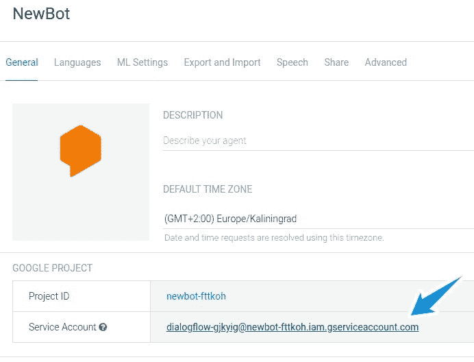
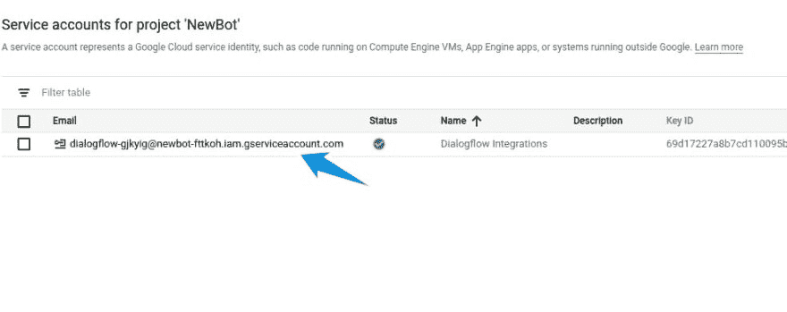
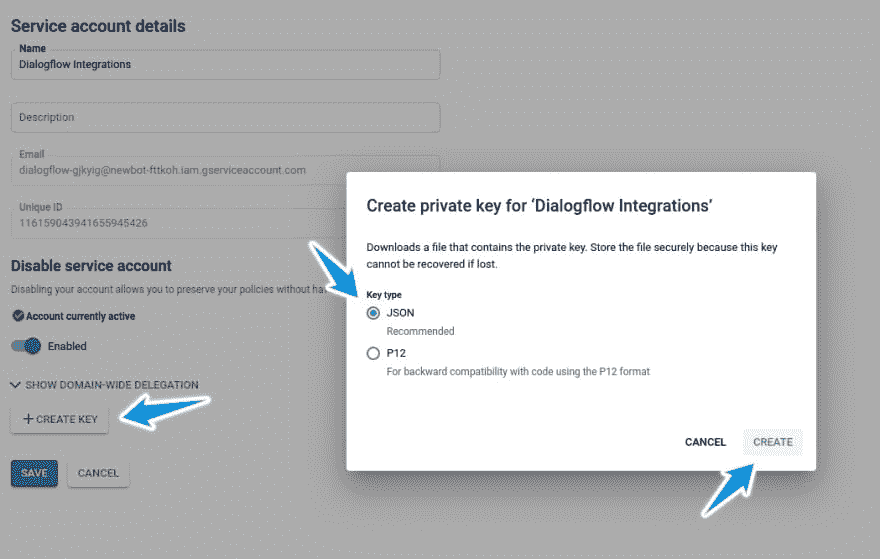
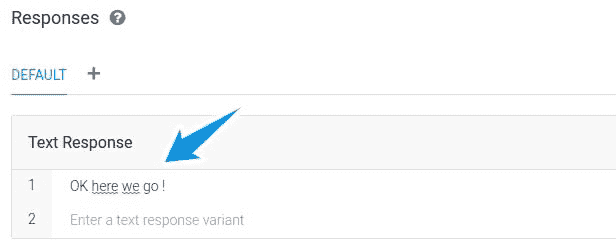

# 带有 NewBot 框架的 DialogFlow 聊天机器人

> 原文：<https://dev.to/rsamaium/dialogflow-chatbot-with-newbot-framework-39g4>

目标是:在理解自然语言(DialogFlow)的情况下，用 Javascript 快速创建一个聊天机器人。

# 先决条件

*   拥有一个 Google Cloud 和 DialogFlow 帐户
*   在你的机器上安装 NodeJS 和 NPM
*   Javascript 知识

# 为什么要 NewBot 框架？

*   通用的，在任何地方都适用的单一代码
*   对话网站的创建
*   模块化和结构化
*   使用 NLP(自然语言处理)
*   轻松快速地编写用户聊天机器人对话的对话脚本语法
*   国际化
*   单元测试
*   带有 NewBot CLI 的仿真器

# 兼容性

所有平台，即

*   脸书信使
*   谷歌助手
*   亚马逊 Alexa
*   松弛的
*   电报
*   Viber
*   网络电话
*   等等。

# 高于一切

安装 NewBot CLI 以利用命令行

```
npm install -g newbot-cli 
```

<svg width="20px" height="20px" viewBox="0 0 24 24" class="highlight-action crayons-icon highlight-action--fullscreen-on"><title>Enter fullscreen mode</title></svg> <svg width="20px" height="20px" viewBox="0 0 24 24" class="highlight-action crayons-icon highlight-action--fullscreen-off"><title>Exit fullscreen mode</title></svg>

创建一个项目

```
newbot new <your directory name> 
```

<svg width="20px" height="20px" viewBox="0 0 24 24" class="highlight-action crayons-icon highlight-action--fullscreen-on"><title>Enter fullscreen mode</title></svg> <svg width="20px" height="20px" viewBox="0 0 24 24" class="highlight-action crayons-icon highlight-action--fullscreen-off"><title>Exit fullscreen mode</title></svg>

转到生成的文件夹

您可以使用命令`newbot serve`测试聊天机器人。见下文

# 检索 DialogFlow 的凭证

拥有一个 Google Cloud 和 DialogFlow 帐户

[](https://res.cloudinary.com/practicaldev/image/fetch/s--1_dDZIzL--/c_limit%2Cf_auto%2Cfl_progressive%2Cq_auto%2Cw_880/https://newbot.img/shared/dialogflow1.jpeg)

点击谷歌云中的服务

[](https://res.cloudinary.com/practicaldev/image/fetch/s--BrJt7N0W--/c_limit%2Cf_auto%2Cfl_progressive%2Cq_auto%2Cw_880/https://newbot.img/shared/dialogflow2.jpeg)

创建新密钥

[](https://res.cloudinary.com/practicaldev/image/fetch/s--_ePD13BN--/c_limit%2Cf_auto%2Cfl_progressive%2Cq_auto%2Cw_880/https://newbot.img/shared/dialogflow3.jpeg)

下载私钥并将其添加到项目的根目录

# 在我们的项目中添加 DialogFlow

安装`newbot-dialogflow`模块:

```
npm install newbot-dialogflow 
```

<svg width="20px" height="20px" viewBox="0 0 24 24" class="highlight-action crayons-icon highlight-action--fullscreen-on"><title>Enter fullscreen mode</title></svg> <svg width="20px" height="20px" viewBox="0 0 24 24" class="highlight-action crayons-icon highlight-action--fullscreen-off"><title>Exit fullscreen mode</title></svg>

在`main.js`文件中，添加对话流技能:

```
import dialogflowSkill from 'newbot-dialogflow'
import code from './main.converse'

export default {
    code,
    skills: {
        dialogflow: dialogflowSkill({
            projectId: 'newbot-fttkoh',
            credentials: 'newbot-fttkoh-69d17227a8b7.json'
        })
    }
} 
```

<svg width="20px" height="20px" viewBox="0 0 24 24" class="highlight-action crayons-icon highlight-action--fullscreen-on"><title>Enter fullscreen mode</title></svg> <svg width="20px" height="20px" viewBox="0 0 24 24" class="highlight-action crayons-icon highlight-action--fullscreen-off"><title>Exit fullscreen mode</title></svg>

*   `projectId`:项目 ID(在聊天机器人设置中)
*   `credentials`:凭证文件的路径

## 输入未知

将此代码添加到`main.converse`文件:

```
@Intent('input.unknown')
unknown() {
    > { :intent.response }
} 
```

<svg width="20px" height="20px" viewBox="0 0 24 24" class="highlight-action crayons-icon highlight-action--fullscreen-on"><title>Enter fullscreen mode</title></svg> <svg width="20px" height="20px" viewBox="0 0 24 24" class="highlight-action crayons-icon highlight-action--fullscreen-off"><title>Exit fullscreen mode</title></svg>

*   对话流中已经存在一个`input.unknow`意图，当没有其他意图被触发时，它被触发
*   然后，我们显示从 DialogFlow 收到的响应

> `:intent.date.value`是一个神奇的变量，用于检索用户输入的日期
> 
> 使用的语言是特定于 NewBot 的。它叫做 ConverseScript，允许你创建语法接近 Javascript 的对话脚本

# 添加我们自己的意图:我们买一个披萨！

1.  在对话流中创建新意图
2.  输入一个名字(例如“购买披萨”)
3.  添加培训短语
4.  添加操作名称。在这里，这个名字是`input.buy`
5.  您可以添加参数。这里，我们恢复了句子中的日期
6.  添加回应

[](https://res.cloudinary.com/practicaldev/image/fetch/s---V-wO3YN--/c_limit%2Cf_auto%2Cfl_progressive%2Cq_auto%2Cw_880/https://newbot.img/shared/dialogflow4.jpeg)
[T6】](https://res.cloudinary.com/practicaldev/image/fetch/s--4-uk0eBw--/c_limit%2Cf_auto%2Cfl_progressive%2Cq_auto%2Cw_880/https://newbot.img/shared/dialogflow5.jpeg)

`main.converse`内容包含新的意图！

```
@Intent('input.buy')
buy() {
    date = :intent.date.value
    > { :intent.response }
    callApi(date)
}

@Intent('input.unknown')
unknown() {
    > { :intent.response }
} 
```

<svg width="20px" height="20px" viewBox="0 0 24 24" class="highlight-action crayons-icon highlight-action--fullscreen-on"><title>Enter fullscreen mode</title></svg> <svg width="20px" height="20px" viewBox="0 0 24 24" class="highlight-action crayons-icon highlight-action--fullscreen-off"><title>Exit fullscreen mode</title></svg>

我们检索日期实体并调用一个可以触发 API 的函数

`callApi()`是我们创建的函数，存在于 Javascript 中:

`main.js`

```
import dialogflowSkill from 'newbot-dialogflow'
import code from './main.converse'

export default {
    code,
    skills: {
        dialogflow: dialogflowSkill({
            projectId: 'newbot-fttkoh',
            credentials: 'newbot-fttkoh-69d17227a8b7.json'
        })
    },
    functions: {
        callApi(date) {
            console.log(`Call your own API. date is ${date}`)
        }
    }
} 
```

<svg width="20px" height="20px" viewBox="0 0 24 24" class="highlight-action crayons-icon highlight-action--fullscreen-on"><title>Enter fullscreen mode</title></svg> <svg width="20px" height="20px" viewBox="0 0 24 24" class="highlight-action crayons-icon highlight-action--fullscreen-off"><title>Exit fullscreen mode</title></svg>

# 在仿真器中测试

在项目的根目录下键入以下命令

```
newbot serve 
```

<svg width="20px" height="20px" viewBox="0 0 24 24" class="highlight-action crayons-icon highlight-action--fullscreen-on"><title>Enter fullscreen mode</title></svg> <svg width="20px" height="20px" viewBox="0 0 24 24" class="highlight-action crayons-icon highlight-action--fullscreen-off"><title>Exit fullscreen mode</title></svg>

转到`localhost:3000`并在仿真器中测试项目

# 文档

这里:[https://newbot.io/en/docs](https://newbot.io/en/docs)