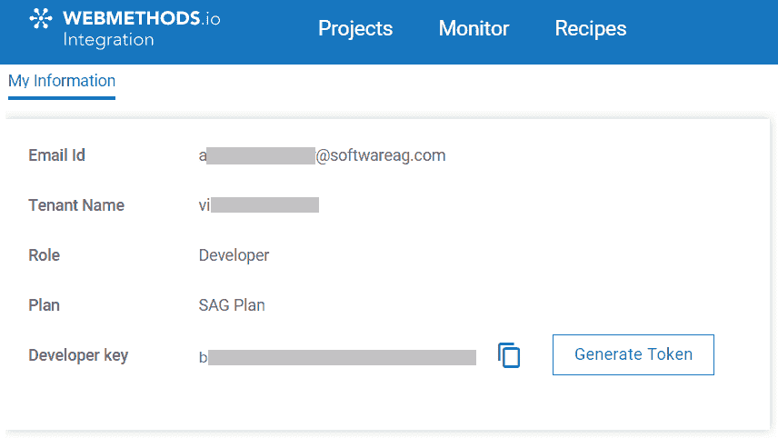
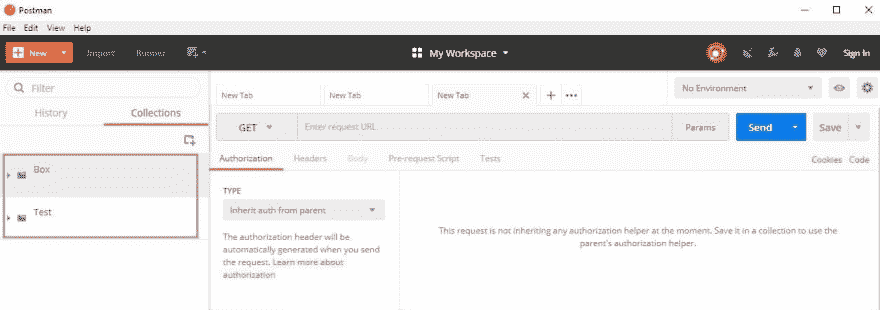
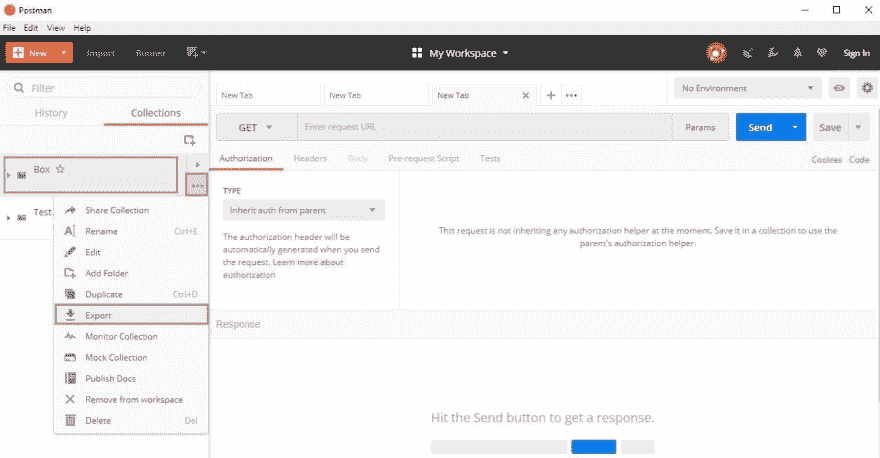
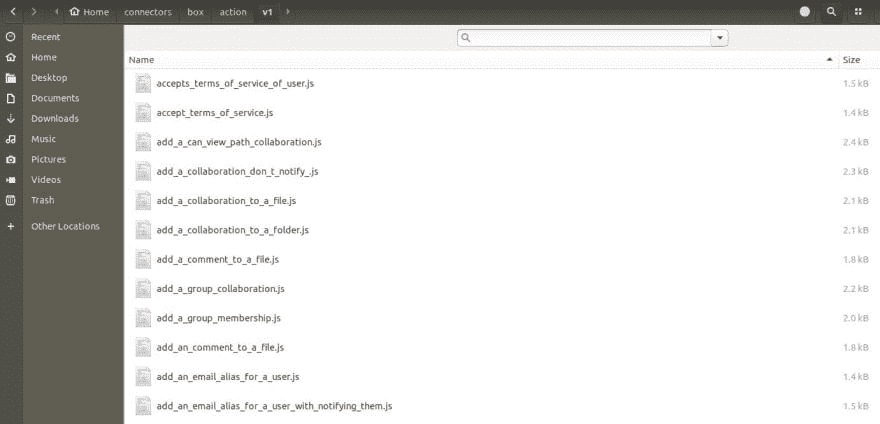

# webMethods.io 连接器构建器指南 1.2

> 原文：<https://dev.to/techcommunity/webmethods-io-connector-builder-guide-1-2-1398>

# 简介

webMethods.io Integration 是一个集成平台即服务(iPaaS ),允许您连接 web 应用程序、本地系统和设备，以创建定制的集成和自动化任务。使用连接器构建器功能，您可以创建自定义 web 连接器并在工作流中使用它们。

# 什么是连接器生成器 App？

Connector Builder 应用程序是一个自定义 Node.js 应用程序，您可以使用 web 应用程序的 API 来构建它。因此，例如，如果您有一个私有 API 或 webMethods.io 集成中尚不可用的 API，您可以为这些 API 创建自定义操作和触发器。一旦创建了这些操作和触发器，就可以像使用现有操作和触发器一样使用它们。

在开始创建您的第一个 Connector Builder 应用程序之前，您应该熟悉以下基本术语:

1.  触发器:它从指定的 API 读取数据，并可用于执行工作流执行。
2.  操作:它向指定的 API 发送数据以执行 CRUD 操作。
3.  身份验证:它指定需要用户提供什么凭证。
4.  查找:它在您的系统或帐户中搜索特定记录。

# 连接器生成器 App 如何工作？

一旦在 webMethods.io 集成上部署了应用程序，它将由 webMethods.io 集成平台进行验证。如果应用程序包含任何错误，您将在控制台上看到错误消息和错误详细信息。如果没有，该应用程序将被成功验证，并在本地提供给您。然后，您可以与特定用户共享此应用程序，或将其发布到 webMethods.io Integration，使其可供 webMethods.io Integration 的所有用户使用。

# 连接器生成器与 Node.js 块

连接器构建器和 Node.js 块的作用相同，即允许您自定义工作流。

然而，两者之间的主要区别在于连接器构建器的工作方式更像是一个编程项目，您必须从头开始创建应用程序。连接器构建器允许您创建动作、触发器和查找以及自定义身份验证。

另一方面，Node.js 块为您提供了一个现成的界面，您只需在其中输入应用程序的核心逻辑。它只允许您创建动作。

根据您的业务需求，您可以选择这些选项中的任何一个，并开始创建您的自定义工作流。

# 要求

该应用程序可以使用 4.x.x 到 8.14.X 之间的任何节点版本进行开发。

如果您已经在系统上安装了任何其他节点版本(例如，v8.9.4)，您可以从以下选项中选择一个:

1.  使用 node-windows、nvm、n 等工具切换到 4.x.x 和 8.14.x 之间的一个节点版本，并在本地运行应用程序。

*   对于 Windows，请使用:

*   [nvm-windows](https://github.com/coreybutler/nvm-windows#installation--upgrades)

*   [nodist](https://github.com/nullivex/nodist#installation)

注意:请使用默认的命令提示符。不支持 GitBash 和 MINGW64。

*   对于 Mac 上的 nvm(通过[自制](https://brew.sh/)，使用:

*   brew 安装 nvm

*   nvm 安装版本 6.10.2

运筹学

1.  使用您现有的节点版本(例如，v8.9.4)构建应用程序，然后使用 [Babel](https://babeljs.io/) 或另一个类似的传输器传输它。

# 安装连接器构建器包

为了开始使用 Connector Builder，首先需要在您的系统上安装它。为此，运行以下命令:

```
npm install -g @webmethodsio/wmiocli 
```

<svg width="20px" height="20px" viewBox="0 0 24 24" class="highlight-action crayons-icon highlight-action--fullscreen-on"><title>Enter fullscreen mode</title></svg> <svg width="20px" height="20px" viewBox="0 0 24 24" class="highlight-action crayons-icon highlight-action--fullscreen-off"><title>Exit fullscreen mode</title></svg>

一旦完成，你就可以开始构建你的应用了。

# 创建本地应用

*注意:这一节包含了如何使用连接器构建器创建本地应用程序的详细说明以及一个示例。如果您熟悉 iPaaS 连接器构建器的工作方式，请跳到快速设置指南。*

安装连接器构建器包后，您可以安装连接器构建器并设置您的身份验证以创建一个工作应用程序。它将是私有的，并在连接器面板的服务选项卡下可见。

下面是组成应用程序的模块:

**1。触发器**

触发器从外部应用程序读取数据，并在 webMethods.io 集成中执行工作流。

下面给出了使用连接器生成器创建触发器的基本结构。您可以在此结构中添加自定义代码来创建自己的触发器。

**a .创建轮询触发器:**

如果要创建轮询触发器，请参考下面给出的结构:

```
module.exports = { name: “sample\_trigger”, label: “Sample Trigger”, input: { type: ‘object’, title: ‘Sample Trigger’, description: “Short description”, properties: { event: { type: ‘string’, enum: [‘sample\_trigger’] }, polling: { type: ‘boolean’, default: true, options: { hidden: true } }, } }, output: { “sample\_trigger”: { type: ‘object’, properties: {} } }, mock\_data: {}, // add the sample output data for testing execute: function(input, options, output) { // will be called every 5 minutes // your code here }, activate: function(input, options, output) { // This function will be called whenever a user activates the trigger/workflow. // This function is useful in scenarios where you save cursor to figure out newly added/changed data in // 3<sup>rd</sup> party services. You can update your cursor so that trigger won't fetch data of the period // during which the trigger was deactivated. }, validate: function(input, options, output) { // This function will be called when the trigger is created. // This function validates all inputs provided by the user and sends an error if any of the details (including auth) are incorrect. In case of an error, trigger server won't create the trigger. } } 
```

<svg width="20px" height="20px" viewBox="0 0 24 24" class="highlight-action crayons-icon highlight-action--fullscreen-on"><title>Enter fullscreen mode</title></svg> <svg width="20px" height="20px" viewBox="0 0 24 24" class="highlight-action crayons-icon highlight-action--fullscreen-off"><title>Exit fullscreen mode</title></svg>

**b .创建 webhook 触发器**

如果你想创建一个 webhook 触发器，请参考下面给出的结构:

```
module.exports = { name: “sample\_trigger”, label: “Sample Trigger”, input: { type: ‘object’, title: ‘Sample Trigger’, description: “Short description”, properties: { event: { type: ‘string’, enum: [‘sample\_trigger’] }, polling: { type: ‘boolean’, default: false, options: { hidden: true } }, } }, output: { “sample\_trigger”: { type: ‘object’, properties: {} } }, mock\_data: {}, // add sample output data for testing execute: function(input, options, output) { // will be called every 5 minutes // your code here }, activate: function(input, options, output) { // This function will be called whenever a user activates the trigger/workflow. // This function is useful in scenarios where you save cursor to figure out newly added/changed data in the // 3<sup>rd</sup> party services. You can update your cursor so that trigger won't fetch data of the period // during which the trigger was deactivated. }, validate: function(input, options, output) { // This function will be called when the trigger is created. // This function validates all inputs provided by the user and sends an error if any of the details (including auth) are incorrect. In case of an error, trigger server won't create the trigger. } } 
```

<svg width="20px" height="20px" viewBox="0 0 24 24" class="highlight-action crayons-icon highlight-action--fullscreen-on"><title>Enter fullscreen mode</title></svg> <svg width="20px" height="20px" viewBox="0 0 24 24" class="highlight-action crayons-icon highlight-action--fullscreen-off"><title>Exit fullscreen mode</title></svg>

了解更多关于[触发器](https://docs.webmethods.io/workflow-building-blocks/triggers)的信息。

**2。动作**

动作是指您想要执行的任务。了解关于[动作](https://docs.webmethods.io/workflow-building-blocks/actions)的更多信息。

下面给出了创建动作的基本结构。您可以在这个结构中添加您的自定义代码来构建您自己的操作。

```
module.exports = { title: “sample\_action”, description: “”, version: “v1”, input: { title: ‘sample\_action’, type: ‘object’, properties: {} }, output: { title: ‘output’, type: ‘object’, properties: {} }, execute: function(input, output) { // your code here } } 
```

<svg width="20px" height="20px" viewBox="0 0 24 24" class="highlight-action crayons-icon highlight-action--fullscreen-on"><title>Enter fullscreen mode</title></svg> <svg width="20px" height="20px" viewBox="0 0 24 24" class="highlight-action crayons-icon highlight-action--fullscreen-off"><title>Exit fullscreen mode</title></svg>

**3。认证**

为了正常工作，动作和触发器需要用户的验证。webMethods.io 集成提供了 4 种方法来为您的操作和触发器添加身份验证。这些方法列举如下:

**a .基本**

如果您的操作/触发器只需要来自用户的两条信息，即电子邮件 ID 和密码，则可以使用基本身份验证方法。

下面是基本身份验证应该使用的结构。您可以在此结构中添加您的自定义代码，以创建您自己的基本身份验证机制。

```
module.exports = { label : ‘Connect to Demo’, mock\_input: { “username” : “myuser”, “password” : “mypassword” }, validate : function (input, output) { // auth data will be available in input.auth // var username = input.auth.username // var password = input.auth.password // make call to third party api to validate user credentials // and return callback output(null, true) in case of successful validation // or return callback output(‘error message’) in case of unsuccessful validation } } 
```

<svg width="20px" height="20px" viewBox="0 0 24 24" class="highlight-action crayons-icon highlight-action--fullscreen-on"><title>Enter fullscreen mode</title></svg> <svg width="20px" height="20px" viewBox="0 0 24 24" class="highlight-action crayons-icon highlight-action--fullscreen-off"><title>Exit fullscreen mode</title></svg>

查看基本认证的[模板。](https://github.com/builtio-flow/cli-basic-auth)

**b. OAuth**

OAuth 是一种基于令牌的身份验证方法。它允许外部服务使用个人帐户信息，并随后提供安全访问，而无需暴露密码。比如很多网站支持多种登录方式。您常见的登录方式之一是通过 Gmail 登录或通过脸书登录。这是 OAuth 的一个例子。webMethods.io 集成为许多服务提供了内置的 OAuth 身份验证模块。根据您的需求，您可以使用这些内置模块，也可以创建自定义的 OAuth 身份验证模块。

下面给出了 OAuth 认证的基本结构。

**内置模块:**

```
module.exports = { label : ‘Connect to Twitter’, mock\_input: { access\_token: ‘token’ }, //can be obtained from https://flowoauth.built.io oauth: ‘twitter’, input: {}, validate : function (input, output){ // auth data will be available in input.auth } } 
```

<svg width="20px" height="20px" viewBox="0 0 24 24" class="highlight-action crayons-icon highlight-action--fullscreen-on"><title>Enter fullscreen mode</title></svg> <svg width="20px" height="20px" viewBox="0 0 24 24" class="highlight-action crayons-icon highlight-action--fullscreen-off"><title>Exit fullscreen mode</title></svg>

**自定义 OAuth 模块:**

您还可以创建定制的 OAuth 模块，使用您自己的凭证进行身份验证。为此，运行 **wmio auth** 命令，选择 o auth 认证方法，然后根据您的要求选择 **OAuth 1** 或 **OAuth 2** 。

下面是为 GitLab 创建定制 OAuth 的示例代码:

```
{ “type”: “oauth2”, “title”: “GitLab”, “clientId”: “CLIENT\_ID”, “clientSecret”: “CLIENT\_SECRET”, “authURL”: “https://gitlab.com/oauth/authorize”, “tokenURL”: “https://gitlab.com/oauth/token”, “authQueryParams”: { “client\_id”: “{client\_id}”, “redirect\_uri”: “{redirect\_uri}”, “response\_type”: “code”, “state”: “{state}” }, “tokenParams”: { “method”: “POST”, “headers”: {}, “data”: { “client\_id”: “{client\_id}”, "client\_secret": "{client\_secret}", “redirect\_uri”: “{redirect\_uri}”, “grant\_type”: “authorization\_code”, “code”: “{code}” } }, “refreshParams”: { “client\_id”: “{client\_id}”, “client\_secret”: “{client\_secret}”, “redirect\_uri”: “{redirect\_uri}”, “grant\_type”: “refresh\_token” }, “requiredParams”: [], “refreshURL”: “https://gitlab.com/oauth/token”, “scope”: {}, “validate”: { “url”: “https://gitlab.com/api/v4/user”, “headers”: { “Authorization”: “Bearer {access\_token}” }, “query”: {} }, “redirectURL”: “REDIRECT\_URL\_WILL\_BE\_PROVIDED\_ON\_CREATION” } 
```

<svg width="20px" height="20px" viewBox="0 0 24 24" class="highlight-action crayons-icon highlight-action--fullscreen-on"><title>Enter fullscreen mode</title></svg> <svg width="20px" height="20px" viewBox="0 0 24 24" class="highlight-action crayons-icon highlight-action--fullscreen-off"><title>Exit fullscreen mode</title></svg>

*注意:花括号内的值将在运行时被插值。*

**c. API 键**

如果您的操作/触发器需要 API 密钥来验证用户，您可以使用此方法。使用 API 密钥身份验证，用户可以将 API 密钥作为查询字符串参数或通过 HTTP 头进行传递。

下面是 API 密钥认证的基本结构。您可以在这个结构中添加您的自定义代码，以创建您自己的 API 密钥身份验证机制。

```
module.exports = { label: ‘Connect to Demo’, mock\_input: { “api\_key” : “my api key” }, input: {}, validate: function (input, output) { // this function will be executed while running unit test cases and the authData will // be available in input.auth } } 
```

<svg width="20px" height="20px" viewBox="0 0 24 24" class="highlight-action crayons-icon highlight-action--fullscreen-on"><title>Enter fullscreen mode</title></svg> <svg width="20px" height="20px" viewBox="0 0 24 24" class="highlight-action crayons-icon highlight-action--fullscreen-off"><title>Exit fullscreen mode</title></svg>

查看 API 密钥认证的[模板。](https://github.com/builtio-flow/cli-basic-auth)

**d .自定义**

除了帐户凭据，如果您的操作/触发器需要来自用户的额外信息，如访问令牌、客户端 ID 和客户端机密，您可以使用自定义身份验证方法。

下面给出了自定义身份验证的基本结构。您可以在此结构中添加您的自定义代码，以创建您自己的自定义身份验证机制。

```
module.exports = { label : ‘Connect to Test’, mock\_input: { “username” : “myuser”, “apikey” : “my api key”, “pass” : “my password” }, input: { type: “object”, properties: { //input field definition } }, validate : function (input, output) { // auth data will be available in input.auth // var username = input.auth.username // var password = input.auth.pass // var apiKey = input.auth.apikey } } 
```

<svg width="20px" height="20px" viewBox="0 0 24 24" class="highlight-action crayons-icon highlight-action--fullscreen-on"><title>Enter fullscreen mode</title></svg> <svg width="20px" height="20px" viewBox="0 0 24 24" class="highlight-action crayons-icon highlight-action--fullscreen-off"><title>Exit fullscreen mode</title></svg>

查看自定义认证的[模板。](https://github.com/builtio-flow/cli-custom-auth)

**4。查找**

查找帮助您使用帐户中的数据自动填充字段。它检索与指定帐户关联的记录列表。创建单个脚手架时，在动作源代码中定义查找功能非常重要。

下面给出了创建查找的基本结构。您可以在这个结构中添加您的自定义代码来创建您自己的查找。

```
module.exports = { ‘name’: ’sample\_lookup’, ‘label’: ‘label’, ‘search’: ‘false’, ‘execute’: function (input, options, output) { // your code goes here } } 
```

<svg width="20px" height="20px" viewBox="0 0 24 24" class="highlight-action crayons-icon highlight-action--fullscreen-on"><title>Enter fullscreen mode</title></svg> <svg width="20px" height="20px" viewBox="0 0 24 24" class="highlight-action crayons-icon highlight-action--fullscreen-off"><title>Exit fullscreen mode</title></svg>

# 举例

既然我们已经介绍了如何创建一个本地应用程序，那么让我们来理解它在实践中是如何工作的。

假设您想为 Evernote 创建一个新操作。为此，请遵循下面给出的步骤:

*注意:在尝试创建应用程序之前，请确保您的计算机上已经安装了 Node.js 版本 4.x.x 或更高版本，并且您当前位于 Connector Builder 目录中。*

**1。全局安装连接器生成器**

```
npm install -g @webmethodsio/wmiocli 
```

<svg width="20px" height="20px" viewBox="0 0 24 24" class="highlight-action crayons-icon highlight-action--fullscreen-on"><title>Enter fullscreen mode</title></svg> <svg width="20px" height="20px" viewBox="0 0 24 24" class="highlight-action crayons-icon highlight-action--fullscreen-off"><title>Exit fullscreen mode</title></svg>

**2。配置部署密钥并登录 webMethods.io Integration。**

```
wmio login 
```

<svg width="20px" height="20px" viewBox="0 0 24 24" class="highlight-action crayons-icon highlight-action--fullscreen-on"><title>Enter fullscreen mode</title></svg> <svg width="20px" height="20px" viewBox="0 0 24 24" class="highlight-action crayons-icon highlight-action--fullscreen-off"><title>Exit fullscreen mode</title></svg>

系统将提示您输入租户 URL、与您的租户相关联的电子邮件以及租户开发人员密钥。

[](https://res.cloudinary.com/practicaldev/image/fetch/s--I2roI841--/c_limit%2Cf_auto%2Cfl_progressive%2Cq_auto%2Cw_880/http://techcommunity.softwareag.com/documents/portlet_file_entry/10157/conf_deploy_key.jpg/0ee33fee-e60f-4e3d-8fa8-bbbc25973cb2%3Fstatus%3D0)

要检索开发人员密钥，请登录 webMethods.io Integration 并导航到配置文件图标>设置。

[](https://res.cloudinary.com/practicaldev/image/fetch/s--pghiwcQj--/c_limit%2Cf_auto%2Cfl_progressive%2Cq_auto%2Cw_880/http://techcommunity.softwareag.com/documents/portlet_file_entry/10157/conf_deploy_key_2.jpg.png/554e7a46-a878-480f-ba0f-81c198a88f78%3Fstatus%3D0)

输入这些详细信息后，您将登录到 webMethods.io 集成。

此时，您的连接器构建器包将被安装并准备就绪。

**3。用最少的必需文件**
为你的应用程序创建一个目录

```
wmio init 
```

<svg width="20px" height="20px" viewBox="0 0 24 24" class="highlight-action crayons-icon highlight-action--fullscreen-on"><title>Enter fullscreen mode</title></svg> <svg width="20px" height="20px" viewBox="0 0 24 24" class="highlight-action crayons-icon highlight-action--fullscreen-off"><title>Exit fullscreen mode</title></svg>

系统将提示您提供应用程序的名称和描述，这将显示在服务选项卡中。

输入这些详细信息后，它会自动下载应用程序所需的文件，并在连接器构建器文件夹中创建一个应用程序目录。

**4。移入新创建的 app 目录**

```
cd evernote 
```

<svg width="20px" height="20px" viewBox="0 0 24 24" class="highlight-action crayons-icon highlight-action--fullscreen-on"><title>Enter fullscreen mode</title></svg> <svg width="20px" height="20px" viewBox="0 0 24 24" class="highlight-action crayons-icon highlight-action--fullscreen-off"><title>Exit fullscreen mode</title></svg>

**5。安装你的应用程序所需的所有库**

```
npm install 
```

<svg width="20px" height="20px" viewBox="0 0 24 24" class="highlight-action crayons-icon highlight-action--fullscreen-on"><title>Enter fullscreen mode</title></svg> <svg width="20px" height="20px" viewBox="0 0 24 24" class="highlight-action crayons-icon highlight-action--fullscreen-off"><title>Exit fullscreen mode</title></svg>

您现在应该有一个工作的本地应用程序，您可以在其中开始为您的操作和触发器添加代码。

**6。添加新操作**

```
wmio create action 
```

<svg width="20px" height="20px" viewBox="0 0 24 24" class="highlight-action crayons-icon highlight-action--fullscreen-on"><title>Enter fullscreen mode</title></svg> <svg width="20px" height="20px" viewBox="0 0 24 24" class="highlight-action crayons-icon highlight-action--fullscreen-off"><title>Exit fullscreen mode</title></svg>

示例:wmio 创建操作 create_issue

您会注意到在 Evernote 目录中已经创建了动作脚手架，它包含新创建的 javascript 文件， **evernote-notebook-create-。js** 。这个文件已经有了创建新操作所需的基本结构。若要创建操作，请在此文件中编写自定义代码。类似地，您可以使用这些命令添加脚手架和相关代码用于查找和触发:

```
wmio create lookup 
```

<svg width="20px" height="20px" viewBox="0 0 24 24" class="highlight-action crayons-icon highlight-action--fullscreen-on"><title>Enter fullscreen mode</title></svg> <svg width="20px" height="20px" viewBox="0 0 24 24" class="highlight-action crayons-icon highlight-action--fullscreen-off"><title>Exit fullscreen mode</title></svg>

和

```
wmio create trigger <trigger_name></trigger_name> 
```

<svg width="20px" height="20px" viewBox="0 0 24 24" class="highlight-action crayons-icon highlight-action--fullscreen-on"><title>Enter fullscreen mode</title></svg> <svg width="20px" height="20px" viewBox="0 0 24 24" class="highlight-action crayons-icon highlight-action--fullscreen-off"><title>Exit fullscreen mode</title></svg>

7 .**。为您的操作添加认证/触发**

```
wmio auth 
```

<svg width="20px" height="20px" viewBox="0 0 24 24" class="highlight-action crayons-icon highlight-action--fullscreen-on"><title>Enter fullscreen mode</title></svg> <svg width="20px" height="20px" viewBox="0 0 24 24" class="highlight-action crayons-icon highlight-action--fullscreen-off"><title>Exit fullscreen mode</title></svg>

系统将提示您选择要使用的身份验证方法的类型(基本/OAuth/API 密钥/自定义)。选择身份验证方法后，将在您的应用程序 cdirrecattoirny . gyaoulcoacnaaldadpthpe 身份验证逻辑中创建文件“authentication.js ”,用于此文件中的操作和/或触发器。

**8。测试你的应用程序，一旦所有的代码都被添加**

```
wmio test 
```

<svg width="20px" height="20px" viewBox="0 0 24 24" class="highlight-action crayons-icon highlight-action--fullscreen-on"><title>Enter fullscreen mode</title></svg> <svg width="20px" height="20px" viewBox="0 0 24 24" class="highlight-action crayons-icon highlight-action--fullscreen-off"><title>Exit fullscreen mode</title></svg>

测试将针对您在代码中提供的模拟数据进行。这是一个可选步骤。但是，我们建议执行它，以确保您编写的代码按预期运行。在这一阶段，您的应用程序的目录结构将如下所示:

**evernote 连接器**

[](https://res.cloudinary.com/practicaldev/image/fetch/s--vejKHRhq--/c_limit%2Cf_auto%2Cfl_progressive%2Cq_auto%2Cw_880/http://techcommunity.softwareag.com/documents/portlet_file_entry/10157/evernoteConnector.png/a409f90f-bf72-4a26-aace-45ba2221d663%3Fstatus%3D0)

**9。部署 app**

```
wmio deploy 
```

<svg width="20px" height="20px" viewBox="0 0 24 24" class="highlight-action crayons-icon highlight-action--fullscreen-on"><title>Enter fullscreen mode</title></svg> <svg width="20px" height="20px" viewBox="0 0 24 24" class="highlight-action crayons-icon highlight-action--fullscreen-off"><title>Exit fullscreen mode</title></svg>

使用此命令将您的应用程序部署到 webMethods.io 集成。部署后，它将自动注册到 webMethods.io Integration，并在 Connectors 面板的 Services 选项卡下本地提供给您。

10。添加自定义图标

您还可以为您的应用程序添加自定义图标。为此，请导航到您的应用程序目录，并将所需的图标放在图标文件夹中。

*注意:自定义图标应该是一个正方形(最大 128x128 像素)，大小小于 1 MB。*

# 快速设置指南

*注意:快速设置指南适用于熟悉 iPaaS 连接器构建器工作方式的用户。有关详细解释，请跳转到创建本地应用程序一节。*

**1。全局安装连接器生成器**

```
npm install -g @webmethodsio/wmiocli 
```

<svg width="20px" height="20px" viewBox="0 0 24 24" class="highlight-action crayons-icon highlight-action--fullscreen-on"><title>Enter fullscreen mode</title></svg> <svg width="20px" height="20px" viewBox="0 0 24 24" class="highlight-action crayons-icon highlight-action--fullscreen-off"><title>Exit fullscreen mode</title></svg>

**2。登录 web methods . io Integration**

```
wmio login 
```

<svg width="20px" height="20px" viewBox="0 0 24 24" class="highlight-action crayons-icon highlight-action--fullscreen-on"><title>Enter fullscreen mode</title></svg> <svg width="20px" height="20px" viewBox="0 0 24 24" class="highlight-action crayons-icon highlight-action--fullscreen-off"><title>Exit fullscreen mode</title></svg>

运行此命令时，系统会提示您输入租户 URL、与租户关联的电子邮件 ID 以及租户开发人员密钥。

[](https://res.cloudinary.com/practicaldev/image/fetch/s--BPV4C34H--/c_limit%2Cf_auto%2Cfl_progressive%2Cq_auto%2Cw_880/http://techcommunity.softwareag.com/documents/portlet_file_entry/10157/login.jpg/0063ab30-1ac4-43cf-b964-2510ebfcf612%3Fstatus%3D0)

输入这些详细信息后，您将登录 webMethods.io Integration，您的 Connector Builder 包将安装完毕并准备就绪！

**3。用最少的所需文件创建一个新应用**

```
wmio init 
```

<svg width="20px" height="20px" viewBox="0 0 24 24" class="highlight-action crayons-icon highlight-action--fullscreen-on"><title>Enter fullscreen mode</title></svg> <svg width="20px" height="20px" viewBox="0 0 24 24" class="highlight-action crayons-icon highlight-action--fullscreen-off"><title>Exit fullscreen mode</title></svg>

系统将提示您提供应用程序的名称。

**4。移入新创建的目录**

```
cd <app_name></app_name> 
```

<svg width="20px" height="20px" viewBox="0 0 24 24" class="highlight-action crayons-icon highlight-action--fullscreen-on"><title>Enter fullscreen mode</title></svg> <svg width="20px" height="20px" viewBox="0 0 24 24" class="highlight-action crayons-icon highlight-action--fullscreen-off"><title>Exit fullscreen mode</title></svg>

**5。为您的连接器构建器应用**
安装所有需要的库

```
npm install 
```

<svg width="20px" height="20px" viewBox="0 0 24 24" class="highlight-action crayons-icon highlight-action--fullscreen-on"><title>Enter fullscreen mode</title></svg> <svg width="20px" height="20px" viewBox="0 0 24 24" class="highlight-action crayons-icon highlight-action--fullscreen-off"><title>Exit fullscreen mode</title></svg>

您现在应该有一个本地工作应用程序，在其中您可以开始为您的操作、触发器、查找和认证添加代码。

**6。添加动作、触发器和查找**

要在应用程序中添加新动作，请使用:

```
wmio create action <action_name></action_name> 
```

<svg width="20px" height="20px" viewBox="0 0 24 24" class="highlight-action crayons-icon highlight-action--fullscreen-on"><title>Enter fullscreen mode</title></svg> <svg width="20px" height="20px" viewBox="0 0 24 24" class="highlight-action crayons-icon highlight-action--fullscreen-off"><title>Exit fullscreen mode</title></svg>

当您执行此命令时，会在您的应用程序目录中创建一个新的操作文件夹，其中包含“.”。js”文件。根据您的需求，您可以在该文件的执行函数中添加操作代码，并更新输入和输出模式。

要在应用程序中添加新的查找，请使用:

```
wmio create lookup <lookup_name></lookup_name> 
```

<svg width="20px" height="20px" viewBox="0 0 24 24" class="highlight-action crayons-icon highlight-action--fullscreen-on"><title>Enter fullscreen mode</title></svg> <svg width="20px" height="20px" viewBox="0 0 24 24" class="highlight-action crayons-icon highlight-action--fullscreen-off"><title>Exit fullscreen mode</title></svg>

当您执行此命令时，将在您的应用程序目录中创建一个新的查找文件夹，其中包含。js”文件。您可以在该文件中添加查找代码。

要在应用程序中添加新的触发器，请使用:

```
wmio create trigger <trigger_name></trigger_name> 
```

<svg width="20px" height="20px" viewBox="0 0 24 24" class="highlight-action crayons-icon highlight-action--fullscreen-on"><title>Enter fullscreen mode</title></svg> <svg width="20px" height="20px" viewBox="0 0 24 24" class="highlight-action crayons-icon highlight-action--fullscreen-off"><title>Exit fullscreen mode</title></svg>

当您执行此命令时，会在您的应用程序目录中创建一个新的触发器文件夹，其中包含。js "文件。您可以在这个文件中添加您的触发器代码。

*注意:动作/触发器/查找名称应仅由字母数字字符和下划线组成。*

7 .**。为操作/触发器/查找创建验证**

```
wmio auth 
```

<svg width="20px" height="20px" viewBox="0 0 24 24" class="highlight-action crayons-icon highlight-action--fullscreen-on"><title>Enter fullscreen mode</title></svg> <svg width="20px" height="20px" viewBox="0 0 24 24" class="highlight-action crayons-icon highlight-action--fullscreen-off"><title>Exit fullscreen mode</title></svg>

运行此命令时，系统会提示您选择身份验证类型(基本/API key/oauth/自定义)。选择特定类型的身份验证后，将在应用程序的目录中创建“authentication.js”文件。然后，您可以向该文件添加身份验证逻辑。

**8。添加所有代码后测试应用程序**

这是一个可选步骤，但我们建议您执行它。测试将针对您在代码中提供的模拟数据进行。

```
wmio test 
```

<svg width="20px" height="20px" viewBox="0 0 24 24" class="highlight-action crayons-icon highlight-action--fullscreen-on"><title>Enter fullscreen mode</title></svg> <svg width="20px" height="20px" viewBox="0 0 24 24" class="highlight-action crayons-icon highlight-action--fullscreen-off"><title>Exit fullscreen mode</title></svg>

**9。将应用程序部署到 webMethods.io 集成**

```
wmio deploy 
```

<svg width="20px" height="20px" viewBox="0 0 24 24" class="highlight-action crayons-icon highlight-action--fullscreen-on"><title>Enter fullscreen mode</title></svg> <svg width="20px" height="20px" viewBox="0 0 24 24" class="highlight-action crayons-icon highlight-action--fullscreen-off"><title>Exit fullscreen mode</title></svg>

部署应用程序后，刷新窗口。部署的应用程序将被添加到连接器面板中的服务选项卡下，并可供您在本地使用。

[](https://res.cloudinary.com/practicaldev/image/fetch/s--blG8bggn--/c_limit%2Cf_auto%2Cfl_progressive%2Cq_auto%2Cw_880/http://techcommunity.softwareag.com/documents/portlet_file_entry/10157/deploy_the_app.png/edf9a593-86c7-4cb2-9596-12ed1bbf8fc3%3Fstatus%3D0)

然后，您可以下载、共享、取消共享或发布此应用程序。

如果您希望公开您的应用程序，即所有 webMethod.io 集成用户都可以访问，请通过[support-wmio@softwareag.com](//mailto:mailto:support-wmio@softwareag.com)联系我们的支持团队。

# 错误验证

webMethods.io 集成已经为 Connector Builder 实现了许多测试验证。下表列出了它们:

| **错误响应** | **描述** |
|无连接器|尚未创建连接器|
| INVALID _ COMMAND _ EXECUTION |输入的命令输入无效|
|非法字符|连接器/操作/触发器/查找名称中不允许使用特殊字符|
|未授权|您未登录。尝试使用 wmio 登录命令|
| UNDEPLOYED_CONNECTOR |连接器尚未部署。尝试使用 wmio deploy COMMAND |
| INVALID _ COMMAND |输入的命令不存在。尝试使用 wmio helpcommand 查看支持的命令列表|
| HISTORY_EMPTY | History 不可用|
| SWAGGER_IMPORT_FAILURE |不支持 SWAGGER 版本|
| INVALID_CONNECTOR_NAME |连接器名称中不允许使用特殊字符|
| USER_LOGGED_IN_ERROR |您已经登录到 webMethods.io Integration。请使用 wmio logout 命令注销，然后使用不同的帐户重新登录|
| INVALID_EMAIL |输入的电子邮件地址无效|
| INVALID_PASSWORD |输入的密码无效|
| LOGOUT_FAILURE |您已登录 web methods . io Integration |
| INVALID _ SET _ PARAMS |输入的命令无效。尝试使用 wmio set LOOKUP |
| EMPTY _ LOOKUP _ LINK _ FIELDS |没有可用于链接查找的字段|
| LOOKUP_NOT_FOUND |在当前应用程序中未找到查找|
| VERSION_FAILURE |尚未注册任何连接器。使用 wmio deploy 命令部署您的连接器|
| INVALID_AUTH |验证身份验证时出错|
| NO_AUTH_FILE |缺少身份验证文件|
| CONNECTOR _ VERSION _ NOT _ FOUND |当前应用程序没有任何版本|
| CONNECTOR _ VERSION _ Error |连接器版本必须高于当前部署的版本|
| LOOKUP_EXIST_ERROR |查找模块已存在|
| INVALID_TRIGGER |在索引中找到无效的触发器条目|
| INVALID _ OAUTH _ Error 尝试使用 wmio OAUTH deploy |
| OAUTH _ MANDATORY _ FIELD | OAUTH . JSON 文件中缺少必填字段|
| OAUTH_EMPTY_FIELD | OAuth 字段必须至少有一个属性|
| OAUTH_FILE_ERROR |无法在应用程序目录中找到 OAUTH . JSON |
| OAUTH _ PARSE _ ERROR |无法解析 OAUTH . JSON |
| OAUTH _ SCOPE _ FAIL | SCOPE 属性应该是一个对象|
| LOOKUP _ in 指定字段|
| LOOKUP _ DEPENDENCY | LOOKUP 需要依赖其他输入字段|
| NO_FIELDS |找不到字段|
| DETACH_ERROR |找不到要分离的查找|
| DETACH_ACTION_FAIL |没有要分离的操作跳过|
| DETACH_TRIGGER_FAIL |没有要分离的触发器跳过|
| LOOKUP_ENTRY_NOT_EXIST |所选查找不存在任何条目|

# 下载您的应用程序

一旦您部署了应用程序，您可以在当前目录下下载它的 ZIP 文件。为此，使用以下命令:

```
wmio download 
```

<svg width="20px" height="20px" viewBox="0 0 24 24" class="highlight-action crayons-icon highlight-action--fullscreen-on"><title>Enter fullscreen mode</title></svg> <svg width="20px" height="20px" viewBox="0 0 24 24" class="highlight-action crayons-icon highlight-action--fullscreen-off"><title>Exit fullscreen mode</title></svg>

运行此命令时，屏幕上会出现一个下拉列表，您可以从中选择要下载的应用程序。

# App 版本控制

每次更新应用时，都会创建一个新版本。您可以使用以下命令获得您的应用程序的所有版本的列表:

```
wmio versions 
```

<svg width="20px" height="20px" viewBox="0 0 24 24" class="highlight-action crayons-icon highlight-action--fullscreen-on"><title>Enter fullscreen mode</title></svg> <svg width="20px" height="20px" viewBox="0 0 24 24" class="highlight-action crayons-icon highlight-action--fullscreen-off"><title>Exit fullscreen mode</title></svg>

# 删除已部署的动作或触发器

要删除任何已部署的操作或触发器，请按照下面给出的步骤操作。

1.  下载包含要删除的操作或触发器的应用程序。
2.  解压缩下载的文件。
3.  从动作/触发器文件夹中删除与动作/触发器相关联的文件，并从“index.json”文件中删除动作/触发器的名称。
4.  使用 **wmio deploy** 命令部署应用程序。

这将从你的应用中移除指定的操作/触发器。

# 使用邮递员集合创建自定义连接器

Postman 集合是一个可执行的 API 描述，它将一组 API 请求作为一个组来存放。

使用 Connector Builder，您可以使用这些现有的 API 集合或集合来创建自定义连接器。

为此，请遵循下面给出的步骤:

**1。转到你的邮差工具，并导航到集合部分**

**[](https://res.cloudinary.com/practicaldev/image/fetch/s--adQ-WAEz--/c_limit%2Cf_auto%2Cfl_progressive%2Cq_auto%2Cw_880/http://techcommunity.softwareag.com/documents/portlet_file_entry/10157/postman-collections-1.jpg/5420c956-5140-4b42-9b69-388f17228905%3Fstatus%3D0)T4】**

您将看到现有收藏的列表。

**2。找到要为其创建自定义操作的收藏库**

单击其名称旁边的省略号图标(三个小点),然后单击导出。

[](https://res.cloudinary.com/practicaldev/image/fetch/s--_vDvSIop--/c_limit%2Cf_auto%2Cfl_progressive%2Cq_auto%2Cw_880/http://techcommunity.softwareag.com/documents/portlet_file_entry/10157/postman-collections-2.jpg/6681adb2-328a-497f-a80b-8dddc35546cd%3Fstatus%3D0)

**3。指定集合版本**

**[](https://res.cloudinary.com/practicaldev/image/fetch/s--pjw5_ztV--/c_limit%2Cf_auto%2Cfl_progressive%2Cq_auto%2Cw_880/http://techcommunity.softwareag.com/documents/portlet_file_entry/10157/postman-collections-3.jpg/dff309d1-7a94-4df2-8715-12cd84c76910%3Fstatus%3D0)T4】**

**4。指定要保存导出收藏的位置**

*注意:为了方便使用，建议您将收藏保存在 app 目录中。*

*[](https://res.cloudinary.com/practicaldev/image/fetch/s--pjw5_ztV--/c_limit%2Cf_auto%2Cfl_progressive%2Cq_auto%2Cw_880/http://techcommunity.softwareag.com/documents/portlet_file_entry/10157/postman-collections-3.jpg/dff309d1-7a94-4df2-8715-12cd84c76910%3Fstatus%3D0)T4】*

**5。打开命令提示符，导航到您的应用程序目录并输入以下命令:**

```
wmio postman 
```

<svg width="20px" height="20px" viewBox="0 0 24 24" class="highlight-action crayons-icon highlight-action--fullscreen-on"><title>Enter fullscreen mode</title></svg> <svg width="20px" height="20px" viewBox="0 0 24 24" class="highlight-action crayons-icon highlight-action--fullscreen-off"><title>Exit fullscreen mode</title></svg>

[](https://res.cloudinary.com/practicaldev/image/fetch/s--kgs19T22--/c_limit%2Cf_auto%2Cfl_progressive%2Cq_auto%2Cw_880/http://techcommunity.softwareag.com/documents/portlet_file_entry/10157/postman-collections-5.jpg/7c5fdbfa-bda0-4595-97e2-78bbb92c85f2%3Fstatus%3D0)

这将为指定集合中包含的每个 API 调用创建一个操作文件。

然后，您可以重新部署应用程序，像在操作面板中处理其他操作一样开始使用这些操作。

[](https://res.cloudinary.com/practicaldev/image/fetch/s--s1s1CR47--/c_limit%2Cf_auto%2Cfl_progressive%2Cq_auto%2Cw_880/http://techcommunity.softwareag.com/documents/portlet_file_entry/10157/postman-collections-6.jpg/9f536ff8-8e06-4ded-a174-1b137d110cd9%3Fstatus%3D0)

# 附加信息

要获得所有 webMethods.io Integration-CLI 命令及其详细信息的列表，请在命令提示符下运行以下命令:

```
wmio help 
```

<svg width="20px" height="20px" viewBox="0 0 24 24" class="highlight-action crayons-icon highlight-action--fullscreen-on"><title>Enter fullscreen mode</title></svg> <svg width="20px" height="20px" viewBox="0 0 24 24" class="highlight-action crayons-icon highlight-action--fullscreen-off"><title>Exit fullscreen mode</title></svg>

或者

```
wmio 
```

<svg width="20px" height="20px" viewBox="0 0 24 24" class="highlight-action crayons-icon highlight-action--fullscreen-on"><title>Enter fullscreen mode</title></svg> <svg width="20px" height="20px" viewBox="0 0 24 24" class="highlight-action crayons-icon highlight-action--fullscreen-off"><title>Exit fullscreen mode</title></svg>

[](https://res.cloudinary.com/practicaldev/image/fetch/s--43eCC9xS--/c_limit%2Cf_auto%2Cfl_progressive%2Cq_auto%2Cw_880/http://techcommunity.softwareag.com/documents/portlet_file_entry/10157/add-information.jpg/3ea7e646-7ca8-4bc8-915c-8eb675e14464%3Fstatus%3D0)

以下是所有连接器生成器命令的列表:

```
1\. wmio login Configures the deploy key and logs you into webMethods.io Integration 2\. wmio logout Logs you out from webMethods.io Integration by deleting your access token from the home directory 3\. wmio connectors Displays the list of all apps for the current user 4\. wmio init Initializes a new webMethods.io Integration app in your directory Example: wmio init sample\_app 5\. wmio create Creates a scaffolding for trigger, action and lookup in app directory Example: wmio create trigger new\_mail 6\. wmio auth Creates an authentication scaffolding in the app directory 7\. wmio attach lookup Attaches lookup to action or trigger field interactively 8\. wmio detach lookup Detaches lookup from action or trigger field interactively 9\. wmio deploy Builds an app and deploys it to webMethods.io Integration Connector Builder will update the existing version of your app unless you change or increase the version before re- deploying it 10\. wmio download Downloads the ZIP file for your app to your current directory 11\. wmio versions Displays the list of all the versions for the current app 12\. wmio history Displays the complete history of the current app 13\. wmio swagger <swagger_file> Converts a Swagger to an action
14\. wmio help or wmio
Displays the list of all Connector Builder commands along with their details
15\. wmio postman <collection_file_name>
Creates an action file under the action folder of your app directory for each API call
</collection_file_name></swagger_file> 
```

<svg width="20px" height="20px" viewBox="0 0 24 24" class="highlight-action crayons-icon highlight-action--fullscreen-on"><title>Enter fullscreen mode</title></svg> <svg width="20px" height="20px" viewBox="0 0 24 24" class="highlight-action crayons-icon highlight-action--fullscreen-off"><title>Exit fullscreen mode</title></svg>

# 结论

**资源**

*   [流行的工作流程](https://docs.webmethods.io/popular-workflows)
*   [开发者指南](https://docs.webmethods.io/developer-guide)
*   [教程](https://docs.webmethods.io/tutorials)
*   [常见问题解答](https://docs.webmethods.io/faqs)

**支持**

如需任何帮助，请通过[support-wmio@softwareag.com](//mailto:mailto:support-wmio@softwareag.com)联系我们或访问我们的[支持](https://empower.softwareag.com/)页面。

您也可以通过我们在[脸书](https://www.facebook.com/SoftwareAG/)、 [LinkedIn](https://www.linkedin.com/company/software-ag/) 、 [Twitter](https://twitter.com/SoftwareAG) 、 [YouTube](https://www.youtube.com/user/SOFTWAREAG) 和 [Instagram](https://www.instagram.com/softwareag_global/) 上的社交媒体页面联系我们。