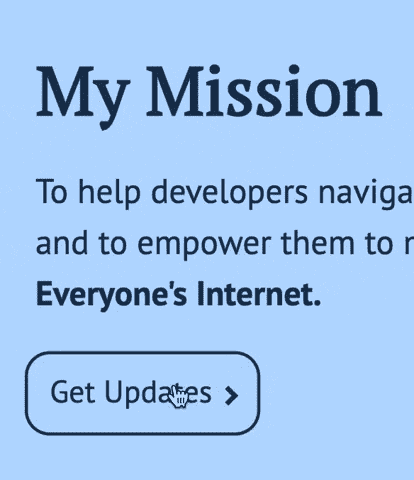
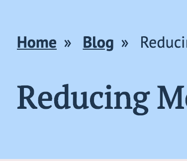
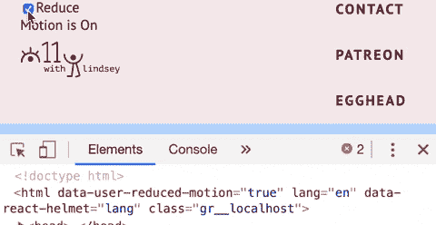

# 减少运动以提高无障碍性

> 原文：<https://dev.to/lkopacz/reducing-motion-to-improve-accessibility-1c0i>

*最初发布于[a11ywithlindsey.com](https://www.a11ywithlindsey.com/blog/reducing-motion-improve-accessibility)。*

嘿朋友们！在这篇文章中，我将带你经历一个新的媒体问题(对我来说):`prefers-reduced-motion`。

快速坦白:我知道 CSS 的基本原理，但是我对所有新出现的东西都很落后。因为我通常关注可访问性，所以我更关注 HTML 和 JavaScript。当我关注 CSS 时，它确保了适当的颜色对比度或自定义焦点状态。有时候我用 CSS 让[复选框可以通过键盘访问](https://www.a11ywithlindsey.com/blog/create-custom-keyboard-accesible-checkboxes)。我总是把媒体的询问和响应式设计联系在一起。我从来不认为媒体查询是一种可访问性增强。

在这篇文章中，我们通过以下方式更新我的博客:

1.  添加`prefers-reduced-motion`查询
2.  添加用户控制的减少运动的设置。

## 理解`prefers-reduced-motion`

对于有前庭障碍的人来说，动画、缩放和平移可能会有问题。这些疾病会导致晕动病和眩晕。这些都是你不想处理的不舒服的感觉，更别说在网站上了。据我所知，[前庭系统](https://a11yproject.com/posts/understanding-vestibular-disorders/)在你的内耳里，帮助控制平衡。

根据 vestibular 的数据，在美国，高达 35%的 40 岁以上的成年人都经历过某种形式的前庭功能障碍。所以这不是一个小问题。

从网页可访问性的角度来看，我的主要收获是:

1.  小心你的动画。
2.  小心你的 gif。
3.  使用`prefers-reduced-motion`。
4.  允许用户控制减少运动。

### 你是怎么做到的

实现查询非常简单:

```
@media screen and (prefers-reduced-motion: reduce) {
  /* Reduced Motion Code */
} 
```

有几个地方我有一些我的链接动画。

首先，有我的链接，当你悬停在它上面时，我有一个向下移动的边框。

[](https://i.giphy.com/media/MY7TMjVSbUUITM2Brh/giphy.gif)

然后是我的行动号召链接，当我们悬停在它上面时，它会放大 1.1 倍。

[](https://i.giphy.com/media/XdIJqlqTIXZG3SyS3V/giphy.gif)

我与[安迪·贝尔](https://twitter.com/andybelldesign/)交谈，他给了我[一些关于实施的建议](https://github.com/andybelldesign/stalfos/blob/feature/v2/src/utilities/_reset.scss#L71)。

```
@media screen and (prefers-reduced-motion: reduce) {
  * {
    animation-play-state: paused !important;
    transition: none !important;
    scroll-behavior: auto !important;
  }
} 
```

实现更改后，我们有悬停效果，但没有转换。

[](https://i.giphy.com/media/W30RUUrYrc94jOvaau/giphy.gif)

[](https://i.giphy.com/media/fszlV41WjnJrjIpoVx/giphy.gif)

这种策略在技术上运作良好。但是，我想完全去掉悬停效果，将链接保留为下划线。我也可能玩秤。

```
@media screen and (prefers-reduced-motion: reduce) {
  * {
    animation-play-state: paused !important;
    transition: none !important;
    scroll-behavior: auto !important;
  }

  a {
    padding-bottom: 0;
    border-bottom: none;
    text-decoration: underline;
  }
} 
```

有了这个改变，现在我所有的链接都只是一个简单的下划线。

[](https://res.cloudinary.com/practicaldev/image/fetch/s--8LRpkyPD--/c_limit%2Cf_auto%2Cfl_progressive%2Cq_auto%2Cw_880/https://thepracticaldev.s3.amazonaws.com/i/zzypb4pbrjq137egweqc.png)

如果没有过渡动画，在悬停时从`scale(1)`到`scale(1.1)`的动作调用链接会有点不协调。所以我把它改成了`scale(1.05)`。

```
@media screen and (prefers-reduced-motion: reduce) {
  * {
    animation-play-state: paused !important;
    transition: none !important;
    scroll-behavior: auto !important;
  }

  a {
    padding-bottom: 0;
    border-bottom: none;
    text-decoration: underline;
  }

  .blog__more-link a {
    text-decoration: none;
  }

  .blog__more-link a:hover {
    transform: scale(1.05);
  }

  .hero__cta a {
    text-decoration: none;
  }

  .hero__cta a:hover {
    transform: scale(1.05);
  }
} 
```

[](https://i.giphy.com/media/jtjBSsS5KPvtCCNqYn/giphy.gif)

### 如何在 mac 上测试

此设置主要在 macOS 上可用。

1.  前往系统偏好设置
2.  转到辅助功能
3.  转到显示
4.  选中“减少运动”

很简单！这篇文章一发表，你就可以在我的博客上测试了！

## 创建用户控制选项以减少运动

[安迪·贝尔的黑暗模式帖子](https://andy-bell.design/wrote/create-a-user-controlled-dark-or-light-mode/)启发我添加了用户控制选项。我们希望优先考虑用户的偏好。我们还想考虑那些没有这些设置的人。

我们将这样做:

1.  创建标签为“减少运动”的复选框
2.  在我的 Gatsby 应用程序中添加一个状态和一个切换该状态的方法。
3.  使用该状态来控制一个`data-user-reduced-motion`属性。
4.  使用上述属性应用 CSS。
5.  将它存储在`localStorage`中，这样我们就保存了用户设置。

### 创建一个`<ReduceToggle />`组件

该组件是一个带有标签的 HTML 复选框。作为免责声明，我使用的是一个`class`组件，而不是钩子。有时候我仍然喜欢写作课，这让我的思考过程更容易。留意一个钩子版本！

```
import React from 'react'

class ReduceToggle extends React.Component {
  render() {
    return (
      <div className="toggle">
        <input id="reduce-motion" type="checkbox" />
        <label htmlFor="reduce-motion">Reduce Motion</label>
      </div>
    )
  }
}

export default ReduceToggle 
```

我在这里做的唯一一件事是创建一个带有与表单标签相关联的[的复选框输入。您可能已经注意到，React 使用了`htmlFor`而不是 for。](https://www.a11ywithlindsey.com/blog/introduction-accessible-labeling)

之后，我将它放在菜单上方的`<Header />`组件中。稍后我会担心造型技巧；我知道这会打乱我的布局，但没关系。我们现在只担心功能性。

### 在状态中添加

我们想继续向我们的构造函数添加一个`checked`状态。

```
import React from 'react'

class ReduceToggle extends React.Component {
  constructor(props) {
    super(props)

    this.state = {
      checked: false,
    }
  }

  render() {
    return (
      <div className="toggle">
        <input id="reduce-motion" type="checkbox" />
        <label htmlFor="reduce-motion">Reduce Motion</label>
      </div>
    )
  }
}

export default ReduceToggle 
```

现在，我们要将该状态添加到复选框本身。

```
import React from 'react'

class ReduceToggle extends React.Component {
  constructor(props) {
    super(props)

    this.state = {
      checked: false,
    }
  }

  render() {
    const { checked } = this.state

    return (
      <div className="toggle">
        <input
          id="reduce-motion"
          type="checkbox"
          checked={checked}
        />
        <label htmlFor="reduce-motion">Reduce Motion</label>
      </div>
    )
  }
}

export default ReduceToggle 
```

接下来，我们想为`onChange`事件添加一个`toggleChecked`方法。

```
import React from 'react'

class ReduceToggle extends React.Component {
  constructor(props) {
    super(props)

    this.state = {
      checked: false,
    }
  }

  toggleChecked = event => {
    this.setState({ checked: event.target.checked })
  }

  render() {
    const { checked } = this.state

    return (
      <div className="toggle">
        <input
          id="reduce-motion"
          type="checkbox"
          checked={checked}
          onChange={this.toggleChecked}
        />
        <label htmlFor="reduce-motion">Reduce Motion</label>
      </div>
    )
  }
}

export default ReduceToggle 
```

我总是喜欢使用 [React 开发工具](https://github.com/facebook/react-devtools)来仔细检查状态是否正常。为此:

*   我检查元素
*   转到“反应”选项卡
*   找到`ReduceToggle`组件
*   确保状态正常工作！

[](https://i.giphy.com/media/d83SPyGS9K9Pm6GQhw/giphy.gif)

现在我们知道国家在起作用。让我们在`documentElement`上切换`data-user-reduced-motion`属性值。我将把它添加到`componentDidUpdate`生命周期方法中。

```
import React from 'react'

class ReduceToggle extends React.Component {
  constructor(props) {
    super(props)

    this.state = {
      checked: false,
    }
  }

  componentDidUpdate() {
    const { checked } = this.state

    if (checked) {
      document.documentElement
        .setAttribute('data-user-reduced-motion', true)
    } else {
      document.documentElement
        .setAttribute('data-user-reduced-motion', false)
    }
  }

  toggleChecked = event => {
    this.setState({ checked: event.target.checked })
  }

  render() {
    const { checked } = this.state

    return (
      <div className="toggle">
        <input
          id="reduce-motion"
          type="checkbox"
          checked={checked}
          onChange={this.toggleChecked}
        />
        <label htmlFor="reduce-motion">Reduce Motion</label>
      </div>
    )
  }
}

export default ReduceToggle 
```

[](https://i.giphy.com/media/gIrdrOgahVAwaRsOW0/giphy.gif)

### 向`data-user-reduced-motion`添加 CSS

警告一句。跳入 CSS 并复制粘贴所有的东西是很诱人的。我建议一步一步来。我犯了一个错误，试图一次完成所有的工作，花了比我想的更多的时间来调试。所以首先让我们回到我们想要的目标。

> 我们希望用户偏好优先于系统偏好。我们将添加系统首选项作为一个渐进的增强功能。

Gatsby 是一个静态站点生成器，所以如果 JavaScript 不能加载，我的大部分静态站点应该可以加载。然而，如果 JavaScript 没有加载，当`data-user-reduced-motion`属性不存在时，我们希望返回到系统首选项。因此，我们将向第一部分中的查询添加一些关于媒体查询本身的内容。所以我们使用`:not()` CSS 伪类来完成这项工作。

```
@media screen and (prefers-reduced-motion: reduce) {
  * {
  :root:not([data-user-reduced-motion]) * {
    animation-play-state: paused !important;
    transition: none !important;
    scroll-behavior: auto !important;
  }

  a {
  :root:not([data-user-reduced-motion]) a {
    padding-bottom: 0;
    border-bottom: none;
    text-decoration: underline;
  }

  .blog__more-link a {
  :root:not([data-user-reduced-motion]) .blog__more-link a {
    text-decoration: none;
  }

  .blog__more-link a:hover {
  :root:not([data-user-reduced-motion]) .blog__more-link a:hover {
    transform: scale(1.05);
  }

  .hero__cta a {
  :root:not([data-user-reduced-motion]) .hero__cta a {
    text-decoration: none;
  }

  .hero__cta a:hover {
  :root:not([data-user-reduced-motion]) .hero__cta a:hover {
    transform: scale(1.05);
  }
} 
```

然后我们将 CSS **添加到**之外，查询 if`data-user-reduced-motion="true"`。

```
:root[data-user-reduced-motion='true'] * {
  animation-play-state: paused !important;
  transition: none !important;
  scroll-behavior: auto !important;
}

:root[data-user-reduced-motion='true'] a {
  padding-bottom: 0;
  border-bottom: none;
  text-decoration: underline;
}

:root[data-user-reduced-motion='true'] .blog__more-link {
  text-decoration: none;
  padding: 12px 14px;
  border: 2px solid;
}

:root[data-user-reduced-motion='true'] .blog__more-link:hover {
  transform: scale(1.05);
}

:root[data-user-reduced-motion='true'] .hero__cta__link {
  text-decoration: none;
  padding: 12px 14px;
  border: 2px solid;
}

:root[data-user-reduced-motion='true'] .hero__cta__link:hover {
  transform: scale(1.05);
} 
```

为了测试，我做了以下工作:

1.  关闭了 macOS 上的任何减少运动设置
2.  取消选中“减少”切换时，确保所有动画仍然存在。
3.  选中减少切换复选框，并看到所有的 CSS 变化，以减少议案的工作。
4.  在元素检查器中，转到`<html>`文档并找到`data-user-reduced-motion`。删除该属性。在这里，我们模拟该属性从未加载。
5.  转到系统偏好设置并选中减少运动。我们应该改变 CSS 来减少动作！

### 添加`localStorage`

现在我们有了工作，我们想开始玩`localStorage`。我们希望为未来保留用户的偏好。每次访问时选择设置并不是最好的用户体验。如果你不知道什么是`localStorage`，我建议你在这里停下来浏览一下[文档](https://developer.mozilla.org/en-US/docs/Web/API/Window/localStorage)。如果你喜欢视频例子，可以看看[韦斯博斯的 JS30 教程](https://www.youtube.com/watch?v=YL1F4dCUlLc)。

我们要做的第一件事是在`componentDidMount`上设置`localStorage`。

```
import React from 'react'

class ReduceToggle extends React.Component {
  constructor(props) {
    super(props)

    this.state = {
      checked: false,
    }
  }

  componentDidMount() {
    let reduceMotionOn = localStorage.getItem('reduceMotionOn')
    console.log(reduceMotionOn)
    // if we haven't been to the site before
    // this will return null
  }

  // All other code stuff

  render() {
    return (
      <div className="toggle">
        <input id="reduce-motion" type="checkbox" />
        <label htmlFor="reduce-motion">Reduce Motion</label>
      </div>
    )
  }
}

export default ReduceToggle 
```

现在我们要做的是，如果`reduceMotionOn`为空，为用户创建一个默认的 localStorage 状态。我要把它设置为`false`。

```
import React from 'react'

class ReduceToggle extends React.Component {
  constructor(props) {
    super(props)

    this.state = {
      checked: false,
    }
  }

  componentDidMount() {
    let reduceMotionOn = localStorage.getItem('reduceMotionOn')

    // Just a way to get around localStorage being
    // stored as a string and not a bool
    if (typeof reduceMotionOn === 'string') {
      reduceMotionOn = JSON.parse(reduceMotionOn)
    }

    if (reduceMotionOn === null) {
      localStorage.setItem('reduceMotionOn', false)
    }
  }

  // All other code stuff

  render() {
    return (
      <div className="toggle">
        <input id="reduce-motion" type="checkbox" />
        <label htmlFor="reduce-motion">Reduce Motion</label>
      </div>
    )
  }
}

export default ReduceToggle 
```

在安装组件时，我要做的最后一件事是在应用程序中设置状态。我想确保我的应用程序与`localStorage`相同。

```
import React from 'react'

class ReduceToggle extends React.Component {
  constructor(props) {
    super(props)

    this.state = {
      checked: false,
    }
  }

  componentDidMount() {
    let reduceMotionOn = localStorage.getItem('reduceMotionOn')

    if (typeof reduceMotionOn === 'string') {
      reduceMotionOn = JSON.parse(reduceMotionOn)
    }

    if (reduceMotionOn === null) {
      localStorage.setItem('reduceMotionOn', false)
    }
    this.setState({ checked: reduceMotionOn })
  }

  // All other code stuff

  render() {
    return (
      <div className="toggle">
        <input id="reduce-motion" type="checkbox" />
        <label htmlFor="reduce-motion">Reduce Motion</label>
      </div>
    )
  }
}

export default ReduceToggle 
```

进入 Chrome 开发工具中的应用>本地存储(Firefox 中的存储>本地存储)。然后，清除`reduceMotionOn`存储器。刷新后，您应该会看到`reduceMotionOn`为假。如果你转到 React Dev 工具并转到`<ReduceToggle />`组件，你会发现选中状态与 reducemotionlocalstorage 项相匹配。

还没完呢！我们必须在 React 组件的`toggleChecked`方法中切换 localStorage。

```
import React from 'react'

class ReduceToggle extends React.Component {
  constructor(props) {
    super(props)

    this.state = {
      checked: false,
    }
  }

  // All other code stuff

  toggleChecked = event => {
    localStorage.setItem('reduceMotionOn', event.target.checked)
    this.setState({ checked: event.target.checked })
  }

  render() {
    return (
      <div className="toggle">
        <input id="reduce-motion" type="checkbox" />
        <label htmlFor="reduce-motion">Reduce Motion</label>
      </div>
    )
  }
}

export default ReduceToggle 
```

现在，如果我选择减少运动并离开网站，我的用户控制的首选项将被保留！

## 结论

当我在我的博客中增加了一个逐渐增强的可访问性功能时，感谢你的加入！我希望你在这个过程中学到了一些东西。大声呼喊安迪，因为他激励我写下这篇文章！

不管你使用什么样的框架，以下是这篇文章的要点:

1.  小心你制作的动画，并为那些有前庭障碍的人提供选择。
2.  用户控制>系统偏好设置
3.  具有渐进增强的系统偏好设置
4.  为了您的利益使用`localStorage`,以便保存用户设置！

如果你想玩这个，我为你做了一个代码沙箱！

[https://codesandbox.io/embed/laughing-sutherland-76xj6](https://codesandbox.io/embed/laughing-sutherland-76xj6)

保持联系！如果你喜欢这篇文章:

*   在 [Twitter](https://twitter.com/LittleKope) 上让我知道，并与你的朋友分享这篇文章！此外，如果有任何后续问题或想法，请随时发推特给我。
*   在 [patreon](https://www.patreon.com/a11ywithlindsey) 上支持我！如果你喜欢我的工作，可以考虑每月认捐 1 美元。如果你认捐了 5 美元或更多，你将能够对未来的博客文章进行投票！我还为所有顾客做了一个每月一次的“问我任何问题”的会议！
*   [成为第一个了解我的帖子的人](https://pages.convertkit.com/4218bd5fb5/68dc4e412a)以获得更多的可访问性乐趣！

干杯！祝你一周愉快！