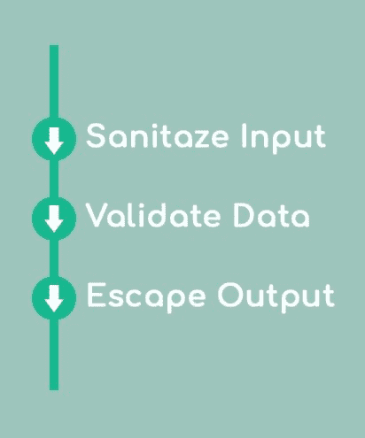

# 良好实践:如何在 PHP 中净化、验证和转义

> 原文：<https://dev.to/anastasionico/good-practices-how-to-sanitize-validate-and-escape-in-php-3-methods-139b>

## 简介

我最近意识到，即使在被认为是顶尖的地方，在伦敦这样技术代理和商业竞争激烈的地方，仍然有很多公司使用 PHP 的第五版或以前的版本，甚至更糟的是，根本没有使用好的实践。

应该每天使用的对流，如**净化输入、验证数据或转义输出被忽略了**，原因是:“没有时间了，我今天需要部署，或者老板催我”。

从跳过检查外部数据到无法管理密码和日期，直到决定不处理错误和异常，**所有这些都会导致糟糕的代码和不安全的应用程序**。

但是今天，您将看到如何使用数据，以及它为什么如此重要。

事实上，

这篇文章包含了一些好的实践和建议，可以在你目前从事的所有项目中每天使用。

如果您遵循良好的实践，您就可以确保您的应用程序运行得更快、更稳定，并且它们很难被破解，因为它们以更安全的方式运行。

PHP 作为一种语言已经存在了 20 多年了，它有过几次重写和发展，这意味着所有被创建、更新和废弃的工具都是过时的，很容易陷入陷阱并部署糟糕的代码。

几年前我得到的一个很好的建议是知道使用什么工具，哪些工具需要被忽略。

## PHP 方式编写的好做法

大卫·杜楚尼饰演的狐狸威廉·莫特是一系列科幻小说中的虚构人物，超自然电视叫做 X 档案，他常说这句话“**不要相信任何人**”。
T3】

[](https://res.cloudinary.com/practicaldev/image/fetch/s--Ua559HXc--/c_limit%2Cf_auto%2Cfl_progressive%2Cq_auto%2Cw_880/http://anastasionico.uk/img/1/David_Duchovny_cropped.jpg)

作为一名 PHP 开发人员，你需要时刻牢记这一理念。

你不知道谁是你网页的访问者，更糟糕的是，你不知道他们的意图是什么。

保持对应用程序控制的一种方法是通过检查和限制对外部资源的访问，为应用程序增加额外的保护层。

典型的外部信号源可以是:

*   $ _ 邮政
*   $ _ 获取
*   $ _ 请求
*   $_COOKIE
*   文件获取内容()
*   数据库
*   蜜蜂
*   从客户端输入数据
*   $argv
*   php://stdin
*   php://input

上面所有的关键字都可能是资源，恶意的**可以利用这些资源将恶意数据注入到您的脚本**中。

如果您在应用程序中使用这些关键字中的任何一个，那么在一周中安排一些时间来净化您的输入、验证您的数据并避开输入可能是值得的

在下面的段落中，我将教你如何去做。

## 

## 整理输入

*来自剑桥官方词典

/ˈsanɪtʌɪz/——使某物完全干净并且没有细菌*

在 web 开发中，净化意味着从输入中删除不安全的字符。

这是你的第一道防线，

[](https://res.cloudinary.com/practicaldev/image/fetch/s--JE63PZW0--/c_limit%2Cf_auto%2Cfl_progressive%2Cq_auto%2Cw_880/http://anastasionico.uk/img/1/110526-M-UF252-004.JPG)

最基本的是在应用程序接收到的输入到达存储层之前对其进行净化(无论您是使用 MySql 还是 NoSql 数据库，或者使用 Redis 之类的缓存应用程序)。

正如我们之前所说的，我们需要假设这个世界是一个危险的地方，这意味着我们需要确保如果一个罪犯来到我们的页面**，他或她不应该做任何危险的事情或者注入一些不良数据**。

消毒时，您需要考虑几种类型的输入，最常见的是 HTML、通过 SQL 查询的输入和用户配置文件信息。

让我们来看看所有这三种情况，以及我们可以做些什么来解决这些问题。

### 通过 HTML 输入

想象你有一个博客，

你的博客允许评论，某个从网上随便找来的家伙，在阅读了你的博客文章后，决定键入一条评论，其中包括一个非常基本的 JavaScript 单行脚本，

类似于 *window.location.href* 命令。

这样做的结果是，每当有人(在我们的朋友留下礼物后)点击我们页面中的帖子，**他或她将被重定向到谁知道攻击者决定发送给他们的页面**。

一种解决方法是使用 PHP 命令 *htmlentities()* 。

该函数转义字符串中的所有 HTML 字符，并使字符串变得安全。

*htmlentities()* 的问题在于它不是很强大，事实上，它不能转义单引号，不能检测字符集，也不能验证 HTML。

为了解决这个问题，我们需要学习如何最好地使用它的论点。

该函数接受的第一个参数是我们需要净化的字符串(duh？).

第二个必须包含一个标志，在我们的例子中，我们希望使用 *ENT_QUOTES* 常量，

**提示函数对单引号进行编码。**

最后，最后一个参数允许您指定应用程序中使用的字符集。

一个基本的例子应该是这样的:

```
echo htmlentities($string, ENT_QUOTES, 'UTF-8'); 
```

你可以用一种叫做 HTML 净化器的工具来净化你的 HTML。

这是一个图书馆，

它接受一系列你可以预先设置的参数，被认为是非常可靠的。

关于这个话题，我想说的最后一点是**不要使用正则表达式函数来净化**，它们非常复杂，出错的风险非常高。

避免 *preg_replace()、preg_replace_all()、preg_replace_callback()*

## 

### SQL 查询

有时候，作为开发人员，我们需要根据用户给我们的输入来构建 SQL 查询。

该输入可以来自查询字符串(例如:？用户=1)或 URI(例如:用户/1)。

如果您不小心使用这些输入，并允许它们直接插入到查询中，对您的应用程序来说可能是非常危险的。

我们来举一个基本的例子:

```
$changePassword = sprintf(
    'UPDATE users set password = "%s" WHERE id = "%s"',
    $_POST['password'],
    $_GET['id'],
); 
```

这段代码有什么问题？

不要忘记规则 1“不要相信任何人”。

该代码的保护级别非常弱，实际上根本不存在。

如果有人向你的 PHP 脚本发送 HTTP 请求会怎么样？

大概是:

```
POST /user?id=1
password="abc";-- 
```

许多 SQL 数据库认为-是注释的开始，导致后面的文本被忽略。

结果呢？

您可以将所有用户的密码设置为 abc。

你能做什么来解决这个问题？

使用 PDO 准备好的语句。

PDO 是一个数据库抽象层。

它内置于 PHP 中，提供了一个允许使用多个数据库的接口。

PDO 以一种安全的方式整理并嵌入外部数据到 SQL 查询中，避免了我上面提到的问题。

## 

### 用户信息:

现在网络上大多数可用的网络应用程序使用某种类型的会计系统，想一想，你选择的社交网络，一份过滤更适合你的账户或你的网飞账户的新闻的在线报纸，它会根据你以前的偏好推荐最好的连续剧。

很有可能所有这些账户都保存了电子邮件地址、电话号码、你的位置等信息。

核心 PHP 的开发人员在预见这些情况方面做得非常好，他们为我们提供了两个功能。

第一个是 *filter_var()* 第二个是 *filter_input()。*

这两个函数通过使用各种标志来净化输入。

一个非常容易理解的例子是当你需要清理一封电子邮件时

```
$email = 'myname@gmail.com';
$emailSanitized = filter_var($email, FILTER_SANITIZE_EMAIL); 
```

当使用示例中的标志时，该函数确保代码删除除字母、数字和后面的字符以外的所有字符！#$%&'*+-=? <sup>_`{|}~@。【</sup>。

有一些这样的标志可用，完整的列表请查看官方手册中的 sanitize filter 页面。

## 

## 验证数据

来自剑桥官方词典

/ˈvæl.ɪ.deɪt/——使某事被官方接受或批准，尤其是在检查之后

您已经清理了输入，删除了所有不想使用的信息，并丢弃了所有您认为危险的数据。

现在是验证数据的时候了。

**验证不是净化，这一步不会删除任何坏数据，验证确认进入您的应用程序的信息符合您想要的标准。**

如果您正在等待一个文本值，让我们继续以电子邮件为例，您需要确保您的应用程序将收到一个包含电子邮件的字符串，日期和数字也是如此。

如果忽略了这一步，可能会在接下来的步骤中导致几个错误，并在用户旅程的更高级阶段导致更多问题。

[](https://res.cloudinary.com/practicaldev/image/fetch/s--YQeAGoM5--/c_limit%2Cf_auto%2Cfl_progressive%2Cq_auto%2Cw_880/http://anastasionico.uk/img/1/validate-arrow.jpg)

有不同的方法来验证输入，但是用于验证的主要函数是 *filter_var()。*

我们已经看到了如何通过使用诸如 *FILTER_SANITIZE_EMAIL* 的标志来删除电子邮件中不支持的字符，

现在我们可以用一个类似的标志 *FILTER_VALIDATE_EMAIL* 来使用这个函数。

该函数根据情况返回两种不同类型的变量。

如果验证成功，它将返回值本身，反之，它将返回 false。

为此，你需要！= false”来检查该函数的结果。

根据 sanitize 函数，大多数(如果不是全部)标志以字符串 *FILTER_VALIDATE_* *开始，并以我们需要使用的验证类型结束，

我们可以验证整数、浮点数、IP 地址、域名、URL 等等。

[查看验证过滤器页面了解更多信息](https://www.php.net/manual/en/filter.filters.validate.php)

请注意，即使 *filter_var()* 提供了几个验证标志，也有更强大的组件，例如:

*   [光环/滤镜](https://packagist.org/packages/aura/filter)
*   [尊重/确认](https://packagist.org/packages/respect/validation)
*   [symphony/审核员](https://packagist.org/packages/symfony/validator)

## 

## 转义输出

*摘自剑桥官方词典

/ɪˈskeɪp/——从某事中获得自由，或避免某事*

我们已经获得了一些数据，并使用您刚刚学到的技术对其进行了验证，**现在是时候考虑如何确保这些数据显示阶段的安全了。**

我们可以通过对我们想要显示的信息进行转义来为我们的应用程序添加另一层保护，并阻止一些代码在我们的页面上显示，甚至更糟的是，阻止它们在我们的页面上执行。

为了对我们使用的输出进行转义，PHP 函数 *htmlentities()* 。

我们需要确保这个函数的第二个参数包括 ENT_QUOTES 标志，这样它就能转义单引号和双引号，并最终定义字符编码(在欧洲和美国通常是 UTF-8)。

注意不要对数据进行一次以上的转义，只有在收到数据或者需要输出数据的时候才进行转义。

这里有一个例子:

**$script = '**

**<脚本> alert("这是一条消息")；< /剧本>**

**’；

echo html entities($ script，ENT_QUOTES，' UTF-8 ')；**

根据数据的验证，有几个组件甚至可以在转义阶段使用。

最相关的是:

*   [小枝/小枝](https://packagist.org/packages/twig/twig)
*   [自作聪明/自作聪明](https://packagist.org/packages/smarty/smarty)

## 结论

能够正确地管理数据、验证数据、以安全可靠的方式展示数据，并使您的 web 应用程序值得信赖，这必须是您作为 web 开发人员职业生涯的主要目标之一。

还有其他一些好的实践，比如学习正确使用密码，或者使用日期和时间，甚至管理 PDO 扩展

(*我们也将对此进行回顾，因此请务必订阅下面的新闻简报*)。

所有这些惯例可能看起来很无聊，浪费时间，但从长远来看，使用它们的好处会变得很明显。

另外，顺便提一下，目前有几十个 PHP 开发框架使得这个过程变得非常容易和流畅

我已经回顾了 24 个 PHP 开发框架，它们可以帮助你简化这项工作。

现在就审查你项目的代码，确保总是使用好的实践。

[](http://eepurl.com/dIZqjf)