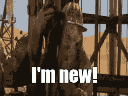

# 软件工程师的时间管理策略

> 原文：<https://dev.to/danondso/time-management-strategies-for-software-engineers-4787>

时间管理是我最关心的问题。我最初是作为一名支持角色的开发人员开始工作的，在这一角色中，我们必须对当时需要我们注意的任何事情做出反应和让步(我实际上必须监视一个错误队列，并在任何事情不能正确处理时进行手动干预)。那是一场噩梦。

###### 

我在处理错误队列

在从那个角色转变为一个更注重发展的角色后，分心的事情仍然存在。需要回复的电子邮件，与其他团队的来回设计会议，因为我们正在构建的系统比会议中的任何开发人员都要老，人们突然出现在我的办公桌前问问题。随着时间的推移，我意识到如果我要完成任何有深度和有意义的工作，我必须更好地管理我的时间。

以下是我尝试过的管理时间的四个策略，并取得了成功。

## 划掉你的时间

管理时间的一个好的开始是对你的时间花在哪里进行更多的控制。

我喜欢做的一个练习是通过时间块来计划我的一天，卡尔·纽波特， *Deep Work* 的作者，我这个策略的灵感，写了一篇关于时间块的极好的[帖子。](http://www.calnewport.com/blog/2013/12/21/deep-habits-the-importance-of-planning-every-minute-of-your-work-day/)

我所做的是根据我认为一项任务需要多长时间来划分我的时间。如果我比估计的完成时间更快地完成了任务，我就用我完成任务的时间来更新那个块，然后继续下一个任务。

如果有什么事情需要我的注意，而我又不能忽视，那么我就记下开始时间，专注于那项任务直到它完成，然后回到我之前正在做的任务。即使工作是被动的，控制花在上面的时间也很重要。不要让反应浪费你的时间。

这听起来可能很乏味，但最终你会对你的时间花在哪里有一个详细的了解，有了这个了解，你就可以开始制定策略来消除某些对你的总体目标没有帮助的活动。

## 变得难以触及

我并不是说成为一个生产率隐士，在那里你找到一个洞藏起来，呆在那里直到你完成你的工作。

但是想想你被动地允许别人联系你的时间。电子邮件、懈怠/团队/不和/等等。、电话，所有这些都可以变成时间烂透了。

当我必须长时间专注于某事时。我关闭了我的即时通讯客户端、电子邮件和其他任何会分散我注意力的东西。有时候我会在办公室里找另一张桌子坐下，信不信由你，换个环境会有很大帮助！

###### 

在

找到一个不受打扰的地方后被打断

而且也不是一直这样。作为一个领导开发团队的人，我的工作职责是协助团队的其他成员。我试着给自己留出时间来提供帮助，但是当我不需要的时候，我的电子邮件和即时消息客户端会被静音，我会专注于手头的任务。

## 知道什么时候停止工作

工作 12 个小时试图理解一些深奥的日志消息不会有什么好结果，你必须通过调试 COBOL 来获得这些消息，这些消息可能在你出生之前就已经高中毕业了。

回家吧。人们倾向于在一天中工作最佳的时间。如果现在是晚上 9 点，那么你会更有动力，但不要为了圆满结束而耗尽精力，大多数事情可以等到明天。

## 关注重要的事情

我们大多数人都在一个充满干扰的环境中工作，人们来到你的办公桌前问问题，应用程序叮叮咚咚地盯着你，有些人有时可能会认为你需要在那里倾听或纠正某人或问问题，甚至更糟的是，安排更多会议的会议。

知道削减什么/优先考虑什么目标是一种无价的技能。除了分时段，我还用[来划分优先级，安排某些目标和提醒。如果需要对任务进行分组，您可以创建项目来分配任务，也可以将任务嵌套在一起。我发现它对保持事物有条理非常有帮助。](https://todoist.com/)

###### T3】我的待办事宜

最后。第一次尝试时间管理并不是一件容易的事情。这需要很强的纪律性和决断力，才能有好的状态。知道你的时间花在哪里是更好地管理时间的第一步！