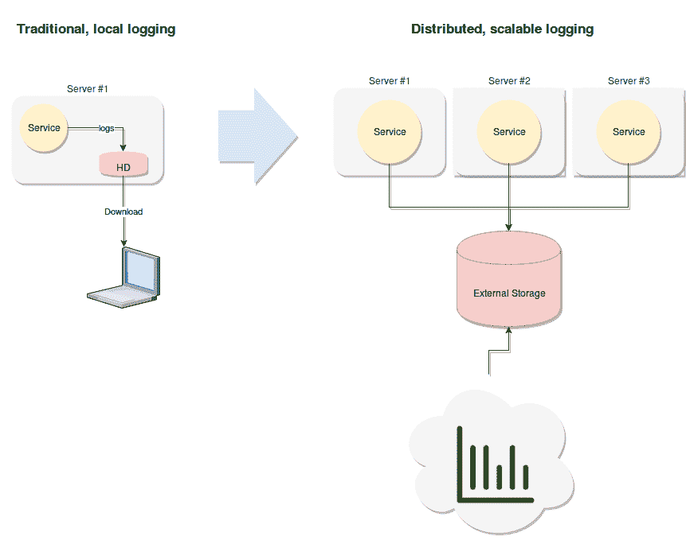

# 正确地按比例记录

> 原文：<https://dev.to/deleteman123/logging-at-scale-done-right-3m0e>

## 如何避免分布式 Node.js 平台中的日志孤岛

[](https://res.cloudinary.com/practicaldev/image/fetch/s--r56JJ3MW--/c_limit%2Cf_auto%2Cfl_progressive%2Cq_auto%2Cw_880/https://cdn-images-1.medium.com/max/3840/1%2ACHNr7K5zAIS7ETy4vdS94Q.png)

*原文发布于此:[https://blog . bitsrc . io/logging-at-scale-done-right-714896554 d94](https://blog.bitsrc.io/logging-at-scale-done-right-714896554d94)T3】*

分布式平台非常适合解决许多问题，例如大代码库的可伸缩性、高可用性甚至可维护性。

但是，尽管它们提供了巨大的好处，但它们也带来了一些额外的负担，你在使用它们时需要考虑到这一点。在本文中，我想介绍其中之一:分布式日志记录

因为当您在本地为单个服务进行日志记录时很容易，但是当您开始并行跨越数十甚至数百个服务时，事情就变得有点疯狂了。

### 你的日志会出什么问题？

从单一实例类型的应用程序迁移到基于微服务的平台本身就是一个相当大的项目。

具体来说，在进行日志记录时，有些事情可能会出错:

1.  **支离破碎的真相**:这是最明显也是最常见的问题，你的日志文件保存在每台服务器的本地，因此无论何时你需要检查发生了什么，你只能了解事情的一部分。为了全面了解您的整个平台上发生了什么，您需要手动收集所有日志文件，合并它们并一起研究它们。

2.  **缺少上下文**:在编写日志代码时不考虑全局的另一个副作用是，你只关注一个过程。您可能无法记录运行服务的服务器的 IP 或名称，或者在任何给定时间有多少副本处于活动状态。当有多个移动的部分时，上下文就是一切，当只有一个移动的部分时，上下文就不那么重要了。

3.  **耗尽存储空间**:除非你在运行某种关键任务服务，否则你不会一直查看日志。因此，将日志存储在本地最终会填满您分配给它们的任何存储空间。即使您正在考虑旋转它们(使用类似 log-rotate 的东西)，活动的峰值也会由于大小的快速增加而导致数据丢失。

我可以继续下去，但是我想你现在已经明白了，日志有很多地方会出错，当出错时，你会特别后悔没有一个更好的日志策略，而你会发现自己手动地运行了数千行日志。

为了尝试和避免这些问题，我们可能要开始考虑用不同的方式去做。

[ ](https://res.cloudinary.com/practicaldev/image/fetch/s--4Oq7Oe-a--/c_limit%2Cf_auto%2Cfl_progressive%2Cq_auto%2Cw_880/https://cdn-images-1.medium.com/max/2000/1%2AuLRTVAtHdco4OlYnEUdhTg.png) *传统日志记录设置与可扩展设置*

## 可扩展的日志记录策略有什么好处？

可伸缩日志策略顾名思义:您可以根据需要记录任意多的日志。就像当您的平台遇到流量高峰时，您可以(并且应该)扩展您的处理能力或带宽一样，您的日志记录功能也应该具有类似的弹性。

经验法则应该是:

> 您的平台工作得越重，它需要的日志记录就越多

那么，可扩展策略的好处是什么呢？

1.  首先，您不会受到现有服务器硬件的限制。你可以在你的服务器上有一个小硬盘，同时有一个大容量的云计算存储等待接收日志消息。

2.  您的日志记录活动不会影响服务器的 I/O 操作。换句话说，你不需要不断地在你的磁盘上写东西，为你的应用程序的实际需求释放周期。

3.  通过集中日志，它们更容易浏览和检查。您不必逐个服务器地手动下载日志文件，然后在能够查看它们之前尝试合并它们。使用分布式方法，您可以将日志发送到其他地方，通过这个过程，您可以在将它们存储在一个集中的公共位置之前合并它们。

4.  记录并忘记。通常，当您在本地进行日志记录时，您必须考虑日志格式、日志文件大小、周期和其他变量。在分布式设置中，您可以让日志记录服务在接收到日志时处理此事，而您的开发人员(以及他们开发的服务)不需要担心这一点，他们只需发送日志事件并将其遗忘。

5.  更容易在所有服务中保持标准格式。与前一点相关，如果您有一个集中的日志服务，能够接收和处理来自不同地方的日志事件，那么您可以将 ETL 代码集中在其中。通过这种方式，您可以控制格式，而不会影响或增加平台的其他部分的额外工作。

这只是我的一个想法，取决于您的具体情况和平台，当您开始考虑这种架构时，其他好处可能会出现。

现在，我已经(希望)让您相信了走向分布式的好处，让我解释一下您可以使用什么样的工具来实现这一点。

## 工作的工具

当进入分布式环境时，有许多选择，其中一些是完全免费的，而另一些将收取你相当多的钱。当然，免费是以需要手动安装为代价的，而付费服务将托管在云上，你所要做的就是将你的日志指向它们。

提供弹性日志存储的第三方服务，额外的好处是提供能够浏览日志并从中获取统计数据的 web UI。

对于这个特殊的例子，我将介绍 ELK ( [Elastic](https://www.elastic.co/products/elastic-stack) 、 [Logstash](https://www.elastic.co/products/logstash) 、 [Kibana](https://www.elastic.co/products/kibana) )堆栈，但是非常欢迎您搜索其他选项并挑选最符合您需求的一个。

### 麋鹿栈

这个堆栈的工作方式是为您提供传输数据、存储数据、使数据可浏览以及最终提供从日志中搜索和收集统计数据的 UI 所需的三种产品。

实现这一点的方法是使用这个出色的开源免费堆栈的三个组件:

*   弹性:这基本上是一个 NoSQL 数据库。尤指专门从事搜索的人。因此，它将作为日志事件的主要存储，使它们在以后很容易搜索和检索。

*   Logstash:这是将日志从服务器导入 Elastic 的方法。通过在您的服务器中安装小代理，您可以配置它们读取、转换和传输日志文件的行，一直到您的弹性服务器。

*   Kibana:最后，一旦您的日志被传输并存储在 Elastic 中，Kibana 将充当一个用户友好的 UI，能够与 Elastic 的 REST API 交互。

### 从 Node.js 应用程序连接到 ELK

所以你已经准备好了你的 ELK 堆栈(如果你还没有，就跟随在线教程)但是没有内容。现在让我们将我们的应用程序连接到它，你会看到它是多么容易。

既然我们正在处理 Node.js，我想说有两种方法可以实现它:我们可以按照我们已经在做的方式继续记录，很可能是记录到一个文件中，然后[配置 Logstash](https://www.elastic.co/guide/en/logstash/current/advanced-pipeline.html) 来捕获对该文件的更新，并将它们重新发送到 Elastic 中。或者我们可以使用一个日志库，比如 [Winston](https://www.npmjs.com/package/winston) 并配置它的一个传输器来为我们做这件事。

猜猜我要说的是哪个？

### 从云丝到弹力

Winston 的美妙之处在于，我们甚至可以避免配置 Logstash。不要误解我的意思，Logstash 是一个非常有用的工具，它可以在日志的传输和格式化领域为我们做很多事情，有时这是天赐之物，尤其是在我们无法访问应用程序的代码和操纵它记录日志的方式的情况下。

如果我们不能改变这一点，那么我们需要抓住任何被保存的内容，并对其进行充分的处理，使其符合我们的存储需求，之后我们会将其发送给 Elastic。这就是 Logstash 大放异彩的地方。您可以在许多地方找到处理来自其他应用程序的最常见日志格式以及如何为它们配置 Logstash 的方法。

但是如果你*是*负责你的应用程序的编码，那么就没有这个必要。感谢像 Winston 这样的库，我们可以很容易地重定向(甚至添加)我们的日志目的地，这样我们的信息就能在我们需要的地方结束。

为了做到这一点，我们将使用 Winston 及其相应的插件 [winston-elasticsearch](https://www.npmjs.com/package/winston-elasticsearch) 。

所以为了安装东西，我们可以简单地做:

```
 $ npm i winston --save
    $ npm i winston-elasticsearch --save 
```

Enter fullscreen mode Exit fullscreen mode

在那之后，这就是你想要如何创建一个新的 logger 对象，以便以后修改。也许您已经有了基于 Winston 的日志记录器，所以在这种情况下，只需获取与传输相关的代码并将其添加到您自己的日志记录器中。

```
 const winston = require('winston');
const Elasticsearch = require('winston-elasticsearch');

const esTransportOpts = {
  level: 'info'
};

const logger = winston.createLogger({
  level: 'info',
  format: winston.format.json(),
  transports: [
    new winston.transports.File({ filename: "logfile.log", level: 'error' }), //save errors on file
    new Elasticsearch(esTransportOpts) //everything info and above goes to elastic
  ]
});

if (process.env.NODE_ENV !== 'production') {
  logger.add(new winston.transports.Console({ //we also log to console if we're not in production
    format: winston.format.simple()
  }));
} 
```

Enter fullscreen mode Exit fullscreen mode

该代码创建了一个新的 logger 对象，根据环境的不同，它有两种或三种不同的传输方式。显然，这里我使用了默认值，并让插件连接到我的本地 Elastic 副本。

因此，使用下面的代码，我可以登录到我的本地副本:

```
//Logging tests...
logger.info("Test!")
logger.error("This is an error message!")
logger.error("This is an error message with an object!", { error: true, message: "There was a problem!"}) 
```

Enter fullscreen mode Exit fullscreen mode

默认情况下，如果你现在没有使用 Kibana，你可以像这样简单地查询 Elastic 的 REST API:

```
 $ curl [http://localhost:9200/logs-2019.07.29/_search](http://localhost:9200/logs-2019.07.29/_search) 
```

Enter fullscreen mode Exit fullscreen mode

请注意索引是如何按日期创建的，因此您可能希望将这一部分修改为当前日期。这是你会得到的:

```
{
    "took": 994,
    "timed_out": false,
    "_shards": {
        "total": 1,
        "successful": 1,
        "skipped": 0,
        "failed": 0
    },
    "hits": {
        "total": {
            "value": 4,
            "relation": "eq"
        },
        "max_score": 1.0,
        "hits": [{
            "_index": "logs-2019.07.29",
            "_type": "_doc",
            "_id": "Cl2KP2wBTq_AEn0ZM0t0",
            "_score": 1.0,
            "_source": {
                "@timestamp": "2019-07-29T21:01:57.472Z",
                "message": "Test!",
                "severity": "info",
                "fields": {}
            }
        }, {
            "_index": "logs-2019.07.29",
            "_type": "_doc",
            "_id": "C12KP2wBTq_AEn0ZM0t0",
            "_score": 1.0,
            "_source": {
                "@timestamp": "2019-07-29T21:01:57.474Z",
                "message": "This is an error message!",
                "severity": "error",
                "fields": {}
            }
        }, {
            "_index": "logs-2019.07.29",
            "_type": "_doc",
            "_id": "DF2KP2wBTq_AEn0ZM0t0",
            "_score": 1.0,
            "_source": {
                "@timestamp": "2019-07-29T21:01:57.475Z",
                "message": "This is an error message with an object!There was a problem!",
                "severity": "error",
                "fields": {
                    "error": true
                }
            }
        }]
    }
} 
```

Enter fullscreen mode Exit fullscreen mode

上面 JSON 中最有趣的一点是最后一次点击(检查 hits 数组)，注意 fields 元素只有一个属性，因为库将消息字段与我传递给 error 方法的第一个参数混合在一起。

### 连接到弹性的远程实例

理想情况下，您希望连接到一个远程弹性实例，为此，您可以简单地将弹性客户端配置传递给 ES 传输配置对象。像这样:

```
const esTransportOpts = {
  level: 'info',
  clientOpts: {
      host: "http://your-host:your-port",
      log:"info"
  }
}; 
```

Enter fullscreen mode Exit fullscreen mode

这样，你就可以自动将你的日志信息发送到以太网。

### 发送前转换数据

由于可以在 es 传输属性上设置 transformer 属性，您可以对日志消息进行一些预处理，例如:

```
const esTransportOpts = {
  level: 'info',
  transformer: logData => {
      return {
        "@timestamp": (new Date()).getTime(),
        severity: logData.level,
        message: `[${logData.level}] LOG Message: ${logData.message}`,
        fields: {}
      }
  }
}; 
```

Enter fullscreen mode Exit fullscreen mode

该 transformer 函数将忽略所有元属性(基本上是我们可能想要记录的任何对象)，并通过在实际消息前添加一个“**【LEVEL】LOG Message:**”字符串来扩展它。

## 结论

就是这样，很抱歉介绍得太长，但是正如您所看到的，实际上设置一个集中式日志记录平台并将 Node.js 应用程序连接到它是非常简单的:

1.  设置松紧带
2.  安装[温斯顿](https://www.npmjs.com/package/winston)和[温斯顿-弹性搜索](https://www.npmjs.com/package/winston-elasticsearch)
3.  使用我上面给你的代码或运输代码
4.  ？？？？
5.  利润！！！

你完了！(也许最后一部分有点夸张，但前三步是非常有效的:P)

如果你有在集中式日志平台上使用 Elastic 的经验，请在评论中告诉我。

否则，*下一场见！*