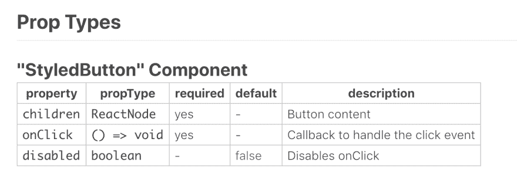

# react ui-kit with TS & styled-components:Bootstrap the project-II 的第一部分

> 原文：<https://dev.to/canastro/react-ui-kit-with-ts-styled-components-storybook-part-i-of-ii-3jbd>

这是一系列关于如何使用类型脚本、故事书和样式组件创建可重用 ui 组件模块的帖子:

*   [用 TS &风格的组件反应 ui-kit:引导项目](https://dev.to/canastro/react-ui-kit-with-ts-styled-components-storybook-part-i-of-ii-3jbd)
*   [反应 ui-kit 与 TS &风格-组件:添加一个主题](https://dev.to/canastro/react-ui-kit-with-ts-styled-components-adding-a-theme-part-ii-of-ii-2745)

你有没有发现自己在开始新项目时一遍又一遍地创建相同的 UI 组件？或者您的项目太大了，以至于您希望拥有一个包含最基本和可重用的 UI 组件的单独的包？您是否发现自己在挖掘项目的源代码，以判断给定的组件是否支持您在给定情况下需要的特性？

在这篇博文中，我将尝试指导您如何设置一个 UI 工具包，该工具包通过 tsdocs 自我记录，并有一个组件目录，该目录准确地显示了组件的行为以及它们支持的所有特性。

我们要用到的工具有: [**React**](https://reactjs.org/) ， [**Typescript**](https://www.typescriptlang.org/) ， [**Storybook**](https://storybook.js.org/) 和[**Styled-components**](https://www.styled-components.com/)。

## 启动和设置

为你的 ui 套件创建一个文件夹，姑且称之为，**鲍勃-罗斯套件**。做`npm init`的事情，并添加以下依赖项:

```
{  ...  "devDependencies":  {  "@storybook/addon-info":  "^4.1.4",  "@storybook/addon-knobs":  "^4.1.4",  "@storybook/addons":  "^4.1.4",  "@storybook/react":  "^4.1.4",  "@types/react":  "^16.7.17",  "@types/react-dom":  "^16.0.11",  "@types/styled-components":  "^4.1.4",  "babel-core":  "^6.26.3",  "babel-plugin-styled-components":  "^1.10.0",  "react-docgen-typescript-loader":  "^3.0.0",  "ts-loader":  "^5.3.2",  "typescript":  "^3.2.2"  },  "dependencies":  {  "react":  "^16.6.3",  "react-dom":  "^16.6.3",  "styled-components":  "^4.1.3"  }  ...  } 
```

哇，对于一个空的项目来说，有太多的依赖项了！别担心，我们会把它们都用上的！😅

## 故事书

> Storybook 是一个 UI 开发环境和 UI 组件的游乐场。该工具使用户能够在一个独立的开发环境中独立地创建组件并交互地展示组件。

我们将添加[故事书](https://storybook.js.org/)和一些插件，为我们的故事添加额外的功能。如果你想要一个更详细和初学者友好的故事书介绍，请查看[故事书的反应-开始](https://storybook.js.org/basics/guide-react/)。

> 默认情况下，Storybook 提供了一种列出故事并将其可视化的方法。插件为故事书实现了额外的功能，使它们更有用。

**[@ story book/addon-info](https://www.npmjs.com/package/@storybook/addon-info):**
显示关于你的故事的附加信息，适当配置它可以显示你的道具的文档和你的组件用法的 jsx

**[@ story book/addon-knobs](https://www.npmjs.com/package/@storybook/addon-knobs):**
在底部增加一节，可以在这里添加道具修改器，看看一个组件对不同道具的反应如何；

为了配置 storybook，首先创建一个**。故事书**文件夹，里面有 **addons.js** 和 **config.js** 文件。

*   创建一个 **addons.js** 文件来导入我们需要注册步骤的插件:

```
import '@storybook/addon-knobs/register'; 
```

*   创建一个 **config.js** 文件。在这里，我们配置插件并告诉 storybook 如何加载你的故事。就我个人而言，我更喜欢将故事作为一个文件放在组件旁边，前缀为 **.stories.js** 。

```
import { addDecorator, configure, setAddon } from '@storybook/react';
import { withInfo } from '@storybook/addon-info';
import { withKnobs } from '@storybook/addon-knobs/react';

addDecorator(withInfo({ header: true, inline: true }));
addDecorator(withKnobs);

const req = require.context('../src', true, /.stories.jsx$/);

function loadStories() {
  req.keys().forEach(file => req(file));
}

configure(loadStories, module); 
```

*   将故事书脚本添加到 package.json 中。

```
{  ...  "scripts":  {  "storybook":  "start-storybook -p 6006 -c .storybook"  }  ...  } 
```

## 打字稿

> TypeScript 是一种由微软开发和维护的开源编程语言。它是 JavaScript 的一个严格的语法超集，并为该语言添加了可选的静态类型。

除了将静态类型添加到我们的代码中，使用 [typescript](https://www.typescriptlang.org/) 对 IDE 集成也有好处。对于一个可重用的模块来说，拥有一个令人敬畏的自动完成功能真的很棒，这将允许开发人员使用您的组件，而不必每次都跳转到文档。

*   用`npx tsc --init`初始化 typescript 设置，这将创建一个默认的 **tsconfig** 文件，并对其进行一些修改:

```
{  ...  "outDir":  "build/lib",  "lib":  ["es5",  "es6",  "es7",  "es2017",  "dom"],  "sourceMap":  true,  "allowJs":  false  "jsx":  "react",  "moduleResolution":  "node",  "rootDir":  "src",  "baseUrl":  "src",  "experimentalDecorators":  true,  "declaration":  true  ...  } 
```

*   为了将 storybook 与 typescript 一起使用，我们需要创建一个**。storybook/webpack.config.js** 文件:

```
const path = require('path');

module.exports = (baseConfig, env, config) => {
  config.module.rules.push({
    test: /\.tsx?$/,
    include: path.resolve(__dirname, '../src'),
    use: [
        require.resolve('ts-loader'), 
        require.resolve('react-docgen-typescript-loader')
    ]
  });

  config.resolve.extensions.push('.ts', '.tsx');

  return config;
}; 
```

你可能会注意到`TSDocgenPlugin`插件。这将从你的打字稿中选择你的 tsdocs，并与`@storybook/addon-info`一起赋予你的故事以道具信息。

以下道具界面:

```
export interface Props {
  /** Button content  */
  children: React.ReactNode;
  /** Callback to handle the click event  */
  onClick: () => void;
  /**
   * Disables onClick
   *
   * @default false
   **/
  disabled?: boolean;
} 
```

在我们的故事中会被渲染成表格，像这样:
[](https://res.cloudinary.com/practicaldev/image/fetch/s--sG3t82f5--/c_limit%2Cf_auto%2Cfl_progressive%2Cq_auto%2Cw_880/https://thepracticaldev.s3.amazonaws.com/i/8u45kyajzuuvrxrpynnz.png)

*   将构建和观察脚本添加到您的包中。json:

```
{  ...  "scripts":  {  ...  "build":  "tsc",  "build:watch":  "tsc --watch"  },  ...  } 
```

这不是必须的，你可以直接调用 tsc，但是我个人更喜欢所有的脚本都有 npm 别名。

## 样式组件

> 利用带标签的模板文字(JavaScript 的新功能)和 CSS 的强大功能，styled-components 允许您编写实际的 CSS 代码来设计组件的样式。它还消除了组件和样式之间的映射——使用组件作为底层样式构造再简单不过了！

*   使用以下命令在项目的根目录下创建一个. babelrc 文件:

```
{  "plugins":  ["babel-plugin-styled-components"]  } 
```

使用 babel 插件不是强制性的，但正如他们在 github 页面中提到的，它提供了一系列有用的功能:

*   环境之间一致的散列组件类名(这是服务器端呈现所必须的)
*   通过基于文件系统中的上下文自动注释您的样式化组件来更好地调试，等等。
*   样式和标记模板文字的各种类型的缩小样式-组件使用

就这样。项目最终配置完成...

## 创建你的第一个组件

让我们在名为**src/styled-button/styled-button . tsx**:
的文件中创建一个简单的按钮

```
import * as React from 'react';
import styled from 'styled-components';

export interface Props {
  /** Button content  */
  children: React.ReactNode;
  /** Callback to handle the click event  */
  onClick: () => void;
  /**
   * Disables onClick
   *
   * @default false
   **/
  disabled?: boolean;
}

const noop = () => {};

const RootStyledButton = styled.button`
  padding: 0px 20px;
  height: 49px;
  border-radius: 2px;
  border: 2px solid #3d5567;
  display: inline-flex;
  background-color: ${() => (props.disabled ? 'red' : 'blue')};
`;

const ButtonSpan = styled.span`
  margin: auto;
  font-size: 16px;
  font-weight: bold;
  text-align: center;
  color: #fff;
  text-transform: uppercase;
`;

/*
 * If you opt to do export default, you'll still need to have this 
 * export for the TsDocGen work properly (I struggled to find this out)
 */
export const StyledButton: React.SFC<Props> = (props: Props): React.ReactNode => {
  const { children, onClick, disabled = false } = props;

  return (
    <RootStyledButton 
        disabled={disabled} 
        onClick={!disabled ? onClick : noop}
    >
      <ButtonSpan>{children}</ButtonSpan>
    </RootStyledButton>
  );
}; 
```

## 创造你的第一个故事

正如在 storybook 配置中提到的，我们约定在组件旁边放置带有前缀 **.stories.jsx** 的故事。因此，让我们在组件旁边创建一个名为**的文件，其内容如下:** 

```
import React from 'react';
import { text, boolean } from '@storybook/addon-knobs/react';
import { storiesOf } from '@storybook/react';

import { StyledButton } from './styled-button';

storiesOf('StyledButton', module)
  .add('basic', () => (
    <StyledButton disabled={boolean('disabled', false)}>
      {text('text', 'Hello World')}
    </StyledButton>
  )); 
```

如你所见，我们使用了`@storybook/addon-knobs`中的一些帮助函数。这些函数接收要传递给组件的名称和默认值，同时收集信息以允许用户使用 Storybook UI 动态编辑 React 道具。

你现在可以运行`npm run storybook`，打开`http://localhost:6006/`，瞧。🎉

## 准备您的项目供他人使用

*   创建一个 **index.ts** 导出您想要公开的文件:

```
export { default as StyledButton } from './styled-button/styled-button'; 
```

*   用您的主入口文件:`"main": "build/lib/index.js",`更新 **package.json**

*   在你的 bob-ross-kit 项目上做`npm link`,这样你就可以在开发时使用它，而不必实际发布到 npm。

*   如果你想在你的文件改变时不断更新你的构建，运行`npm run watch`。

## 消耗我们的 lib

*   用`create-react-app`创建一个项目

*   安装我们的开发库

*   现在导入并使用您的组件:

```
import React from 'react';
import { StyledButton } from 'bob-ross-kit';

const Comp = () => (
    ...
    <StyledButton onClick={() => console.log('clicked')}>Button</StyledButton>
    <StyledButtton disabled>My Button</StyledButton>
    ...
) 
```

## 出版

到目前为止，我们使用的是`npm link`，但这只在本地使用时有效。下一步是将你的模块发布到 npm 中，查看如何[创建和发布未限定范围的公共包](https://docs.npmjs.com/creating-and-publishing-unscoped-public-packages)或[创建和发布限定范围的公共包](https://docs.npmjs.com/creating-and-publishing-scoped-public-packages)。

发布之后，您只需要像安装任何其他 npm 依赖项一样安装您的模块。

## 结论

我希望在这篇文章结束时，我能帮助你:

*   配置 typescript
*   用一些好的插件配置故事书，并与 typescript 集成
*   创建基本样式组件
*   了解应用程序如何使用我们的 UI 套件

所以我们有了构建可重用 ui 套件的基础。但是我们仍然可以改进它，我们将在第 2 部分中进行改进。

在 [github](https://github.com/canastro/bob-ross-kit/tree/blog-stuff) 上查看 **bob-ross-kit** 的源代码

## 学分

这篇文章主要基于王自如·埃格海德的课程[“在故事书中用 React 和 Typescript 设计系统”](https://egghead.io/courses/design-systems-with-react-and-typescript-in-storybook)。我做了一些调整，并开始在课程结束时完成的基础上添加一些功能。

如果你发现任何错误，无论是我糟糕的英语还是任何技术细节，请不要害羞，在推特上告诉我。我会努力不断改进这篇博文 :simple_smile: