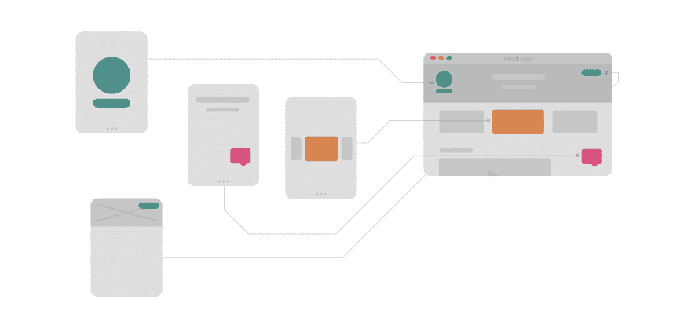
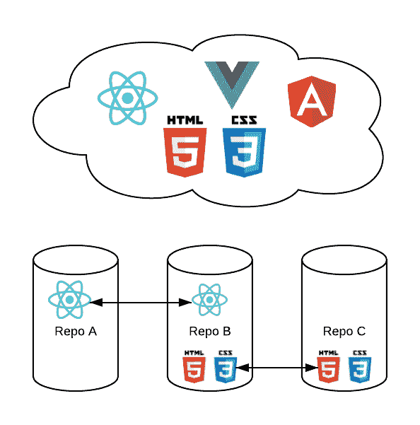

# 重用 React UI 组件

> 原文：<https://dev.to/giteden/reusing-react-ui-components-4f77>

## 如何利用 [Bit](https://bit.dev) + [NPM](https://www.npmjs.com/) 简化 React 和其他 UI 组件的共享、重用和协作。

当使用 [UI](https://hackernoon.com/tagged/ui) 组件时，跨项目和团队的可重用性通常是更快开发、 [UI 一致性](https://blog.bitsrc.io/building-a-consistent-ui-design-system-4481fb37470f)和更简单维护的关键。

如今，组件被设计成可重用的，带有 T2 反应、Vue 和其他优秀框架，重用它们的能力变得至关重要。当不同的开发人员在不同的地方重写相同的组件时，时间被浪费了，维护很快成为一场噩梦。

## 组件重用可能有些棘手

重用组件的最大问题是开销。

首先，要使一个可重用组件成为可重用的，你必须把它变成一个包。这意味着**拆分 repo** ， **boiler-plating a package** 包括 package.json，build 和 test 配置等，然后发布到 NPM。

您还必须记录组件，创建一个 wiki，并以某种方式组织所有这些组件，使它们对团队来说是可发现的。

使用这段代码的开发人员将使用包管理器来安装它，这意味着如果没有大量的开销，他们就不能在需要时对组件进行更改。随着时间的推移，这使得维护变得更加困难。

许多团队都会遇到这些问题，这可能会导致不希望的强制架构或代码重复。但是，使用位+ NPM，您可以在没有这种开销的情况下扩展组件重用。以下是方法。

## Bit + NPM:缩放组件复用

通过一个**位+NPM 工作流**组件可以在项目间共享、开发和同步，而没有上述开销。下面是它如何在 3 个简单的步骤中工作，从发布到在团队之间同步变更。

## 1。零发布开销

** *示例:* *这里有一个[示例 app](https://github.com/teambit/movie-app) 和从中发布的 [React 组件](https://bitsrc.io/bit/movie-app)。*

Bit 让您无缝地**隔离任何现有项目中的** **组件**，而不是强迫您重构代码或拆分存储库来发布包。

这是通过使用 bit add 命令将 bit 指向要重用的文件集来完成的。当 Bit 识别组件时，它会自动检测它们的依赖关系，这样您就不必进行任何配置。

然后，您可以添加预制的构建+测试环境(或者创建您自己的环境),并使用位标签锁定组件的版本。剩下的就是使用 bit export 发布组件，就这样。

项目中的所有组件现在都可以重用并与 NPM 一起安装，或者通过 bit import 从任何项目中开发它们。

这意味着 **0 重构**， **0 代码或文件变更**， **0 配置* *和* *无手工依赖定义**。在消除发布组件的开销的同时，您可以扩展组件重用。

## 2。发现和团队合作

](https://res.cloudinary.com/practicaldev/image/fetch/s--dkspD9np--/c_limit%2Cf_auto%2Cfl_progressive%2Cq_auto%2Cw_880/https://cdn-images-1.medium.com/max/2000/1%2A2AHGKRexNK_GP-QnjKhymA.png)

一旦导出，所有组件都被组织在云中，比单独使用 NPM 更容易被发现。

以下是一些有助于大规模查找和导航组件的关键功能:

*   集合(Collections):组件可以按照主题、团队、项目或者你喜欢的任何东西组织成集合。

*   **可视化** : UI 组件(现在 React)可以渲染，这样你就可以玩组件，用自己的眼睛去选择。

*   **Test + Build results** : Bit 构建并运行项目之外的组件测试，以确保它们准备就绪。结果是作为一个有用的指示，表明它的工作和在什么情况下。

*   **自动解析的文档** : Bit 将自动解析并显示来自代码本身的文档和示例。md 文件和 jsdocs。

因此，结合 Bit 的团队管理功能，您可以更轻松地找到和管理您共享的组件及其质量等。

## 3。协作工作流:双向开发

Bit 的另一个有用的特性是，除了用 NPM/Yarn 安装组件之外，您还可以使用 bit import 在任何使用它们的项目中获得组件。).

这意味着，当一个组件需要轻微的改进或修改时，您可以简单地将它导入到消费项目中，进行更改，并将新版本共享回您团队的集合中。

然后，如果您选择这样做并且有适当的权限，您可以更新它所在的任何项目中的组件，包括共享它的原始存储库。

使用 Bit 对 Git 的合并实用程序的扩展，可以在项目之间合并更改，这意味着跨项目的同步过程是平滑流畅的。

当一个团队或几个团队一起工作时，这种**分布式工作流**使得开发和维护随着时间的推移变得更快。到目前为止，自 2018 年 1 月以来，数千名使用 Bit 的开发人员中约有 75%更喜欢导入组件，而不是将它们作为软件包安装。