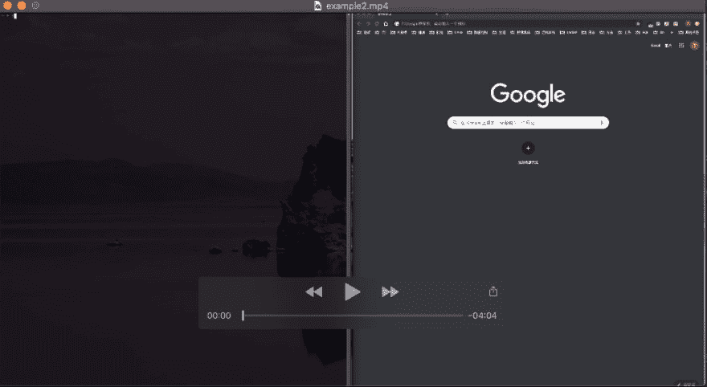
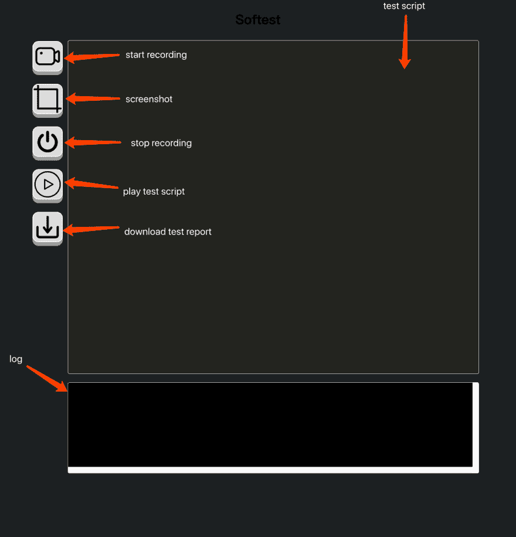

# 记录浏览器交互并生成测试脚本

> 原文：<https://dev.to/prprprus/recording-browser-interactions-and-generating-test-scripts-1loa>

# 最柔软

最软的是记录浏览器交互和生成测试脚本的测试工具，简单实用。它允许你不用写代码就能得到测试脚本。

[](https://vimeo.com/354273223)

github:[https://github.com/prprprus/softest](https://github.com/prprprus/softest)

您的帮助和贡献是非常宝贵的，请明星⭐，叉，提交问题或公关，谢谢！😁😘🎁🎉

## 为什么

当我需要一个可以记录浏览器交互并生成相应脚本的工具时，我找到了[木偶师-记录者](https://github.com/checkly/puppeteer-recorder)和[硒 IDE](https://www.seleniumhq.org/selenium-ide/) ，当然它们都是优秀的项目。但是我发现他们不能支持多标签录音，截图等。，而 Selenium IDE 在播放脚本的时候总会报错，所以我做了这个轮子。

## 特性

*   单标签记录
*   多标签记录
*   屏幕上显示程序运行的图片
*   生成测试脚本
*   播放剧本
*   下载测试报告(包含截图和测试脚本)

## 安装

```
$ npm i -g softest 
```

## 用法

添加环境变量以方便运行命令:

```
$ export PATH=$PATH:$HOME/.npm-global/bin 
```

要运行`softest`命令，需要指定 Chromium 所在的目录和测试报告保存的目录:

```
$ soft -c PATH_CHROMIUM -r PATH_REPORT 
```

> 如果不知道 Chromium 在哪里，可以启动 Chromium，在地址栏输入`chrome://version/`找到其可执行文件的位置。

如果您看到类似下面的输出，那么恭喜您🎉🎉🎉👏

```
 _______  _______  _______  _______  _______  _______  _______
|       ||       ||       ||       ||       ||       ||       |     status: running
|  _____||   _   ||    ___||_     _||    ___||  _____||_     _|     host: 127.0.0.1
| |_____ |  | |  ||   |___   |   |  |   |___ | |_____   |   |       port: 2333
|_____  ||  |_|  ||    ___|  |   |  |    ___||_____  |  |   |
 _____| ||       ||   |      |   |  |   |___  _____| |  |   |
|_______||_______||___|      |___|  |_______||_______|  |___|

🎉 Running WebSocket server successfully

🎉 Running HTTP server successfully 
```

打开浏览器，输入`host`和`port`，你会看到如下网页界面:

[](https://res.cloudinary.com/practicaldev/image/fetch/s--PUaMik4V--/c_limit%2Cf_auto%2Cfl_progressive%2Cq_auto%2Cw_880/https://raw.githubusercontent.com/prprprus/picture/master/softest1.png)