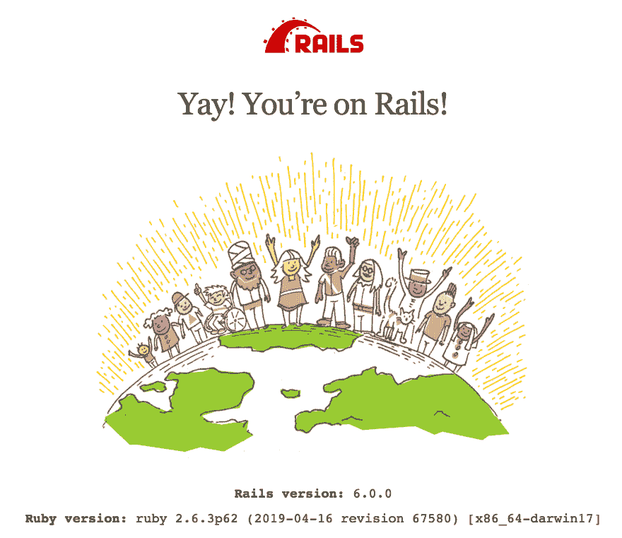
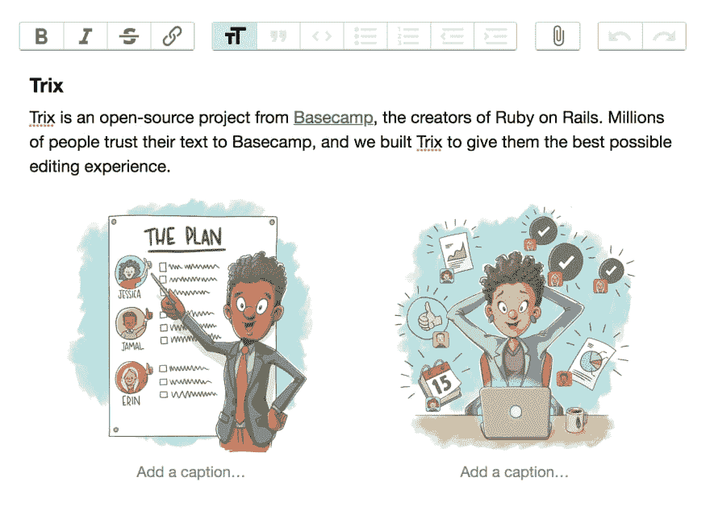

# Rails 6 发布了——这对你意味着什么？

> 原文：<https://dev.to/chrisachard/rails-6-released-what-does-that-mean-for-you-3591>

*本文最初发布于:[chrisachard.com](https://chrisachard.com/rails-6-released)T3】*

Rails 6 于 2019 年 8 月 15 日发布，DHH 发表了一篇[博文](https://weblog.rubyonrails.org/2019/8/15/Rails-6-0-final-release/)

那么——有什么新的东西，旧的 Rails 版本呢？

# 铁轨 4 & 5

## 对 Rails 4 的支持正在迅速消失

[官方 Rails 维护政策](https://guides.rubyonrails.org/maintenance_policy.html)仍然将 Rails `4.2.Z`列为接收*严重安全问题*补丁——但它已经从常规安全问题补丁列表中移除。

所以如果你还在使用 Rails 4 - *的话，现在是时候开始升级了*。

## Rails 5 还是刚刚好

Rails `5.0.Z`仍在*严重*补丁列表中，Rails `5.2.Z`仍在定期接收安全更新；所以你在 Rails 5 上还是可以的(尤其是`5.2`或更高版本)

## 时刻关注安全问题

如果你想了解 Rails 最新的安全问题，可以查看一下 [Rails 安全策略](https://rubyonrails.org/security/)或者订阅 [Rails 安全邮件列表](https://groups.google.com/forum/#!forum/rubyonrails-security)

# 如何获得新版本

根据您当前的状态，按照以下步骤获得 Rails 6:

## 确保你有 Ruby 2.5.0 或更高版本

检查您的 ruby 版本:

```
$ ruby -v
ruby 2.3.3p222 (2016-11-21 revision 56859) [x86_64-darwin16]
# Need to update! 
```

如果小于`2.5.0`，那你就要先升级。我建议使用 [RVM](https://rvm.io/) 来安装，你可以安装 RVM *和*最新的轨道，所有这些都只需要一个命令:

```
$ \curl -sSL https://get.rvm.io | bash -s stable --rails 
```

如果你已经安装了 RVM，那么你可以用:
升级到最新的 ruby

```
$ rvm install 2.6.3 
$ rvm use 2.6.3 --default 
```

然后根据需要更新你的 gem 版本:

```
$ gem update --system 
Latest version already installed. Done. 
```

## 安装最新的 Rails 版本

用 Ruby >= `2.5`，可以获得最新的 Rails:

```
$ gem install rails -v '6.0.0'
Fetching concurrent-ruby-1.1.5.gem
# ...
Building native extensions. This could take a while...
# ...
40 gems installed 
```

现在，检查您的 rails 版本！

```
$ rails -v
Rails 6.0.0 
```

## 制作一个新的 rails 项目

安装了 Rails 6 之后，您可以使用:
创建一个新项目

```
$ rails new MyAwesomeProject
# ...
$ cd MyAwesomeProject
# ...
$ rails start 
```

**注**

如果您遇到以下任何 webpacker 错误:

`Webpacker configuration file not found`

运筹学

`Please run rails webpacker:install Error: No such file or directory @ rb_sysopen .../config/webpacker.yml`

运筹学

`RAILS_ENV=development environment is not defined in config/webpacker.yml, falling back to production environment`

然后你可能需要**更新你的`yarn`版本**。使用[纱文件](https://yarnpkg.com/lang/en/docs/install/#mac-stable)升级，然后运行:

```
$ rails webpacker:install 
```

或者删除该项目并用`rails new MyAwesomeProject`创建一个新项目

一旦一切正常——在浏览器中进入`localhost:3000`，你就可以使用新版的 Rails 了！

[](https://res.cloudinary.com/practicaldev/image/fetch/s--0RyHT0m2--/c_limit%2Cf_auto%2Cfl_progressive%2Cq_auto%2Cw_880/https://thepracticaldev.s3.amazonaws.com/i/4tdrv2qldk50wx3blwaj.png)

## 升级现有项目

如果您在`5.2`上有一个 Rails 项目，那么您可以使用`rails app:update`命令:
进行更新

```
$ rails app:update 
```

或者对于 Rails `4.2`或更低版本，可以使用相同任务的`rake`版本:

```
$ rake rails:update 
```

关于升级时的更多技术细节，请查看官方的 Rails 升级文档。

# 有什么新鲜刺激的

好——你现在有 Rails 6 了...有什么新鲜有趣的！？

## Webpacker 默认

我喜欢将 React 混合到 Rails 项目中，webpacker 通常是将 npm 依赖项添加到 Rails 项目中的最佳选择。

现在您不必担心设置这一切的最佳方式——因为 webpacker 是内置的！

## 内置富文本编辑器

Trix 编辑器是 Basecamp 制作的富文本编辑器。在 Rails 6 中，它被自动包含为[动作文本](https://github.com/rails/rails/tree/6-0-stable/actiontext)。

要让它工作，请查看[动作文本概述](https://guides.rubyonrails.org/action_text_overview.html)，或[DHH](https://www.youtube.com/watch?v=HJZ9TnKrt7Q)的这段视频，它会带你完成设置。

[](https://res.cloudinary.com/practicaldev/image/fetch/s---ijkjBhq--/c_limit%2Cf_auto%2Cfl_progressive%2Cq_auto%2Cw_880/https://thepracticaldev.s3.amazonaws.com/i/1b1sp90lpjwz5v4ekfct.png)

## 并行运行测试

WooHoo!

如果您以前从事过任何大型 Rails 项目，那么您应该知道运行一些测试套件需要多长时间。

现在——终于有了一种内置的方法来[并行化您的测试](https://guides.rubyonrails.org/testing.html#parallel-testing)。

## 大量的其他小改进

要获得所有变更的完整列表，您可以查看 Rails 每个单独部分的变更日志:

[动作索](https://github.com/rails/rails/blob/v6.0.0/actioncable/CHANGELOG.md)、
、[动作邮件器](https://github.com/rails/rails/blob/v6.0.0/actionmailer/CHANGELOG.md)、
、[动作包](https://github.com/rails/rails/blob/v6.0.0/actionpack/CHANGELOG.md)、
、[动作视图](https://github.com/rails/rails/blob/v6.0.0/actionview/CHANGELOG.md)、
、[活动作业](https://github.com/rails/rails/blob/v6.0.0/activejob/CHANGELOG.md)、
、[活动模型](https://github.com/rails/rails/blob/v6.0.0/activemodel/CHANGELOG.md)、
、[活动记录](https://github.com/rails/rails/blob/v6.0.0/activerecord/CHANGELOG.md)、
、[活动存储](https://github.com/rails/rails/blob/v6.0.0/activestorage/CHANGELOG.md)、
、[活动支持](https://github.com/rails/rails/blob/v6.0.0/activesupport/CHANGELOG.md)、
、[铁轨](https://github.com/rails/rails/blob/v6.0.0/railties/CHANGELOG.md)

# 该不该用 Rails 6？

如果你今天开始一个新的 Rails 项目，我肯定会*从 Rails 6 开始。它现在得到了官方支持——如果你看看上面的一些变更日志，你会发现许多子系统已经稳定了好几个月。*

如果你有一个基于 **Rails 5.2 或更高版本**的项目——那么在你必须做任何事情之前，你还有一些时间。如果你对任何[宣布的重大更新](https://weblog.rubyonrails.org/2019/8/15/Rails-6-0-final-release/)不感兴趣，那么你仍然会在一段时间内获得安全更新。

不过你仍然可以试着运行`rails app:update`,看看你的特定应用程序发生了多少变化——这将让你知道当你决定升级时会有多少工作量。

如果你有一个关于 **Rails 5.0 或更低版本**的项目，那么我肯定会考虑尽早升级。升级这些旧项目(尤其是 Rails 4 和更低版本)将需要更多的工作——但 Rails < 4.2 的安全更新已经停止——所以现在(在一个主要版本发布后)是更新的好时机(这样你就不用再做一段时间)。

# 那么我要先试什么呢？

我在上面展示了如何制作`MyAwesomeProject`，所以我打算借此机会尝试一下[动作文本](https://github.com/rails/rails/tree/6-0-stable/actiontext)——内置的富文本编辑器看起来很棒，也很容易使用。

一旦我成功了，我会发布一篇关于它的文章——所以[加入我的时事通讯](https://chrisachard.com)在未来听到它！