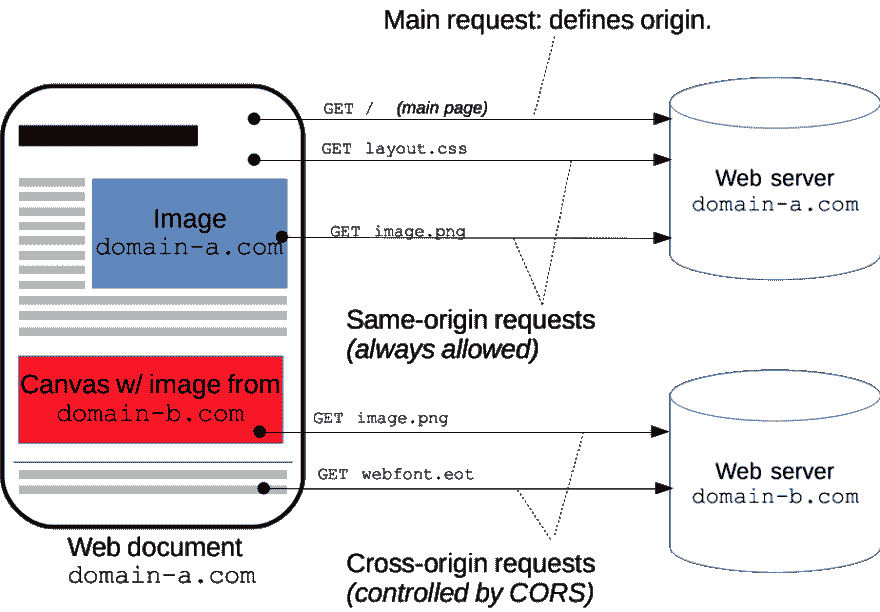

# 同源政策& CORS

> 原文：<https://dev.to/geoffreyianward/same-origin-policy-cors-17nm>

### 介绍

那么，当你听到“*同源政策*”这个短语时，我们在谈论什么呢？简而言之，*同源策略*是一个概念，在这个概念中，网络浏览器允许网页之间共享内容，但前提是这些网页符合来自同一来源的标准。这是大多数 web 浏览器的内置功能，旨在作为一种安全功能，阻止不良行为者试图使用恶意代码操纵网页。

这种策略虽然在安全性方面很好，但会限制已验证网站之间共享数据的能力。这抑制了许多脚本和 API 的功能。为了绕过同源政策，网络浏览器已经同意了一个名为 **CORS** 的系统，该系统允许经过认证的网页相互共享，不管它们来自何方。

### 同源策略

*   **协议**:这些选项包括 *http* 、 *https* 或 *ftp* ，通常在 URI 电话的其余部分之前。
*   **端口**:通信端点。这里有很多(80 是最常见的，代表 *http* 调用)，它们代表我们试图从哪个入口点访问一个 URL。把一个网站想象成一座建筑，端口是这座建筑的不同入口。
*   **主机**:URL 的肉。这是我们试图访问的地址。

* * *

这里有一些例子来说明什么构成和不构成“相同”起源。我们将把这些与我们的基本示例进行比较:**http://www.example.com/dir/page.html**

*   http://www.example.com:**81**/dir/other.html

    在这种情况下，协议和主机匹配，但端口不匹配。这将是一个失败

*   **https**://www.example.com/dir/other.html

    在这种情况下，协议不匹配。这将是一个失败

*   http://**en.example.com**/dir/other.html

    这种情况下，主机不匹配。这将是一个失败

*   http://**example.com**/dir/other.html

    这看起来可能匹配，但实际上不匹配。同源策略将寻找*精确的*匹配，而这个地址不符合要求。失败。

*   http://**example.com**/dir/other.html

    这看起来可能匹配，但实际上不匹配。同源策略将寻找*精确的*匹配，而这个地址不符合要求。失败。

*   http://www.example.com/dir/page2.html

    这是一个具有相同协议、主机和端口的地址示例。巨大的成功！

* * *

### 克-奥二氏分级量表

所以，同源政策有一些固有的问题。最值得注意的是，在网站之间共享数据是 rad！允许脚本在站点之间运行，可以让我们拥有各种很酷的功能。那么我们如何绕过同源政策呢？这就是 CORS 的用武之地。

**代表*跨产地资源共享*，这正是它允许我们做的。CORS 利用 http 头来认证站点之间的安全连接。想象一次班级实地考察。要上车去博物馆，你需要一张签名的许可单。你的老师很聪明，不会让伪造的签名通过她的检查。去实地考察的唯一方法是有一个经过认证的签名许可单。CORS 是非常重要的父母签名。**

 **同源策略是一个很好的安全工具，有助于防止恶意脚本在您的浏览器中肆虐。然而，有时我们*希望*脚本在我们的浏览器中运行！为了做到这一点，我们可以利用 CORS 发送认证请求到另一个网站的数据。**