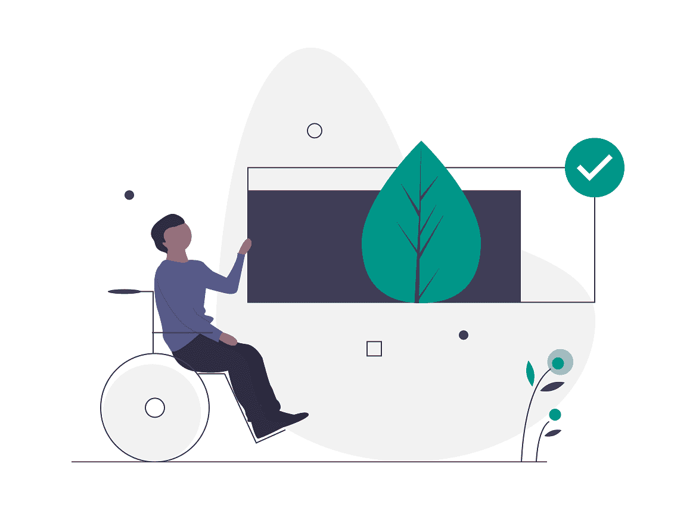

# Django 的 9 大概念-第 2 部分

> 原文：<https://dev.to/steelwolf180/top-9-django-concepts-part-2-47an>

[](https://res.cloudinary.com/practicaldev/image/fetch/s--hndv4NuB--/c_limit%2Cf_auto%2Cfl_progressive%2Cq_auto%2Cw_880/https://thepracticaldev.s3.amazonaws.com/i/ekqhqji80mi4bkllv363.jpg)

# 简介

[](//images.ctfassets.net/ly2f59p4unnn/3YD8xVEIN3uNvKhkqVg1gk/83e1299dbb3280e7e2bc2a10db6b14d8/undraw_ideas_s70l.png)

欢迎来到 3 部分系列的第 2 部分，了解**Django 的 9 大概念**。

我将讲述 3 个 Django 概念，对于那些错过了 3 部分系列的第一部分的人，你可以往下看[9 大 Django 概念-第 1 部分](https://www.maxongzb.com/top-9-django-concepts-part-1-4-mins/)

第一个概念是**基本的** Django 命令，您将在 Django 中开发时使用这些命令。

第二个概念是使用 Vue、React 或 Angular web 框架这样的前端或使用 Django 现有的模板系统来构建 UI。

最后，要么使用[基于类的视图](https://simpleisbetterthancomplex.com/series/2017/10/09/a-complete-beginners-guide-to-django-part-6.html#class-based-view)要么使用[基于函数的视图](https://simpleisbetterthancomplex.com/series/2017/10/09/a-complete-beginners-guide-to-django-part-6.html#function-based-view)。

# Django 的基本命令

[](//images.ctfassets.net/ly2f59p4unnn/82sBpZHBRS9hWPLh3ZCld/84bc08e5efe27b65e07811b85e20e06f/undraw_progress_tracking_7hvk.png)

所以这里有一些你在 Django 中开发时会用到的基本命令。

## 创建新的 Django 项目

[](//images.ctfassets.net/ly2f59p4unnn/71PZmGgxGxu9Q7mbOGjLcb/e405531e70f4513e2bf088e9e96d34f1/undraw_all_the_data_h4ki.png)

这是您第一次创建 Django 项目时遇到的第一个命令。

```
django-admin startproject project-name 
```

Enter fullscreen mode Exit fullscreen mode

这个命令帮助创建一个**模板**项目文件夹，其中包含 Django 运行所需的所有标准文件或文件夹列表。

与项目同名的文件夹，包含配置设置、url 路由和服务配置。

以进一步了解模板项目的默认项目结构。

请前往 Django 文档中的[创建一个新项目](https://docs.djangoproject.com/en/2.2/intro/tutorial01/#creating-a-project)。

## 启动 Django Web 服务器

[](//images.ctfassets.net/ly2f59p4unnn/XprFWpUNP0sM3MX3VOT5J/2afeab748d8970005df1d931a7bdb75b/undraw_start_building_vqhd.png)

默认情况下，所有 Django 项目都附带了一个开发 web 服务器。

这是用来测试你的网站，然后在生产环境中部署，使用生产级的网络服务器，如 [Gunicorn](https://gunicorn.org/) 或 [uWISGI](https://uwsgi-docs.readthedocs.io/en/latest/) 或 [Mod WISGI](https://docs.djangoproject.com/en/2.2/howto/deployment/wsgi/modwsgi/) 。

要启动 Django web 开发服务器，您必须输入以下命令:

```
python manage.py runserver 
```

Enter fullscreen mode Exit fullscreen mode

默认情况下，Django 运行在 IP 地址为`127.0.0.1`和端口号为`8000`的服务器上。

您可以通过输入以下命令来更改 IP 地址和端口号，以便在不同的 IP 地址或端口号中为其提供服务:

```
python manage.py runserver  ip_address:port 
```

Enter fullscreen mode Exit fullscreen mode

一旦开发服务器启动并运行，您就可以不干涉它。

开发服务器有一个内置功能，每当添加新代码时，**重新加载**服务器。

## 创建 Django 应用程序

[](//images.ctfassets.net/ly2f59p4unnn/2Mbjd3q4lal1BBWD2PZ53o/18318fd51fb3dade014a04f16b2035fb/undraw_complete_design_ongo.png)

您可以将 Django 应用程序视为附加模块，为构成整个网站的项目执行单一任务。

现在，您通过输入以下命令创建一个新的应用程序:

```
python manage.py startapp appname 
```

Enter fullscreen mode Exit fullscreen mode

这个命令创建一个新的 Django 应用程序，其中包含各种文件和文件夹来执行这个应用程序。

总是建议将多个功能拆分成**个更小的应用**。

而不是有一个**单一的大应用**来做一切事情，以方便项目的维护和可读性。

## 创建&更新数据库表

[](//images.ctfassets.net/ly2f59p4unnn/2VnuJEklIPv7W0k4BuFrjw/d79c376eec559c24289a745ff878fcdf/undraw_personal_data_29co.png)

在 Django 中，数据库表被表示为一个**模型**。

这可以在每个 Django 应用程序的`models.py`文件中找到。

关于如何创建模型的详细信息可以在 Django 文档中的[创建模型](https://docs.djangoproject.com/en/2.2/intro/tutorial02/#creating-models)上找到。

一旦在`models.py`中创建了模型。

开发人员必须执行两个命令来更改数据库。

第一个命令称为`makemigration`，它准备对数据库进行的更改，作为**迁移**又名`version` :

```
python manage.py makemigrations 
```

Enter fullscreen mode Exit fullscreen mode

第二个命令叫做`migrate`。

它将所有迁移应用于数据库，以创建新表或更新现有表。

关于`migrate`或`makemigrations`命令的更多细节，你可以去 Django 文档中的[创建模型](https://docs.djangoproject.com/en/2.2/intro/tutorial02/#creating-models)

## 访问 Django Shell

[](//images.ctfassets.net/ly2f59p4unnn/5W6Pxp9TksL8lvUaOjaGXB/d26e77abc02d435a1f1acde743dc7bcb/undraw_hacker_mind_6y85.png)

通过输入以下命令，它将打开一个交互式 python shell，其中加载了所有 Django 模块。

```
python manage.py shell 
```

Enter fullscreen mode Exit fullscreen mode

当您计划在将 Django 的 ORM 查询添加到您的 Django 应用程序之前测试各种查询时，这个命令非常有用。

关于如何执行各种 orm 查询的细节可以在 DjangoGirls 的 Django ORM query sets 中找到。

# 使用前端框架 vs Django 的模板？

[](//images.ctfassets.net/ly2f59p4unnn/1GsYiymeguLwrbkJq8RaWu/189bcd4d09492e0af5372ad490550d60/undraw_design_sprint_x3eb.png)

因为用于前端开发的 Javascript web 框架越来越流行。

在与客户打交道或工作中，你可能会遇到这种困境。

最终，我会问自己以下问题:

*   项目需求是什么？
*   项目中有谁？是自己还是包括一个前端开发者的开发团队？
*   你使用 Vue、React 或 Angular 的经验是什么？

如果项目不要求你使用前端 web 框架，比如 Vue、React 或 Angular。

我建议你坚持使用 Django 的默认模板系统，并将其与预先构建的[引导主题](https://themes.getbootstrap.com/)或[引导示例](https://getbootstrap.com/docs/4.3/examples/)集成，以加快开发过程。

如果你的工作需要 Django 做一个**后端系统**。

您应该开始考虑使用 [Django REST Framework](https://www.django-rest-framework.org/) 构建 RESTful APIs，用您的 API 支持前端开发人员。

# 基于类的视图与基于函数的视图

[](//images.ctfassets.net/ly2f59p4unnn/3JDTj79FN1z1fghHHR0RmH/629ce64a8491ad56dfad5fe57ebf65b3/undraw_share_opinion_jpw0.png)

在使用[基于类的视图(CBV)](https://simpleisbetterthancomplex.com/series/2017/10/09/a-complete-beginners-guide-to-django-part-6.html#class-based-view) 还是[基于功能的视图(FBV)](https://simpleisbetterthancomplex.com/series/2017/10/09/a-complete-beginners-guide-to-django-part-6.html#function-based-view) 之间有一场[辩论](https://simpleisbetterthancomplex.com/article/2017/03/21/class-based-views-vs-function-based-views.html)。

原因是两者各有利弊。

我建议你只有在理解了基于类的视图并找到了在项目中使用它的用例时，才使用它。

也就是需要在你的项目中重用和定制，或者使用基于功能的视图。

如果你是 Django 的初学者，因为它用简单、直接的方式在你的代码中呈现逻辑。

# 结论

[](//images.ctfassets.net/ly2f59p4unnn/6cor0id0xLim3nnJ6NnTaD/d1963a0c53c2119532c2c34805547878/undraw_review_fkgn.png)

我希望您能够更好地理解作为 Django 开发人员可能会遇到的各种概念。

这些概念是设计或开发决策。

由于所需知识的深度和 Django 的角色越来越多地被用作后端系统，你可能需要这样做。

如果你喜欢我的文章，请**注册**Max[冒险家简讯](http://eepurl.com/dOUoUb)获取我每周在 **Python** 、**创业**和 **Web 开发**偶然发现的牛逼内容。

你也可以**关注**我来获取我在 **Dev** 上的文章的**最新**更新

除此之外，我希望能帮助任何有兴趣创业的人。

我的空闲时间是从晚上 9 点到 GMT+8 点的凌晨 2 点，再见！！！。

这篇文章最初发表在 Max 的博客上，标题为[django 的 9 大概念-第二部分:5 分钟](https://www.maxongzb.com/top-9-django-concepts-part-2-5-mins/)和[照片由🇸🇮·扬科·费里奇- @specialdaddy 在 Unsplash 上拍摄](https://unsplash.com/photos/sfL_QOnmy00)

# 参考文献

*   [基于类的视图](https://simpleisbetterthancomplex.com/series/2017/10/09/a-complete-beginners-guide-to-django-part-6.html#class-based-view)
*   [基于功能的视图](https://simpleisbetterthancomplex.com/series/2017/10/09/a-complete-beginners-guide-to-django-part-6.html#function-based-view)
*   [创建新项目](https://docs.djangoproject.com/en/2.2/intro/tutorial01/#creating-a-project)
*   Gunicorn
*   [uWISGI](https://uwsgi-docs.readthedocs.io/en/latest/)
*   [Mod WISGI](https://docs.djangoproject.com/en/2.2/howto/deployment/wsgi/modwsgi/)
*   [创建模型](https://docs.djangoproject.com/en/2.2/intro/tutorial02/#creating-models)
*   [Django ORM Django girls 的查询集](https://tutorial.djangogirls.org/en/django_orm/)
*   [引导主题](https://themes.getbootstrap.com/)
*   [引导示例](https://getbootstrap.com/docs/4.3/examples/)
*   [Django REST 框架](https://www.django-rest-framework.org/)
*   [辩论](https://simpleisbetterthancomplex.com/article/2017/03/21/class-based-views-vs-function-based-views.html)
*   [基于类别的视图(CBV)](https://simpleisbetterthancomplex.com/series/2017/10/09/a-complete-beginners-guide-to-django-part-6.html#class-based-view)
*   [基于功能的视图(FBV)](https://simpleisbetterthancomplex.com/series/2017/10/09/a-complete-beginners-guide-to-django-part-6.html#function-based-view)
*   [最常用的 5 个 Django 命令](https://www.codingforentrepreneurs.com/blog/the-top-5-most-used-django-commands)
*   [un draw 的插图](https://undraw.co/illustrations)