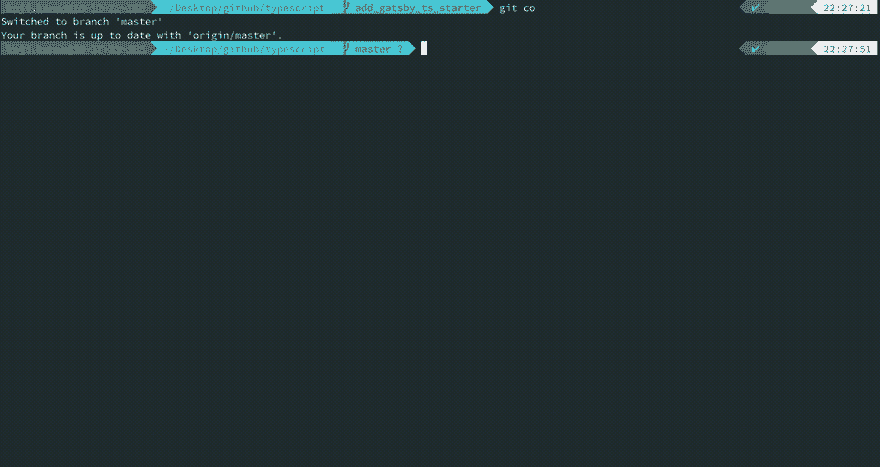
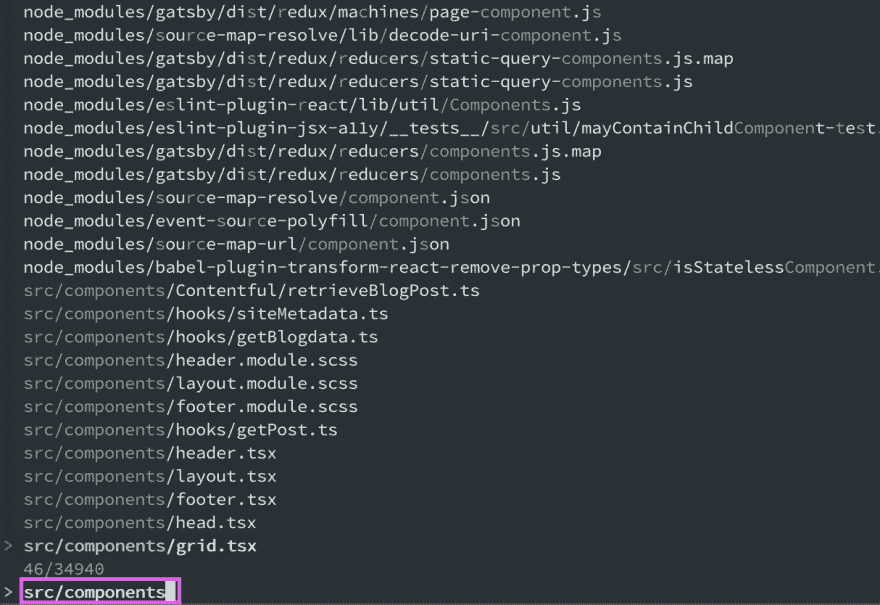
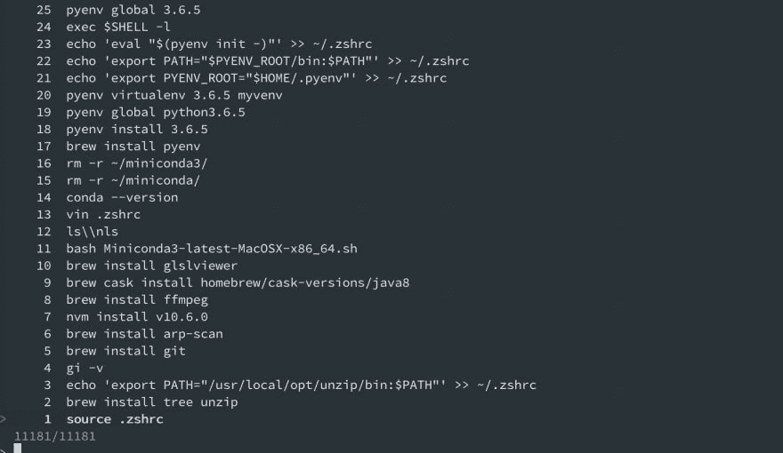
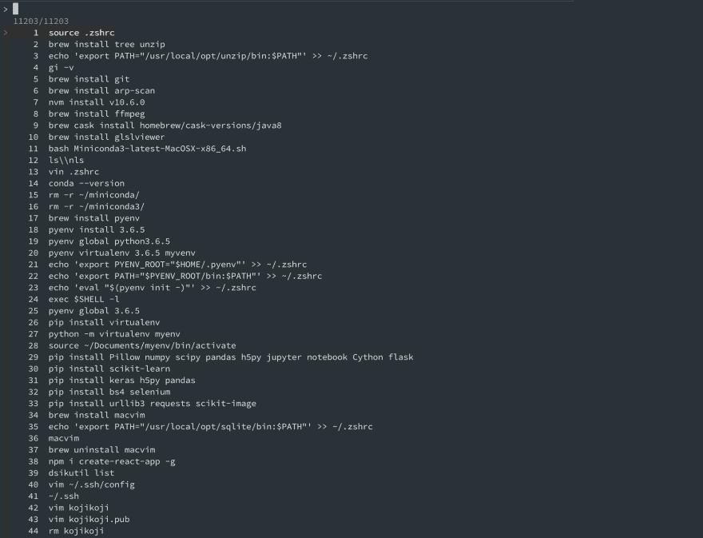
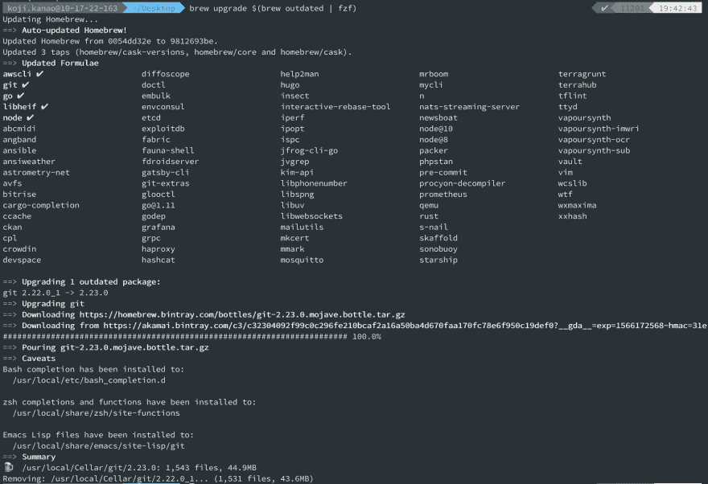
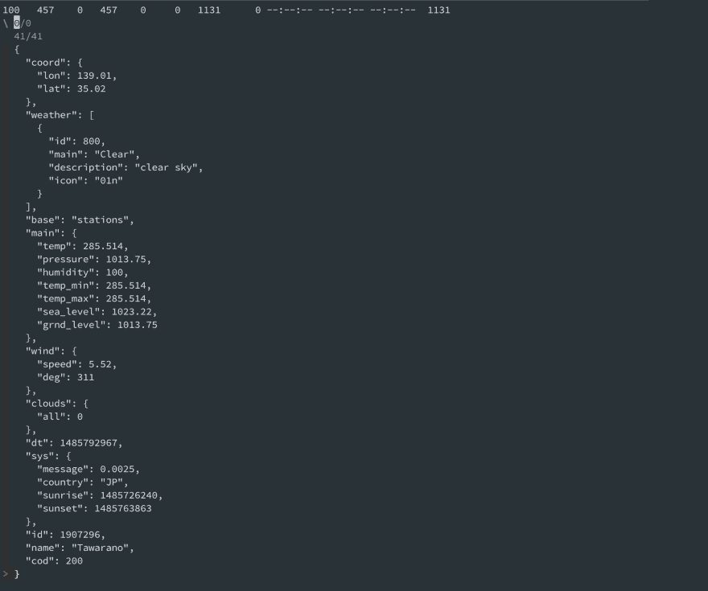

# 与终端的 fzf 相处

> 原文：<https://dev.to/0xkoji/get-along-with-terminal-3jd9>

这是我的下一个 Git 帖子。
我开始玩`.gitconfig`并认识了一个伟大的工具，fzf。
`fzf`可以让事情变得简单！！！

> fzf 是一个通用的命令行模糊查找器。https://github.com/junegunn/fzf
> T2

在这篇文章中，我将展示我们能做什么，如何安装和一些用法。

## 我们能用 fzf 做什么

在下面的 gif 中，我先试了一下`history`，然后用了`h | fzf` ( `h`是`history`的别名)。可以看到，用 fzf 可以很容易的找到想要看到的命令。fzf 允许我们像下面这样交互地使用`git checkout`。
另外可以用 fzf 自定义命令，很多人写脚本。在这个帖子的底部，我放了一个对想尝试`fzf`的人非常有用的链接。也可以设置快捷键。

[T2](https://res.cloudinary.com/practicaldev/image/fetch/s--hUKoDhfy--/c_limit%2Cf_auto%2Cfl_progressive%2Cq_66%2Cw_880/https://thepracticaldev.s3.amazonaws.com/i/cz7ei3oi68gisszlcdbk.gif)

[](https://res.cloudinary.com/practicaldev/image/fetch/s--w8qAG4rK--/c_limit%2Cf_auto%2Cfl_progressive%2Cq_66%2Cw_880/https://thepracticaldev.s3.amazonaws.com/i/03ha9cqhizgr7wdrx5x0.gif)

## 安装

这篇文章支持 MacOS 和 Ubuntu，因为我都用过。

```
# MacOS
$ brew install fzf

# Ubuntu
$ sudo apt-get install fzf 
```

<svg width="20px" height="20px" viewBox="0 0 24 24" class="highlight-action crayons-icon highlight-action--fullscreen-on"><title>Enter fullscreen mode</title></svg> <svg width="20px" height="20px" viewBox="0 0 24 24" class="highlight-action crayons-icon highlight-action--fullscreen-off"><title>Exit fullscreen mode</title></svg>

如果你使用的是 Windows，我强烈推荐你开始使用 chocolatey([https://chocolatey.org/](https://chocolatey.org/))这是一个软件包管理器软件。

## 简单用法

#### 文件搜索

我在我的 Gatsby 站点文件夹中执行了这个命令，并搜索了我的组件。

```
$ fzf
$ fzf --reverse 
```

<svg width="20px" height="20px" viewBox="0 0 24 24" class="highlight-action crayons-icon highlight-action--fullscreen-on"><title>Enter fullscreen mode</title></svg> <svg width="20px" height="20px" viewBox="0 0 24 24" class="highlight-action crayons-icon highlight-action--fullscreen-off"><title>Exit fullscreen mode</title></svg>

[](https://res.cloudinary.com/practicaldev/image/fetch/s--1gbQMrVq--/c_limit%2Cf_auto%2Cfl_progressive%2Cq_auto%2Cw_880/https://thepracticaldev.s3.amazonaws.com/i/7nsi2kb26hdyu46n1qic.png)

#### 历史搜索

这对我很有用，因为我通常会做`h | grep 'something'`来检查我之前输入的命令。

```
$ history | fzf
$ history | fzf --reverse 
```

<svg width="20px" height="20px" viewBox="0 0 24 24" class="highlight-action crayons-icon highlight-action--fullscreen-on"><title>Enter fullscreen mode</title></svg> <svg width="20px" height="20px" viewBox="0 0 24 24" class="highlight-action crayons-icon highlight-action--fullscreen-off"><title>Exit fullscreen mode</title></svg>

[](https://res.cloudinary.com/practicaldev/image/fetch/s--287Tg_sQ--/c_limit%2Cf_auto%2Cfl_progressive%2Cq_auto%2Cw_880/https://thepracticaldev.s3.amazonaws.com/i/no9tmv6dyevociljunlw.png)

如果加上`--reverse`你可以这样改变布局(也许更好)
[](https://res.cloudinary.com/practicaldev/image/fetch/s--V-o-yHUn--/c_limit%2Cf_auto%2Cfl_progressive%2Cq_auto%2Cw_880/https://thepracticaldev.s3.amazonaws.com/i/1pnu1wvagtxdcmuknp6x.png)

#### 用 fzf 打开文件

```
$ open $(fzf) 
```

<svg width="20px" height="20px" viewBox="0 0 24 24" class="highlight-action crayons-icon highlight-action--fullscreen-on"><title>Enter fullscreen mode</title></svg> <svg width="20px" height="20px" viewBox="0 0 24 24" class="highlight-action crayons-icon highlight-action--fullscreen-off"><title>Exit fullscreen mode</title></svg>

[](https://res.cloudinary.com/practicaldev/image/fetch/s--bzI9S_oV--/c_limit%2Cf_auto%2Cfl_progressive%2Cq_66%2Cw_880/https://thepracticaldev.s3.amazonaws.com/i/cv0oojr8xnlx1ikp0vpa.gif)

#### 用 fzf 更新包

有时我打错字，然后得到一个安装错误 lol

```
$ brew upgrade $(brew outdated | fzf)
# Then choose a package. Probably user --multi. 
```

<svg width="20px" height="20px" viewBox="0 0 24 24" class="highlight-action crayons-icon highlight-action--fullscreen-on"><title>Enter fullscreen mode</title></svg> <svg width="20px" height="20px" viewBox="0 0 24 24" class="highlight-action crayons-icon highlight-action--fullscreen-off"><title>Exit fullscreen mode</title></svg>

[](https://res.cloudinary.com/practicaldev/image/fetch/s--CsbP4jAQ--/c_limit%2Cf_auto%2Cfl_progressive%2Cq_auto%2Cw_880/https://thepracticaldev.s3.amazonaws.com/i/xfcpm92tsz7nlyb0j6dz.png)

#### jq 带 API

这没有帮助，但是如果我们需要用`curl`命令检查从 API 返回的一个大的 json，这可能是好的？？？
顺便说一下，对于`jq`你需要安装 jq。

```
$ curl https://samples.openweathermap.org/data/2.5/weather\?lat\=35\&lon\=139\&appid\=b6907d289e10d714a6e88b30761fae22 | jq | fzf --reverse 
```

<svg width="20px" height="20px" viewBox="0 0 24 24" class="highlight-action crayons-icon highlight-action--fullscreen-on"><title>Enter fullscreen mode</title></svg> <svg width="20px" height="20px" viewBox="0 0 24 24" class="highlight-action crayons-icon highlight-action--fullscreen-off"><title>Exit fullscreen mode</title></svg>

[](https://res.cloudinary.com/practicaldev/image/fetch/s--xjXaETRv--/c_limit%2Cf_auto%2Cfl_progressive%2Cq_auto%2Cw_880/https://thepracticaldev.s3.amazonaws.com/i/3e0nvv84o4447q7e3703.png)

## 更多信息

##### 例子

你可以在这里看到更多信息([https://github.com/junegunn/fzf/wiki/examples](https://github.com/junegunn/fzf/wiki/examples))。

##### 命令行的按键绑定

来自[@ vonheikemen](https://dev.to/vonheikemen)
T3】的建议 https://github . com/June Gunn/fzf # key-bindings-for-command-line