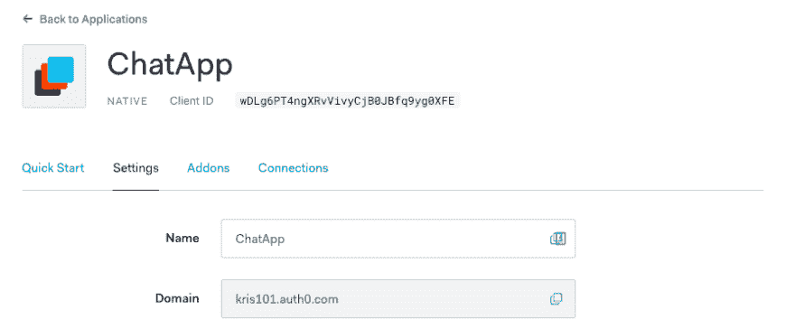
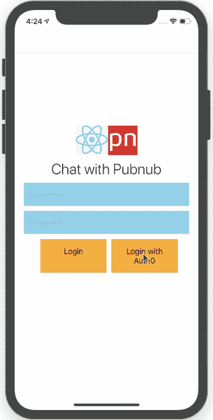

# 如何集成 Auth0 反应原生

> 原文：<https://dev.to/kris/how-to-integrate-auth0-to-react-native-pa1>

在本教程中，我们将学习如何实现 **Auth0** 到我们的 [React 本地聊天应用](https://instamobile.io/app-templates/react-native-chat-app-template/)。 [Auth0](https://auth0.com) 是一个安全平台，提供认证和授权服务。它为开发人员提供了一个选项，使他们的应用程序更加安全，而不必成为安全专家。因此，在本教程中，我们将把它纳入我们的 React 本机应用程序，使其更加安全。

在我们进入细节之前，让我总结一下这个过程，以获得整个教程的要点:

1.  我们将创建一个 Auth0 帐户和应用程序。
2.  我们将把 **Auth0 React 原生包(** react-native-auth)安装到[现有 app](https://github.com/krissnawat/pubnub-react-native-chat/tree/add_auth0) 中。
3.  我们将把 Auth0 添加到我们现有的应用程序中。

### 要求

这里有一个插件、包、平台和服务的完整列表，我们需要从本教程中获得一些东西:

*   与 npm/yarn 一起安装的 Node.js v8.x.x 或更高版本。
*   Android 或 iOS 模拟器或硬件设备。
*   [已经设置好 React 本地开发环境](https://developers.facebook.com/docs/react-native/getting-started)。
*   一个锅炉启动板项目可用[此处](https://github.com/krissnawat/pubnub-react-native-chat/)。

现在，让我们开始这个过程。

### 设置起始项目

在这一步，我们将使用这个 [GitHub repo](https://github.com/krissnawat/pubnub-react-native-chat/) 。我们需要通过下面的 git 命令将 [starter 样板文件](https://facebook.github.io/react-native/docs/getting-started.html#content)项目克隆到您的本地目录中:

首先，我们需要在 Git 控制台中使用以下命令克隆 GitHub repo:

```
git clone [https://github.com/krissnawat/pubnub-react-native-chat](https://github.com/krissnawat/pubnub-react-native-chat/) 
```

接下来，我们将通过运行以下命令导航到项目:

```
cd pubnub-react-native-chat 
```

然后，我们需要使用下面的命令检查到 *before_use_auth0* 分支:

```
git checkout before\_use\_auth0 
```

现在，我们有了 starter React 原生样板项目，如下面的 GitHub 克隆完成截图所示:

[](https://res.cloudinary.com/practicaldev/image/fetch/s--jKtGAzjD--/c_limit%2Cf_auto%2Cfl_progressive%2Cq_auto%2Cw_880/https://cdn-images-1.medium.com/max/681/1%2A5hlHzdEO2jknNYSe_mxZMw.png)

### 创建新的 Auth0 应用

在这一步中，我们将创建一个 Auth0 应用程序。我们需要导航到 [Auth0 仪表板](http://auth0.com)，然后创建一个 Auth0 帐户或登录到现有的 Auth0 帐户。然后，我们将遵循以下步骤:

[](https://res.cloudinary.com/practicaldev/image/fetch/s--WKe7m5Zi--/c_limit%2Cf_auto%2Cfl_progressive%2Cq_auto%2Cw_880/https://cdn-images-1.medium.com/max/959/1%2Ag9U32QleKeaDaWyhVcY4yw.png)

我们需要选择“本地”应用程序类型，因为我们的应用程序是基于移动设备的。我们需要给我们的 Auth0 应用命名，例如“ChatApp”最后，输入名称并选择应用程序的应用程序类型后，我们需要单击“创建”按钮，如下面的屏幕截图所示:

[](https://res.cloudinary.com/practicaldev/image/fetch/s--mNQagCmf--/c_limit%2Cf_auto%2Cfl_progressive%2Cq_auto%2Cw_880/https://cdn-images-1.medium.com/max/841/1%2AgZNPpd3vlQlxozTKvHronA.png)

因此，我们有了新的 Auth0 应用程序。点击“设置”选项卡后，我们现在可以看到应用程序的控制台:

[](https://res.cloudinary.com/practicaldev/image/fetch/s--8PyC1wJH--/c_limit%2Cf_auto%2Cfl_progressive%2Cq_auto%2Cw_880/https://cdn-images-1.medium.com/max/896/1%2A8WkIjdwawAfS-q7t0Pgg8Q.png)

### 配置

在这里，我们将为 Android 和 iOS 配置 Auth0 应用程序，以将其集成到我们的 React 原生应用程序中。

#### 用于安卓系统

在文件 Android/app/src/main/androidmanifest . XML 中，我们需要确保应用程序的 ***MainActivity*** 具有 singleTask 的 ***launchMode*** 值，并且具有如下代码片段所示的意图过滤器:

```
<intent-filter>
    <action android:name="android.intent.action.VIEW" />
    <category android:name="android.intent.category.DEFAULT" />
    <category android:name="android.intent.category.BROWSABLE" />
    <data
        android:host="YOUR\_AUTH0\_DOMAIN"
        android:pathPrefix="/android/${applicationId}/callback"
        android:scheme="${applicationId}" />
</intent-filter> 
```

因此，如果我们将 samples.auth0.com 作为我们的 Auth0 域，我们将有以下主活动配置:

```
<activity
   android:name=".MainActivity"
   android:label="@string/app\_name"
**android:launchMode="singleTask"** android:configChanges="keyboard|keyboardHidden|orientation|screenSiz e"
   android:windowSoftInputMode="adjustResize">
<intent-filter>
    <action android:name="android.intent.action.MAIN" />
    <category android:name="android.intent.category.LAUNCHER" />
</intent-filter>
<intent-filter>
    <action android:name="android.intent.action.VIEW" />
    <category android:name="android.intent.category.DEFAULT" />
    <category android:name="android.intent.category.BROWSABLE" />
  **<data  
        android:host="samples.auth0.com"  
        android:pathPrefix="/android/${applicationId}/callback"  
        android:scheme="${applicationId}" />**  
</intent-filter>
</activity> 
```

> *更多信息请阅读* [*React 原生文档*](https://facebook.github.io/react-native/docs/linking.html) *。*

为了减少潜在的冲突，这种冲突可能是由不同版本的 Android 支持库引起的，您可能希望[配置项目范围的属性](https://developer.android.com/studio/build/gradle-tips.html#configure-project-wide-properties)。在根项目的 build.gradle 文件中设置编译和目标 SDK 版本、构建工具版本和支持库版本将使 react-native-auth0 和许多其他 react 本机模块使用它们。

#### 用于 iOS

在 ios 文件夹中，我们需要找到文件 _ios/pubnubchat/_AppDelegate.m，并向其中添加以下代码:

```
#import <React/RCTLinkingManager.h>

- (BOOL)application:(UIApplication \*)application openURL:(NSURL \*)url
  sourceApplication:(NSString \*)sourceApplication annotation:(id)annotation
{
  return [RCTLinkingManager application:application openURL:url
                      sourceApplication:sourceApplication annotation:annotation];
} 
```

然后，在我们的 ios 文件夹中，我们需要打开 _ios/pubnubchat/_Info.plist 文件并找到 CFBundleIdentifier 的值，示例如下面的代码片段所示:

```
<key>CFBundleIdentifier</key>
<string>$(PRODUCT\_BUNDLE\_IDENTIFIER)</string> 
```

然后我们需要使用 CFBundleIdentifier 的值作为*pubnubchat/IOs/info . plist*文件中 CFBundleURLSchemesasin 的值来注册或更改 **URL 类型**条目，如下面的代码片段所示:

```
<key>CFBundleURLTypes</key>
<array>
    <dict>
        <key>CFBundleTypeRole</key>
        <string>None</string>
        <key>CFBundleURLName</key>
        <string>auth0</string>
        <key>CFBundleURLSchemes</key>
        <array>
        <string>$(PRODUCT\_BUNDLE\_IDENTIFIER)</string>
        </array>
    </dict>
</array> 
```

#### 回调 URL

回调 URL 是身份验证过程成功后 Auth0 调用的 URL。Auth0 将我们的应用程序路由回这个 URL，并向它附加附加参数，包括一个令牌。由于回调 URL 可以被操纵，为了安全起见，我们需要将这个 URL 添加到应用程序允许的回调 URL 中。这将使 Auth0 能够识别这些有效的 URL。如果省略，身份验证将不会成功。

> *回调 URL 必须具有由* [*规范*](https://tools.ietf.org/html/rfc3986#page-17) *定义的有效方案值。如果不遵循这种格式，将出现“重定向 URI 无效”错误。*

因此，我们需要转到 [Auth0 仪表板](https://manage.auth0.com/#/applications)，选择我们的应用程序，并确保**允许的回调 URL**包含以下内容:

#### 对于 iOS 来说，

```
{YOUR\_BUNDLE\_IDENTIFIER}://${YOUR\_AUTH0\_DOMAIN}/ios/{YOUR\_BUNDLE\_IDENTIFIER}/callback 
```

#### 对于安卓来说，

```
{YOUR\_APP\_PACKAGE\_NAME}://{YOUR\_AUTH0\_DOMAIN}/android/{YOUR\_APP\_PACKAGE\_NAME}/callback 
```

例如，我们可以从下面的代码片段中获取值并保存更改:

```
// iOS
org.reactjs.native.example.pubnubchat://kris101.auth0.com/ios/org.reactjs.native.example.pubnubchat/callback

// Android
com.pubnubchat://kris101.auth0.com/android/com.pubnubchat/callback 
```

### 向我们的应用添加 Auth0

在这一步中，我们将把 Auth0 安装和配置到 React 本机应用程序中。为此，我们将使用[**react-native-auth 0**](https://github.com/auth0/react-native-auth0)包。这个包是 Auth0 APIs 的工具包。要安装这个包，我们可以使用 npm 或 yarn，如下所示:

在项目目录中，

使用 npm，

```
npm install react-native-auth0 --save 
```

或者使用纱线，

```
yarn add react-native-auth0 
```

在我们添加了包和配置之后，我们需要运行下面的安装命令:

```
react-native link react-native-auth0 
```

接下来，我们将成功链接 react-native-auth0native 模块，如下面的屏幕截图所示:

[](https://res.cloudinary.com/practicaldev/image/fetch/s--D2822idF--/c_limit%2Cf_auto%2Cfl_progressive%2Cq_auto%2Cw_880/https://cdn-images-1.medium.com/max/751/1%2AZZbSxWD31_1yEGfZTRvZ2g.png)

添加完软件包和配置后，我们需要运行以下安装命令:

雅诺 npm 安装

现在，我们需要打开我们的 *src/components/Login.js* 组件，从 react-native-auth0 包中导入 ***Auth0*** 模块。然后，我们需要用*域*和 *clientID、*定义一个新的实例，如下面的代码片段所示:

```
import React, { Component } from "react";
import Auth0 from "react-native-auth0";
const auth0 = new Auth0({
  domain: "xxxxxx.auth0.com",
  clientId: "xxxxxxxxxxxxxxxxxx"
}); 
```

现在，我们需要使用下面 *src/components/Login.js* 文件:
中的代码片段提供的代码创建一个名为 ***Auth0Login()*** 的新函数来处理认证流

```
Auth0Login = () => {
    auth0.webAuth
      .authorize({
        scope: "openid email"
      })
      .then(res => {
        console.log(res);
        auth0.auth
          .userInfo({ token: res.accessToken })
          .then(user => {
            this.props.navigation.navigate("MainChat", {
              username: user.email
            });
          })
          .catch(console.error);
      })
      .catch(error => console.log(error));
 }; 
```

首先，我们从 web 身份验证开始。在我们得到一个成功的回调之后，我们将得到带有一个**访问令牌的**用户信息**。**然后，我们需要将用户重定向到下一个屏幕，即带有用户数据的 ***【主聊天】*** (即带有用户电子邮件的用户名)。

最后，我们需要在视图中创建一个按钮来触发 ***Auth0Login()*** 函数，如 *src/components/Login.js* 文件:
中的代码片段所示

```
<View style={styles.btnContiner}>
    <TouchableOpacity style={styles.btn} onPress={() => this.login()}>
       <Text style={styles.btntext}>Login</Text>
    </TouchableOpacity>
    <TouchableOpacity style={styles.btn} onPress={() => this.Auth0Login()} >
       <Text style={styles.btntext}>Login with Auth0</Text>
    </TouchableOpacity>
</View> 
```

现在，当一切都完成后，我们可以使用以下命令启动 iOS simulator:

react-native run-ios 或 react-native run-android

让我们测试整体配置和代码，看看它是否正常工作。在下面的模拟中，我们看到当单击“使用 Auth0 登录”按钮时，我们被重定向到登录页面。在那里，我们看到我们可以点击“使用 GOOGLE 登录”按钮。这将把我们重定向到* *主聊天** 屏幕。

[](https://res.cloudinary.com/practicaldev/image/fetch/s--Z_ErT5R2--/c_limit%2Cf_auto%2Cfl_progressive%2Cq_66%2Cw_880/https://cdn-images-1.medium.com/max/398/1%2AwI-7mbhqopII9rRKmLnZCQ.gif)

[](https://res.cloudinary.com/practicaldev/image/fetch/s--bcNXJhLx--/c_limit%2Cf_auto%2Cfl_progressive%2Cq_66%2Cw_880/https://cdn-images-1.medium.com/max/364/0%2AEfC-cTSPc0fXcZVG.gif)

正如我们在上面的模拟中看到的，Auth0 身份验证工作正常。这意味着我们已经成功地将 Auth0 集成到了我们的 React 原生应用中。

### 结论

在本教程中，我们学习了如何创建一个 Auth0 应用程序，并将其配置到 React 本机应用程序中。我们学习了如何为 Android 和 iOS 平台配置 Auth0。然后，我们开始体验如何处理认证流程的详细过程，以完成我们的 React 原生应用程序。本教程的整体代码可以在 [this GitHub repo](https://github.com/krissnawat/pubnub-react-native-chat/tree/add_auth0) 中找到。

### 交底

这篇文章包括附属链接；如果您从本文提供的不同链接购买产品或服务，我可能会收到报酬。

* * *