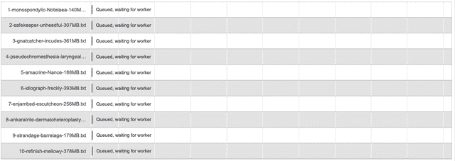

# 具有可观察网络工作者的浏览器中的并行计算

> 原文：<https://dev.to/zakhenry/parallel-computation-in-the-browser-with-observable-webworkers-hci>

在[之前的文章](https://dev.to/zakhenry/observable-web-workers-a-deep-dive-into-a-realistic-use-case-4042)中，我们深入研究了 web worker 的使用，通过将计算卸载到 web worker 来提高主线程的响应能力。

为了方便消息传递，我们使用了库 [`observable-webworker`](https://github.com/cloudnc/observable-webworker) 来给我们一个易于使用的基于 RxJS 流的 API。

这种策略在该用例中非常有效，但是我们并没有最大限度地利用可用的计算资源。

网络浏览器可以让多个*并行*的网络工作者运行在操作系统的不同线程上。这意味着我们在一个工作者中进行的任何计算都不会减慢另一个工作者的计算速度。然而，这是有限制的，因为不仅计算机本身有并行化限制(逻辑处理器核心数),浏览器还会自我限制允许使用的并发网页的数量。

可以运行的并行线程的数量可以由`navigator.hardwareConcurrency`决定。这个数字因底层硬件和浏览器实现而异。例如，大多数桌面浏览器给出核心数，一些移动浏览器会限制这个值，而一些浏览器(Safari)根本不会告诉你。

要计算出我们可以并行运行多少个工人，只需做`const workerCount = navigator.hardwareConcurrency - 1`。这里的`- 1`是为主 ui 线程保留一个处理器内核。

简而言之，通过工人池策略，我们可以让尽可能多的工人运转起来，并构建一个工作池。每个工作者从池中挑选一个任务，在它自己的核心上执行计算，然后将结果返回给主线程，抓取下一个任务，或者如果没有更多的工作要做就关闭。

* * *

为了更好地解释这个概念以及如何实现它，我们将构建一个简单的应用程序，它将获取一个文件列表(使用一个`<input type="file" multiple />`元素)并将这些文件的 MD5 散列和返回给主线程。这个基本概念可以扩展到许多不同类型的应用程序，它本身就是一个相当有用的应用程序，因为您可能想使用这个策略来散列多个文件，以便上传到 AWS S3 等。

让我们从概述我们想要达到的确切目标开始。我将使用一点图表语法，它大致基于 [RxJS marble testing](https://github.com/ReactiveX/rxjs/blob/master/docs_app/content/guide/testing/marble-testing.md) 语法。

*   `-`空闲/等待时间
*   `^`将文件传输到工作线程
*   `*`加工文件
*   `|`哈希计算，返回结果

取下图:

```
file-1.txt  ----^*******| 
```

使用上面的键，我们可以看到我们显示了对于`file-1.txt`有一些空闲时间，然后文件被拾取，处理运行了一段时间，然后结果被返回。

我们可以使用这个语法来展示如果我们一次计算一个文件的散列会发生什么:

```
file-1.txt  ^*******|
file-2.txt  ---------^***|
file-3.txt  --------------^**********|
file-4.txt  --------------------------^********|
file-5.txt  ------------------------------------^*********|
file-6.txt  -----------------------------------------------^****|

results     --------1----2------------3--------4----------5-----6 
```

我通过随机延长处理时间(`*`)来模拟不同大小的文件/花费不同的时间来散列。
最后一行显示了返回到主线程的结果，数字就是文件号。

从这个图中我们可以看到，获得所有 6 个文件的哈希结果的总时间是每个文件处理的单独持续时间的总和。有了工人池，我们当然可以利用并行计算，并行运行许多这样的进程:

```
file-1.txt  ^*******|               # worker-1
file-2.txt  ^***|                   # worker-2
file-3.txt  ^**********|            # worker-3
file-4.txt  -----^********|         # worker-2
file-5.txt  ---------^*********|    # worker-1
file-6.txt  ------------^****|      # worker-3

results     ----2---1---3-4--6-5 
```

在此图中，我采用了与上面完全相同的处理持续时间，但是假设并行度计数为 3，则改变了处理时间。您可以看到这对总处理时间的显著影响，因为一旦第一个文件(file-2.txt)完成，下一个文件(file-4.txt)将立即被选取进行处理。您还可以看到，即使 file-3.txt 仍然占用一个线程，其他两个线程也能够完成它们的工作单元并获得一个新的任务。后面要注意的一点是，结果是尽快返回的，在这种情况下，这意味着无序。我们需要将每个工作单元与其结果相关联，以正确地结合数据。

看待上述场景的另一种方式是使用相同的图语法，但是考虑每个工人而不是每个文件:

```
worker-1    ^*******|^*********|    # file-1.txt, file-5.txt
worker-2    ^***|^********|         # file-2.txt, file-4.txt
worker-3    ^**********|^****|      # file-3.txt, file-6.txt

results     ----2---1--3--4-6-5 
```

这里要注意的重要一点是，工人们从来没有闲着——他们一完成处理工作，就会拿起另一个文件进行处理。

在我们的示例中，我们只使用了三个工作线程，但是假设客户端机器有 8 个逻辑内核，并且浏览器允许您使用它们，那么图表将如下所示

```
file-1.txt  ^*******|               # worker-1
file-2.txt  ^***|                   # worker-2
file-3.txt  ^**********|            # worker-3
file-4.txt  ^********|              # worker-4
file-5.txt  ^*********|             # worker-5
file-6.txt  ^****|                  # worker-6

results     ----26--1453 
```

没什么意思，但是我们可以看到总的时间只和最长的文件(file-3.txt)一样长，而且我们只需要七个可用工作人员中的六个。

好了，我们已经讨论了理论，让我们实际一点吧！

我在这里将使用 Angular，因为它是我最熟悉的，但是我们将使用的两个库(`observable-webworker`和`js-md5`)都是框架不可知的，所以如果您正在学习，请随意使用您最喜欢的前端框架。

* * *

让我们从一个快速组件开始，该组件可以从文件系统加载一些文件，并将它们打印到控制台。

模板:`files-hash.component.html`

```
<input type="file" multiple (change)="hashFiles($event)" /> 
```

组件:`files-hash.component.ts`

```
import { Component } from '@angular/core';

@Component({
  selector: 'app-files-hash',
  templateUrl: './files-hash.component.html',
  styleUrls: ['./files-hash.component.scss'],
})
export class FilesHashComponent {
  public hashFiles($event): void {
    const files: File[] = Array.from($event.target.files);
    console.log(files);
  }
} 
```

运行此命令，我们将看到单个文件选择，当我们选择几个文件时，我们会看到它们以阵列形式记录在控制台中。简单。

接下来，让我们创建一个 webworker，它将一个文件作为参数，并返回该文件的散列。我们不会只返回散列字符串，因为我们需要关联哪个散列对应于哪个文件(记住，在前面我们会得到无序的结果)。

首先，我们定义一个接口来管理传递回文件名和散列的这种相关性:

`file-hasher.interface.ts`

```
export interface FileHashPayload {
  filename: string;
  hash: string;
} 
```

这里没有什么令人兴奋的，只是一个保存文件名和散列的接口。

现在对于工人来说。我们将需要`observable-webworker`和`js-md5`来分别处理工人和散列。

`yarn add -E observable-webworker js-md5`

工人:`file-hasher.worker.ts`

```
import * as md5 from 'js-md5';
import { DoWorkUnit, ObservableWorker } from 'observable-webworker';
import { Observable } from 'rxjs';
import { map } from 'rxjs/operators';
import { FileHashPayload } from './file-hasher.interface';

@ObservableWorker()
export class WorkerPoolHashWorker implements DoWorkUnit<File, FileHashPayload> {
  public workUnit(file: File): Observable<FileHashPayload> {
    return this.readFileAsArrayBuffer(file).pipe(
      map(arrayBuffer => ({ filename: file.name, hash: md5(arrayBuffer) })),
    );
  }

  private readFileAsArrayBuffer(blob: Blob): Observable<ArrayBuffer> {
    return new Observable(observer => {
      if (!(blob instanceof Blob)) {
        observer.error(
          new Error('`blob` must be an instance of File or Blob.'),
        );
        return;
      }

      const reader = new FileReader();

      reader.onerror = err => observer.error(err);
      reader.onload = () => observer.next(reader.result as ArrayBuffer);
      reader.onloadend = () => observer.complete();

      reader.readAsArrayBuffer(blob);

      return () => reader.abort();
    });
  }
} 
```

好了，这里有几件事，让我们来分解一下。

```
@ObservableWorker()
export class WorkerPoolHashWorker implements DoWorkUnit<File, FileHashPayload> { 
```

在类头中，我们用`@ObservableWorker()`来修饰它，将该类注册为一个 worker，这样我们就可以从主线程与它通信。

我们还实现了`DoWorkUnit<File, FileHashPayload>`，这意味着我们需要实现一个公共方法，该方法获取一个文件并返回一个可观察的`FileHashPayload`。

```
public workUnit(file: File): Observable<FileHashPayload> {
  return this.readFileAsArrayBuffer(file).pipe(
    map(arrayBuffer => ({ filename: file.name, hash: md5(arrayBuffer) })),
  );
} 
```

这个方法非常简单——我们将文件作为数组缓冲区读取(参见接下来为实现定义的私有方法),然后将得到的数组缓冲区映射到我们之前定义的`FileHashPayload`,使用`js-md5`库同步计算散列。

请注意，我们在这里返回的是一个完整的可观测值。在管理线程池时，这对于`observable-webworker`库的功能至关重要。它使用完成通知来确定工作人员已经完成了该工作单元，并准备好了另一个工作单元。我们返回 observable，因为它允许我们从 worker 返回多个事件，这对于从长时间运行的流程中输出进度事件很有用。

现在回到主线程来实际实现工人池。

```
import { Component } from '@angular/core';
import { fromWorkerPool } from 'observable-webworker';
import { FileHashPayload } from './file-hasher.interface';

@Component({
  selector: 'app-files-hash',
  templateUrl: './files-hash.component.html',
  styleUrls: ['./files-hash.component.scss'],
})
export class FilesHashComponent {
  public hashFiles($event): void {
    const files: File[] = Array.from($event.target.files);
    console.log(`files`, files);
    fromWorkerPool<File, FileHashPayload>(
      () => new Worker(`./file-hasher.worker.ts`, { type: 'module' }),
      files,
    ).subscribe((hashPayload: FileHashPayload) => {
      console.log('Hashed file', hashPayload.filename, hashPayload.hash);
    });
  }
} 
```

这与我们在之前的文章中用`fromWorker()`做的事情非常相似，但是这次我们使用来自`observable-webworker`的`fromWorkerPool()`。就像`fromWorker`一样，参数是工厂创建一个工人，以及输入本身。

在这个例子中，我们使用了一个`Array<File>`作为输入，然而`fromWorkerPool`方法也使用了一个`Observable<T>`或者一个`Iterator<T>`。

迭代器在这种模式下非常有用，因为您可以使用它们的惰性评估特性来了解*何时*工作已经被处理，而不仅仅是它已经被排队。

Observable 可能很有用，因为您可能正在使用 observable streams，当输入速率超过 worker pool 处理工作的速率时,`fromWorkerPool`会缓冲流。

* * *

如果我们现在运行上面定义的应用程序，并选择一些 filesm，我们将看到如下所示的内容:

```
files (10) [File, File, File, File, File, File, File, File, File, File]
Hashed file 1-monospondylic-Notelaea-140MB.txt 8b3e48ad838ba4b3024d42fa10591c82
Hashed file 2-safekeeper-unheedful-307MB.txt d1bef08d19b30f471f161c8f5fbf9a8a
Hashed file 4-pseudochromesthesia-laryngeal-162MB.txt d77b94eea8ad01c4e4b804fe9ecd26a2
Hashed file 3-gnatcatcher-incudes-361MB.txt 30c6b4c2ea8b1dd9e5222e8ab9f2119d
Hashed file 5-amacrine-Nance-188MB.txt 7be20804dde038994a2c0e6630643046
Hashed file 8-ankaratrite-dermatoheteroplasty-149MB.txt 72cb1a511a27ac023b9960dbc3959c40
Hashed file 7-enjambed-escutcheon-256MB.txt 1f5039e50bd66b290c56684d8550c6c2
Hashed file 6-idiograph-freckly-393MB.txt bcee52113567c0040a0db2c678dfe3c3
Hashed file 9-strandage-barrelage-179MB.txt 9eab43b111f3c7ff67536d031d06f69b
Hashed file 10-refinish-mellowy-378MB.txt 212374c37a433a7b06105090002297d0 
```

为了测试，我已经[生成了](https://github.com/cloudnc/observable-webworker/blob/master/generate-test-files.sh)一堆随机文件，文件名中带有文件大小。

从输出中我们可以看到，我们已经达到了我们之前提出的预期结果——文件出现在日志中，没有按照顺序排列，特别大的文件按照我们的预期排在最后。**成功！**

不过不要相信我的话——我在[https://cloudnc.github.io/observable-webworker](https://cloudnc.github.io/observable-webworker)制作了一个更具互动性的演示，它基本上使用了这里概述的完全相同的策略，只是用了更多的进度信息来构建一个漂亮的时间线:

[](https://res.cloudinary.com/practicaldev/image/fetch/s--ONCDeLOY--/c_limit%2Cf_auto%2Cfl_progressive%2Cq_66%2Cw_880/https://github.com/zakhenry/blog-posts/raw/master/posts/observable-workers-parallel-computation-in-the-browser/article/webworker-pool-demo.gif)

要进行试验，请跳到“多个工作池”部分并选择一些文件。不要担心——没有文件被发送出浏览器，请随意检查源代码以验证或像我一样生成一些随机文件。一旦您选择了文件，您将看到一个文件的时间线图，无论您的机器可以处理什么并发性，都可以处理这些文件。

如果您在您的浏览器 devtools 中检查 sources 选项卡，您将看到正在创建多个工作线程来处理工作负载，一旦池中没有进一步的工作，它们就会被关闭。

此外，如果您选择的文件少于可用的并发数，您将只能启动与您选择的文件一样多的工作线程。

* * *

这篇文章就到这里，希望你喜欢！在本系列的下一篇文章中，我们将深入探讨将大型对象转移给 webworkers 所带来的性能损失，以及降低这一成本的策略。

* * *

这篇文章和演示的源代码可以从[https://github . com/zak Henry/blog-posts/tree/master/posts/observable-workers-parallel-computing-in-the-browser](https://github.com/zakhenry/blog-posts/tree/master/posts/observable-workers-parallel-computation-in-the-browser)获得

[<sub>Unsplash</sub>](https://unsplash.com/@make_it)上 Max Vertsanov 的照片