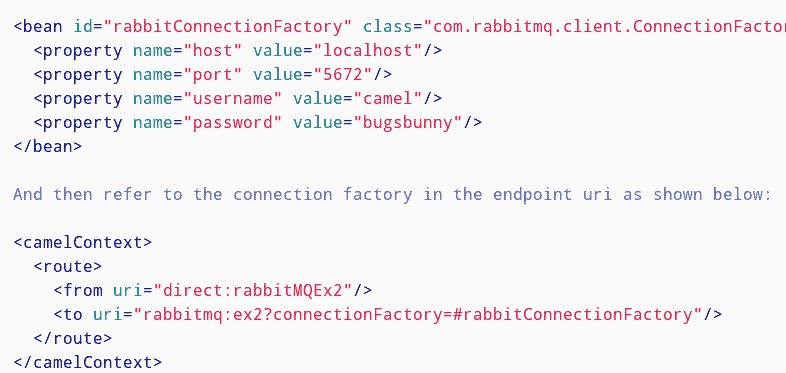

# 阿帕奇骆驼 3 号-兔子

> 原文：<https://dev.to/djoleb/apache-camel-3-using-rabbitmq-2250>

又见面了。

距离我的上一篇文章已经过去 2 个月了，所以我决定写一篇新的。

今天我们将关注 RabbitMq 以及我们可以用 Camel 来做什么。

### 属国

[Maven 资源库- >骆驼 RabbitMq](https://mvnrepository.com/artifact/org.apache.camel/camel-rabbitmq)

### 连接到 RabbitMq

使用 SpringBoot 时:

1.  使用@Configuration 注释创建一个类。
2.  创建一个将返回 ConnectionFactory 的方法，并用@Bean 对其进行注释。
3.  实例化连接工厂并设置属性。

```
@Bean
public ConnectionFactory rabbitConnectionFactory() {
    ConnectionFactory connectionFactory = new ConnectionFactory();
    connectionFactory.setHost("localhost);
    connectionFactory.setPort(5672);
    connectionFactory.setUsername("Username");
    connectionFactory.setPassword("Password);

    return connectionFactory;
} 
```

<svg width="20px" height="20px" viewBox="0 0 24 24" class="highlight-action crayons-icon highlight-action--fullscreen-on"><title>Enter fullscreen mode</title></svg> <svg width="20px" height="20px" viewBox="0 0 24 24" class="highlight-action crayons-icon highlight-action--fullscreen-off"><title>Exit fullscreen mode</title></svg>

*注意:您可以使用应用程序属性连接到服务器。

如果你用的是纯骆驼:

[](https://res.cloudinary.com/practicaldev/image/fetch/s--DBT6tfNJ--/c_limit%2Cf_auto%2Cfl_progressive%2Cq_auto%2Cw_880/https://thepracticaldev.s3.amazonaws.com/i/zlluic9su8pvb8isxkbp.png)

### 使用 RabbitMq

既然我们已经成功地连接到 RabbitMq，那么是时候开始消费/产生消息来排队/交换了。

Camel RabbitMq 组件文档。

正在使用队列中的消息:

1.  我们将设置 rabbitMq 组件从绑定到 exchange 的队列中获取数据。
2.  收到日志消息正文。

公共 void configure() {

```
from("rabbitmq:exchangeA?queue=QueueA&amp;declare=true")
.routeId("RabbiqMqConsumer")
.log("Message received: ${body}"); 
```

<svg width="20px" height="20px" viewBox="0 0 24 24" class="highlight-action crayons-icon highlight-action--fullscreen-on"><title>Enter fullscreen mode</title></svg> <svg width="20px" height="20px" viewBox="0 0 24 24" class="highlight-action crayons-icon highlight-action--fullscreen-off"><title>Exit fullscreen mode</title></svg>

正在生成要交换的消息:

1.  我们将创建一条路线。
2.  设置邮件正文。
3.  给交易所发消息。

公共 void configure() {

```
 from("timer:fooo?period=10000")
 .routeId("RabbiqMqProducer)
 .setBody().constant("{\"foo\":\"bar\"}")
 .log("Message to be sent: ${body}")
 .to("rabbitmq:exchangeB"); 
```

<svg width="20px" height="20px" viewBox="0 0 24 24" class="highlight-action crayons-icon highlight-action--fullscreen-on"><title>Enter fullscreen mode</title></svg> <svg width="20px" height="20px" viewBox="0 0 24 24" class="highlight-action crayons-icon highlight-action--fullscreen-off"><title>Exit fullscreen mode</title></svg>

这就是所有的人，如果任何人有任何问题，随时通过 DM 问我或留下评论。

[](https://i.giphy.com/media/2PuVOnv02rRvy/giphy.gif)