# 正则表达式

> https://dev . to/konami 12/正则表达式-bd4

作为一个开发者，处理文本字符串是很常见的，这最初可能看起来很简单，但随着字符串变得越来越复杂，不可避免地忽略了使用【**【muhaha】。这听起来不再那么简单，因为在这一点上，一个问题变成了 2 个，而且有点令人沮丧。**

 **安静，开始之前，趴在地上，跟着我念:

### 正则表达式不错，不是魔鬼……

### 正则表达式不错，不是魔鬼……

### 正则表达式不错，不是魔鬼……

放松，深呼吸，呼气…准备好了。丑陋的时刻已经过去了，你可能会问自己的问题是:

###真理 las〖t0〗邪恶正则表达式〖t1〗好吗？

对于我能回答的问题，当然他们非常优秀【强大】，因为通过正确的字符组合，我们可以从非常简单的搜索到非常复杂的搜索；简而言之，我们有**瑞士刀**用于链处理。

## 一点历史

在进入主题之前，了解一些关于计算机领域中首次出现的“t0”正则表达式的历史是很好的，这些表达式只不过是在工程师创建的名为 [Ed](https://es.wikipedia.org/wiki/Ed_(Unix)) *的线路编辑器中出现的*

那家线路编辑器首次作为实用程序出现在[UNIX](https://es.wikipedia.org/wiki/Unix)T3】的操作系统上，负责复盖编辑文件的工作。与目前的做法类似，为使[和](https://es.wikipedia.org/wiki/Ed_(Unix))进行文本搜索而必须写的指示类似。

[和](https://es.wikipedia.org/wiki/Ed_(Unix))所使用的命令位于**【g(global)**和**【p(print)**的开头，最后两个字母被称为修饰符，中间剩下的是构成正则表达式的字符组合。

在这一点上出现了一件很有趣的事情，因为前面的语句产生了短语 *，其缩写构成了单词***【grep】**，从这一特点出发

[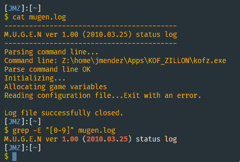](https://res.cloudinary.com/practicaldev/image/fetch/s--VfCSMQFv--/c_limit%2Cf_auto%2Cfl_progressive%2Cq_auto%2Cw_880/https://cdn-images-1.medium.com/max/2000/1%2ApQjVdfJlPy53Osix-8NQqw.png)

*目前许多现代编程语言都有使用正则表达式的必要支持，虽然每种语言的语法可能会有所不同，*基本上我们可以为每种语言做出类似的解决方案，从以上所有的有趣之处开始，所有显示的例子都会写成【t】

## 结构

在我们开始玩常规表情**并发现它们只是被误解之前，我们先了解基本结构。

我们可以看到，结构非常简单，只需要 2 个参数。我们不会考虑修饰符参数，因为我们将从基本示例开始，随着复杂性的增加，我们将首先执行字符搜索。

在这一点上，第一个例子并不奇怪，因为这可以由任何一个搜索者来完成，如果我们再深入一点，我们可以看到搜索正在接收到一个模式，该模式会将*正则表达式*转换为其基本表达式。

## 📗元字符

**元字符**或也称为*类*是能够表示语义上相关的整个字符组的另一种方法，要使用它们，必须使用*反斜线*

> **注:**元字符名称大写时被认为是否定的，因此其行为会与平时不同。

考虑到上述语法和注，我们可以从宣扬正则表达式**开始，为此，我们将使用以下规则开始。

> **提示**:所有示例均使用修饰符**，该修饰符允许在字符串中全局搜索匹配项，此选项用于演示目的，因为每个元字符仅使用一个字符。**

 **### 🔖元字符\w

对**字母数字字符**进行搜索，重要的是要提到它也取**undercore**。

[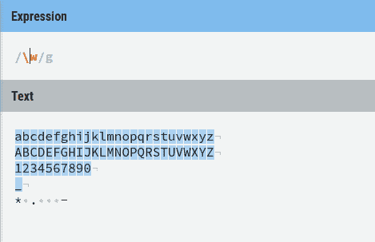](https://res.cloudinary.com/practicaldev/image/fetch/s--oq8W1xaz--/c_limit%2Cf_auto%2Cfl_progressive%2Cq_auto%2Cw_880/https://cdn-images-1.medium.com/max/2000/1%2AME2ltRve03PIEAtwIFI15Q.png)

**类已经具有同等效果。**

 **[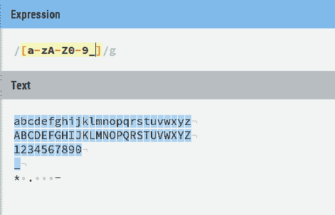](https://res.cloudinary.com/practicaldev/image/fetch/s--FRgjvxu7--/c_limit%2Cf_auto%2Cfl_progressive%2Cq_auto%2Cw_880/https://cdn-images-1.medium.com/max/2000/1%2AGMebN3nkpAIsPVtEJOL5Gw.png)

元字符**具有其否定变体**，使您可以查找除*字母数字字符*和**以外的所有内容。******

 ****

### 🔖元字符\d

执行数字字符的唯一搜索。

元字符**也有其等效项，因为得到了相同的结果。**

 **[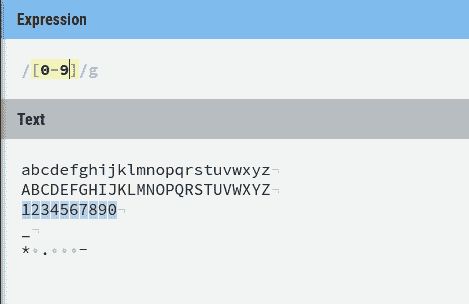](https://res.cloudinary.com/practicaldev/image/fetch/s--5OO0rZB_--/c_limit%2Cf_auto%2Cfl_progressive%2Cq_auto%2Cw_880/https://cdn-images-1.medium.com/max/2000/1%2AAb4_MJquSyShVVg3BU9BHA.png)

元字符**也有其否定变体**，它允许搜索除数字*字符以外的任何内容。*****

 ****[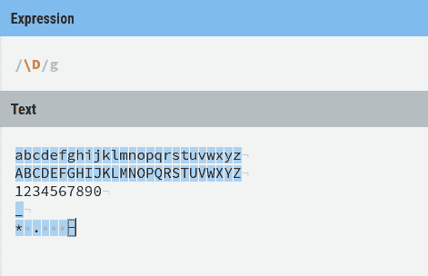](https://res.cloudinary.com/practicaldev/image/fetch/s--ftTKsP7K--/c_limit%2Cf_auto%2Cfl_progressive%2Cq_auto%2Cw_880/https://cdn-images-1.medium.com/max/2000/1%2AlnE33j7I-zjfcWW6H8gUcA.png)

### 🔖元字符\s

搜索字符串中存在的“**”空白“**”。

元字符**也有其否定变体**，这使您可以搜索除空白以外的所有内容****

 ****[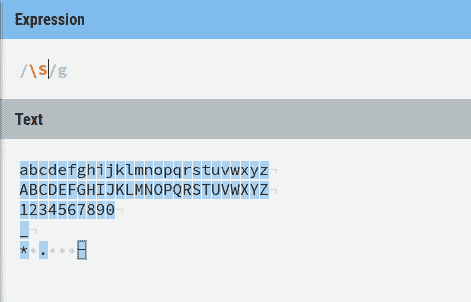](https://res.cloudinary.com/practicaldev/image/fetch/s--Ygeqawri--/c_limit%2Cf_auto%2Cfl_progressive%2Cq_auto%2Cw_880/https://cdn-images-1.medium.com/max/2000/1%2AWGgJCfytG4Hm9h9Sat7hvQ.png)

### 🔖元字符。

这是最特别的一个，因为我们可以匹配除换行符之外的任何字符。

[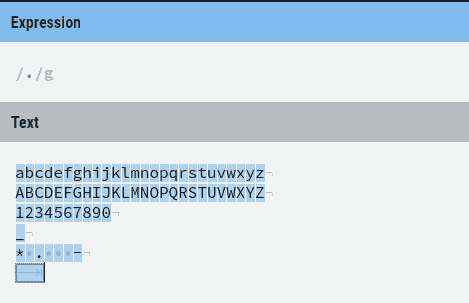](https://res.cloudinary.com/practicaldev/image/fetch/s--dydaFKS4--/c_limit%2Cf_auto%2Cfl_progressive%2Cq_auto%2Cw_880/https://cdn-images-1.medium.com/max/2000/1%2AajuPFnnZDgro1l17Xc6FHw.png)

很有趣的是**正则表达式**不再显得那么邪恶(嗯很有趣我想我恋爱了)到这一点，我们可以说是走上了**的道路，所以我们将着手进行我们的第一次祈祷(例)。**

 **### 🤩额外的

对于**和**有同等的模式，这些模式有着很奇怪的相似之处，这就是**的用法【很有趣】，这为各种可能性提供了便利。**

1.  ***数字范围【0-9】***

2.  ***字母范围【a-za-z】***

3.  ***-******

 *[![Ejemplo usando **[] **(**Fig-18**)](img/da95d0c1fdc42c28cc86d6fd2b2fb5c3.png)](https://res.cloudinary.com/practicaldev/image/fetch/s--7QlqA8eX--/c_limit%2Cf_auto%2Cfl_progressive%2Cq_auto%2Cw_880/https://cdn-images-1.medium.com/max/2000/1%2Ay5NeoVrXlhwhMCwrxlrDIQ.png)

如本例所示，使用始终可靠的**反斜线**转义的特殊字符。

### 实例

对于这个例子，我们将进行前面解释过的元字符的组合，挑战是在一段内搜索一个电话号码，要搜索的号码是**会很有趣你尝试给出**

 *](https://res.cloudinary.com/practicaldev/image/fetch/s--uoDxRHd9--/c_limit%2Cf_auto%2Cfl_progressive%2Cq_auto%2Cw_880/https://cdn-images-1.medium.com/max/2000/1%2AuZncW0LZ75D3qpNcQk9JUw.png)

 *> **注**:如果你想对提议的解决办法作出改变，可以在以下链接[祈祷](https://regexr.com/40tps)上作出。

如上例所示，将元字符组合使用，形成向**(解决方案可能因读者的疯狂程度而异)进行的第一次祈祷。**

 **## 📗康塔多斯

*或也称为*数量词*可让您指定字元或模式在规则运算式中出现的次数，使用的语法为。*

 *

考虑到所显示的语法，我们一眼就可以看出*【元字符】* 和 ***【计数器】*** 之间的组合正在使用，到这一点，我们只关心二者之间的内容

> ## **Lower bound** : indicates the minimum number of occurrences of characters or patterns.
> 
> ## **Upper limit** : indicates the maximum number of times a character or pattern appears. This mark is used together with the upper limit mark to become the possible range.

综上所述，我们可以沿着得救的道路继续前进，继续宣扬、*、*的常规表达方式，要了解计数器的用法，就必须了解以下规则。

### 🔖Contador {x}

此选项是最基本的方式，因为仅使用*下限*标注。此变体在某些程式语言中非常有效，在其他情况下则不需要放置两个标注。

[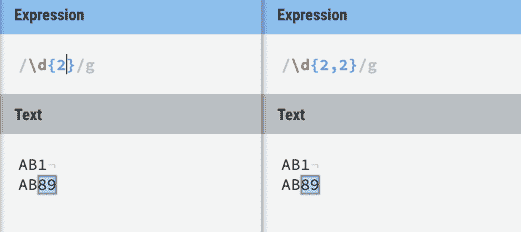](https://res.cloudinary.com/practicaldev/image/fetch/s--GhzwzK8C--/c_limit%2Cf_auto%2Cfl_progressive%2Cq_auto%2Cw_880/https://cdn-images-1.medium.com/max/2000/1%2Aixv9LJlqIaXc9-7ZiN5-Vw.png)

> **注:**这两种选择都是有效的，但由于我们是非常优秀的程序员，我们将始终使用右边的选择，这是因为良好的做法总是要求申报**最高限额***

 ***### 🔖Contador {x，}

此选项可让您指定从*底部标注中指定的数字开始的无限范围的复本。*

[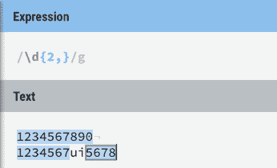](https://res.cloudinary.com/practicaldev/image/fetch/s--ZIjxPNUz--/c_limit%2Cf_auto%2Cfl_progressive%2Cq_auto%2Cw_880/https://cdn-images-1.medium.com/max/2000/1%2A6BH2Uf8uzqAt-qzGSLSUDg.png)

如上例所示，使用语法时，并不在乎满足*下界条件*后出现的事件。

### 计数器{x，y}

此选项使用*作为*作为*作为*作为*作为*作为*作为*作为 ***和*作为可以转换的字符或模式的出现范围****

 *[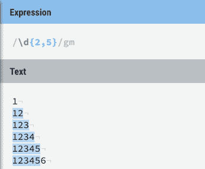](https://res.cloudinary.com/practicaldev/image/fetch/s--TLfghGLc--/c_limit%2Cf_auto%2Cfl_progressive%2Cq_auto%2Cw_880/https://cdn-images-1.medium.com/max/2000/1%2ALOLQAz3qaCbGeAFRm6e0YQ.png)

如上例所示，我们可以使用两个尺寸来设置字符或模式可能出现的范围，如果将这两个尺寸与上一个实例进行比较，您可以看到，在这种情况下，您有一个限制。

### 🤩额外的

计数器中也有便于计数的字符这些也被称为**，**

 *> ## Separator: a string of one or more characters used to specify the boundary between the independent area and the independent area in plain text or other data sequences.

***？:可能是也可能不是***

***+:可能是一次或多次***

[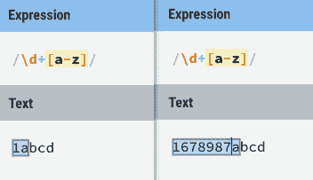](https://res.cloudinary.com/practicaldev/image/fetch/s--O9jaQMzT--/c_limit%2Cf_auto%2Cfl_progressive%2Cq_auto%2Cw_880/https://cdn-images-1.medium.com/max/2000/1%2AUn04r6nHu4feDdl4otuBHA.png)

****可能不在或经常在***

***():被称为捕获括号，它允许您记住正则表达式，其功能与[]非常相似，只是在这种情况下范围被正则表达式替换。***

### 实例

对于本例，我们将执行与在*项中所做的相同的做法，但在此例中，我们将使用**，
，正如我们回顾的那样***

 ***](https://res.cloudinary.com/practicaldev/image/fetch/s--q_I99dK0--/c_limit%2Cf_auto%2Cfl_progressive%2Cq_auto%2Cw_880/https://cdn-images-1.medium.com/max/2360/1%2AFegXBdCu7MIw7Hn6A95Lww.png)

> **注**:如果你想对提议的解决办法作出改变，可以在以下链接[祈祷](https://regexr.com/419am)上作出。

如上例所示，我们已经在应用所学的福音，这将使我们创造出更强大的祈祷，满足于**(答案可能因读者的疯狂而异)。**

 **## 📗修饰者

在前面的示例中，我们已经提到并使用了这些修改符，这些修改符允许我们重新定义表达式的搜索条件，因为搜索有时区分大小写，在找到第一个匹配项时结束，等等，因此我们可以使用语法来修改此行为。

这与开始时的图像相同，但到目前为止，这是合理的，因为我们遵守将修饰符与正则表达式一起使用所需的语法。

> **注**:修饰符是可选的，除了可累积性之外，这意味着我们可以同时使用多个修饰符。

### 🔖 Modificador i

此修饰符称为*【不敏感】、* ，无论大小写如何，都会执行搜索。

如范例所示，当您使用修改子 I 时，选取项目会以大写字母开头，否则会从小写字母开始搜寻。

### 🔖 Modificador g

它被称为修饰符**(在示例中使用)，它执行的搜索最多匹配项不会在它遇到的第一个结果中停止。**

 **

如本例所示，使用修饰符 g 时，如果未放置修饰符，则搜索将保留在找到的第一个匹配项中。

### 🔖 Modificador m

它被称为修饰词 ***、*** 它在文本的每一行单独进行搜索，此修饰词与元字符配合使用

> ## **: used to indicate the starting point of the line.**
> 
>  **## **: used to indicate the end of the line****

 ****使用这些字符可以指示要搜索的行的位置。另一个优点是可以匹配整个行。

[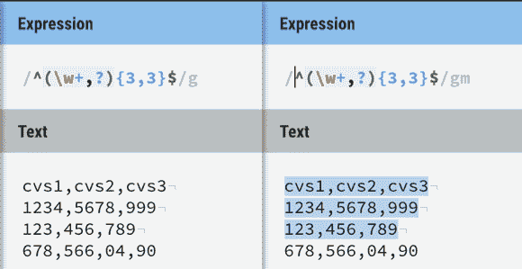](https://res.cloudinary.com/practicaldev/image/fetch/s--NWHz85uB--/c_limit%2Cf_auto%2Cfl_progressive%2Cq_auto%2Cw_880/https://cdn-images-1.medium.com/max/2000/1%2AJ44f7wHVADL4rF4k6HDkGg.png)

如本范例所示，当您使用*修正因子 m *时，会逐行搜寻，因此只会传回符合搜寻请求的结果。

### 🤩额外的

在多行修饰符中使用了“*”元字符“*”，其中该字符具有用于执行否定的变体，其语法如下。

如本例所示，要使用否定，必须使用**表示要否定的字符。**

 **[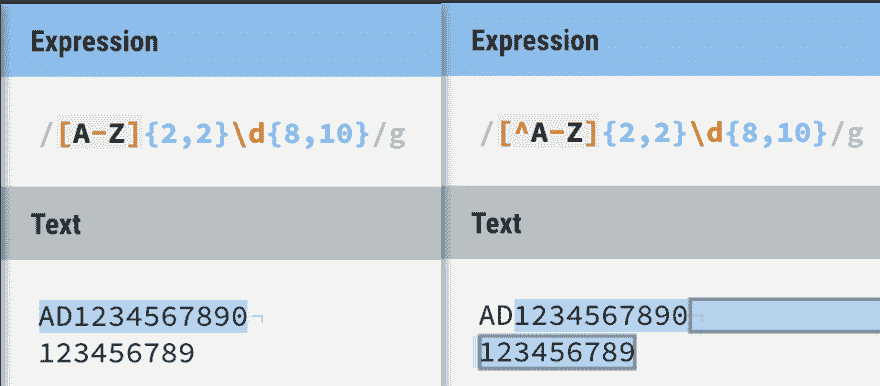](https://res.cloudinary.com/practicaldev/image/fetch/s--pVqUpvgk--/c_limit%2Cf_auto%2Cfl_progressive%2Cq_auto%2Cw_880/https://cdn-images-1.medium.com/max/2000/1%2A_IIa2Ya7_y0sbeZHipzI2w.png)

如上例所示，当您在方括号内使用时，会自动忽略字母并采用剩馀值。

### 实例

对于本例，我们将执行与在*项中所做的相同的做法，但在此例中，我们将使用**，
，正如我们回顾的那样***

 ***](https://res.cloudinary.com/practicaldev/image/fetch/s--gBa3hEf6--/c_limit%2Cf_auto%2Cfl_progressive%2Cq_auto%2Cw_880/https://cdn-images-1.medium.com/max/2000/1%2AjYx8KJqLuzn2gb-FyxbBpQ.png)

> **注意**:如果你想对提出的解决方案作出改变，可以在下面的链接[祈祷。](https://regexr.com/41l1g)

### 结论

如整个入口展示的例子所示，我们可以说我们已经福音化了，所以我们需要使用【**【邪恶正则表达式】* *的任何字符串，我们都可以通过**对他们施驱魔咒，因为我们知道*

> ## If it's my friend, regular expression.
> 
> ## If it's my friend, regular expression.
> 
> ## If it's my friend, regular expression.

**谢谢你乘坐这个条目**。任何评论均欢迎在 [@Konami12Jorge](https://twitter.com/Konami12Jorge) 中发表，如果你认为其他人需要福音，请不要忘记帮忙并分享这些材料。*************************************************