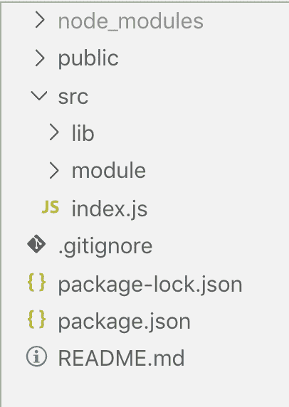

# 创建 REACT 组件库

> 原文：<https://dev.to/arpitjain_in/create-library-of-react-component-1fa8>

`Create React App`是学习和开发 React 应用程序的舒适环境。这是在 React 中开始构建单页面应用程序的最佳方式。

通过增加几个步骤，我们可以将 React 组件转换成库。之后，你可以把它发布到 NPM，让全世界都把它作为可重用的现成组件应用到他们的应用程序中。

所以，让我们开始旅程吧！！！

这个旅程有 9 个里程碑。所有这些都很简单，很容易实现。

### **里程碑#1**

如果您已经安装了`create-react-app`样板 CLI，您可以跳过，否则使用下面的命令安装它。

```
npm install -g create-react-app 
```

一旦你成功地安装了它，你就可以使用上面安装的样板文件创建一个新的项目了，要做到这一点，请运行下面的命令。
创建-反应-应用我的第一反应-库

*   “我的第一反应库”是我的项目名称。你可以随便起任何名字。

恭喜你！实现第一个里程碑。

### **里程碑#2**

这里，我们必须执行两个小步骤。

*   删除文件夹`src`中的所有可用内容，并在 src 文件夹中执行以下操作。
*   创建一个新文件，命名为`index.js`。
*   创建两个文件夹，命名为`lib`和`module`。
*   再创建一个 index.js，但这次是在`lib`文件夹中。应该就像`lib/index.js`一样。
*   再创建一个 index.js，但这次是在`module`文件夹中。应该就像`module/index.js`一样。

你的文件夹层次结构应该如下:-
[](https://res.cloudinary.com/practicaldev/image/fetch/s--0m4EEI8s--/c_limit%2Cf_auto%2Cfl_progressive%2Cq_auto%2Cw_880/https://thepracticaldev.s3.amazonaws.com/i/ttcqnevmd2vdka0v9mhf.png)

### **里程碑#3**

现在，无论你想把哪个组件的代码打包成可重用的组件，都需要放在`src/lib`文件夹中。
`src/lib`文件夹将被视为分布式代码，该文件夹的全部内容将发布到 NPM。

`Any external file like CSS or images which are the part of your component, should available inside the "src/lib" only.`

### **里程碑#4**

在第二个里程碑中，我们创建了`src/lib/index.js`。现在是使用它的时候了。这里，我们需要导入我们的组件引用并将其导出，以便作为外部包使用。

最后，你的`lib/index.js`应该是这样的:-

```
 import <your-component> from './ <your-component-reference>'
 export default <your-component> 
```

如果要导出单个组件，可以声明为`export default`。或者如果您有多个组件要导出，那么您的声明应该是这样的

`export {your-component-1, your-component-2}`

为了更好的理解，请参考下面 GitHub 的位置:-
`https://github.com/arpitjain-in/create-react-component-library`

### **里程碑#5**

在将它发布到 NPM 之前，在本地机器上测试它总是一个好的做法，如果有必要，我们也可以在本地机器上调试。
让我们使用`src/module/index.js`开始测试。你的代码片段应该像这样

```
import React from 'react';
import <your-component> from '../lib';
const App =()=> <your-component>;
export default App; 
```

同样，为了更好地理解，请参考上面提到的 github 链接。

将`module/index.js`参考添加到`src/index.js`、

```
import React from 'react';
import ReactDOM from 'react-dom';
import App from './module';
ReactDOM.render( <App/>, document.getElementById('root') ); 
```

跟随到现在，你已经准备好运行`npm start`并看到浏览器的魔力。

### **里程碑#6**

为了使组件可发布，我们需要对 package.json 进行一些修改，还需要安装`babel-cli`。
首先，使用下面的命令安装 babel-CLI:-

```
npm install babel-cli --save 
```

安装成功后，在项目的根级别创建`.babelrc`文件，并添加以下内容:-

```
{ “presets” : [[ “react-app”,{ “absoluteRuntime”:false }]]} 
```

在 package.json 中，将“构建”脚本更改为以下内容。

```
"build": "rm -rf dist && NODE_ENV=production babel src/lib --out-dir dist --copy-files --ignore __tests__,spec.js,test.js,__snapshots__" 
```

随着以上脚本的改变，`src/lib`文件夹代码将被传送到“dist”文件夹。它还会忽略特定于规范、测试和快照的 JS 文件。

### **里程碑#7**

执行以下步骤:-

*   从 package.json 中删除行“private”:true。
*   将 react-scripts、react 和 react-dom 从依赖项移动到开发依赖项。
*   或者，您也可以将 react 和 react-dom 添加到对等依赖中。

> 恭喜你！所有主要里程碑均已实现。

### **里程碑#8**

发布准备

```
 "main": "dist/index.js",
  "module": "dist/index.js",
  "files": [ "dist", "README.md" ],
  "repository": {
    "type": "git",
    "url": "URL_OF_YOUR_REPOSITORY"
    } 
  “author”: <your-name>
  “keyword”: [<mention all your keywords comma separated>] 
```

### **里程碑#9**

最后，“发布”

为大众 NPM 推
`npm run publish –-access public`

对于私推
`npm run publish`

由 [Arpit Jain](https://arpitjain.in) 创作。