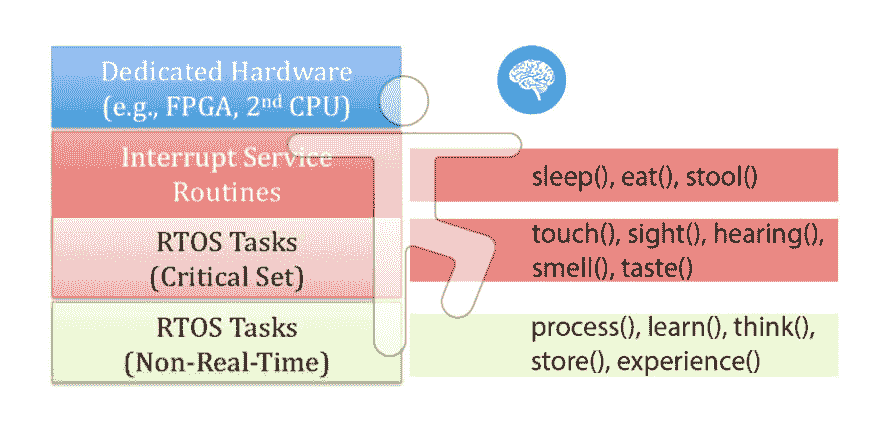

# 将人类视为一个计算机程序

> 原文：<https://dev.to/th3n00bc0d3r/thinking-humans-as-a-computer-program-42im>

计算机是一种使用二进制值作为计算手段的电子设备，因此程序是帮助计算机进行计算的一条指令或一组指令，由此得出结论，没有程序，计算机什么也做不了。没有程序的电脑只是一个没有用途的电子设备。

人类，也被称为“智人”,是一种可以与承载文化的灵长类动物相比较的活体装置，因为它与灵长类动物相似，但区别在于具有高度发达的计算机，即大脑。大脑可以被认为是一个电子设备，主要使用二进制值进行计算。

电子设备是作为硬件组件制造的，通过硅加热和冷却将部件焊接在一起。人类有一个相似的制造过程，事物变热，然后最终变冷，因此你所拥有的是一个迷你人类。为了使一个电子硬件起作用，首先要在里面烧一个固件，一个小的程序，当它一通电就循环运行。人类也有一个固件。

[](https://res.cloudinary.com/practicaldev/image/fetch/s--Ks6NcchJ--/c_limit%2Cf_auto%2Cfl_progressive%2Cq_auto%2Cw_880/https://thepracticaldev.s3.amazonaws.com/i/q1os7afudzz9qw1x00di.jpg) 
一张图，我刚编出来的。

核心的固件就像这组功能一样，一些中断服务、一些关键任务和一些非关键任务。这些函数在某种程度上是彼此的衍生物，返回小块信息，这些信息以基于对象的存储方式存储在我们的内存中，或者你可以说是硬盘。我认为我们的内存在开始时是相当不稳定的，也许随着时间的推移，learn()和 experience()函数的结合确实使程序存储了长时间的数据，而不会被覆盖或擦除。这样一个概念真的可以简化我们理解周围生活的方式，并且让我更进一步地关注，跳过其他功能就是恐惧()功能。它是在人脑单元测试时产生的，其输出和结果与预期不符。通常程序员会尝试...捕捉...并在 console.log()中抛出错误。他会检查堆栈跟踪，一行一行地重复这个函数，以得出想要的结果。这解决了问题，但是在人类的情况下，他们没有尝试...捕捉...并且函数一次又一次地破坏它们的程序，因此开发了一个函数 fear()，它存储了所有它不应该调用的函数。这就是所谓的有限计划。它没有修复，它的基本功能一次又一次地崩溃。

```
A program that does not execute all its functions properly, is a useless program and the same can be said for a human. 
```

Enter fullscreen mode Exit fullscreen mode

人类适应的恐惧()函数是利用他们的学习()和经验()函数，它是一个非线性函数，然后封装在一个称为焦虑()的函数中，它进一步封装了一个称为抑郁()的函数。现在，人类的这种非线性行为已经使他们变得迟钝、无反应和专注，无法改变他们自己的结果或输出。

```
function depression() {
 function anxiety() {
  function fear() {
   return 0;
  }
 }
}

while (depression() == 1) {
 delay();
 sleep();
} 
```

Enter fullscreen mode Exit fullscreen mode

我认为我们被赋予了世界上任何其他成功人士所拥有的所有功能，唯一的不同是，他们使用了更多的尝试...捕捉...那么我们实际上已经使用了，所以为了使我们自己成为一个有用的、优雅的、漂亮的程序，我们可能需要尝试一下...接住。更频繁地阻塞，并在 console.log()上吐掉所有内容，这样我们就知道发生了什么。

只是一个想法。