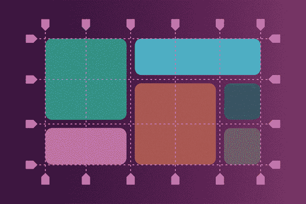
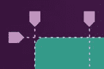

# 使用 CSS 网格创建简单网格

> [https://dev . to/openevufcg/创建简单网格-com-css-grid-3kd2](https://dev.to/opendevufcg/criando-malhas-simples-com-css-grid-3kd2)

# 格帕拉塞尔菲利斯

你知道 CSS 网格吗？否则，您将丢失一个很好的 CSS 工具，该工具既便于代码开发，又便于代码维护。在那篇文章里，我会稍微介绍一下它的功能以及它的力量。

# 关于盒子的一点

首先，您需要抽象每个 HTML 元素都包含在一个框中，框中既包含它，也包含它的内容(要了解更多信息，请访问“[”此链接“](https://tableless.github.io/iniciantes/manual/css/box-model.html)”和“[”此链接“](https://developer.mozilla.org/pt-BR/docs/Web/CSS/box_model)”。大多数情况下，您的内容中会包含其他 HTML 元素，即框内的框，而 Grid 所做的只是根据您的意愿组织这些框。他怎么做到的？它定义一个四边形网格，并为每个 HTML 元素指定该网格中的空间。

[](https://res.cloudinary.com/practicaldev/image/fetch/s--CIs7DR9B--/c_limit%2Cf_auto%2Cfl_progressive%2Cq_auto%2Cw_880/https://thepracticaldev.s3.amazonaws.com/i/58gv9hkeys3de94e0amo.png) 
*来源:[【储蓄盒】](https://seesparkbox.com/foundry/css_grid_layout_guide_with_flexbox_fallbacks)*

网格由跟踪器定义，它们基本上是行和列的分隔符，即以下白色标记:

[](https://res.cloudinary.com/practicaldev/image/fetch/s--aLzp0jlT--/c_limit%2Cf_auto%2Cfl_progressive%2Cq_auto%2Cw_880/https://thepracticaldev.s3.amazonaws.com/i/kldxli86fo9f6mcgoi4r.jpg) 
*来源:[【储蓄盒】](https://seesparkbox.com/foundry/css_grid_layout_guide_with_flexbox_fallbacks)*

直线是一个跟踪器与另一个跟踪器之间的垂直区域，即网格高度处的每个新空间。柱已经是一个跟踪器之间的水平区域，即网格长度中的每个新空间。

行和列通常是在`fr`中测量的。此度量专门为 CSS Grid 创建，可以定义为“网格容器中可用空间的一小部分”(源: [MDN](https://developer.mozilla.org/pt-BR/docs/Web/CSS/CSS_Grid_Layout/Basic_Concepts_of_Grid_Layout) 。在上图中，柱的测量值为`5fr`，行的测量值为`3fr`。你知道最棒的是什么吗？它适合你的屏幕尺寸。

此外，图像中的每个绘制框都是网格中的一个区域，其中将包含一个 HTML 元素。但冷静点，我会解释为什么这很重要。

# 付诸实践

请注意，此贴子中的样例将遵循一个框架，在该框架中，我将始终显示 css 代码以及该代码在代码中的应用。此外，还有一个流，其中每个代码都将用作后续代码的基础。

## 准备出发

使用网格的第一步是定义我们使用的元素以及每个元素包含的内容。这是在 HTML 中定义的。在这种情况下，我们有一个大箱子里面有六个小箱子:

```
<div class="caixa grande">
  <div class="caixa pequena-1">Caixa pequena 1</div>
  <div class="caixa pequena-2">Caixa pequena 2</div>
  <div class="caixa pequena-3">Caixa pequena 3</div>
  <div class="caixa pequena-4">Caixa pequena 4</div>
  <div class="caixa pequena-5">Caixa pequena 5</div>
  <div class="caixa pequena-6">Caixa pequena 6</div>
</div> 
```

为了便于理解，可以使用自定义 HTML 标签。遵循上面的代码可能出现的示例:

```
<caixa-grande>
  <caixa-pequena1/>
  <caixa-pequena2/>
  <caixa-pequena3/>
  <caixa-pequena4/>
  <caixa-pequena5/>
  <caixa-pequena6/>
</caixa-grande> 
```

要开始使用网格，只需在所需元素中设置属性`display: grid`，在这种情况下，我们将在`caixa-grande`中使用该属性，因为我们要组织其中的内容:

```
caixa-grande {
  display: grid;
} 
```

[https://codepen.io/pedroespindula/embed/mNQYGQ?height=600&default-tab=result&embed-version=2](https://codepen.io/pedroespindula/embed/mNQYGQ?height=600&default-tab=result&embed-version=2)

很简单吧？别紧张，我们还没准备好。在此 CSS 中定义的只是该框将使用的组织类型(“T0”)，即网格。在这种情况下，我们只对元素说:“用网格来组织你体内的东西。我不管你怎么做，只要使用网格。”。

# Entendendo como organizar

## 基本组织

您可能注意到网格是自动设置的，其中每个较小的框都放置在网格线中，即一条网格线下方。隐式定义‘t0’时，将设置元素的其他一些标准网格属性。以这种方式组织网格的属性是[【网格自动流程】](https://developer.mozilla.org/pt-BR/docs/Web/CSS/grid-auto-flow)，默认设置为`grid-auto-flow: row`。也就是说，网格的自动组织流设置为线。因此，每添加一个新的子项，它就会被放入一个新行。

现在，假设您要将元素排列为列而不是行，即并排排列，而不是向下排列。只需将该属性修改如下:

```
caixa-grande {
  display: grid;
  grid-auto-flow: column;
} 
```

[https://codepen.io/pedroespindula/embed/qeLPzx?height=600&default-tab=result&embed-version=2](https://codepen.io/pedroespindula/embed/qeLPzx?height=600&default-tab=result&embed-version=2)

在此示例中，我们实际上是在告诉元素“使用网格，但将这些框组织为列”。

## 具有网格模板的组织

在上面的示例中，我们自动将整个网格定义作业保留在网格中。但是如果我们想要定义一个自定义网格呢？为此，我们需要在您选择的 HTML 元素中定义“`grid-template`”。在此网格中，您将定义三个元素:“列”(columns)、“行”(rows)和“区域”(areas)，以放置所选框的内容。

还记得我在上面给你的行、列和区域的定义吗？好的，您将遵循这些概念来定义您的网格。

## 编码

让我们举一个具体的例子。想像一下，你不想使用‘t0’，而是想把每一个盒子放在一条线上。既然我们有六个小盒子，就要定义六栏一行，如下所示:

```
caixa-grande {
  display: grid;
  grid-template-columns: 1fr 1fr 1fr 1fr 1fr 1fr;
  grid-template-rows: 1fr;
} 
```

[https://codepen.io/pedroespindula/embed/MNLZEV?height=600&default-tab=result&embed-version=2](https://codepen.io/pedroespindula/embed/MNLZEV?height=600&default-tab=result&embed-version=2)

因为我们只有一行，所以不需要明确定义，所以为了方便起见，可以这样定义:

```
caixa-grande {
  display: grid;
  grid-template-columns: repeat(6, 1fr);
} 
```

[https://codepen.io/pedroespindula/embed/VogNKJ?height=600&default-tab=result&embed-version=2](https://codepen.io/pedroespindula/embed/VogNKJ?height=600&default-tab=result&embed-version=2)

除了省略`repeat`外，我们还使用`repeat`功能。`repeat`用于多次重复过去的测量量。在这种情况下，我们重复测量“`1fr`”六次，因为所有列的大小都相同，均为 1fr。重复是一个非常强大的功能，将在另一个帖子中进一步讨论。

现在，如果我们想要 3x2 网格？仍然很简单:

```
caixa-grande {
  display: grid;
  grid-template-columns: repeat(3, 1fr);
  grid-template-rows: repeat(2, 1fr);
} 
```

[https://codepen.io/pedroespindula/embed/YzKwNBj?height=600&default-tab=result&embed-version=2](https://codepen.io/pedroespindula/embed/YzKwNBj?height=600&default-tab=result&embed-version=2)

在所有这些情况下，列和行的大小相同，但我们也可以设置为不同的大小。例如:

```
caixa-grande {
  display: grid;
  grid-template-columns: 2fr repeat(2, 1fr);
  grid-template-rows: repeat(2, 1fr);
} 
```

[https://codepen.io/pedroespindula/embed/OJLMWee?height=600&default-tab=result&embed-version=2](https://codepen.io/pedroespindula/embed/OJLMWee?height=600&default-tab=result&embed-version=2)

现在，第一列的大小是其他列的两倍。很简单吧？

## Usando áreas 无网格

在这些例子中，我们都没有使用‘t0’，但是，大家都工作得很好。它们之所以起作用，正是因为我前面提到的 CSS 网格推断，因为它按顺序将网格属性分配给每个子代。

但是，如果要更改框的顺序，我们需要更改 HTML。在这样一个简单的示例中，只需更改框行的顺序，每个内容都会更改。但是，在复杂项目中，更改 HTML 变得不可行。幸运的是，有‘t0’。

在该对话框中，可以定义网格将具有的实际区域。例如:

```
caixa-grande {
  display: grid;
  grid-template-columns: 2fr repeat(2, 1fr);
  grid-template-rows: repeat(2, 1fr);
  grid-template-areas: 
    "c-pequena1 c-pequena2 c-pequena3"
    "c-pequena4 c-pequena5 c-pequena6";
} 
```

父容器已就绪，但我们仍需要在子对象内定义每个对象所分配到的区域，如下所示:

```
caixa-pequena1 {
  grid-area: c-pequena1;
}

caixa-pequena2 {
  grid-area: c-pequena2;
}

caixa-pequena3 {
  grid-area: c-pequena3;
}

caixa-pequena4 {
  grid-area: c-pequena4;
}

caixa-pequena5 {
  grid-area: c-pequena5;
}

caixa-pequena6 {
  grid-area: c-pequena6;
} 
```

[https://codepen.io/pedroespindula/embed/VwZePoG?height=600&default-tab=result&embed-version=2](https://codepen.io/pedroespindula/embed/VwZePoG?height=600&default-tab=result&embed-version=2)

都准备好了！这一定义与之前没有‘t0’的例子相同，但想象一下我们想把‘t1’的位置换成‘T2’。您只需更改“`grid-template-areas`”中的顺序，从而只修改 CSS 而不移动 HTML，如下所示:

只有一点观察，`grid-area`属性的设置没有引号，如果放入引号包围的区域就行不通了。

```
caixa-grande {
  display: grid;
  grid-template-columns: 2fr repeat(2, 1fr);
  grid-template-rows: repeat(2, 1fr);
  grid-template-areas: 
    "c-pequena1 c-pequena4 c-pequena3"
    "c-pequena2 c-pequena5 c-pequena6";
} 
```

[https://codepen.io/pedroespindula/embed/YzKwZzR?height=600&default-tab=result&embed-version=2](https://codepen.io/pedroespindula/embed/YzKwZzR?height=600&default-tab=result&embed-version=2)

网格区域不仅允许方便地更改位置 HTML 元素。可以使用的最强大的方法是定义复杂网格。我们以前没有做过的一件事是在`grid-template-areas`的定义中多次使用一个区域，但这是我们使用网格的主要原因。

为了更好地理解，想象一下我们现在需要制作一个包含边栏、内容、页眉和页脚的主页。页眉应始终位于顶部，侧栏应位于左侧，主要内容应位于右侧，页脚应始终位于侧栏下方。主要内容是侧栏宽度的 3 倍，页眉和页脚高度的 5 倍。

听起来很复杂，不是吗？不，这很容易用网格和网格区域组织。我建议你先试试这个例子，再看我是怎么做的。你做过吗？太好了！你做不到？没问题，我们是来干这个的！你没试过？我看着呢！？

让我们先定义一下决议的所有要素:

```
<pagina-principal>
  <cabecalho/>
  <barra-lateral/>
  <conteudo-principal/>
  <rodape/>
</pagina-principal> 
```

之后的网格:

```
pagina-principal {
  display: grid;
} 
```

我通常先定义‘t0’，因为这样我的视力比我想做的更好:

```
pagina-principal {
  display: grid;
  grid-template-areas: 
    "cabecalho cabecalho"
    "barra-lateral conteudo-principal"
    "rodape conteudo-principal";
} 
```

然后，我们可以将每个区域指定给子元素:

```
cabecalho {
  grid-area: cabecalho;
}

barra-lateral {
  grid-area: barra-lateral;
}

conteudo-principal {
  grid-area: conteudo-principal;
}

rodape {
  grid-area: rodape;
} 
```

但是，我们仍然需要定义所请求的大小，因此我们使用行和列的定义。由于主要内容将是侧栏的 3 倍，我们将有一列是另一列的 3 倍，并且由于主要内容将是页眉和页脚的 4 倍，因此主要内容的行将需要是页眉和页脚行的 4 倍:

```
pagina-principal {
  display: grid;
  grid-template-columns: 1fr 3fr;
  grid-template-rows: 1fr 4fr 1fr;
  grid-template-areas: 
    "cabecalho cabecalho"
    "barra-lateral conteudo-principal"
    "rodape conteudo-principal";
} 
```

[https://codepen.io/pedroespindula/embed/gOYPmrN?height=600&default-tab=result&embed-version=2](https://codepen.io/pedroespindula/embed/gOYPmrN?height=600&default-tab=result&embed-version=2)

好了，我们有我们的主页了！

# 实验者的时间

现在，您已经了解了一些 CSS Grid，请使用此属性稍微玩一玩，并测试一些我在本手册中没有解释的东西。你不知道吗？所以，如果我在网格上有一个未使用的区域，会发生什么？如果我想在每一列和每一行之间放置一个空白区域呢？如果我不知道子元素的数量，该怎么办？如果我不想要任何空间呢？有了网格，这一切都是可能的，我向你保证。

# éisto！

我叫佩德罗，非常感谢阅读！我是 opendevufcg 的贡献者和前端开发者。如果你想联系我，只要在 [Twitter](https://twitter.com/pedro_espindula) 上给我发个信息，如果你想看我的作品，看看我的 [GitHub](https://github.com/pedro_espindula) 。

注意:很快，我们将在 **dev.to** (包括我自己)这里有来自 opendevufcg 的投稿人的新文章。陪同 openevufcg no[Twitter](https://twitter.com/OpenDevUFCG)、no [Instagram](https://instagram.com/OpenDevUFCG) 当然还有 [GitHub](https://github.com/OpenDevUFCG) 。