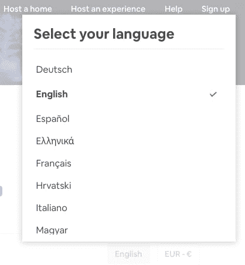
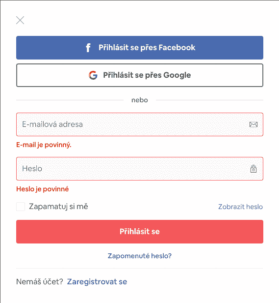

# 前端工作面试问题#1 — HTML 问题

> 原文：<https://dev.to/alexandrshy/frontend-job-interview-questions-1-html-questions-mej>

在你安排好面试日期后，许多前端开发人员会问自己“等待我的是什么？”🤔

这是因为前端开发的世界非常广阔，包括基本领域(HTML、CSS、JavaScript)和许多特定主题(框架和库、各种测试、图形和动画等等)。为了准备自己的面试，我查阅了很多资料。其中一些更好。有些只会给我带来更多的问题，但对我来说最有用的是一系列问题[前端开发人员面试问题](https://github.com/h5bp/Front-end-Developer-Interview-Questions)，我决定继续努力。

我想写这一系列笔记来捕捉我自己的答案，也许可以在评论中展开一场有趣的讨论。但是不要把我的答案当成纯粹的真理，我是一个普通的开发者，可能会错😅

你可以在 GitHub 上找到完整的问题列表。该项目正在积极发展，你可以成为其中的一部分。

## a`doctype`做什么？

`DOCTYPE`(文档类型声明)是给浏览器的关于编写页面的标记语言版本的指令。根据 HTML 规范，每个 HTML 文档都需要一个`DOCTYPE`声明，表明正在使用的 HTML 版本或标准。

HTML5 的`DOCTYPE`不区分大小写，应该位于文档的开头。

```
<!DOCTYPE html>
<html lang="en">
  <head>
    <title><!-- Title of your page --></title>
  </head>
  <body>
    <!-- Body of your page -->
  </body>
</html> 
```

当前没有理由在创建新页面时使用旧的声明。但是，您仍然可以在较旧的项目中遇到它们。

### 参考文献

1.  [W3C —推荐在 Web 文档中使用的 Doctype 声明](https://www.w3.org/QA/2002/04/valid-dtd-list.html)
2.  [HTML 规范—文档类型](https://html.spec.whatwg.org/multipage/syntax.html#the-doctype)
3.  [MDN — Doctype](https://developer.mozilla.org/en-US/docs/Glossary/Doctype)

## 如何为一个页面提供多种语言的内容？

总是在 HTML 标签上使用语言属性来声明页面中文本的默认语言。注意，您应该使用`html`元素而不是`body`来定义语言，因为`body`元素没有覆盖文档的`head`元素中的文本。

```
<html lang="en">
  <head>
    <title><!-- Title of your page --></title>
  </head>
  <body>
    <!-- Body of your page -->
  </body>
</html> 
```

当页面包含另一种语言的内容时，向该内容周围的元素添加语言属性。

```
<html lang="en">
  <head>
    <title><!-- Title of your page --></title>
  </head>
  <body>
    <p lang="fr">Texte français</p>
  </body>
</html> 
```

为了确保所有用户代理都能识别您所指的语言，在提供语言属性值时，您需要遵循一种标准的方法。您可以在这个[注册表](https://www.iana.org/assignments/language-subtag-registry/language-subtag-registry)中找到各种语言的完整代码列表。

### 参考文献

1.  [W3C —在 HTML 中声明语言](https://www.w3.org/International/questions/qa-html-language-declarations)
2.  [MDN —全局属性—lang](https://developer.mozilla.org/en-US/docs/Web/HTML/Global_attributes/lang)
3.  [带语言的注册表](https://www.iana.org/assignments/language-subtag-registry/language-subtag-registry)

## 为多语言网站设计或开发时，你必须警惕什么样的事情？

这是一个广泛的问题，可以从不同的角度来探讨。我的观点是，最好的答案是你个人遇到的一些具体的例子。例如:

*   总是使用带有`charset`属性的`meta`元素，或者使用`http-equiv`和`content`属性来声明文档的编码。声明应该完全放在文件开头的前 1024 个字节内，所以最好直接放在开始的`head`标签之后。例如:

```
<html lang="en">
  <head>
    <title><!-- Title of your page --></title>
  </head>
  <meta charset="utf-8" />
</html> 
```

或者

```
<html lang="en">
  <head>
    <title><!-- Title of your page --></title>
  </head>
  <meta http-equiv="Content-Type" content="text/html; charset=utf-8" />
</html> 
```

*   当您选择不同的语言时，请确保网站上的链接正常工作。如果你网站上的内容没有被完全翻译，并且一些链接指向一个用另一种语言写的页面，提醒用户这一点是很好的做法。

*   确保网站上的图片显示正确。如果您的网站包含带有文本的图像，不要忘记为所有语言的图像制作一个单独的副本。然而，这产生了一些你需要解决的难点。首先，你需要想出一个过程，其中所有语言的图像将被改变，缩小，并上传到服务器。其次，你需要确保用户只加载那些他需要的图片。不要允许用户上传几个相同的图片和翻译文本的情况(直到用户在网站上切换语言)。

<figure>

[](https://res.cloudinary.com/practicaldev/image/fetch/s--9qS8Xfp9--/c_limit%2Cf_auto%2Cfl_progressive%2Cq_auto%2Cw_880/https://thepracticaldev.s3.amazonaws.com/i/nh1d65rypse35pbies9c.jpg)

<figcaption>Airbnb has a separate background image and on top of the text, which is translated depending on the selected language</figcaption>

</figure>

因此，如果可能的话，用干净图像上的文本替换图像，并用 HTML 和 CSS 分别覆盖文本。这对你和你的用户都有好处🙂

*   您需要将用户重定向到他们的语言版本的站点，为此，请使用用户的系统设置。但是你不能局限于自动语言切换，总是要给用户改变语言的机会。

*   基于前面的观点，制作一个方便的语言切换器是很重要的。最好将它作为一个单独的下拉列表，标签为“其他语言”。在我看来，使用 logo/flag/其他图形元素来改变语言是不好的做法，因为新用户不熟悉你的界面，他想快速改变语言并继续使用你的网站。

<figure>

[](https://res.cloudinary.com/practicaldev/image/fetch/s--tfqssILr--/c_limit%2Cf_auto%2Cfl_progressive%2Cq_auto%2Cw_880/https://thepracticaldev.s3.amazonaws.com/i/2fwry03z7p3u0nx2lbg2.png)

<figcaption>Language switch in Airbnb</figcaption>

</figure>

*   请记住，并非所有的语言都以相同的方式阅读。例如，中东的语言是从右向左读的，如果你的网站支持这些语言，你需要考虑到这一点。您可以添加特殊的类并编写样式来对齐右侧的文本和块，但这不是最佳的解决方案。使用值为`rtl`的`dir`属性来设置文本的方向是一个好习惯(从右到左)。因为文本方向在语义上与内容联系在一起，而不是与表示联系在一起。

```
<body>
  <p>
    This paragraph is in English and correctly goes left to right.
  </p>
  <p dir="rtl">هذه الفقرة باللغة العربية ولكن بشكل خاطئ من اليسار إلى اليمين.</p>
</body> 
```

阅读罗伯特·多迪斯为《粉碎》杂志撰写的关于这个话题的更多文章。

*   当你为手机(或任何其他手机)使用屏蔽时，确保它们对所有类型的号码都适用(但最好不要使用会限制用户的解决方案)，如果客户没有留下数据就离开了，那就太糟糕了。

*   一定要让用户明白你想从他那里得到什么。确保所有错误、警告、提示或验证码(如果您使用自己的基于文本的解决方案)使用用户选择的语言。

<figure>

[](https://res.cloudinary.com/practicaldev/image/fetch/s--ZvbE4xhr--/c_limit%2Cf_auto%2Cfl_progressive%2Cq_auto%2Cw_880/https://thepracticaldev.s3.amazonaws.com/i/nadeu7xvw7oqs2aqk099.png)

<figcaption>Airbnb translates error messages according to the selected language</figcaption>

</figure>

*   你需要记住日期格式的不同。例如，在英国和欧洲，日期格式通常是日-月-年，而在美国，日期格式是月-日-年。您可能还需要翻译度量单位，这取决于您的目标受众。虽然世界上 90%的国家使用公制，但美国、利比里亚和缅甸仍然使用英制度量衡。

*   使用图标也有一些限制。例如，对于从右向左可读的语言，指示方向的图标需要扩展。有些图标可能会冒犯某些国家的人。有些图标可能对用户来说根本无法理解，因为开发没有考虑到文化特征。所以要仔细考虑界面图标的选择。

<figure>

[](https://res.cloudinary.com/practicaldev/image/fetch/s--ELV405Sj--/c_limit%2Cf_auto%2Cfl_progressive%2Cq_auto%2Cw_880/https://thepracticaldev.s3.amazonaws.com/i/twh62qdyqczyvom4ayxb.png)

<figcaption>Note the direction of the arrow on the booking screen</figcaption>

</figure>

*   不要忘记通知搜索引擎你网站的替代版本。为此，您需要为`link`元素使用`hreflang`和`rel`属性。`hreflang`属性描述了链接资源的语言。而`rel`属性指定了目标对象与链接对象的关系。

```
<link rel="alternate" href="http://example.com.de/" hreflang="de" />
<link rel="alternate" href="http://example.com.de/it/" hreflang="it" />
<link rel="alternate" href="http://example.com.de/es/" hreflang="es" />
<link rel="alternate" href="http://example.com.de/en/" hreflang="en" /> 
```

*   使用符合文化的颜色。颜色在设计中起着重要的作用，但是你也必须记住颜色的象征意义会因文化不同而不同。当你为多语言网站选择颜色时，你应该研究一下 ShutterStock 博客上的文章。这篇文章也将回答这个问题:“为什么 Twitter、脸书和 LinkedIn 如此忧郁？”😀

*   检查不同语言的所有界面元素和内容的行为。用一种语言写的一行文字可能比用另一种语言写的要大得多。在包含大量文本的块中，这并不可怕(任何多行文本都会在几个新行中安静地存活下来)，但是它会极大地影响标题、链接、标签或按钮。检查溢出没有打破这些元素，并轻轻地转移到一个新的行。

<figure>

[](https://res.cloudinary.com/practicaldev/image/fetch/s--AHEumMoO--/c_limit%2Cf_auto%2Cfl_progressive%2Cq_auto%2Cw_880/https://thepracticaldev.s3.amazonaws.com/i/jjhvxf3gcxt67y8s2w8x.png)

<figcaption>The first screen of Airbnb in Arabic</figcaption>

</figure>

<figure>

[](https://res.cloudinary.com/practicaldev/image/fetch/s--V4E6NH7p--/c_limit%2Cf_auto%2Cfl_progressive%2Cq_auto%2Cw_880/https://thepracticaldev.s3.amazonaws.com/i/drqxma37z8ohe945vtbc.png)

<figcaption>The first screen of Airbnb in Portuguese</figcaption>

</figure>

只要比较一下当你改变语言时页面是如何变化的

*   检查所有语言文本的可读性，也许对于某些语言应该稍微增加或减少字体大小(尤其是中东语言)。

*   重复前面的回答就好了😄对于`html`标签总是使用`lang`属性，当对单个页面元素使用单独的语言时，对这些元素使用`lang`属性。例如:

```
<html lang="en">
  <head>
    <title><!-- Title of your page --></title>
  </head>
</html> 
```

*   使用这个[寄存器](https://www.iana.org/assignments/language-subtag-registry/language-subtag-registry)为`lang`属性编写正确的语言代码。

```
<html lang="en">
  <head>
    <title><!-- Title of your page --></title>
  </head>
  <body>
    <p lang="fr">Texte français</p>
    <p lang="de">Deutscher text</p>
  </body>
</html> 
```

我只给出了开发多语言网站时应该注意的一部分技巧和事情。如果你有关于这个主题的有趣文章，让我知道，我会给它们添加一个链接🙂

### 参考文献

1.  [W3C —在 HTML 中声明语言](https://www.w3.org/International/questions/qa-html-language-declarations)
2.  [W3C —在 HTML 中声明字符编码](https://www.w3.org/International/questions/qa-html-encoding-declarations)
3.  [MDN —全局属性—lang](https://developer.mozilla.org/en-US/docs/Web/HTML/Global_attributes/lang)
4.  [MDN —全局属性目录](https://developer.mozilla.org/en-US/docs/Web/HTML/Global_attributes/dir)
5.  [数字指南—文章— hreflang:多语言网站的 HTML 属性](https://www.ionos.com/digitalguide/online-marketing/search-engine-marketing/hreflang-basics-examples-and-common-errors/)
6.  [ShutterStock —文章—世界各地颜色的象征意义和颜色含义](https://www.shutterstock.com/blog/color-symbolism-and-meanings-around-the-world)
7.  [粉碎杂志—文章—移动设计中从右到左的发展](https://www.smashingmagazine.com/2017/11/right-to-left-mobile-design/)

## `data-*`属性有什么好处？

发明这个属性是为了标准化用户数据在 HTML 中的存储。只有在没有其他合适的 HTML 元素或属性时，才应该使用 data 属性。每个 HTML 元素可以有任意数量的数据属性。

使用数据属性最常见的情况是在库或框架中使用它们(例如，在测试 Jest 或 Puppeteer 的库中)。

### HTML 语法

语法很简单。任何数据属性都包含两个元素:

1.  跟在`data-`后面的属性名(必须包含至少一个字符，可以由几个单词组成，用破折号隔开)
2.  属性的值(字符串)

这描述了具有三个数据属性的部分。

```
<section
  class="blog"
  data-id="200"
  data-test="blog"
  data-test-value="attribute"
>
  ...
</section> 
```

使用数据属性时，您需要考虑许多特性:

1.  搜索引擎将忽略存储在数据属性中的所有数据
2.  数据并没有完全隐藏，用户仍然可以通过浏览器中的代码检查器访问数据

### JavaScript 访问

通过 JavaScript 从数据属性中获取数据非常容易。为此，您需要使用`querySelector`找到元素，然后使用属性`dataset`并从数据属性中读取任何数据。

```
const section = document.querySelector(".blog");

section.dataset.id; // 200
section.dataset.test; // blog
section.dataset.testValue; // attribute 
```

注意:如果使用由两个单词组成的数据属性名称，则破折号将转换为驼峰式。

### 参考文献

1.  [MDN —使用数据属性](https://developer.mozilla.org/en-US/docs/Learn/HTML/Howto/Use_data_attributes)
2.  [MDN —全局属性-数据-*](https://developer.mozilla.org/en-US/docs/Web/HTML/Global_attributes/data-*)

## html 5 的积木是什么？

这个问题的绝佳答案由 [MDN](https://developer.mozilla.org/en-US/docs/Web/Guide/HTML/HTML5) 给出。如果你不明白其中的任何一点，我建议你也点击 [MDN](https://developer.mozilla.org/en-US/docs/Web/Guide/HTML/HTML5) 的链接，阅读一篇更详细的文章。你也可以打开[HTML 规范](https://html.spec.whatwg.org/multipage/)来阅读 HTML 新的次要版本。

*   语义学。允许您更精确地描述您的内容。
*   连通性。允许您以创新的方式与服务器通信。
*   离线和存储。允许网页在客户端本地存储数据并更有效地离线操作。
*   多媒体。让视频和音频成为开放网络中的一等公民。
*   2D/3D 图形和效果。允许更多样的呈现选项。
*   性能和集成。提供更快的速度优化和更好的计算机硬件使用。
*   设备访问。允许使用各种输入和输出设备。
*   造型。让作者写出更复杂的主题。

### 参考文献

1.  [MDN — HTML5](https://developer.mozilla.org/en-US/docs/Web/Guide/HTML/HTML5)
2.  规格 HTML。生活水平

## 结论

我认为我们应该完成第一部分。我也将这篇文章发布在[资源库](https://github.com/Alexandrshy/articles/tree/master/interview-questions)中，如果有必要，我会更新它。

请告诉我你对这个话题有多感兴趣。此外，如果你在评论中分享故事，你的面试如何，你被问了什么问题，你被分配了什么任务，我会很高兴。我计划不仅考虑来自列表的问题，也讨论来自评论和我个人经历的有趣问题。将来，我还想讨论一些技术示例和解决方法。但是这一切以后😁

## 参考其他社区的回复

1.  [Repository @yangshun](https://github.com/yangshun/front-end-interview-handbook)
2.  [Repository @utatti](https://github.com/utatti/Front-end-Developer-Interview-Questions-And-Answers)
3.  [Repository @khan4019](https://github.com/khan4019/front-end-Interview-Questions)

封面图片谢谢[安娜斯·阿尔尚蒂](https://unsplash.com/@otenteko)在 [Unsplash](https://unsplash.com/) 🤗

感谢您的关注，祝您愉快👋