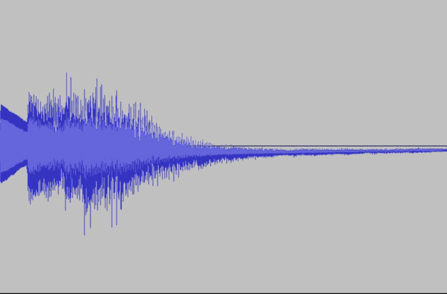
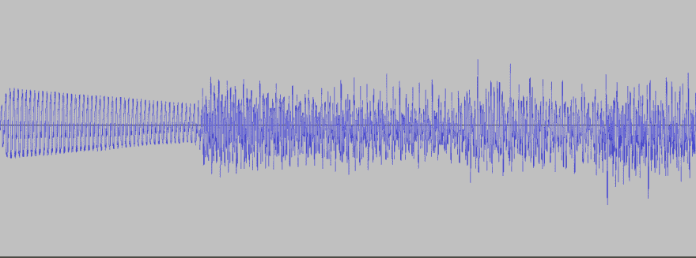
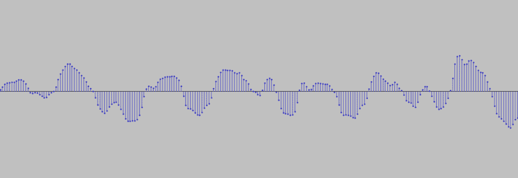
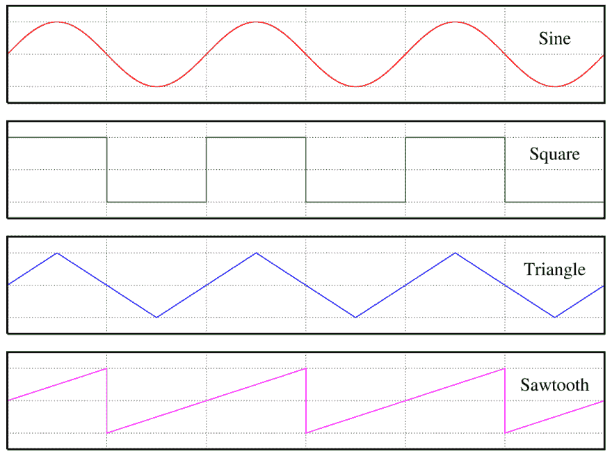
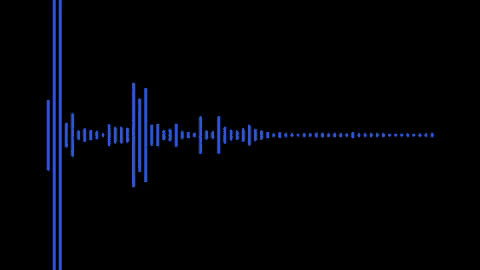

# 带 Web 音频 API 的音频信号处理基本概述

> 原文：<https://dev.to/fihra/basic-overview-of-audio-signal-processing-w-web-audio-api-4n3k>

音频信号处理，这是一个我在这方面找到的大部分材料都是密集信息的主题。简而言之，音频信号是声波的表示，无论它是模拟还是数字源，都被计算和生成以用作应用程序的数据。

它实际上是数字信号处理的一个子课题，数字信号处理是将数据翻译成计算机形式以供使用的主要课题，其中数据可以是语音、成像、电信、地震学、生物医学工程等。

但现在，我想把重点放在数据处理的音频部分。

应用音频信号处理的示例:

*   储存；储备
*   数据压缩
*   音乐信息检索
*   语言处理
*   本地化
*   声波探测
*   播送
*   噪声消除
*   声学指纹
*   声音识别
*   综合
*   增强(均衡、滤波、电平压缩、回声和混响消除或添加等。)

[来源](https://en.wikipedia.org/wiki/Audio_signal_processing)

## 什么是音频信号？

它是声音的表现。有两种不同类型的信号:模拟信号和数字信号。

模拟用符号波表示，用**周期**、**振幅**、**相位**和**频率**描述。

#### 周期-波峰到下一个波峰的长度

#### 振幅-从中心到峰值的高度，最高或最低

#### (相移)-波从其原始位置水平移动的长度

#### 频率-周期发生的次数

[周期、振幅、相位、频率](https://www.mathsisfun.com/algebra/amplitude-period-frequency-phase-shift.html)

下面是一个模拟信号的例子，来自我为我正在开发的业余游戏设计的音效:

[](https://res.cloudinary.com/practicaldev/image/fetch/s--8lK9Xjd7--/c_limit%2Cf_auto%2Cfl_progressive%2Cq_auto%2Cw_880/https://thepracticaldev.s3.amazonaws.com/i/uem1weiln5gpx6ii4a43.png)

让我们放大一些:

[](https://res.cloudinary.com/practicaldev/image/fetch/s--F8uzY6ZW--/c_limit%2Cf_auto%2Cfl_progressive%2Cq_auto%2Cw_880/https://thepracticaldev.s3.amazonaws.com/i/w736eshdutfxshdljcr0.png)

还有一点:

[](https://res.cloudinary.com/practicaldev/image/fetch/s--zRD0id31--/c_limit%2Cf_auto%2Cfl_progressive%2Cq_auto%2Cw_880/https://thepracticaldev.s3.amazonaws.com/i/s62l08wozmhubuvgq2mt.png)

再来一个:

[](https://res.cloudinary.com/practicaldev/image/fetch/s--NpSw8E46--/c_limit%2Cf_auto%2Cfl_progressive%2Cq_auto%2Cw_880/https://thepracticaldev.s3.amazonaws.com/i/lqy3qp6qq8q51ugv2pja.png)

在此回顾中查看音频数据，我们实际上可以看到线条变得比波浪线更加坚实。有了数据的这种表示，它可以被翻译和解释为现在要用计算机处理的数字数据。这主要表现为正弦波。

数字用方波表示。它以二进制形式传送数据。它用比特率和比特间隔来描述。正如您所看到的正弦波的不同之处，方波更加直截了当，没有曲线和斜率。这意味着声音将被切断，没有稳定的进展。代表方波的一个很好的例子是合成器音乐。合成器是一个电子键盘，播放一个音符，你可以立即听到高增益或高音量的声音，当释放音符时，它会立即切断。

比较模拟信号和数字信号的一个很好的类比是:

模拟就像人的声音，你可以控制你的音量、速度和清晰度等。

数码就像是立即在电吉他上弹一个音符(除非你用音量旋钮控制音量)。

[模拟与数字信号](https://techdifferences.com/difference-between-analog-and-digital-signal.html)

现在我提到的 ***正弦波*** 和 ***方波*** 波，其实还有两种更叫 ***锯齿波*** 和 ***三角波*** 波。这是的四种基本波形

[](https://res.cloudinary.com/practicaldev/image/fetch/s--9H-1uka6--/c_limit%2Cf_auto%2Cfl_progressive%2Cq_auto%2Cw_880/https://thepracticaldev.s3.amazonaws.com/i/vrk8y0i2vsn5wgra4nfd.png)

## 是什么处理？

至此，我们可以介绍一下 Web Audio API，它检索和操作音频数据，作为处理音频信号的一个例子。

[听不同波形的声音](https://en.audiofanzine.com/getting-started/editorial/articles/in-search-of-the-perfect-wave.html)

```
//using AudioContext method from Web Audio API
var audioContext = new AudioContext();

//Apply the createOscillator method to osc variable
let osc;
osc = audioContext.createOscillator();

//Assign the type of waveform as "sine"
osc.type = "sine";

//Apply the frequency value to 440
osc.frequency.value = 440;

//connect osc to the destination
osc.connect(audioContext.destination);

//output sound
osc.start(audioContext.currentTime); 
```

<svg width="20px" height="20px" viewBox="0 0 24 24" class="highlight-action crayons-icon highlight-action--fullscreen-on"><title>Enter fullscreen mode</title></svg> <svg width="20px" height="20px" viewBox="0 0 24 24" class="highlight-action crayons-icon highlight-action--fullscreen-off"><title>Exit fullscreen mode</title></svg>

嘿！我们听到声音了！您听到的是 440hz 的正弦波或音符值“a”

在这个例子中，我们正在创建一个音频信号，它是振荡器并给出波形类型。我们通过给定频率值 440 来操纵振荡器。你可以调整音频的其他部分，比如调整增益或音量的振幅。

音频频谱是为视觉显示操纵音频信号的另一种方式。它读取频率和振幅，以控制每个条形的形状。

[](https://res.cloudinary.com/practicaldev/image/fetch/s--wsZTx9T7--/c_limit%2Cf_auto%2Cfl_progressive%2Cq_66%2Cw_880/https://res.cloudinary.com/practicaldev/image/fetch/s--JW699Bwz--/c_limit%252Cf_auto%252Cfl_progressive%252Cq_66%252Cw_880/https://gifimage.net/wp-content/uploads/2018/10/audio-spectrum-gif-5.gif)

这只是对音频信号处理的介绍。我想就这个话题写另一篇博客，因为有太多关于音频软件的东西需要学习。我希望我的博客有助于理解音频在技术中的用途和力量。

如果你对软件中音频的话题还比较好奇，可以去看看从音频信号处理中分支出来的其他相关话题:
-离散傅立叶变换
-快速傅立叶变换
-频谱分析仪
-游戏音频实现
-声音理论

这里有一些关于音频信号处理的更多主题的链接。

https://www . video maker . com/article/c04/18241-know-your-audio-signal-processing-techniques

[https://cs.wellesley.edu/~cs110/reading/sound-files/](https://cs.wellesley.edu/%7Ecs110/reading/sound-files/)

[https://www . Java point . com/difference-between-analog-signals-and-digital-signals](https://www.javatpoint.com/difference-between-analog-signals-and-digital-signals)