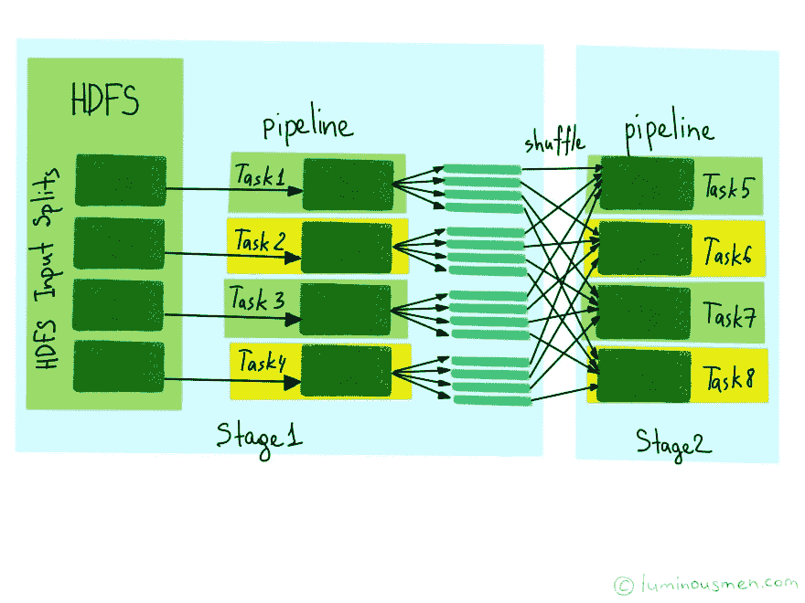

# 火花。Spark 应用剖析

> 原文：<https://dev.to/luminousmen/spark-anatomy-of-spark-application-i1j>

[Apache Spark](https://spark.apache.org/) 被认为是对大数据原创技术 [Hadoop](https://hadoop.apache.org/) 的有力补充。Spark 是一款更易于使用、功能更强大、性能更强的大数据工具，用于应对各种大数据挑战。它已经成为所有主要行业的主流和最受欢迎的大数据框架。从 2.0 开始，Spark 已经成为 Hadoop 的一部分。并且是对 Python 大数据工程师最有用的技术之一。

这一系列的文章是提供 spark 架构概述的一站式资源，对于希望学习 spark 的人来说很有帮助。

整个系列:

*   [关于 Hadoop 和 YARN 成为 Spark 开发者你需要知道的事情](https://luminousmen.com/post/hadoop-yarn-spark)
*   [Spark 核心概念讲解](https://luminousmen.com/post/spark-core-concepts-explained)
*   [火花。Spark 应用剖析](https://luminousmen.com/post/spark-anatomy-of-spark-application)

* * *

## 建筑

[](https://res.cloudinary.com/practicaldev/image/fetch/s--7sHF8eJJ--/c_limit%2Cf_auto%2Cfl_progressive%2Cq_auto%2Cw_880/https://thepracticaldev.s3.amazonaws.com/i/txybfmrq5sa0mphq4q86.jpg)

spark 应用程序的组件包括:

*   驾驶员
*   应用程序主机
*   火花上下文
*   实施者
*   集群资源管理器(又名集群管理器)

Spark 使用一个主/从架构，带有中央协调器，名为**驱动程序**，以及一组可执行的工作进程，名为**执行器**，它们位于不同的集群节点上。

### 司机

驱动程序(也称为应用程序的驱动程序进程)负责将用户应用程序转换成称为**任务**的更小的执行单元，然后调度它们在执行器上运行。驱动程序还负责执行 spark 应用程序，并将状态/结果返回给用户。

火花驱动器包含各种组件—`DAGScheduler`、`TaskScheduler`、`BackendScheduler`和`Block Manager`。它们负责将用户代码翻译成在集群上执行的实际 spark 作业。

其他驱动程序属性:

*   可以在一个独立的进程中运行，或者在一个工作节点上实现高可用性(HA)；
*   存储关于所有弹性分布式数据库及其分区的元数据；
*   一旦用户向集群管理器(在我们的例子中是 YARN)提交 spark 应用程序，就会创建一个。
*   在他自己的 JVM 中运行；
*   优化转换的逻辑 DAG，并在可能的情况下将它们组合成阶段；
*   显示 Spark WebUI 的应用程序详细信息；

### 申请主

正如我们在[第一篇文章](https://luminousmen.com/post/hadoop-yarn-spark)中所描述的，应用程序主机是一个特定于框架的实体，其任务是协商来自资源管理器的资源，并与节点管理器一起执行和监控应用程序任务。

当用户使用`spark-submit`提交 Spark 应用程序时，Spark Master 与同一节点上的驱动程序同时创建(在集群模式下)。

驱动程序将执行器对应用程序的要求通知给应用程序主设备，应用程序主设备与资源管理器协商资源以托管这些执行器。

在独立模式下，Spark Master 扮演集群管理器的角色。

### 火花语境

Spark 上下文是 Spark 功能的主要入口点，因此是任何 Spark 应用程序的核心。它允许 Spark Driver 通过集群资源管理器访问集群，并可用于在集群上创建 rdd、[累加器和广播变量](https://spark.apache.org/docs/2.2.0/rdd-programming-guide.html#shared-variables)。Spark Context 还通过定期发送心跳消息来跟踪实时执行器。

当用户第一次提交 Spark 应用程序时，Spark 驱动程序为每个 Spark 应用程序创建 Spark 上下文。它存在于 spark 应用程序的整个生命周期中。

一旦 spark 应用程序完成，Spark 上下文就终止。每个 JVM 只能有一个 Spark 上下文是活动的。在创建新的 Spark 上下文之前，您必须`stop()`激活 Spark 上下文。

### 集群资源管理器

分布式 Spark 应用程序中的集群管理器是在集群工作节点上以容器的形式监视、管理和保留资源的进程。这些容器是应应用程序主机的请求而保留的，并在释放或可用时分配给应用程序主机。

一旦集群管理器分配了容器，应用程序主机将容器的资源提供回 Spark 驱动程序，Spark 驱动程序将负责执行 Spark 应用程序的各个阶段和任务。

### 执行者

执行者是工作节点上的进程，其工作是执行分配的任务。这些任务在 worker 节点的分区 rdd 上执行，然后将结果返回给 Spark 驱动程序。

执行器在 Spark 应用程序开始时启动一次，然后在应用程序的整个生命周期中运行。这种现象被称为“执行器的静态分配”。然而，用户也可以选择动态分配执行器，其中他们可以动态地添加或删除 spark 执行器，以匹配整体工作负载。即使 Spark 执行器失败，Spark 应用程序也可以继续运行。

执行器为 Spark 应用程序中缓存(本地)的 RDD 分区提供内存存储(通过`BlockManager`)。

其他执行者属性:

*   将数据存储在 JVM 堆或硬盘的缓存中
*   从外部来源读取数据
*   将数据写入外部源
*   执行所有数据处理

## 火花应用运行步骤

在这个理解水平上，让我们创建并分解一个最简单的 spark 应用程序。

```
 from pyspark.sql import SparkSession

    # initialization of spark context
    conf = SparkConf().setAppName(appName).setMaster(master) 
    sc = SparkSession\
            .builder\
            .appName("PythonWordCount")\
                    .config(conf=conf)
            .getOrCreate()

    # read data from HDFS, as a result we get RDD of lines
    linesRDD = sc.textFile("hdfs://...")

    # from RDD of lines create RDD of lists of words 
    wordsRDD = linesRDD.flatMap(lambda line: line.split(" ")

    # from RDD of lists of words make RDD of words tuples where 
    # the first element is word and the second is counter, at the
    # beginning it should be 1
    wordCountRDD= wordsRDD.map(lambda word: (word, 1))

    # combine elements with the same word value
    resultRDD = wordCountRDD.reduceByKey(lambda a, b: a + b)

    # write it back to HDFS
    resultRDD.saveAsTextFile("hdfs://...")
    spark.stop() 
```

<svg width="20px" height="20px" viewBox="0 0 24 24" class="highlight-action crayons-icon highlight-action--fullscreen-on"><title>Enter fullscreen mode</title></svg> <svg width="20px" height="20px" viewBox="0 0 24 24" class="highlight-action crayons-icon highlight-action--fullscreen-off"><title>Exit fullscreen mode</title></svg>

[](https://res.cloudinary.com/practicaldev/image/fetch/s--05LSscSA--/c_limit%2Cf_auto%2Cfl_progressive%2Cq_auto%2Cw_880/https://thepracticaldev.s3.amazonaws.com/i/nm3ksw256jyrmpc6mid7.jpg)

1.  当我们通过集群模式提交 Spark 应用程序时，`spark-submit` utility 将与集群资源管理器交互来启动应用程序主机。
2.  资源管理器负责分配启动应用程序主机所需的容器。然后，资源管理器启动应用程序主机。
3.  应用程序主机在资源管理器上注册自己。注册允许客户程序向资源管理器请求特定的信息，这允许它直接与它自己的应用主机通信。
4.  下一个 Spark 驱动程序在应用程序主容器上运行(在集群模式下)。
5.  驱动程序隐式地将包含转换和操作的用户代码转换成一个逻辑计划，称为 RDDs 的 DAG。所有 rdd 都是在驱动程序上创建的，在调用 action 之前不做任何事情。在这一步，驱动程序还执行优化，如流水线转换。
6.  之后，它将 DAG 转换为物理执行计划。在转换成物理执行计划后，它在每个阶段下创建称为任务的物理执行单元。
7.  现在，驱动程序与集群管理器对话并协商资源。然后，集群管理器将分配容器，在所有分配的容器上启动执行器，并分配任务以代表驱动程序运行。当执行者开始时，他们向驱动程序注册自己。因此，驱动程序将有一个正在执行任务的执行器的完整视图。
8.  此时，驱动程序将根据数据放置将任务发送给执行器。集群管理器负责在构成集群的工作机之间调度和分配资源。此时，驱动程序根据数据放置向集群管理器发送任务。
9.  在成功接收到容器后，应用主机通过向节点管理器提供容器配置来启动容器。
10.  在容器内部，用户应用程序代码开始运行。它向应用主机提供信息(执行阶段、状态)。
11.  因此，在这一步，我们将真正开始执行我们的代码。我们的第一个 RDD 将通过从 HDFS 并行读取数据到不同节点上的不同分区来创建。所以每个节点都有一个数据子集。
12.  在读取数据之后，我们有两个映射转换，它们将在每个分区上并行执行。
13.  然后我们有一个`reduceByKey`转换，它不是像`map`那样的标准管道操作，因此它将创建一个额外的阶段。它组合具有相同键的记录，然后在节点(shuffle)和分区之间移动数据，将相同记录的键组合在一起。
14.  然后我们有了动作操作——写回 HDFS，这将触发整个 DAG 执行。
15.  在用户应用程序执行期间，客户端与应用程序主机通信以获得应用程序的状态。
16.  当应用程序已经完成执行并且所有必要的工作已经完成时，应用程序主机从资源管理器注销并关闭，释放其容器用于其他目的。

* * *

**感谢您的阅读！**

有什么问题吗？请在下面留下您的评论，开始精彩的讨论！

查看我的博客或来打个招呼👋在[推特](https://twitter.com/luminousmen)或订阅[我的电报频道](https://t.me/iamluminousmen)。
做好你的计划！