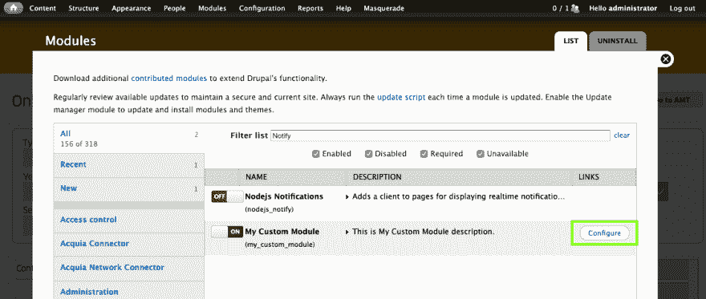

# Drupal 的定制模块配置表单

> 原文：<https://dev.to/lukas238/custom-module-configuration-form-for-drupal-j0b>

最近，我发现自己需要在 Drupal 7 中为自定义模块添加一个配置页面。

该模块用于向用户发送每日电子邮件通知，但是像收件人列表电子邮件地址这样的设置是硬编码在代码中的。

为了更新这个列表，我被迫更新代码库并在产品上进行部署。所以这并不理想。

[](https://res.cloudinary.com/practicaldev/image/fetch/s--3Za5ptcc--/c_limit%2Cf_auto%2Cfl_progressive%2Cq_auto%2Cw_880/https://i.imgur.com/p1MJTSh.png)

因此，我将自己投入到学习如何通过添加自定义模块自己的配置页面来改进自定义模块的任务中。

最后，阅读相关文档、实现代码和执行相关测试只花了几个小时。

# TL；速度三角形定位法(dead reckoning)

您可以直接跳到以下链接上的文档:

*   Drupal 7 HowTos -创建定制模块:[https://www.drupal.org/docs/7/creating-custom-modules](https://www.drupal.org/docs/7/creating-custom-modules)
    *   准备模块配置表单:[https://www . Drupal . org/docs/7/creating-custom-modules/preparing-for-a-module-configuration-form](https://www.drupal.org/docs/7/creating-custom-modules/preparing-for-a-module-configuration-form)
    *   创建配置表单:[https://www . Drupal . org/docs/7/creating-custom-modules/creating-the-configuration-form](https://www.drupal.org/docs/7/creating-custom-modules/creating-the-configuration-form)
    *   验证数据:[https://www . Drupal . org/docs/7/creating-custom-modules/validating-the-data](https://www.drupal.org/docs/7/creating-custom-modules/validating-the-data)
*   Drupal 7 表单 API:[https://API . Drupal . org/API/Drupal/developer % 21 topics % 21 forms _ API _ reference . html/7 . x](https://api.drupal.org/api/drupal/developer%21topics%21forms_api_reference.html/7.x)

# 先决条件

您将需要一个 Drupal 实例，已经为它创建了一个自定义模块，您也可以访问源代码。

# 如何

所有步骤都将应用于模块的`.module`文件，除了步骤#2 将应用于模块的`.info`文件。

## 1。添加新菜单项

```
/**
 * Implements hook_menu().
 */
function my_custom_module_menu()
{
    $items = array();

    $items['admin/modules/my_custom_module'] = array(
        'title' => 'My Custom Module configuration',
        'description' => 'Configuration for My Custom Module',
        'page callback' => 'drupal_get_form',
        'page arguments' => array('my_custom_module_admin'),
        'access arguments' => array('administer site configuration'),
        'type' => MENU_NORMAL_ITEM,
    );

    return $items;
} 
```

对于这个例子，自定义模块名是`my_custom_module`，所以 hook_menu 函数名必须是`my_custom_module_menu`。

*   我们在菜单上增加了一个新的$项目。键值是这个新页面的主菜单的路径(在这个例子中是`admin/modules/my_custom_module`)。
*   `page arguments`值指向将用于填充表单的函数(在本例中为`my_custom_module_admi`)。我们将在下一步构建这个函数。
*   `access arguments`值用于确定谁有权访问该菜单项。

## 2。在模块描述中添加配置链接

[](https://res.cloudinary.com/practicaldev/image/fetch/s--Gb0yPTY---/c_limit%2Cf_auto%2Cfl_progressive%2Cq_auto%2Cw_880/https://i.imgur.com/aGWRIUz.png)

在自定义模块描述页面上添加配置链接很简单，只需将这一行添加到。信息模块文件:

```
configure = admin/modules/my_custom_module 
```

> 这与我们在步骤#1 中使用的菜单路径相同。

## 3。向表单添加项目

```
function my_custom_module_admin($form, &$form_state)
{

    // EMAILS Fieldset
    $form['my_custom_module_settings__emails'] = array(
        '#type' => 'fieldset',
        '#title' => t('Email account settings'),
    );

    // From
    $form['my_custom_module_settings__emails']['my_custom_module_settings__emails__from'] = array(
        '#type' => 'textfield',
        '#title' => t('From address'),
        '#default_value' => variable_get('my_custom_module_settings__emails__from', false),
        '#description' => t('Email address to be used as FROM and Reply-To.'),
        '#required' => true,
    );
    // To
    $form['my_custom_module_settings__emails']['my_custom_module_settings__emails__to'] = array(
        '#type' => 'textarea',
        '#title' => t('To address'),
        '#default_value' => variable_get('my_custom_module_settings__emails__to', false),
        '#description' => t('Recipient email address. You can add multiple email addresses by separating them by a colon (,) character.'),
        '#required' => true,
    );

    return system_settings_form($form);
} 
```

使用 Drupal form API 文档向表单添加条目非常简单。

*   在这个例子中，我们可以找到一个字段集，并包含两个电子邮件字段。第一个是表单地址的输入文本字段，第二个是多个收件人电子邮件地址的文本区域。
*   在所有的`#default_value`参数中，我们利用 Drupal 函数`variable_get`来检索该字段最后保存的值。
*   该字段的名称是您在$form 数组中指定的名称。因此，对于`$form['my_custom_module_settings__emails']['my_custom_module_settings__emails__to']`，变量名将是`my_custom_module_settings__emails__to`。
*   最后一行`return system_settings_form($form);`将在提交时保存表单值。

## 4。添加自定义验证

```
function my_custom_module_admin_validate($form, &$form_state)
{

    $from = $form_state['values']['my_custom_module_settings__emails__from'];
    if (!filter_var($from, FILTER_VALIDATE_EMAIL)) {
        form_set_error('my_custom_module_settings__emails__from', t('You must enter a valid FROM email address.'));
    }

    $to = $form_state['values']['my_custom_module_settings__emails__to'];
    echo $to;
    $to = explode(',', $to);
    for ($i = 0; $i < count($to); $i++) {
        $address = trim($to[$i]);
        if (!filter_var($address, FILTER_VALIDATE_EMAIL)) {
            form_set_error('my_custom_module_settings__emails__to', t('You must enter a valid TO email address.'));
            break; //Exit the For/Loop on first error
        }
    }
} 
```

虽然像' #required '这样的字段参数将负责像使字段成为必填字段一样的基本验证，但有些字段可能需要更复杂的检查。

您可以添加一个函数名为`my_custom_module_admin_validate`的验证挂钩，并添加您自己的验证。

*   所有表单字段值将在`$form_state['values']`中可用。
*   您可以验证多个字段，并通过使用 Drupal 函数`form_set_error`单独返回错误。

* * *

就这些。编码快乐！