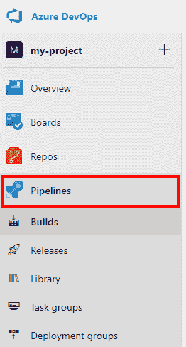
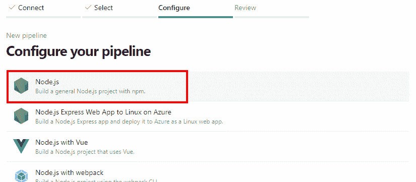
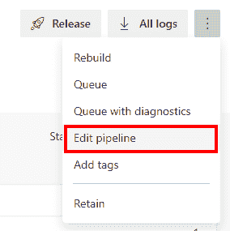
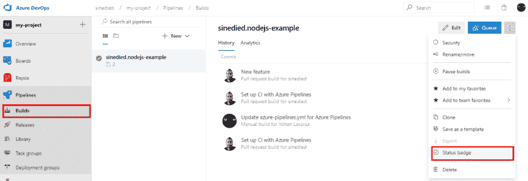
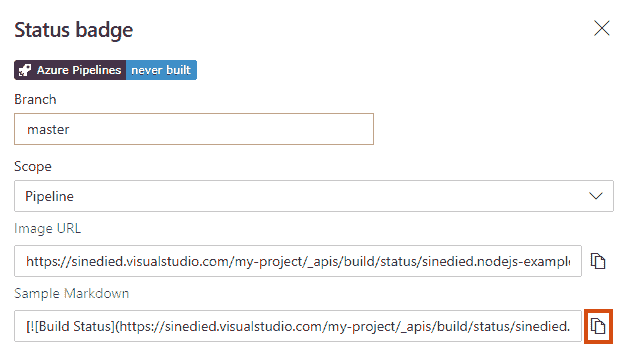
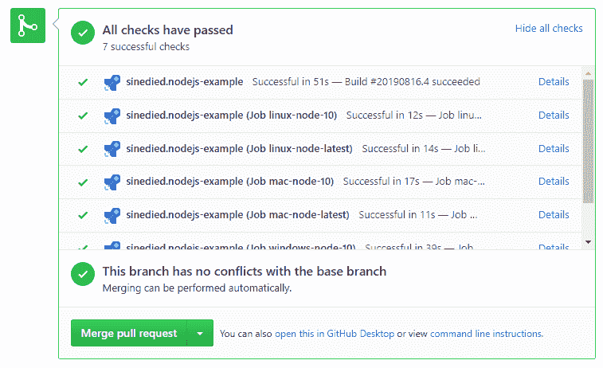

# 开源项目的终极(免费)CI/CD

> 原文：<https://dev.to/itnext/the-ultimate-free-ci-cd-for-your-open-source-projects-3bkd>

我花了大部分空闲时间在 GitHub 上开发开源软件(OSS ),我这么做(大部分)是为了好玩和学习新东西。但是我可以告诉你的是，浪费时间去寻找我无法复制的虫子一点也不好玩...或者与应该帮助你的工具斗争，比如你的持续集成(CI)系统。

您是否想过应该在哪个 CI/CD 解决方案上投入时间？你来对地方了！

> *强制披露:我现在为微软工作，但我在换工作之前就开始考虑 CI 迁移方式，我并没有被强迫这样做。我在 OSS 项目上的经验可以追溯到我现在的工作之前，我试图在这篇文章中提出我作为 OSS 维护者的真实反馈。*

## TL；速度三角形定位法(dead reckoning)

*   如果你打算长期维护一个开源项目，你必须做的是**自动化**
*   浪费时间的最糟糕的方式是当你的自动化构建没有像预期的那样工作时:剥落、不可靠的构建和跨平台的问题可能(将会)让你发疯
*   实用主义应该是你的主要驱动力，寻求用最少的时间完成工作

基于此，我发现 [Azure Pipelines](https://azure.microsoft.com/services/devops/pipelines/?WT.mc_id=devto-blog-yolasors) 目前提供了我认为最好的*时间投资/收益*比率。

一旦 [GitHub Actions CI/CD](https://github.blog/2019-08-08-github-actions-now-supports-ci-cd/?WT.mc_id=devto-blog-yolasors) 解决方案面向所有人推出(计划于 11 月 13 日推出)，这种情况可能会改变。但在那之前，我会坚持使用一个经过测试的&解决方案，它能让我花更多的时间和我爱的人在一起，而不是和构建问题做斗争🍸

## 在这里你会学到什么？

*   如何为 GitHub 上的开源项目设置 Azure Pipelines
*   为什么它可以帮助您节省一些有限的 OSS 工作时间

如果你不喜欢背后的故事，你可以[直接进入行动](#lets-do-it)。

## 完整的故事

我在 GitHub 上维护多个开源项目已经有几年了，这些年来我得出了这样一个结论:

*   🔥做一名维护者很难*(不开玩笑！)*
*   ⏲它占用了你大量的空闲时间*(有时你可能更喜欢和家人朋友在一起)*
*   😭为了在短期内赢得时间而走捷径几乎总是会导致在长期内损失大量时间*(就像任何软件项目一样)*

玩笑归玩笑，最后一点很容易被忽略，我因为没有添加适当的测试或 CI 而多次陷入其中，比如:

> “我这么做主要是为了自己，但我会分享它，以防对其他人有用”

### 糟糕，没想到会这样😱

大错特错。一旦问题和公关来了，就太晚了。
审查、测试和部署来自贡献者的补丁和新特性变成了浪费时间的黑洞。

<figure>

[](https://res.cloudinary.com/practicaldev/image/fetch/s--HqLhuTB---/c_limit%2Cf_auto%2Cfl_progressive%2Cq_auto%2Cw_880/https://raw.githubusercontent.com/sinedied/articles/master/articles/oss/azure-pipelines-for-oss/assets/free-time-hole.jpg)

<figcaption>Black hole by Event Horizon Telescope Collaboration, [CC BY 4.0](https://creativecommons.org/licenses/by/4.0/) // Altered with my awesome Paint skills</figcaption>

</figure>

但是在几个项目之后，你可能不会再犯这样的错误，并且像我一样建立了一个最小的 CI 渠道😎

### 然后就没事了。不知何故。

几年前，如果你想为一个开源项目获得一个免费的托管 CI 解决方案，并没有太多的选择。我很高兴一些解决方案的存在，因为它是，嗯...免费。

这就是我如何最终使用最流行的解决方案，如 [Travis CI](https://travis-ci.org) 、 [AppVeyor](https://www.appveyor.com) 和 [CircleCI](https://circleci.com) 。每一个都满足特定的需求，但不幸的是，没有一个是完美的。

| 服务 |  | OSS 层 |
| --- | --- | --- |
| 特拉维斯·CI | 在 GitHub 上开始使用配置项的最简单和最常见的方式。 | 5 个并发任务在*所有*你的库
Linux + Mac 构建之间共享 |
| 应用程序供应商 | 很长一段时间，它是唯一一个为 Windows 版本提供免费层的 CI 平台。 | 1 个并发作业
Windows + Linux 构建。 |
| 绕圈圈圈圈圈圈圈圈圈圈圈圈圈圈圈圈圈圈圈圈圈圈圈圈圈圈圈圈圈圈圈圈圈圈圈圈圈圈圈圈圈圈圈圈圈圈圈圈 | 这三个解决方案中最灵活的，因为您可以使用自己的容器，但是它的设置也是最复杂的 | 1 个并发作业
1000 分钟/月构建
仅 Linux 构建 |

#### 红色构建和发布

对于大多数简单的项目，使用这些解决方案可能就足够了。但是随着时间的推移，我遇到了一系列的问题，随着我的项目的复杂性而增长。

##### 构建矩阵

首先是环境问题:我在 Mac OS 上开发，CI 在 Linux 上运行...问题出现在 Windows 上。就这样，我像很多项目一样，最终使用了 Travis CI + AppVeyor 的组合。

然后是兼容多个平台版本的问题。例如，一个支持 Node.js `>= 8`的项目在所有 LTS 版本以及最新的稳定版本上进行测试将是明智的:这将意味着此时的`8.x`、`10.x`和`12.x`。

几乎所有 CI 服务都支持这些用例的构建矩阵定义，所以这很好。

但是当你开始有*多个项目*并且每个项目都有*多个构建*时，总的构建时间开始成为一个问题:我已经不得不等了好几天了。)能够合并一些 pr，因为许多 pr 同时参与不同的项目(并且所有 pr 共享相同的工人限制)。当你的管道已经很长了(比如一个公关项目需要 1 个小时)，它很快就会出问题。

##### 不确定性不受欢迎

最后，还有一个最可怕的问题，它白白花费了我生命中无数的时间:脆弱的构建😱。

[](https://res.cloudinary.com/practicaldev/image/fetch/s--9ZE_LtOO--/c_limit%2Cf_auto%2Cfl_progressive%2Cq_auto%2Cw_880/https://raw.githubusercontent.com/sinedied/articles/master/articles/oss/azure-pipelines-for-oss/assets/matrix-fight.jpg)

有时，由于*没有好的理由*，你的一个或多个构建失败了。您(或您的贡献者)会浪费时间调查问题，发现 CI 服务是问题，而不是代码。

如果只是偶尔发生一次，而你对此感到怀疑，你只需重新开始构建，它就通过了。但有时不会，这使您花费宝贵的时间来尝试修复配置项，因为:

*   一个不幸的更新(bug)被推了出来(*倒楣的事情发生了*，但是它曾经存在了几个星期)
*   构建容器映像被调整(您的 CI 会💥)
*   *“我们目前遇到技术困难”*
*   没有理由...😞

久而久之，这会让你对自己的 CI 产生戒心，这不是一件好事。

我知道我可能问得太多了，大多数 OSS 项目使用这些解决方案都很好。公平地说，鉴于所有这些服务都是免费提供的，很难有什么可抱怨的。

### 遇见蔚蓝的管道

不久前，我发现 JHipster 已经将其所有 CI 迁移到 T2 Azure Pipelines T3。我知道这个项目很久了，它的 CI 复杂性没有什么可嘲笑的，有很多组合路径和巨大的构建时间。所以这引起了我的兴趣，我试着迁移一些我自己的项目来测试它。

嗯，我很惊讶地看到，与其他解决方案相比，Azure Pipelines 为您提供了相当多的免费内容:

*   它可以面向任何操作系统(Windows/Mac/Linux)
*   速度很快(OSS 层每个组织 10 名 parallels 员工)
*   这似乎更可靠(根据我自己的经验和与 JHipster 维护者的讨论)
*   它很容易设置和运行(虽然比 Travis 复杂一点，但是更灵活)

我从迁移我的一个简单 Node.js 项目的测试开始。现有的 Travis/AppVeyor 组合被替换为一个单一的 Azure 管道，以在 Windows/Mac/Linux 上进行测试，正如在本次 PR 的[中所做的那样。我不得不禁用 git `autocrlf`选项来让](https://github.com/sinedied/smoke/pull/3/files)[更漂亮](https://prettier.io) check 在 Windows 上更开心，但除此之外，移植是微不足道的。

在第一次成功之后，我继续迁移更加复杂和要求更高的 CI，即[发电机-ngx-火箭](https://github.com/ngx-rocket/generator-ngx-rocket)，下面是结果。

|  | 以前 | 在...之后 |
| --- | --- | --- |
| 服务 | Travis + AppVeyor + Circle CI 和自定义 Docker 图像 | 天蓝色管道 |
| 组合 | 40 个构建基于 Travis (Linux * 2 节点版本)
20 个构建基于 AppVeyor (Windows)
1 个构建基于 CircleCI (Android) | 83 个版本(Linux/Windows * 2 节点版本+ Mac/Android) |
| 构建时间 | 约 1 小时用于 PR(约 50 分钟特拉维斯，约 1 小时应用程序，约 5 分钟 CircleCI) | 约 1 小时(如果仅限于之前的 Travis 场景，则约 30 分钟) |

这次迁移并不简单，因为我不得不使用[模板](https://github.com/ngx-rocket/generator-ngx-rocket/blob/master/.ci-templates/test.yml)来生成组合矩阵，但是结果很好:

*   只需管理一个配置(无需为 Android 构建额外的 Docker 映像)
*   同时测试更多组合
*   一些额外的好处，比如将 Android 构建的 apk 直接作为构建工件发布

有了这次经历后，我可以说我现在完全支持 Azure Pipeline，我将继续迁移我的其他存储库👍

> 嘿，等等，但是关于 CI/CD 的新 [GitHub 动作呢？！](https://github.blog/2019-08-08-github-actions-now-supports-ci-cd/?WT.mc_id=devto-blog-yolasors)

我认为它看起来很棒，尤其是 OSS 层😍一旦它在 11 月 13 日对所有人开放，它可能会成为最好的解决方案(在这种情况下，本文将会更新)😉).

不过，有两件事仍然需要考虑 Azure Pipelines:

*   如果你没有被邀请成为 beta 测试者之一，你将暂时不能使用 GitHub 动作。但同时，您可能需要一个有效的 CI 解决方案！
*   GitHub Actions for CI/CD 基于 Azure Pipelines 堆栈的一部分，因此如果您已经在使用后者，迁移应该是轻而易举的事情

## 动手吧！

此时，您可能想亲自尝试一下。我们将完成为 Node.js 项目放置 Azure Pipeline CI 的步骤(如果您使用另一个堆栈，不要走开，这没有太大的不同，我将给出一些提示😉).

您可以在这个存储库上看到一个示例结果[。](https://github.com/sinedied/smoke)

**要求:**

*   一个 [Azure DevOps 账户](https://azure.microsoft.com/services/devops/?WT.mc_id=devto-blog-yolasors)(你可以使用你的 GitHub 账户登录)
*   一个 GitHub 存储库，包含一些您想要自动化的测试

### 1。准备您的存储库

首先，您必须为 CI 准备测试脚本。

对于 Node.js 项目，通常通过在你的`package.json`文件中添加一个`test`脚本来完成:

```
{  "scripts":  {  "test":  "jest"  }  } 
```

<svg width="20px" height="20px" viewBox="0 0 24 24" class="highlight-action crayons-icon highlight-action--fullscreen-on"><title>Enter fullscreen mode</title></svg> <svg width="20px" height="20px" viewBox="0 0 24 24" class="highlight-action crayons-icon highlight-action--fullscreen-off"><title>Exit fullscreen mode</title></svg>

在这个例子中， [Jest](https://jestjs.io) 将用于运行单元测试。

您可以通过运行`npm test`来测试您的脚本，以确保一切正常。

### 2。创建 Azure DevOps 项目

在您的 Azure DevOps 帐户中，创建一个新项目并为其命名:

[](https://res.cloudinary.com/practicaldev/image/fetch/s--zv5zjkJK--/c_limit%2Cf_auto%2Cfl_progressive%2Cq_auto%2Cw_880/https://raw.githubusercontent.com/sinedied/articles/master/articles/oss/azure-pipelines-for-oss/assets/1-create-project.png)

### 3。设置管道

之后，进入左侧的**管线**部分:

[](https://res.cloudinary.com/practicaldev/image/fetch/s--5RaHfAx5--/c_limit%2Cf_auto%2Cfl_progressive%2Cq_auto%2Cw_880/https://raw.githubusercontent.com/sinedied/articles/master/articles/oss/azure-pipelines-for-oss/assets/2-pipelines.png)

然后点击`New pipeline`开始设置过程:

[](https://res.cloudinary.com/practicaldev/image/fetch/s--quHNclM3--/c_limit%2Cf_auto%2Cfl_progressive%2Cq_auto%2Cw_880/https://raw.githubusercontent.com/sinedied/articles/master/articles/oss/azure-pipelines-for-oss/assets/3-new-pipeline.png)

选择`GitHub (YAML)`，然后按照流程将您的帐户与 Azure DevOps 关联:

[](https://res.cloudinary.com/practicaldev/image/fetch/s--3oEBUn0I--/c_limit%2Cf_auto%2Cfl_progressive%2Cq_auto%2Cw_880/https://raw.githubusercontent.com/sinedied/articles/master/articles/oss/azure-pipelines-for-oss/assets/4-github.png)

选择您的存储库，然后在 GitHub 上授权应用程序。

之后，选择第一个`Node.js`选项(或任何其他与您的技术组合相关的选项):

[](https://res.cloudinary.com/practicaldev/image/fetch/s--eMt3VfuD--/c_limit%2Cf_auto%2Cfl_progressive%2Cq_auto%2Cw_880/https://raw.githubusercontent.com/sinedied/articles/master/articles/oss/azure-pipelines-for-oss/assets/5-nodejs.png)

> 对于其他堆栈和语言，如 C#、Java、Go、Python 等，您应该查看文档的[生态系统部分](https://docs.microsoft.com/azure/devops/pipelines/languages/dotnet-core?view=azure-devops&WT.mc_id=devto-blog-yolasors)中的相应页面。你会得到一些具体的提示，告诉你如何用你最喜欢的技术来搭建你的建筑。

你可以在[这个资源库](https://github.com/microsoft/azure-pipelines-yaml/tree/master/templates)里找到很多 YAML 的例子文件。

### 4。自定义 YAML

然后你会在编辑器中看到这个 YAML 文件:

```
# Node.js
# Build a general Node.js project with npm.
# Add steps that analyze code, save build artifacts, deploy, and more:
# https://docs.microsoft.com/azure/devops/pipelines/languages/javascript

trigger:
  - master

pool:
  vmImage: 'ubuntu-latest'

steps:
  - task: NodeTool@0
    inputs:
      versionSpec: '10.x'
    displayName: 'Install  Node.js'

  - script: |
      npm install
      npm run build
    displayName: 'npm  install  and  build' 
```

<svg width="20px" height="20px" viewBox="0 0 24 24" class="highlight-action crayons-icon highlight-action--fullscreen-on"><title>Enter fullscreen mode</title></svg> <svg width="20px" height="20px" viewBox="0 0 24 24" class="highlight-action crayons-icon highlight-action--fullscreen-off"><title>Exit fullscreen mode</title></svg>

现在，你只需要修改最后一部分来运行命令`npm test`而不是`npm run build` :

```
- script: |
    npm install
    npm test
  displayName: 'npm  install  and  test' 
```

<svg width="20px" height="20px" viewBox="0 0 24 24" class="highlight-action crayons-icon highlight-action--fullscreen-on"><title>Enter fullscreen mode</title></svg> <svg width="20px" height="20px" viewBox="0 0 24 24" class="highlight-action crayons-icon highlight-action--fullscreen-off"><title>Exit fullscreen mode</title></svg>

点击`Save and run`，然后选择是直接在`master`上提交还是用 PR 创建一个新分支。

> 我建议您在这个阶段使用 PR 创建一个新的分支，这样您就可以在将构建配置合并到您的存储库中之前对其进行试验。

之后再次点击`Save and run`，然后检查一切运行正常。

### 5。添加构建矩阵

现在你已经有了一个可以工作的 CI，但是使用 Azure Pipelines 的好处之一是你可以很容易地添加跨平台的构建，所以让我们开始吧。

在菜单中选择`Edit pipeline`返回 YAML 编辑器:

[](https://res.cloudinary.com/practicaldev/image/fetch/s--amxwHr7N--/c_limit%2Cf_auto%2Cfl_progressive%2Cq_auto%2Cw_880/https://raw.githubusercontent.com/sinedied/articles/master/articles/oss/azure-pipelines-for-oss/assets/6-edit.png)

首先在你的文件顶部添加这个矩阵:

```
strategy:
  matrix:
    linux-node-10:
      imageName: 'ubuntu-latest'
      nodeVersion: '10.x'
    linux-node-latest:
      imageName: 'ubuntu-latest'
      nodeVersion: '>=12.x'
    mac-node-10:
      imageName: 'macos-latest'
      nodeVersion: '10.x'
    mac-node-latest:
      imageName: 'macos-latest'
      nodeVersion: '>=12.x'
    windows-node-10:
      imageName: 'windows-latest'
      nodeVersion: '10.x'
    windows-node-latest:
      imageName: 'windows-latest'
      nodeVersion: '>=12.x' 
```

<svg width="20px" height="20px" viewBox="0 0 24 24" class="highlight-action crayons-icon highlight-action--fullscreen-on"><title>Enter fullscreen mode</title></svg> <svg width="20px" height="20px" viewBox="0 0 24 24" class="highlight-action crayons-icon highlight-action--fullscreen-off"><title>Exit fullscreen mode</title></svg>

这将允许您的测试在 Windows、Linux 和 Mac OS 上运行，每次使用 2 个不同的 Node.js 版本，总共 6 个构建。

然后更新`pool`部分，使用当前构建的映像名称:

```
pool:
  vmImage: $(imageName) 
```

<svg width="20px" height="20px" viewBox="0 0 24 24" class="highlight-action crayons-icon highlight-action--fullscreen-on"><title>Enter fullscreen mode</title></svg> <svg width="20px" height="20px" viewBox="0 0 24 24" class="highlight-action crayons-icon highlight-action--fullscreen-off"><title>Exit fullscreen mode</title></svg>

最后更新`node`任务，为 Node.js 版本做同样的事情:

```
- task: NodeTool@0
  inputs:
    versionSpec: $(nodeVersion)
  displayName: 'Install  Node.js' 
```

<svg width="20px" height="20px" viewBox="0 0 24 24" class="highlight-action crayons-icon highlight-action--fullscreen-on"><title>Enter fullscreen mode</title></svg> <svg width="20px" height="20px" viewBox="0 0 24 24" class="highlight-action crayons-icon highlight-action--fullscreen-off"><title>Exit fullscreen mode</title></svg>

点击`Save`，然后`Run`测试更新后的管道，大功告成。

> 如果您在第一次保存管道配置时创建了一个带有 PR 的分支，那么您还需要在 GitHub 上首先合并这个 PR，以便为新的提交和 PR 激活管道。

不要忘记查看完整的[文档](https://docs.microsoft.com/azure/devops/pipelines/?view=azure-devops&WT.mc_id=devto-blog-yolasors)，查看所有可用的任务和功能。

#### 6。添加状态徽章(可选)

[](https://res.cloudinary.com/practicaldev/image/fetch/s--V5lToS8r--/c_limit%2Cf_auto%2Cfl_progressive%2Cq_auto%2Cw_880/https://raw.githubusercontent.com/sinedied/articles/master/articles/oss/azure-pipelines-for-oss/assets/badge.png)

我强烈建议你在你的 GitHub 库上添加一个状态徽章，这样人们就能从你的项目中得到一个积极的信号:

*   它得到了维护，你关心它的质量
*   贡献者可以满怀信心地推动 PRs

为此，请返回到您的管道构建，并单击菜单上的`Status badge`:

[](https://res.cloudinary.com/practicaldev/image/fetch/s--gWMAGQGT--/c_limit%2Cf_auto%2Cfl_progressive%2Cq_auto%2Cw_880/https://raw.githubusercontent.com/sinedied/articles/master/articles/oss/azure-pipelines-for-oss/assets/8-status.png)

然后使用按钮复制 markdown 代码，并将其粘贴到资源库根目录下的`readme.md`文件的顶部:

[](https://res.cloudinary.com/practicaldev/image/fetch/s---xJsB9H_--/c_limit%2Cf_auto%2Cfl_progressive%2Cq_auto%2Cw_880/https://raw.githubusercontent.com/sinedied/articles/master/articles/oss/azure-pipelines-for-oss/assets/9-copy.png)

一旦它被提交到`master`分支，它将在你的项目的 GitHub 文档中可见。徽章状态将根据`master`上的最后一次提交自动更新。

> 要与其他人一起完成这个状态徽章，请查看 [https://shields.io](https://shields.io) 。
> 你甚至可以自己造: [](https://res.cloudinary.com/practicaldev/image/fetch/s--peOUBy7z--/c_limit%2Cf_auto%2Cfl_progressive%2Cq_auto%2Cw_880/https://img.shields.io/badge/badges-are%2520awesome%2520%25F0%259F%2598%258E-blue)

#### 7。享受你的夜晚

就是这样！

一旦新的 commit 或 PR 被推送到您的存储库，CI 将会处理它，并直接在 GitHub 上显示结果:

[](https://res.cloudinary.com/practicaldev/image/fetch/s--qd9zdFDc--/c_limit%2Cf_auto%2Cfl_progressive%2Cq_auto%2Cw_880/https://raw.githubusercontent.com/sinedied/articles/master/articles/oss/azure-pipelines-for-oss/assets/7-pr.png)

现在你可以放松，再次享受你的自由时间🍻。

> 为了让您更加放心，我建议您为您的新配置项启用[必需的状态检查](https://help.github.com/en/articles/enabling-required-status-checks)，以便只有通过所选检查的 pr 才允许合并。

别忘了在评论中分享你的反馈和经验！

## 更进一步

当然，作为一名维护者，你可以做更多的事情来简化你的生活，我将在以后的文章中分享它们。但是我认为 CI 是你在任何项目中首先应该做的事情之一。

你还可以用 Azure Pipelines 做更多的事情*(我在什么地方提到 CD 了吗？但是让我们留着以后再说吧😉。*

* * *

在 Twitter 上关注我，我很乐意讨论并采纳你的建议！