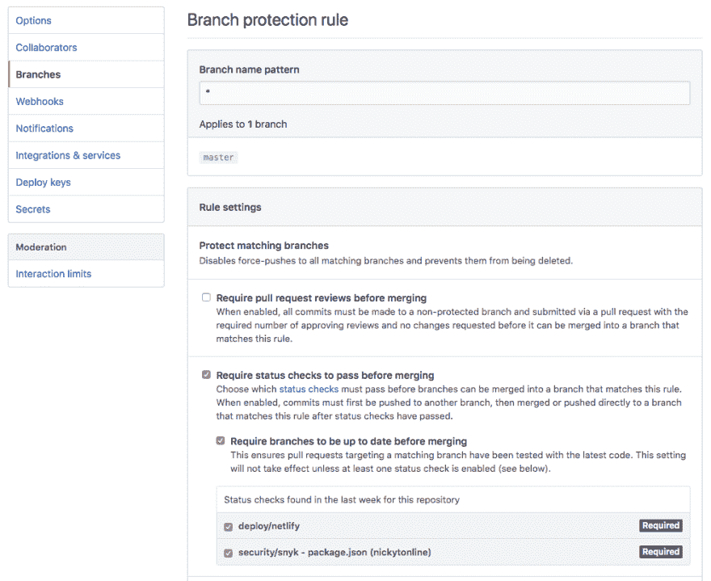
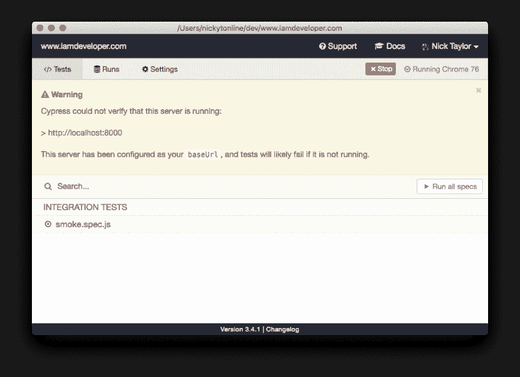
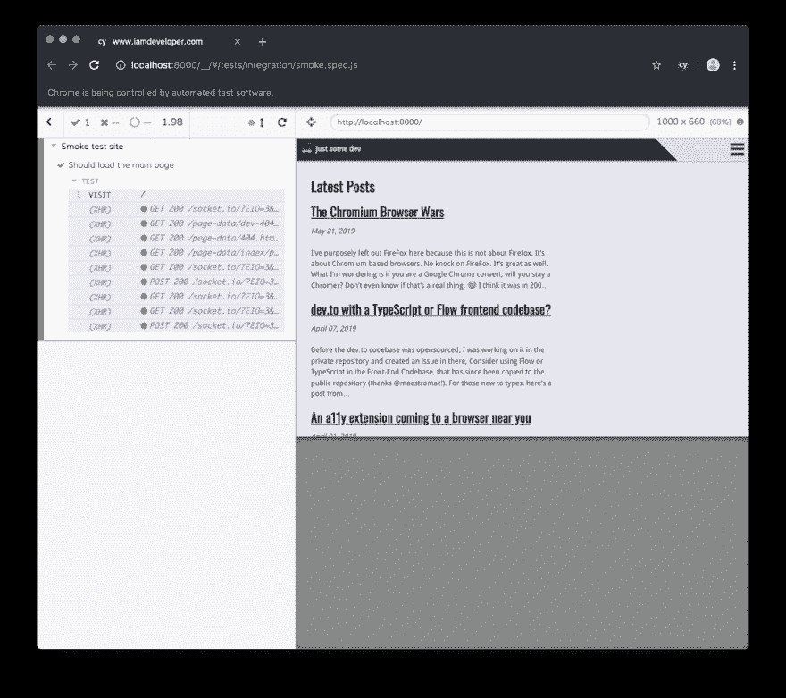

# 用 Dependabot，Cypress 和 Netlify 更新依赖关系

> 原文：<https://dev.to/nickytonline/update-dependencies-with-dependabot-cypress-and-netlify-3lkf>

首先，这篇文章是在一个 JavaScript 项目的背景下发表的，具体来说，就是我的博客[iamdeveloper.com](https://iamdeveloper.com)。

就托管我的网站而言，我使用 [Netlify](https://www.netlify.com) 。他们有很棒的工具，并且很容易设置，以便 PRs 和 push 能够创建部署。如果你想看看 Netlify，我强烈推荐看看他们令人敬畏的[文档](https://www.netlify.com/docs/)。

如果你负责任何存储库，你肯定已经处理了更新你的项目的依赖关系。有很好的工具可以帮你做到这一点。其中一个很棒的工具是[dependent bot](https://dependabot.com)(祝贺[被 GitHub 收购！](https://dependabot.com/blog/hello-github/))。如果你想学习如何设置 Dependabot，请查看他们的[文档](https://dependabot.com/#how-it-works)。Dependabot 在您的存储库中创建拉请求，然后您可以自己合并它们。这就是我所做的，因为我想在合并依赖更新 PR 之前先测试一下。即使已经为您创建了 PRs，这也会变得乏味且耗时。

dependent bot 具有允许 dependent bot 自动合并其生成的 PRs 的设置。这起初听起来很棒，但是并不理想，因为只有单元测试通过(或者没有测试！😱)然后合并不安装很多信心。在休假的时候，我心想，就硬着头皮把 [Cypress](https://cypress.io) 添加到我的[持续集成](https://en.wikipedia.org/wiki/Continuous_integration) / [持续交付](https://en.wikipedia.org/wiki/Continuous_delivery) (CI/CD)管道中进行端到端(e2e)测试吧。我在工作中使用它，它是一个很好的工具。如果你是 Cypress 的新手，我强烈推荐你看看他们的[文档](https://docs.cypress.io)。

液体错误:内部

如果你不熟悉 e2e 测试，基本上他们是你写的测试，就像他们是你网站上的用户一样。例如，e2e 测试可以点击商品并将它们添加到购物车中。对于 Cypress 来说，在开发阶段，他们有一个很棒的任务运行器，可以让你在 Chrome 上运行 e2e 测试(其他浏览器也在路上)。这是一个电子应用程序，为您提供了您在浏览器中习惯使用的开发工具的所有功能。在 CI/CD 的上下文中，当 Cypress 运行时，它针对一个无头浏览器(暂时只针对 Chrome)执行测试。

有了所有这些信息，让我们把所有的碎片放在一起。最后一点是，我的博客运行在盖茨比上，所以一些配置将与盖茨比相关。不管怎样，这篇文章的内容可以应用于其他项目。

## 为 CI/CD 设置存储库

我的网站托管在 [GitHub](https://github.com) 上，所以我们将浏览那里的设置。如果你使用另一个类似 [GitLab](https://gitlab.com) 的服务，设置是相似的。

在存储库主页上，单击“设置”选项卡。在那里，单击分支部分以创建分支保护规则。

[](https://res.cloudinary.com/practicaldev/image/fetch/s--AMdiuwc0--/c_limit%2Cf_auto%2Cfl_progressive%2Cq_auto%2Cw_880/https://dev-to-uploads.s3.amazonaws.com/uploads/articles/h5f02iehfz4jlu2p1dg3.png)

在我的例子中，因为我使用 Netlify 和 [Snyk](https://snyk.io) ，所以我希望在合并之前通过这两个状态检查。点击*保存修改*按钮。

## 把柏树立起来

因为我们目前正在讨论一个 JavaScript 项目，所以让我们添加 npm 脚本来启动和运行 Cypress 进行本地开发。

1.  通过运行`npm install cypress -D` (-D，因为它是一个开发依赖项)安装 Cypress
2.  安装 fkill CLI 包，因为我们也需要运行`npm install fkill-cli -D`
3.  现在让我们向 package.json 添加一些 npm 脚本

```
 "scripts":  {  ...  "prebuild":  "CI=1 npm i cypress",  "e2e":  "cypress run",  "e2e:dev":  "CYPRESS_baseUrl=http://localhost:8000 cypress open"  "build":"gatsby build",  "postbuild":"gatsby serve & npm run e2e && fkill:9000",  "develop":"gatsby develop",  ...  }, 
```

<svg width="20px" height="20px" viewBox="0 0 24 24" class="highlight-action crayons-icon highlight-action--fullscreen-on"><title>Enter fullscreen mode</title></svg> <svg width="20px" height="20px" viewBox="0 0 24 24" class="highlight-action crayons-icon highlight-action--fullscreen-off"><title>Exit fullscreen mode</title></svg>

让我们从`e2e:dev`脚本开始。这个脚本的作用是启动 Cypress 的测试运行程序。这里设置了环境变量`CYPRESS_baseUrl`，因为我们想要覆盖 cypress.json 文件中的值。那里储存的价值是我们将用于 CI/CD 渠道的价值。如果你想了解更多关于 cypress.json 配置文件的信息，可以查看他们的完全管状的[文档](https://docs.cypress.io/guides/references/configuration.html#Options)。

好吧，让我们运行赛普拉斯任务运行程序。从命令行运行`npm run e2e:dev`。通常大约需要 5-10 秒启动。因为这是您第一次运行它，所以 Cypress 将在您的项目根目录下创建一个`cypress`文件夹，其中包含一些示例文件，以便您能够启动并运行它。以后可以随意删除它们，或者把它们作为学习工具。让我们停止任务运行程序。你可以退出它或者简单地从你启动它的命令行按下`CTRL + C`。

在这篇文章中，我们将创建一个简单的测试。让我们在`cypress/integration`文件夹中创建一个名为`smoke.spec.js`的文件。打开文件并添加以下内容:

```
describe('Smoke test site', () => {
    it('Should load the main page', () => {
        cy.visit('/');
    });
}); 
```

<svg width="20px" height="20px" viewBox="0 0 24 24" class="highlight-action crayons-icon highlight-action--fullscreen-on"><title>Enter fullscreen mode</title></svg> <svg width="20px" height="20px" viewBox="0 0 24 24" class="highlight-action crayons-icon highlight-action--fullscreen-off"><title>Exit fullscreen mode</title></svg>

保存文件。因为我们是在 Gatsby 站点的上下文中，所以让我们通过运行`npm run develop`来启动 Gatsby 本地开发服务器。所有这些只是运行下面的 Gatsby CLI 命令，`gatsby develop`。一旦构建了站点，它将在端口 8000(默认)上运行。

让我们通过从命令行运行`npm run e2e:dev`来再次启动任务运行器。在任务运行器中，`smoke.spec.js`现在应该在测试文件列表中。点击它开始运行测试。

[](https://res.cloudinary.com/practicaldev/image/fetch/s--gdrHhmG---/c_limit%2Cf_auto%2Cfl_progressive%2Cq_auto%2Cw_880/https://dev-to-uploads.s3.amazonaws.com/uploads/articles/o2mkg284xtj32alrj0ge.png)

如果你的盖茨比网站正在运行，测试应该通过。

[](https://res.cloudinary.com/practicaldev/image/fetch/s--syfcpbU6--/c_limit%2Cf_auto%2Cfl_progressive%2Cq_auto%2Cw_880/https://dev-to-uploads.s3.amazonaws.com/uploads/articles/5dasrrtove90dbw90718.png)

恭喜，你太棒了。在这一点上，你可以进行更多的测试，如果这些都通过了，你就可以出货了。

此时，我们已经准备好为我们的存储库重新访问我们的 Dependabot 配置。让我们改变设置，以允许我们所有的依赖关系自动 PR 合并(或配置到你喜欢的水平。

[](https://res.cloudinary.com/practicaldev/image/fetch/s--bSAA0e4f--/c_limit%2Cf_auto%2Cfl_progressive%2Cq_auto%2Cw_880/https://dev-to-uploads.s3.amazonaws.com/uploads/articles/y41agaxm0dim2c45ba8h.png)

好了，让我们通过额外的设置让 Cypress 作为 CI/CD 管道的一部分运行。需要`prebuild`脚本，因为至少在 Netlify 上，您不能缓存二进制文件。更多信息见本文[Netlify | Gatsby+Netlify+cypress . io](https://gatsby-blog-0a5be4.netlify.com/test-on-netlify/)测试。

```
 "prebuild":  "CI=1 npm i cypress", 
```

<svg width="20px" height="20px" viewBox="0 0 24 24" class="highlight-action crayons-icon highlight-action--fullscreen-on"><title>Enter fullscreen mode</title></svg> <svg width="20px" height="20px" viewBox="0 0 24 24" class="highlight-action crayons-icon highlight-action--fullscreen-off"><title>Exit fullscreen mode</title></svg>

`e2e`脚本是我们将用来在 CI/CD 管道中运行 Cypress 的。它在一个无头浏览器中运行所有的 e2e 测试文件。

```
 "e2e":  "cypress run", 
```

<svg width="20px" height="20px" viewBox="0 0 24 24" class="highlight-action crayons-icon highlight-action--fullscreen-on"><title>Enter fullscreen mode</title></svg> <svg width="20px" height="20px" viewBox="0 0 24 24" class="highlight-action crayons-icon highlight-action--fullscreen-off"><title>Exit fullscreen mode</title></svg>

`build`脚本是我用来构建我的网站的。它的加入只是为了解释`postbuild`。😉如果您不知道，您可以在 npm 脚本上运行 pre 和 post 脚本。更多信息请参见 [npm 文档](https://docs.npmjs.com/misc/scripts)。

```
 "postbuild":"gatsby serve & npm run e2e && fkill:9000", 
```

<svg width="20px" height="20px" viewBox="0 0 24 24" class="highlight-action crayons-icon highlight-action--fullscreen-on"><title>Enter fullscreen mode</title></svg> <svg width="20px" height="20px" viewBox="0 0 24 24" class="highlight-action crayons-icon highlight-action--fullscreen-off"><title>Exit fullscreen mode</title></svg>

对于我们的`postbuild`脚本，我们希望在容器中运行我们的 Gatsby 站点。 [Gatsby CLI](https://www.gatsbyjs.org/docs/gatsby-cli) 有一堆很棒的命令，包括在端口 9000(默认)启动你的站点的`gatsby serve`。当服务器启动时，我们还想启动 e2e 测试。这就是我们的`e2e`剧本的用武之地。一旦测试在容器中运行完毕(希望成功😉)，我们希望优雅地停止站点。这就是 fkill CLI 派上用场的地方。现在，由于这是一个后期构建步骤，事情将继续在 Netlify 部署土地上进行，最终该网站将上线。对于依赖关系更新的 PR，该检查将通过，因为 Dependabot 被配置为自动合并 PR，所以我们已经实现了依赖关系更新的完全自动化。

[](https://res.cloudinary.com/practicaldev/image/fetch/s--nd3PUX74--/c_limit%2Cf_auto%2Cfl_progressive%2Cq_auto%2Cw_880/https://dev-to-uploads.s3.amazonaws.com/uploads/articles/eot199766u7m1zmipwq4.png)

如果你想在我的网站上看到完整的设置，请查看我在 GitHub 上的资源库。

## [Nicky tonline](https://github.com/nickytonline)/[iamdeveloper.com](https://github.com/nickytonline/iamdeveloper.com)

### 我的网站 iamdeveloper.com 的源代码

<article class="markdown-body entry-content container-lg" itemprop="text">

[](https://app.netlify.com/sites/iamdeveloperdotcom/deploys)

# 欢迎

这是使用[第十一](https://www.11ty.dev/)静态站点生成器构建的尼克·泰勒网站的源代码。它使用的是[安迪·贝尔](https://piccalil.li/)的 [Hylia 模板](https://github.com/hankchizljaw/hylia)。我已经对它做了一些调整，并且随着时间的推移可能会做得更多，但是我只是想为 Andy 令人敬畏的模板欢呼一下。

## 终端命令

### 首先安装依赖项

```
npm install
```

<svg width="20px" height="20px" viewBox="0 0 24 24" class="highlight-action crayons-icon highlight-action--fullscreen-on"><title>Enter fullscreen mode</title></svg> <svg width="20px" height="20px" viewBox="0 0 24 24" class="highlight-action crayons-icon highlight-action--fullscreen-off"><title>Exit fullscreen mode</title></svg>

### 在本地以观察模式服务站点

```
npm start
```

<svg width="20px" height="20px" viewBox="0 0 24 24" class="highlight-action crayons-icon highlight-action--fullscreen-on"><title>Enter fullscreen mode</title></svg> <svg width="20px" height="20px" viewBox="0 0 24 24" class="highlight-action crayons-icon highlight-action--fullscreen-off"><title>Exit fullscreen mode</title></svg>

### 构建网站的生产版本

```
npm run production
```

<svg width="20px" height="20px" viewBox="0 0 24 24" class="highlight-action crayons-icon highlight-action--fullscreen-on"><title>Enter fullscreen mode</title></svg> <svg width="20px" height="20px" viewBox="0 0 24 24" class="highlight-action crayons-icon highlight-action--fullscreen-off"><title>Exit fullscreen mode</title></svg>

#### 在本地测试生产站点

```
cd dist
npx serve
```

<svg width="20px" height="20px" viewBox="0 0 24 24" class="highlight-action crayons-icon highlight-action--fullscreen-on"><title>Enter fullscreen mode</title></svg> <svg width="20px" height="20px" viewBox="0 0 24 24" class="highlight-action crayons-icon highlight-action--fullscreen-off"><title>Exit fullscreen mode</title></svg></article>

[View on GitHub](https://github.com/nickytonline/iamdeveloper.com)