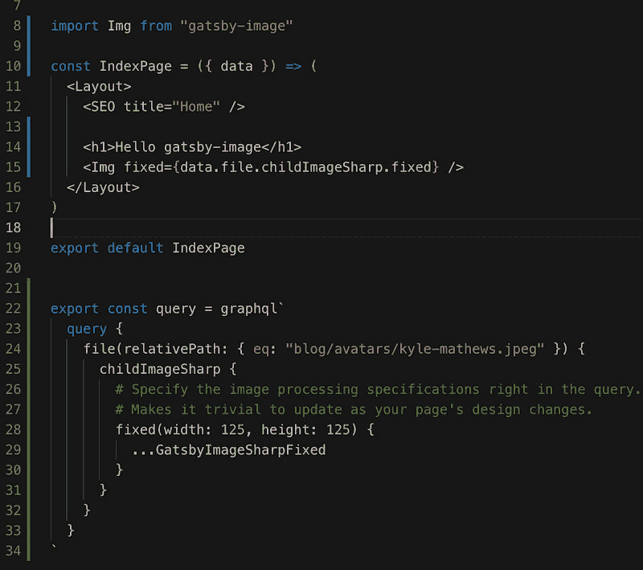
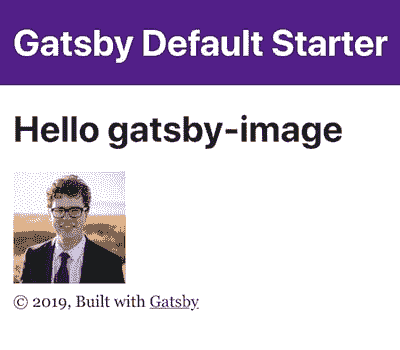

# 清晰地使用盖茨比应用中的图像

> 原文：<https://dev.to/lwz7512/using-image-in-gatsby-application-by-a-clear-way-2a96>

Gatsby 的许多特性赢得了开发人员的喜爱，并且优于其他主流静态站点生成器。其中一个特征就是[盖茨比形象](https://www.gatsbyjs.org/packages/gatsby-image/)组件。它解决了您定义的指定维度范围内的图像优化问题，渐进地、响应性地呈现在网页上，给用户带来舒适的浏览体验。

## 使用盖茨比形象的步骤

正如官方文件所说，在盖茨比网站上实现一个盖茨比形象需要三个步骤:

*   安装 [gatsby-image](https://github.com/gatsbyjs/gatsby/tree/master/packages/gatsby-image) 组件和另外两个构建依赖插件: [gatsby-transformer-sharp](https://www.gatsbyjs.org/packages/gatsby-transformer-sharp/) 和 [gatsby-plugin-sharp](https://www.gatsbyjs.org/packages/gatsby-plugin-sharp/)
*   在 gatsby-source-filesystem 插件中定义镜像源目录，并在`gatsby-config.js`插件部分定义上述两个插件
*   将`gatsby-image`组件导入到 gatsby 页面组件中，并声明一个带有`fixed`或`fluid`属性的图像标签/实例，该属性的值来自 graphql 查询。

在步骤 2 中，您告诉 Gatsby 构建工具，在哪里可以找到所有图像文件的`root`目录。就像 doc 例子一样，这里的根目录是当前 Gatsby 项目的`simg/`:

```
{
  resolve: `gatsby-source-filesystem`,
  options: {
    name: `images`,
    path: path.join(__dirname, `src`, `images`),
  },
}, 
```

<svg width="20px" height="20px" viewBox="0 0 24 24" class="highlight-action crayons-icon highlight-action--fullscreen-on"><title>Enter fullscreen mode</title></svg> <svg width="20px" height="20px" viewBox="0 0 24 24" class="highlight-action crayons-icon highlight-action--fullscreen-off"><title>Exit fullscreen mode</title></svg>

在第 3 步中，您告诉 gatsby-image 组件实例从哪里获取文件:graphql 查询结果。

```
export const query = graphql`
  query {
    file(relativePath: { eq: "blog/avatars/kyle-mathews.jpeg" }) {
      childImageSharp {
        # Specify the image processing specifications right in the query.
        # Makes it trivial to update as your page's design changes.
        fixed(width: 125, height: 125) {
          ...GatsbyImageSharpFixed
        }
      }
    }
  }
` 
```

<svg width="20px" height="20px" viewBox="0 0 24 24" class="highlight-action crayons-icon highlight-action--fullscreen-on"><title>Enter fullscreen mode</title></svg> <svg width="20px" height="20px" viewBox="0 0 24 24" class="highlight-action crayons-icon highlight-action--fullscreen-off"><title>Exit fullscreen mode</title></svg>

## 图像放在哪个目录？

看到这个 graphql 代码片段后，你可能会想`blog/avatars/kyle-mathews.jpeg`在哪里？是在项目根下还是 src/images 下？让我们从一个空白的盖茨比项目中进行测试。

创建盖茨比项目:

```
$ gatsby new using-image-in-gatsby 
```

<svg width="20px" height="20px" viewBox="0 0 24 24" class="highlight-action crayons-icon highlight-action--fullscreen-on"><title>Enter fullscreen mode</title></svg> <svg width="20px" height="20px" viewBox="0 0 24 24" class="highlight-action crayons-icon highlight-action--fullscreen-off"><title>Exit fullscreen mode</title></svg>

将 kyle-mathews.jpeg 图像放在`simg/blog/avatars/`下。

用以下代码替换原始 index.js 内容:

[](https://res.cloudinary.com/practicaldev/image/fetch/s--KEgE9pZs--/c_limit%2Cf_auto%2Cfl_progressive%2Cq_auto%2Cw_880/https://raw.githubusercontent.com/lwz7512/my-dev.to/master/blog-posts/using-image-in-gatsby/assets/index_20190815_37.png)

> 注意:不要忘记 IndexPage 属性中的`data`属性。

现在，我们可以启动网站，而不需要修改其他的东西:

```
$ gatsby develop 
```

<svg width="20px" height="20px" viewBox="0 0 24 24" class="highlight-action crayons-icon highlight-action--fullscreen-on"><title>Enter fullscreen mode</title></svg> <svg width="20px" height="20px" viewBox="0 0 24 24" class="highlight-action crayons-icon highlight-action--fullscreen-off"><title>Exit fullscreen mode</title></svg>

访问浏览器中的`http://localhost:8000/`，你会看到正确的结果。

[](https://res.cloudinary.com/practicaldev/image/fetch/s--6D4QFGFy--/c_limit%2Cf_auto%2Cfl_progressive%2Cq_auto%2Cw_880/https://raw.githubusercontent.com/lwz7512/my-dev.to/master/blog-posts/using-image-in-gatsby/assets/kyle_20190815_38.png)

这个实验验证了我们的推测，那就是:

> gatsy-image query(graphql)使用 gatsby-source-filesystem 中定义的路径下的相对路径作为查询条件！

## 动态图像源值怎么样？

上面的例子使用静态值`blog/avatars/kyle-mathews.jpeg`在 graphql 表达式中进行查询。那么，如果查询条件是来自 markdown 文件元数据呢？

关于[在 markdown 帖子和页面中使用图像的官方文档](https://www.gatsbyjs.org/docs/working-with-images-in-markdown/)告诉我们将特征图像放在 Markdown 文件的相同位置:

文件结构:

```
├── src
  ├── pages
    ├── example-post.md
    ├── awesome-image.png 
```

<svg width="20px" height="20px" viewBox="0 0 24 24" class="highlight-action crayons-icon highlight-action--fullscreen-on"><title>Enter fullscreen mode</title></svg> <svg width="20px" height="20px" viewBox="0 0 24 24" class="highlight-action crayons-icon highlight-action--fullscreen-off"><title>Exit fullscreen mode</title></svg>

示例-post.md:

```
--------
title: My Amazing Post
featuredImage: ./awesome-image.png
--------

Content goes here! 
```

<svg width="20px" height="20px" viewBox="0 0 24 24" class="highlight-action crayons-icon highlight-action--fullscreen-on"><title>Enter fullscreen mode</title></svg> <svg width="20px" height="20px" viewBox="0 0 24 24" class="highlight-action crayons-icon highlight-action--fullscreen-off"><title>Exit fullscreen mode</title></svg>

在这个解决方案中，它仍然可以工作，但是，如果你有很多帖子，并且每个帖子中包含很多图片，那么目录结构将会急剧变大，最终导致混乱。

如何合理地重构图像路径？

*   第一步:在`gatsby-config.js`中定义一个新的内容源

```
plugins: [
    {
      resolve: `gatsby-source-filesystem`,
      options: {
        path: `${__dirname}/content`,
        name: `content`,
      },
    },
    ...
] 
```

<svg width="20px" height="20px" viewBox="0 0 24 24" class="highlight-action crayons-icon highlight-action--fullscreen-on"><title>Enter fullscreen mode</title></svg> <svg width="20px" height="20px" viewBox="0 0 24 24" class="highlight-action crayons-icon highlight-action--fullscreen-off"><title>Exit fullscreen mode</title></svg>

*   第二步:将所有图片放在`content/assets`下

> 分离图像文件和。md 文件到不同的文件夹

```
├── content
  ├── posts
    ├── example-post.md
    ├── ....md
  ├── assets
      ├── fantastic-image.png
      ├── awesome-image.png
      |── ...
├── src 
```

<svg width="20px" height="20px" viewBox="0 0 24 24" class="highlight-action crayons-icon highlight-action--fullscreen-on"><title>Enter fullscreen mode</title></svg> <svg width="20px" height="20px" viewBox="0 0 24 24" class="highlight-action crayons-icon highlight-action--fullscreen-off"><title>Exit fullscreen mode</title></svg>

*   第三步:使用 markdown 文件元数据中的相对路径引用图像。

示例-post.md:

```
--------
title: My Amazing Post
featuredImage: ../assets/awesome-image.png
--------

Business intro is missing... 
```

<svg width="20px" height="20px" viewBox="0 0 24 24" class="highlight-action crayons-icon highlight-action--fullscreen-on"><title>Enter fullscreen mode</title></svg> <svg width="20px" height="20px" viewBox="0 0 24 24" class="highlight-action crayons-icon highlight-action--fullscreen-off"><title>Exit fullscreen mode</title></svg>

## 如何在 Gatsby 应用中使用 html img 标签

在普通 web 应用程序中，html img 元素可以使用相对或绝对路径来分配`src`属性。我们像[官方文件](https://www.gatsbyjs.org/docs/static-folder/)所说的那样，以一种自然而静态的方式使用图像，将图像放在`static`文件夹下，按照我们的预期在网页中显示图像。但是，当我们构建和部署 gatsby 站点 [GitHub Pages](https://pages.github.com/) 时，在如下 URL 模式下访问它:

[https://username.github.io/your-gatsby-website/](https://username.github.io/your-gatsby-website/)

img 标签声明的图片全部破！

虽然`$ gatsby build --prefx-paths`构建的`gatsby-image`都可以用，但是那些原生的 img 不行。

有什么解决办法？

*   一个解决方案是重构所有的`img`到`gatsby-image`组件
*   另一个解决方案是给 img `src`属性添加上下文前缀。

例如:

```
 
```

<svg width="20px" height="20px" viewBox="0 0 24 24" class="highlight-action crayons-icon highlight-action--fullscreen-on"><title>Enter fullscreen mode</title></svg> <svg width="20px" height="20px" viewBox="0 0 24 24" class="highlight-action crayons-icon highlight-action--fullscreen-off"><title>Exit fullscreen mode</title></svg>

`ueofcweb`是 github 项目名称，`images/project-home.jpg`实际上在`ueofcweb/static`之下。

如果你正在重构一个使用大量 img 标签的传统网站，第二个选择将是一个便宜的选择。我的生产[官方网站](https://github.com/runbytech/ueofcweb)是从 bootstrap/jquey stack 迁移过来的，当我把它添加到 [Gatsby showcase](https://www.gatsbyjs.org/showcase/) 的时候，我花了几个小时才发现第二种方法对我来说是最好的。

在这篇文章中，我能给出的最后一个提示是:

```
Do not include folders under static folder, it's a BAD practice ending up with build error `childImageSharp' of null. 
```

<svg width="20px" height="20px" viewBox="0 0 24 24" class="highlight-action crayons-icon highlight-action--fullscreen-on"><title>Enter fullscreen mode</title></svg> <svg width="20px" height="20px" viewBox="0 0 24 24" class="highlight-action crayons-icon highlight-action--fullscreen-off"><title>Exit fullscreen mode</title></svg>

盖茨比形象是我见过的最好的形象解决方案。它将您从构建阶段繁琐的优化工作中解放出来，为您的网站增加良好的性能和卓越的用户体验。值得你花时间去钻研，去熟练运用。