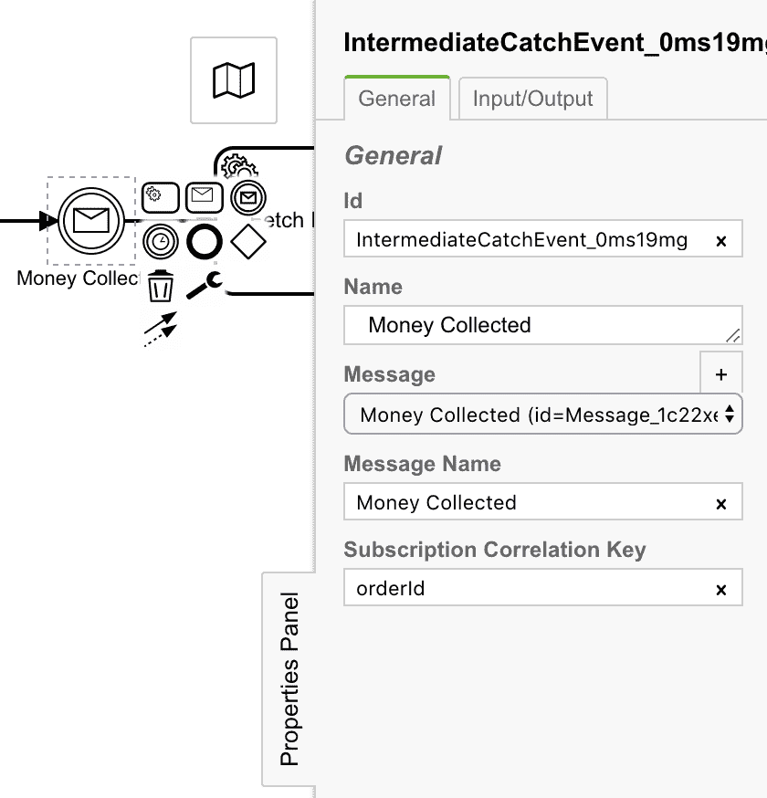
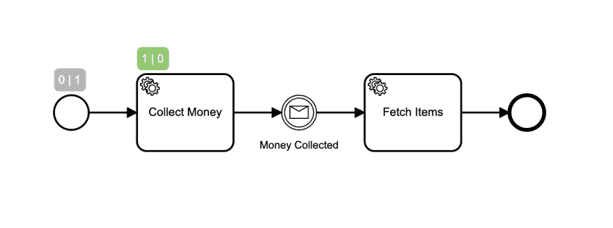
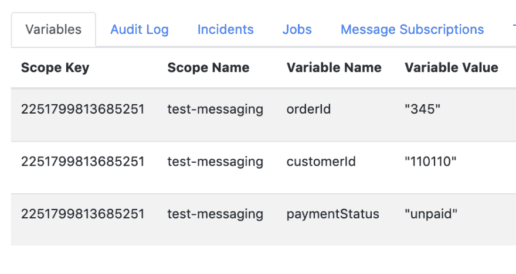
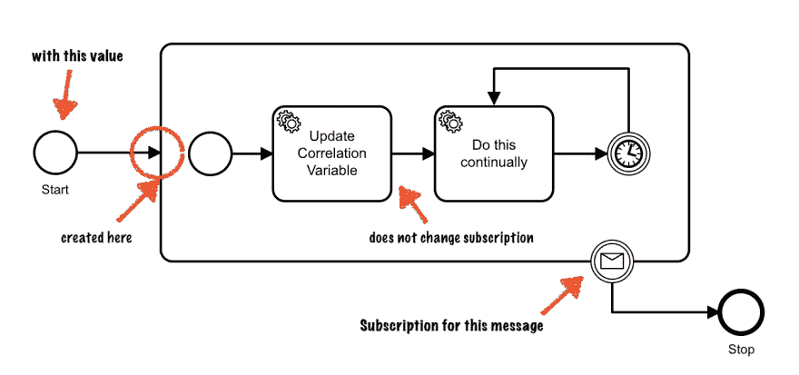
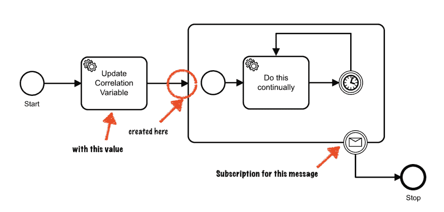

# 齐伯消息相关性

> 原文：<https://dev.to/jwulf/zeebe-message-correlation-15p4>

Zeebe 是一个用于微服务编排的新工作流引擎。它通过 [zeebe-node](https://www.npmjs.com/package/zeebe-node) 为用 JavaScript 编写的客户端提供一流的支持。

*这篇文章最初发表在 [Zeebe 博客](https://zeebe.io/blog/2019/08/zeebe-message-correlation/)上。*

消息关联是 Zeebe 中的一个强大特性。它允许您使用来自外部系统的异步状态更新来定位正在运行的工作流。

本教程使用 JavaScript 客户机，但是它用来说明适用于所有语言客户机的消息相关性概念。

我们将使用[简单监视器](https://github.com/zeebe-io/zeebe-simple-monitor)来检查正在运行的工作流状态。Simple Monitor 是一个社区支持的工具，并不是为在生产中使用而设计的——但是，它在开发过程中很有用。

## 工作流程

以下是来自 Zeebe 文档的基本示例:

[](https://res.cloudinary.com/practicaldev/image/fetch/s--o8Uk2lgT--/c_limit%2Cf_auto%2Cfl_progressive%2Cq_auto%2Cw_880/https://thepracticaldev.s3.amazonaws.com/i/nwgc9d8o0znwirji11m6.png)

使用 [Zeebe Modeler](https://github.com/zeebe-io/zeebe-modeler) 打开[这个项目](https://github.com/jwulf/zeebe-message-correlation)中的[测试消息](https://github.com/jwulf/zeebe-message-correlation/blob/master/bpmn/test-messaging.bpmn)文件。

单击中间消息捕获事件，查看它是如何配置的:

[](https://res.cloudinary.com/practicaldev/image/fetch/s--OgLsm46u--/c_limit%2Cf_auto%2Cfl_progressive%2Cq_auto%2Cw_880/https://thepracticaldev.s3.amazonaws.com/i/pv0toca6dzk8ioh6a2z8.png)

这里的一个关键部分是*订阅相关密钥*。在这个工作流的运行实例中，一个传入的“ *Money Collected* ”消息将具有一个`correlationKey`属性:

```
 zbc.publishMessage({
    correlationKey: "345",
    name: "Money Collected",
    variables: {
      paymentStatus: "paid"
    }); 
```

<svg width="20px" height="20px" viewBox="0 0 24 24" class="highlight-action crayons-icon highlight-action--fullscreen-on"><title>Enter fullscreen mode</title></svg> <svg width="20px" height="20px" viewBox="0 0 24 24" class="highlight-action crayons-icon highlight-action--fullscreen-off"><title>Exit fullscreen mode</title></svg>

通过将提供的值与订阅此消息的运行实例的`orderId`变量进行比较，消息`correlationKey`的具体值与运行的工作流实例相匹配。这是通过在 BPMN 的消息捕获事件中将 correlationKey 设置为`orderId`而建立的关系。

##运行演示

*   克隆此存储库。

*   安装依赖项:

```
 npm i && npm i -g ts-node typescript 
```

<svg width="20px" height="20px" viewBox="0 0 24 24" class="highlight-action crayons-icon highlight-action--fullscreen-on"><title>Enter fullscreen mode</title></svg> <svg width="20px" height="20px" viewBox="0 0 24 24" class="highlight-action crayons-icon highlight-action--fullscreen-off"><title>Exit fullscreen mode</title></svg>

*   在另一个终端中，使用来自[Zeebe-docker-compose](https://github.com/zeebe-io/zeebe-docker-compose)repo 的`simple-monitor`概要文件启动 Zeebe 代理。

*   部署工作流并启动实例:

```
 ts-node start-workflow.ts 
```

<svg width="20px" height="20px" viewBox="0 0 24 24" class="highlight-action crayons-icon highlight-action--fullscreen-on"><title>Enter fullscreen mode</title></svg> <svg width="20px" height="20px" viewBox="0 0 24 24" class="highlight-action crayons-icon highlight-action--fullscreen-off"><title>Exit fullscreen mode</title></svg>

这将启动一个工作流实例，其中`orderId`设置为 345:

```
await zbc.createWorkflowInstance("test-messaging", {
      orderId: "345",
      customerId: "110110",
      paymentStatus: "unpaid"
    }) 
```

<svg width="20px" height="20px" viewBox="0 0 24 24" class="highlight-action crayons-icon highlight-action--fullscreen-on"><title>Enter fullscreen mode</title></svg> <svg width="20px" height="20px" viewBox="0 0 24 24" class="highlight-action crayons-icon highlight-action--fullscreen-off"><title>Exit fullscreen mode</title></svg>

*   现在在[打开简单监视器 http://localhost:8082](http://localhost:8082)

*   单击工作流实例。您将看到工作流程的当前状态:

[](https://res.cloudinary.com/practicaldev/image/fetch/s--hIqWZ4Ci--/c_limit%2Cf_auto%2Cfl_progressive%2Cq_auto%2Cw_880/https://thepracticaldev.s3.amazonaws.com/i/a6fmqndx5v5tn98wmx4y.png)

BPMN 符号上方的数字表示在开始事件中没有代币在等待，并且有一个代币已经通过；还有一个令牌在“收钱”任务中等待，没有一个令牌通过。

*   看看屏幕底部的“变量”选项卡。(如果您没有看到它，您可能正在查看工作流，而不是实例。在这种情况下，深入到实例):

[](https://res.cloudinary.com/practicaldev/image/fetch/s--GJa7bPZI--/c_limit%2Cf_auto%2Cfl_progressive%2Cq_auto%2Cw_880/https://thepracticaldev.s3.amazonaws.com/i/xlgzjtfcsnkbing06z2c.png)

您可以看到这个工作流实例将变量`orderId`设置为值 345。

*   现在启动工人:

```
ts-node workers.ts 
```

<svg width="20px" height="20px" viewBox="0 0 24 24" class="highlight-action crayons-icon highlight-action--fullscreen-on"><title>Enter fullscreen mode</title></svg> <svg width="20px" height="20px" viewBox="0 0 24 24" class="highlight-action crayons-icon highlight-action--fullscreen-off"><title>Exit fullscreen mode</title></svg>

*   刷新简单监视器以查看工作流的当前状态:

[](https://res.cloudinary.com/practicaldev/image/fetch/s--yDPm_xrl--/c_limit%2Cf_auto%2Cfl_progressive%2Cq_auto%2Cw_880/https://thepracticaldev.s3.amazonaws.com/i/dcdzu9rx86au7lke2cpu.png)

现在，令牌处于消息捕获事件，等待消息被关联。

*   看看“消息订阅”选项卡:

[](https://res.cloudinary.com/practicaldev/image/fetch/s--TZb4KiZ7--/c_limit%2Cf_auto%2Cfl_progressive%2Cq_auto%2Cw_880/https://thepracticaldev.s3.amazonaws.com/i/69tzd27ccjr0mdl3kk9j.png)

您可以看到代理已经为这个工作流实例打开了一个消息订阅，具体值为`orderId` 345。这是在令牌进入消息捕获事件时创建的。

*   现在在另一个终端中发送消息:

```
ts-node send-message.ts 
```

<svg width="20px" height="20px" viewBox="0 0 24 24" class="highlight-action crayons-icon highlight-action--fullscreen-on"><title>Enter fullscreen mode</title></svg> <svg width="20px" height="20px" viewBox="0 0 24 24" class="highlight-action crayons-icon highlight-action--fullscreen-off"><title>Exit fullscreen mode</title></svg>

*   刷新简单监视器，您会看到消息已经关联，工作流已经运行完成:

“消息订阅”选项卡现在报告消息是相关的:

[](https://res.cloudinary.com/practicaldev/image/fetch/s--tRzUvt9o--/c_limit%2Cf_auto%2Cfl_progressive%2Cq_auto%2Cw_880/https://thepracticaldev.s3.amazonaws.com/i/mwuc8r53dmcqreodc9ei.png)

## 消息缓冲

消息在代理上缓冲，因此您的外部系统可以在您的流程到达 catch 事件之前发出消息。当从客户端库发布消息时，配置消息的缓冲时间。

例如，使用 JavaScript 客户端发送缓冲 10 分钟的消息:

```
 zbc.publishMessage({
    correlationKey: "345",
    name: "Money Collected",
    variables: {
      paymentStatus: "paid"
    },
    timeToLive: 600000
  }); 
```

<svg width="20px" height="20px" viewBox="0 0 24 24" class="highlight-action crayons-icon highlight-action--fullscreen-on"><title>Enter fullscreen mode</title></svg> <svg width="20px" height="20px" viewBox="0 0 24 24" class="highlight-action crayons-icon highlight-action--fullscreen-off"><title>Exit fullscreen mode</title></svg>

下面是你如何看到它的作用:

*   让工人们继续工作。
*   发布消息:

```
ts-node send-message.ts 
```

<svg width="20px" height="20px" viewBox="0 0 24 24" class="highlight-action crayons-icon highlight-action--fullscreen-on"><title>Enter fullscreen mode</title></svg> <svg width="20px" height="20px" viewBox="0 0 24 24" class="highlight-action crayons-icon highlight-action--fullscreen-off"><title>Exit fullscreen mode</title></svg>

*   点击简单监控页面顶部的“消息”。您将看到缓冲在代理上的消息:

[](https://res.cloudinary.com/practicaldev/image/fetch/s--fIwXeDL7--/c_limit%2Cf_auto%2Cfl_progressive%2Cq_auto%2Cw_880/https://thepracticaldev.s3.amazonaws.com/i/wolznr2jcwnm5q5qhtyt.png)

*   现在启动工作流的另一个实例:

```
ts-node start-workflow.ts 
```

<svg width="20px" height="20px" viewBox="0 0 24 24" class="highlight-action crayons-icon highlight-action--fullscreen-on"><title>Enter fullscreen mode</title></svg> <svg width="20px" height="20px" viewBox="0 0 24 24" class="highlight-action crayons-icon highlight-action--fullscreen-off"><title>Exit fullscreen mode</title></svg>

您将看到消息与工作流实例相关联，即使它是在工作流实例启动之前到达的。

## 常见错误

一些常见的问题:

*   BPMN 消息定义中的`correlationKey`是要匹配的工作流变量的名称。消息中的`correlationKey`是与工作流实例中的变量相匹配的具体值。可以说，为了使这种区别更加清晰，它可能被更恰当地命名为`correlationValue`。GitHub 有一个问题,请随意添加您的反馈。

    *   需要知道的重要一点是，消息订阅*在打开*后不会更新。在消息捕获事件的情况下，这不是问题，但是对于边界消息事件(中断和非中断)，令牌一进入边界子进程，订阅就被打开*。如果任何服务任务修改子流程中的`orderId`值，订阅将不会被更新。*

例如，以下示例中的中断边界消息事件将不会与更新后的值相关联，因为当令牌进入子流程时，订阅会打开，并使用当时的值:

[](https://res.cloudinary.com/practicaldev/image/fetch/s--ualy5e_o--/c_limit%2Cf_auto%2Cfl_progressive%2Cq_auto%2Cw_880/https://thepracticaldev.s3.amazonaws.com/i/6yzgdv5r1bwigq93138o.png)

如果需要与流程中某处修改的值相关的边界消息事件，那么将边界消息事件放在设置变量的任务之后的子流程中。当令牌进入子流程时，将打开边界消息事件的消息订阅，并使用当前变量值。

[](https://res.cloudinary.com/practicaldev/image/fetch/s--faNOfEo4--/c_limit%2Cf_auto%2Cfl_progressive%2Cq_auto%2Cw_880/https://thepracticaldev.s3.amazonaws.com/i/ge32800ujlciubxlbubq.png)

## 总结

消息关联是 Zeebe 中的一个强大特性。了解消息是如何关联的，以及如何和何时创建消息订阅，对于设计按预期执行的系统非常重要。

Simple Monitor 是一个有用的工具，可以用来检查 Zeebe 系统的行为，了解开发过程中发生了什么。