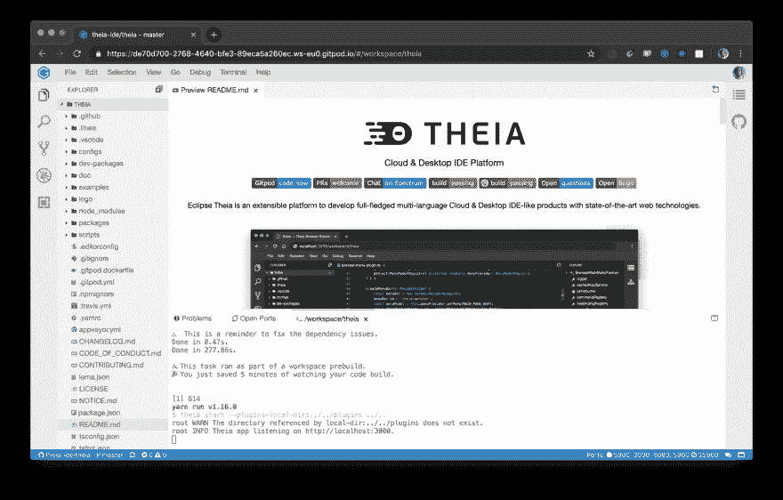

# 持续开发环境——开发运维的下一步

> 原文：<https://dev.to/svenefftinge/continuous-dev-environments-the-next-step-in-devops-4ab7>

过去几年来，DevOps 已经风靡一时。今天，像 GitHub / GitLab 这样持续集成的东西似乎是一个像样的开发工具链的绝对最低要求。这样的工具允许更快的反馈周期，更好的再现性，和通常更高的生产率。

然而，在一个至关重要的方面，我们大多数人每天仍在浪费无尽的时间:

让我们的开发环境进入准备编码状态通常仍然是手工完成的，浪费了开发人员大量宝贵的时间和精力。

> 开发环境供应可以而且应该自动化。

**持续开发环境**是完全优化的 DevOps 工具链中至关重要的一部分，它允许从任何 git 状态即时启动一个现成的代码开发环境。持续开发环境减少了入职和任务切换中的摩擦，并提高了整个项目的可重复性。

## 自动化开发环境

自动化开发环境并不新鲜，通常集中在初始设置上，但这并不能完全解决问题。当然，我们都感受到了参与新项目的痛苦，花第一周时间弄清楚要安装什么工具以及如何正确配置它们。手动设置开发环境是浪费精力。令人惊讶的是，我们会做这样的事情，因为我们开发人员通常忙于自动化世界上的其他事情。

但我想讨论的不仅仅是一次性入职。我们的项目随着时间而变化，我们的开发环境也是如此。开发人员在一个项目的不同版本之间切换。因此，他们必须一直相应地调整开发环境的某些部分。

我们应该使用代码来自动化开发环境，就像我们为持续部署而处理测试、试运行和生产环境一样。

> 当一个开发人员想要在某个分支、某个项目中开始一项任务时，她应该能够做到，而不需要花费数小时进入正确的环境。

## 一次性开发环境

自动化开发环境意味着我们可以随时重新创建它。每次都重新开始将确保设置正确运行，并获得一个干净的状态。因为构建和测试已经运行过，而且依赖项都是全新的，所以您可以确信任何问题都来自您的更改。这样的设置也非常容易复制错误。

此外，一次使用的开发环境使您不必事后清理。您永远不会因为任何繁重的签出、依赖、构建、数据库等等而污染您的本地系统。输入零浪费编码。

快到 2020 年了，我们明白通过代码和配置实现复杂系统的自动化至关重要。现在，让我们将学到的经验应用到我们的开发环境中。

## 预构建的开发环境——无需再等待构建！

初始设置很烦人，但是真正的时间点是[等待构建](https://www.gitpod.io/blog/prebuilds)。需要执行编译器、生成器、下载依赖项和运行测试来初始化您的开发环境。

就像 CI 工具在您提交变更后构建您的项目一样，持续开发环境服务在您需要它之前构建您的项目。这样你可以立即开始一个干净的状态。

> 一个提供连续自动化开发环境的工具应该预先构建你的项目，所以你不必等待。

Gitpod 持续预构建您的分支，这样您就可以立即开始编码，而不必等待构建完成。启动一个新的开发环境，并在终端中看到下面的输出，每次都让我会心一笑。

## 基于浏览器的开发环境？

> “基于浏览器的？我需要专业的工具！”

是的，我听到了。直到最近，基于浏览器的工具还没有我们在本地使用的工具强大。

但是时代变了。今天，[我们可以在浏览器标签](https://theia-ide.org)中运行 VS 代码兼容的 IDE，以及专用 Linux 容器的完整终端。一切都是专门为您的项目配置的。

忒伊亚 IDE 开源项目完全配置了持续预构建的开发环境。你可以点击下面的链接亲自尝试一下。

> [https://gitpod.io/#https://github.com/theia-ide/theia](https://gitpod.io/#https://github.com/theia-ide/theia)

## 但是我的环境和队友不一样！

是的，当然，也有个人偏好，比如主题，按键，甚至是一个或另一个工具。一些开发人员大量使用命令行工具，并拥有非常高级的配置。其他人使用特定的 VS 代码扩展来显著改进他们的工作流。

> 为什么我们不在团队中分享这些优点呢？

虽然 [Gitpod](https://www.gitpod.io) 让你拥有用户特定的设置，但我们看到了在团队内部分享智慧的机会，以 ***为每个人*** 建立一个完美、无摩擦的设置。通过这种方式，您可以与您的团队分享您令人印象深刻的终端技能和配置，并且您可能还会学到一两件新东西。

## devo PS 中缺失的一块

我非常确定，自动化的现成代码开发环境将成为主流。这些优势和影响太好了，不容忽视。理解并体验了适当的 DevOps 工具链的好处的每个人都应该理解按需提供开发环境是如何完成这一体验的。消除最后一个不可再生和非常烦人的问题应该是我们的首要任务，因为这将极大地提高开发人员的生产力。

Gitpod.io 是一个 Saas 服务，对开源项目是免费的，对商业项目是负担得起的。 [Gitpod Enterprise](https://www.gitpod.io/pricing#enterprise) 即将发布，允许在任何 Kubernetes 集群上自托管 Gitpod，并与 GitHub Enterprise、GitLab、Jenkins、吉拉和您的 DevOps 工具链中的其他工具集成。

这篇文章最初发表在 [gitpod.io](https://www.gitpod.io/blog/continuous-dev-environment-in-devops/) 上。