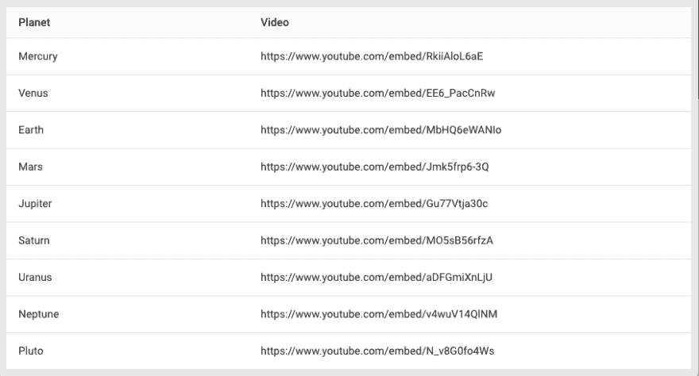
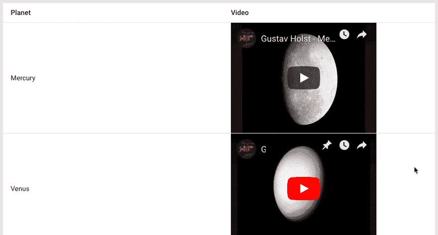

# 如何在 60 秒内将视频嵌入数据网格

> 原文：<https://dev.to/zinggrid/how-to-embed-videos-in-a-data-grid-in-under-60-seconds-54ia>

这是我的“60 秒内的功能”博客系列的第三部分。这些演练旨在强调向 [ZingGrid 数据网格和表格](https://www.zinggrid.com/)添加交互性和功能是多么容易。

观看下面的视频短片，了解将视频添加到 ZingGrid 数据网格有多简单，或者进一步滚动以阅读涵盖基础知识的简短摘要。

[https://www.youtube.com/embed/e5BFU9zlQNw](https://www.youtube.com/embed/e5BFU9zlQNw)

您首先要做的是按照这个清单来确保您已经正确地设置了 ZingGrid，为实现这个特性做好了准备:

1.  确保您要嵌入的视频已经在线托管，并且您有权限使用它们
2.  更新您的 JSON 数据集，以包含您想要嵌入的视频的 URL。确保在数据集中包含视频嵌入 URL，而不是直接视频 URL。
3.  确保您已经在开发环境中使用 CDN 或自托管选项通过引用 ZingGrid 库建立了一个基本的网格

作为快速复习，如果你在一个基本的 HTML 页面中使用 ZingGrid，在开始本教程之前，你的代码应该是这样的:

```
<!DOCTYPE html>
<html>
    <head>
        <meta charset="utf-8">
        <title></title>
        <script src="https://cdn.zinggrid.com/zinggrid.min.js" defer></script>
    </head>
    <body>
        <zing-grid></zing-grid>
    </body>
</html> 
```

从这里开始，只需将数据添加到网格中，并添加列，这样就可以为嵌入的媒体指定列类型。

* * *

## 一分钟内嵌入视频

假设你有一个基本的数据集，其中包含了献给我们太阳系中每一颗行星的古典音乐作品的视频。这个数据集在 ZingGrid 中呈现时将产生两列数据，最后一列包含视频。

正如我在本文开头提到的，使用视频的嵌入 URL，而不是直接 URL，这一点很重要。在 YouTube 视频的例子中，这是这两种类型的 URL 之间的区别:

嵌入网址: [`https://www.youtube.com/embed/RkiiAloL6aE`](https://www.youtube.com/embed/RkiiAloL6aE)

直接网址: [`https://www.youtube.com/watch?v=RkiiAloL6aE`](https://www.youtube.com/watch?v=RkiiAloL6aE)

一旦你添加了你的视频链接，你的 JSON 数据集可能看起来像这样:

```
[ 
    {
        "planet": "Mercury",
        "video": "https://www.youtube.com/embed/RkiiAloL6aE"
    },
    {
        "planet": "Venus",
        "video": "https://www.youtube.com/embed/EE6_PacCnRw"
    },
    {
        "planet": "Earth",
        "video": "https://www.youtube.com/embed/MbHQ6eWANIo"
    },
    {
        "planet": "Mars",
        "video": "https://www.youtube.com/embed/Jmk5frp6-3Q"
    },
    {
        "planet": "Jupiter",
        "video": "https://www.youtube.com/embed/Gu77Vtja30c"
    },
    {
        "planet": "Saturn",
        "video": "https://www.youtube.com/embed/MO5sB56rfzA"
    },
    {
        "planet": "Uranus",
        "video": "https://www.youtube.com/embed/aDFGmiXnLjU"
    },
    {
        "planet": "Neptune",
        "video": "https://www.youtube.com/embed/v4wuV14QlNM"
    },
    {
        "planet": "Pluto",
        "video": "https://www.youtube.com/embed/N_v8G0fo4Ws"
    }
] 
```

如果您将这些数据内联添加到网格中，您的代码看起来会是这样的:

```
<!DOCTYPE html>
<html>
    <head>
    <meta charset="utf-8">
        <title></title>
        <script src="https://cdn.zinggrid.com/zinggrid.min.js" defer></script>
    </head>
    <body>
        <zing-grid
        data='[ 
    {
        "planet": "Mercury",
        "video": "https://www.youtube.com/embed/RkiiAloL6aE"
    },
    {
        "planet": "Venus",
        "video": "https://www.youtube.com/embed/EE6_PacCnRw"
    },
    {
        "planet": "Earth",
        "video": "https://www.youtube.com/embed/MbHQ6eWANIo"
    },
    {
        "planet": "Mars",
        "video": "https://www.youtube.com/embed/Jmk5frp6-3Q"
    },
    {
        "planet": "Jupiter",
        "video": "https://www.youtube.com/embed/Gu77Vtja30c"
    },
    {
        "planet": "Saturn",
        "video": "https://www.youtube.com/embed/MO5sB56rfzA"
    },
    {
        "planet": "Uranus",
        "video": "https://www.youtube.com/embed/aDFGmiXnLjU"
    },
    {
        "planet": "Neptune",
        "video": "https://www.youtube.com/embed/v4wuV14QlNM"
    },
    {
        "planet": "Pluto",
        "video": "https://www.youtube.com/embed/N_v8G0fo4Ws"
    }
]'>
        </zing-grid>
    </body>
</html> 
```

在这一点上，你的网格应该看起来像这样——但是不要担心，这不是一个错误:

[](https://res.cloudinary.com/practicaldev/image/fetch/s--_8rsW_H4--/c_limit%2Cf_auto%2Cfl_progressive%2Cq_auto%2Cw_880/https://thepracticaldev.s3.amazonaws.com/i/8xk4xoc2wkyk9huohh4y.png)

要将数据集中的最后一列呈现为视频而不是包含视频 URL 的字符串，您需要手动指定网格中的列，以便可以更改最后一列的列类型。

为此，在`<zing-grid></zing-grid>`标记中添加两个`<zg-column></zg-column>`标记——每个标记对应 JSON 数据中的一个惟一键。在我们的例子中，我们的样本数据集有两个唯一的 JSON 键，所以我们将在`<zing-grid></zing-grid>`标签中添加两个`<zg-column></zg-column>`标签。

在每组`<zg-column></zg-column>`标记中，我们将添加`index=""`，并按照我们希望列出现的顺序填写每个 JSON 键名。在`video`的`zg-column`标签中，我们将添加值为`iframe`的`type=""`属性，以指定该列应该呈现 iframe 内容，而不是文本字符串。

如果您正在使用本教程中的示例数据，您的列标记应该如下所示:

```
<zg-colgroup>
    <zg-column index="planet"></zg-column>
    <zg-column index="photo" type="iframe"></zg-column>
</zg-colgroup> 
```

您不需要为`planet`列指定列类型，因为 ZingGrid 的默认列类型被设置为`text`。

如果你一直跟着做，你的代码应该是这样的(关注内联数据下面的代码):

```
<!DOCTYPE html>
 <html>
  <head>
   <meta charset="utf-8">
   <title></title>
   <script src="https://cdn.zinggrid.com/zinggrid.min.js" defer></script>
  </head>
  <body>
   <zing-grid
     data='[
      {
      "planet": "Mercury",
      "video": "https://www.youtube.com/embed/RkiiAloL6aE"
     },
     {
      "planet": "Venus",
      "video": "https://www.youtube.com/embed/EE6_PacCnRw"
     },
     {
      "planet": "Earth",
      "video": "https://www.youtube.com/embed/MbHQ6eWANIo"
     },
     {
      "planet": "Mars",
      "video": "https://www.youtube.com/embed/Jmk5frp6-3Q"
     },
     {
      "planet": "Jupiter",
      "video": "https://www.youtube.com/embed/Gu77Vtja30c"
     },
     {
      "planet": "Saturn",
      "video": "https://www.youtube.com/embed/MO5sB56rfzA"
     },
     {
      "planet": "Uranus",
      "video": "https://www.youtube.com/embed/aDFGmiXnLjU"
     },
     {
      "planet": "Neptune",
      "video": "https://www.youtube.com/embed/v4wuV14QlNM"
     },
     {
      "planet": "Pluto",
      "video": "https://www.youtube.com/embed/N_v8G0fo4Ws"
     }
    ]'>
    <zg-colgroup>
     <zg-column index="planet"></zg-column>
     <zg-column index="video" type="iframe"></zg-column>
    </zg-colgroup>
   </zing-grid>
  </body>
 </html> 
```

这就是在 ZingGrid 数据网格中渲染视频所需做的全部工作！上述代码将产生以下结果。

[](https://res.cloudinary.com/practicaldev/image/fetch/s--fWbNttod--/c_limit%2Cf_auto%2Cfl_progressive%2Cq_66%2Cw_880/https://thepracticaldev.s3.amazonaws.com/i/uoj62sp43i1wcr33qf2k.gif)

这些是在 ZingGrid 数据表和网格中添加视频嵌入的基础。[在我们的工作室操场观看现场演示](https://app.zingsoft.com/demos/create/FS3Q3016),看看它是如何工作的，并摆弄最终结果。