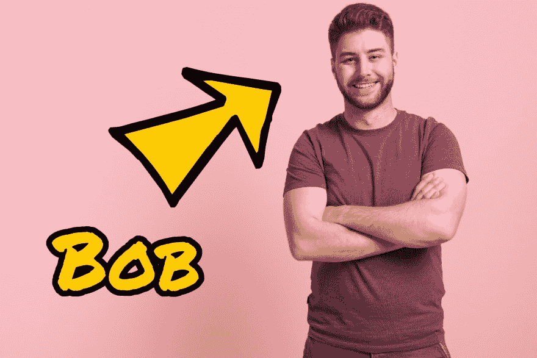

# 什么是 JavaScript 原型？

> 原文：<https://dev.to/brianemilius/what-in-tarnation-are-javascript-prototypes-3800>

*本文最初发布于[www.brianemilius.com/javascript-prototypes](http://www.brianemilius.com/javascript-prototypes)。访问[www.brianemilius.com/blog](http://www.brianemilius.com/blog)了解更多内容。*

* * *

我的一个朋友前几天问我关于 MDN JavaScript 手册的问题。

当他查找一个函数时，他注意到了一些奇怪的事情。例如，页面上“forEach”的标题不是“forEach”。它是“Array.prototype.forEach”。

我的朋友想知道那个原型是怎么回事。这篇文章就是关于这个的。

## 原语

所以在 JavaScript 中，我们有一种叫做“原语”的东西。[根据 MDN](https://developer.mozilla.org/en-US/docs/Glossary/Primitive) ，一个图元是

> 不是对象也没有方法的数据。有 7 种原始数据类型:字符串、数字、bigint、布尔、空、未定义和符号。

但是每个原语，除了 null 和 undefined，都有我们称之为“原语包装对象”的东西。这些是我们想看的。

*   `String`是原语`string`的包装对象，
*   `Number`对于`number`原语，
*   `BigInt`对于`bigint`原语，
*   `Boolean`对于`boolean`原语，
*   最后，`Symbol`代表`symbol`原语。

注意，包装对象以大写字母开始(这很重要)。

## 物体

JavaScript 中的所有对象都有一个原型。这包括不是原始包装器的对象，例如“函数”、“数组”和“对象”。

一个物体的原型只是你认为它是什么；对象的原型。

## 原型

让我们后退一步，弄清楚什么是原型。

想象一下，我们在 JavaScript 中有一个原语，叫做“人类”。包装对象将被命名为“人类”。

[](https://res.cloudinary.com/practicaldev/image/fetch/s--1CUr391u--/c_limit%2Cf_auto%2Cfl_progressive%2Cq_auto%2Cw_880/https://thepracticaldev.s3.amazonaws.com/i/f4l5igi2a8xltsrq2jm2.jpg)

人类的原型充满了属性和方法。例如，人类的一些属性可能是

*   眼睛:2
*   耳朵:2
*   鼻子:1
*   嘴巴:1

这些特性告诉我们人类拥有什么——它是用什么创造的，看起来像什么。

人类原型也包括方法。这些告诉我们人类能做什么:

*   吃
*   睡眠
*   咆哮

现在想象这段 JavaScript 代码在现实生活中实际上不会工作:

```
var Bob = new Human; 
```

Enter fullscreen mode Exit fullscreen mode

这里，我们创建了一个变量`Bob`，它是建立在人类原型之上的。

我们现在可以调用人类对鲍勃的任何属性:

```
Bob.Eyes // output: 2
Bob.Mouths // output: 1 
```

Enter fullscreen mode Exit fullscreen mode

我们也可以在 Bob 身上运行人类原型的任何方法:

```
Bob.Eat() // output: Bob probably eats something
Bob.Sleep() // output: Bob sleeps 
```

Enter fullscreen mode Exit fullscreen mode

### 回到实际 JavaScript

对于人类 Bob 来说，JavaScript 中的原始包装对象也是如此。

让我们以`Number`为例。

包装对象`Number`原型有一堆我们可以在任何实际的`number`原语上运行的方法。我经常用的一个是“Number.prototype.toString”。

该方法将数字原语转换为字符串原语。

```
var myNumber = 42;
console.log(myNumber); // output: 42 <-- a number

var myString = 42.toString();
console.log(myString); // output: "42" <-- a string 
```

Enter fullscreen mode Exit fullscreen mode

## 明白了！现在怎么办？

有许多有用的方法可以在对象上运行。[MDN 手册](https://developer.mozilla.org/en-US/docs/Web/javascript)将它们都列出来了，而且太多了，无法在此一一列举，所以去探索吧！

如果你在一个原始包装对象上使用`console.log()`，你可以在你的浏览器或控制台上看到原型属性和方法的完整列表。这是一个有趣的起点。

[封面照片由 www.freepik.com kjpargeter-](https://www.freepik.com/free-photos-vectors/technology)[创作](http://www.freepik.com)

[鲍勃照片由 www.freepik.com 自由派创作-](https://www.freepik.com/free-photos-vectors/people)