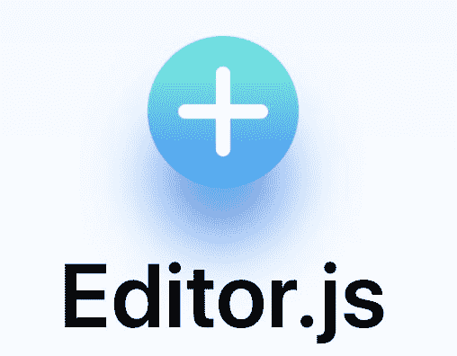
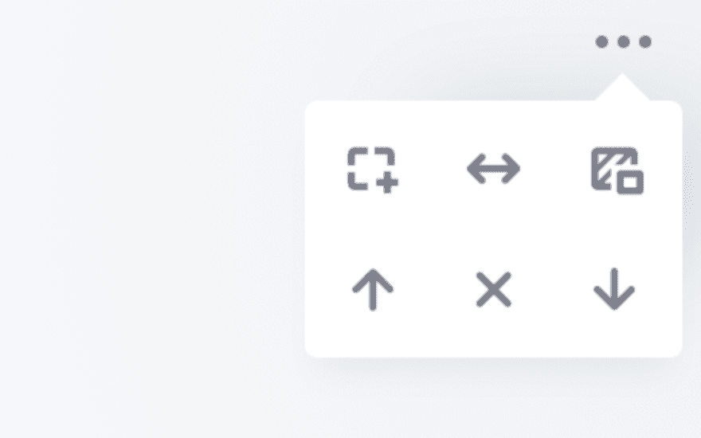
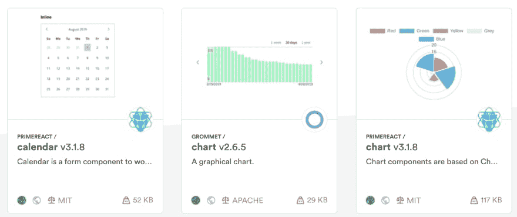
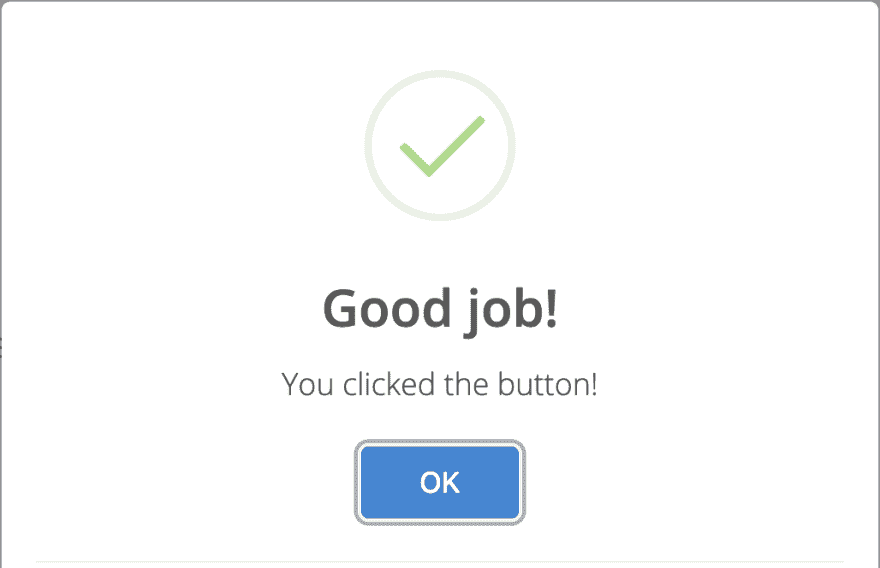
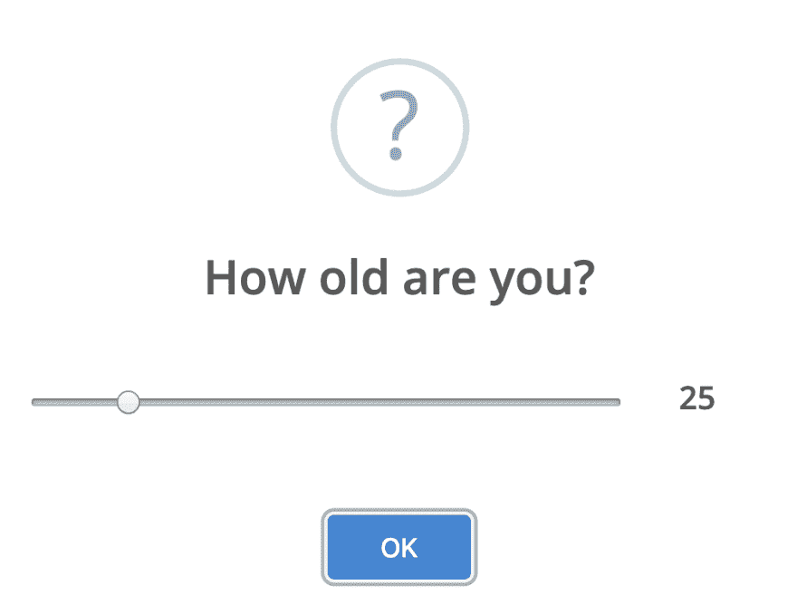

# 利用这些工具提高工作效率！🍉八月为你挑选

> 原文：<https://dev.to/paco_ita/be-more-productive-with-these-tools-august-picks-for-you-3ga4>

新的一个月到了，是时候复习一些新的 Javascript 库了！！🔥

# Editor.js

[](https://res.cloudinary.com/practicaldev/image/fetch/s--VSoazCrM--/c_limit%2Cf_auto%2Cfl_progressive%2Cq_auto%2Cw_880/https://thepracticaldev.s3.amazonaws.com/i/fknjk86dmsjpdqtbp6xo.png)

[Editor.js](https://editorjs.io/) 是一个用于富媒体报道的*块样式*编辑器。

块样式意味着每个元素(段落、标题、图片、列表、引用)都被独立地当作一个`contenteditable`。它不同于其他典型的解决方案，在其他典型的解决方案中，单个主`contenteditable`工作区包装了所有的 HTML 内容。然而，这种方法会带来样式过载和其他恼人的副作用。

Editor.js 允许创建**内嵌编辑**菜单:

[](https://res.cloudinary.com/practicaldev/image/fetch/s--78WRxfiY--/c_limit%2Cf_auto%2Cfl_progressive%2Cq_auto%2Cw_880/https://thepracticaldev.s3.amazonaws.com/i/3tzlnpv21ci9qsza51q1.png)

或者**块设置**菜单，其范围是整个可编辑目标块，而不仅仅是所选文本:

[](https://res.cloudinary.com/practicaldev/image/fetch/s--dSinefq1--/c_limit%2Cf_auto%2Cfl_progressive%2Cq_auto%2Cw_880/https://thepracticaldev.s3.amazonaws.com/i/1dc3r4xs75i76tbrbsok.png)

为了在我们的网络应用中使用它——在导入基础`editorjs`之后——我们可以添加想要的工具，作为单独的*插件*。

这种模块化来自于设计，允许我们只导入我们需要的特性:

```
import EditorJS from '@editorjs/editorjs'; 
import Header from '@editorjs/header'; 
import List from '@editorjs/list'; 

const editor = new EditorJS({ 
  /** 
   * Id of Element that should contain the Editor 
   */ 
  holderId: 'codex-editor', 

  /** 
   * Available Tools list. 
   * Pass Tool's class or Settings object for each Tool you want to use 
   */ 
  tools: { 
    // Here we can include the tools we want
    header: Header, 
    list: List 
  }, 
}) 
```

<svg width="20px" height="20px" viewBox="0 0 24 24" class="highlight-action crayons-icon highlight-action--fullscreen-on"><title>Enter fullscreen mode</title></svg> <svg width="20px" height="20px" viewBox="0 0 24 24" class="highlight-action crayons-icon highlight-action--fullscreen-off"><title>Exit fullscreen mode</title></svg>

另一个好的方面是，与生成大量 HTML 标记的其他编辑器相比，输出是 JSON。

下面是来自媒体平台的输出示例:

```
<section name="0ed1" class="section section--body section--first">
   <div class="section-divider">
      <hr class="section-divider">
   </div>
   <div class="section-content">
      <div class="section-inner sectionLayout--insetColumn">
         <h3 name="f8e8" class="graf graf--h3 graf--leading graf--title">
            <br>
         </h3>
         <p name="982b" class="graf graf--p graf-after--h3">
            The example of text that was written in 
            <strong class="markup--strong markup--p-strong">one of 
            popular</strong> text editors.
         </p>
         <h3 name="c2ad" class="graf graf--h3 graf-after--p">
            With the header of course
         </h3>
         <p name="83d3" class="graf graf--p graf-after--h3">
            So what do we have?
         </p>
      </div>
   </div>
</section>
<section name="d1d2" class="section section--body">
  ...
</section> 
```

<svg width="20px" height="20px" viewBox="0 0 24 24" class="highlight-action crayons-icon highlight-action--fullscreen-on"><title>Enter fullscreen mode</title></svg> <svg width="20px" height="20px" viewBox="0 0 24 24" class="highlight-action crayons-icon highlight-action--fullscreen-off"><title>Exit fullscreen mode</title></svg>

和 Editor.js 生成的内容相同:

```
{  "time"  :  1550476186479,  "blocks"  :  [  {  "type"  :  "paragraph",  "data"  :  {  "text"  :  "The example of text that was written in 
                          <b>one of popular</b> text editors."  }  },  {  "type"  :  "header",  "data"  :  {  "text"  :  "With the header of course",  "level"  :  2  }  },  {  "type"  :  "paragraph",  "data"  :  {  "text"  :  "So what do we have?"  }  }  ],  "version"  :  "2.8.1"  } 
```

<svg width="20px" height="20px" viewBox="0 0 24 24" class="highlight-action crayons-icon highlight-action--fullscreen-on"><title>Enter fullscreen mode</title></svg> <svg width="20px" height="20px" viewBox="0 0 24 24" class="highlight-action crayons-icon highlight-action--fullscreen-off"><title>Exit fullscreen mode</title></svg>

我们可以清楚地看到 Editor.js 输出看起来没有那么冗长。

# Howler.js

[](https://res.cloudinary.com/practicaldev/image/fetch/s--XffH9YcT--/c_limit%2Cf_auto%2Cfl_progressive%2Cq_auto%2Cw_880/https://thepracticaldev.s3.amazonaws.com/i/8n20p61ednltbx8qjof8.png)

这个 [JavaScript 音频库](https://howlerjs.com/)允许给网站添加音效，流式网络电台或为音轨提供高级声音控制。

[](https://res.cloudinary.com/practicaldev/image/fetch/s--EuQlgs5x--/c_limit%2Cf_auto%2Cfl_progressive%2Cq_auto%2Cw_880/https://thepracticaldev.s3.amazonaws.com/i/5ed2wekxpj3fk6g6h6yn.png)

它是轻量级的(7KB gzipped ),没有任何外部依赖性。此外，它还提供开箱即用的优化。已经加载的声音会自动缓存并在后续调用中重用。

用法简单直观:

```
import {Howl, Howler} from 'howler';

// Setup the new Howl.
const sound = new Howl({
  src: ['sound.webm', 'sound.mp3']
});

// Play the sound.
sound.play();

// Change global volume.
Howler.volume(0.5); 
```

<svg width="20px" height="20px" viewBox="0 0 24 24" class="highlight-action crayons-icon highlight-action--fullscreen-on"><title>Enter fullscreen mode</title></svg> <svg width="20px" height="20px" viewBox="0 0 24 24" class="highlight-action crayons-icon highlight-action--fullscreen-off"><title>Exit fullscreen mode</title></svg>

[演示示例](https://github.com/goldfire/howler.js/tree/master/examples)

# 位

[Bit](https://bit.dev/) 是一个提供 React UI 组件集合(按钮、图表、日历、...)，类似于[语义-UI-反应](https://react.semantic-ui.com/)。

[](https://res.cloudinary.com/practicaldev/image/fetch/s--gYmIkhxW--/c_limit%2Cf_auto%2Cfl_progressive%2Cq_auto%2Cw_880/https://thepracticaldev.s3.amazonaws.com/i/sos2y4jyv3pzb2utjcke.png)

任何人都可以发布个人组件，并免费提供给社区使用。

私人中心——只有注册会员才能进入——也是可用的，而且非常方便。想象一下，在一个跨越不同团队的项目中工作。能够与我们的同事共享组件可以极大地提高团队的生产力。它可以很容易地防止两个不同的团队两次实现一个通用的自动完成输入字段的经典场景！！
听起来耳熟吗？🤦‍♂️

# 轻弹

[](https://res.cloudinary.com/practicaldev/image/fetch/s--pH0fldR8--/c_limit%2Cf_auto%2Cfl_progressive%2Cq_auto%2Cw_880/https://thepracticaldev.s3.amazonaws.com/i/sjjpwtv6lsi9bqn6swu3.png)

[Flicking](https://naver.github.io/egjs-flicking/) 是一个灵活的转盘，可以轻松地与最流行的 JS 框架(React、Vue.js、Angular)集成。

它提供无限滚动、自由滚动、多面板等功能:

[](https://res.cloudinary.com/practicaldev/image/fetch/s--aGT32gWW--/c_limit%2Cf_auto%2Cfl_progressive%2Cq_auto%2Cw_880/https://thepracticaldev.s3.amazonaws.com/i/r3tt9r5pb0rsj5v8xn18.png)

还有一些插件可用于进一步扩展基本功能:

[](https://res.cloudinary.com/practicaldev/image/fetch/s--uKE2fP5J--/c_limit%2Cf_auto%2Cfl_progressive%2Cq_auto%2Cw_880/https://thepracticaldev.s3.amazonaws.com/i/agm16ufqdjljk7bq7azd.png)

试一试(下面的例子使用了 Angular):

[https://codesandbox.io/embed/egjsngx-flicking-examples-czb2g](https://codesandbox.io/embed/egjsngx-flicking-examples-czb2g)

# 甜味剂 2

[](https://res.cloudinary.com/practicaldev/image/fetch/s--quEFdi67--/c_limit%2Cf_auto%2Cfl_progressive%2Cq_auto%2Cw_880/https://thepracticaldev.s3.amazonaws.com/i/jtytjx8ohcj5ssr5so9w.png)

如果你需要定制 javascript 弹出窗口，让它们更时尚，但你不想使用一个完整的设计框架，那么 [SweetAlert2](https://sweetalert2.github.io/) 就是你的最佳选择。它没有依赖性，可以与 Angular 和 React 集成。

您可以升级普通弹出窗口:

[](https://res.cloudinary.com/practicaldev/image/fetch/s--HtO5IkUs--/c_limit%2Cf_auto%2Cfl_progressive%2Cq_auto%2Cw_880/https://thepracticaldev.s3.amazonaws.com/i/orqd5s3u934f0hs9zdw2.png)

变成更吸引人的东西:

[](https://res.cloudinary.com/practicaldev/image/fetch/s--mk6GCuMk--/c_limit%2Cf_auto%2Cfl_progressive%2Cq_auto%2Cw_880/https://thepracticaldev.s3.amazonaws.com/i/hu594w30m3k5j522hzbz.png)

我们可以选择通知类型(成功、信息、错误、...)并为弹出内容定义不同的输入类型:

```
Swal.fire({
  title: 'How old are you?',
  type: 'question',
  input: 'range',
  inputAttributes: {
    min: 8,
    max: 120,
    step: 1
  },
  inputValue: 25
}) 
```

<svg width="20px" height="20px" viewBox="0 0 24 24" class="highlight-action crayons-icon highlight-action--fullscreen-on"><title>Enter fullscreen mode</title></svg> <svg width="20px" height="20px" viewBox="0 0 24 24" class="highlight-action crayons-icon highlight-action--fullscreen-off"><title>Exit fullscreen mode</title></svg>

前面的代码片段生成了一个范围选择弹出窗口:

[](https://res.cloudinary.com/practicaldev/image/fetch/s--VLxhY6BU--/c_limit%2Cf_auto%2Cfl_progressive%2Cq_auto%2Cw_880/https://thepracticaldev.s3.amazonaws.com/i/73lfg6mzmdseytusuc7n.png)

当用户点击一个按钮时，警报关闭，Swal.fire()返回一个承诺。我们只需解析承诺，检测用户的回答。简单快捷！

该库还提供了一种方法来检测用户是否消除了弹出窗口(例如，按下`ESC`键或点击 cancel 按钮)。在这种情况下，Swal.fire()返回一个对象`{ dismiss: reason }`,其原因是解散。

我喜欢 SweetAlert2 的是它的简单性，但仍然可以创建漂亮的自定义通知。

在他们的网站上还有几个其他用法的例子。

🎉这个月到此为止🎉九月份再来看一篇充满发现的新文章吧！！

[](https://res.cloudinary.com/practicaldev/image/fetch/s--8xFjFSKW--/c_limit%2Cf_auto%2Cfl_progressive%2Cq_auto%2Cw_880/https://thepracticaldev.s3.amazonaws.com/i/mzwzpv81mt92qgxter81.png)