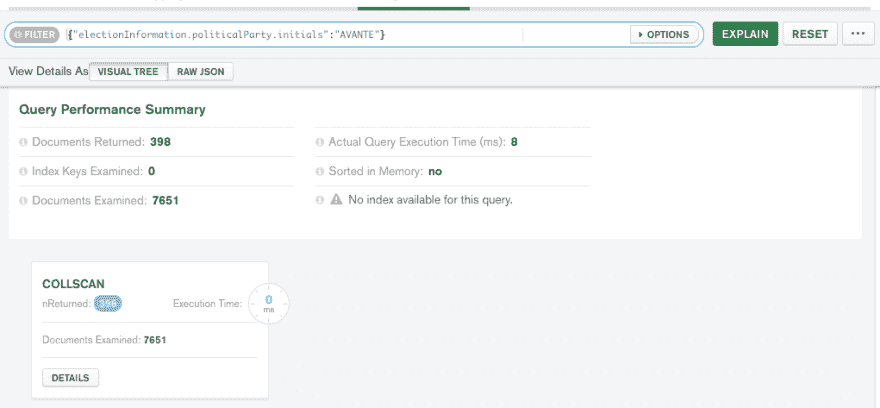
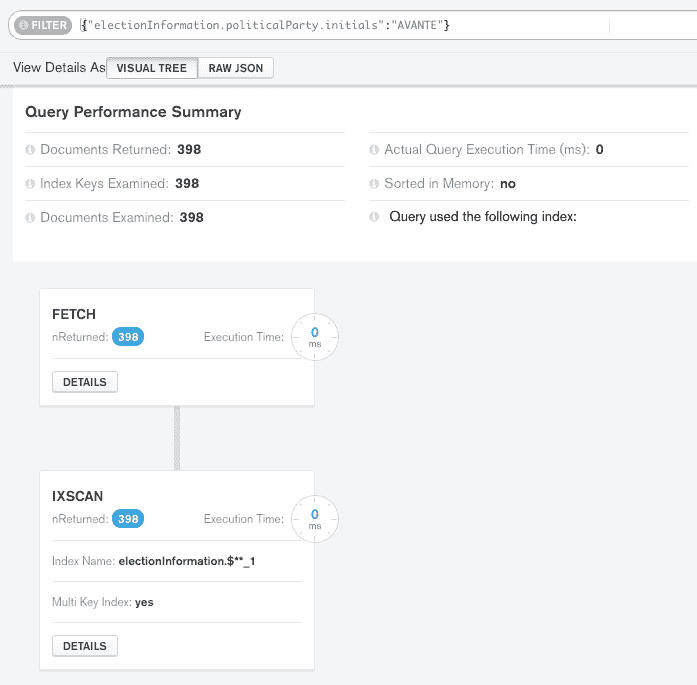

# 通配符索引 com MongoDB 4.2

> 原文：<https://dev.to/delbussoweb/wildcard-indexes-com-mongodb-4-2-1n1p>

各位，借着 mongbod 4.2 ga 版本的发布，我将向大家展示我认为在建模和性能方面很有趣的一项功能，一种新型的索引:Wildcard index。

由于 mongodb 支持动态模式，因此我们的应用程序可以使用这些字段名称未知的字段或甚至可选字段来执行搜索。到 4.0 版为止，我们有两种方法可以做到这一点:为其中的每一个字段创建索引，但我们需要了解每一个字段，或者创建类似于包含关键字和值的字典的东西，这样会“丑”起来，看起来像这样:

```
{  "k":  "nome do atributo",  "v":  "valor do atributo"  } 
```

<svg width="20px" height="20px" viewBox="0 0 24 24" class="highlight-action crayons-icon highlight-action--fullscreen-on"><title>Enter fullscreen mode</title></svg> <svg width="20px" height="20px" viewBox="0 0 24 24" class="highlight-action crayons-icon highlight-action--fullscreen-off"><title>Exit fullscreen mode</title></svg>

当我们有这么多固定模式的字段时，或者当我们有动态模式的字段时，我觉得最酷的是，通配符索引来帮助我们。我将举一个巴西选举候选人基数的例子，并使用这种指数进行一些绩效测试。让我们看一个文档示例:

```
{  "_id"  :  ObjectId("5d126803044a9b1399ba41e7"),  "personalInformation"  :  {  "maritalStatus"  :  [  {  "year"  :  2018,  "code"  :  1,  "description"  :  "SOLTEIRO(A)"  }  ],  "schooling"  :  [  {  "year"  :  2018,  "code"  :  8,  "description"  :  "SUPERIOR COMPLETO"  }  ],  "emailAddresses"  :  [  {  "year"  :  2018,  "email"  :  "gpm.guimaraes.adv@gmail.com"  }  ],  "birth"  :  {  "date"  :  ISODate("1987-04-13T00:00:00.000Z"),  "city"  :  "RIO DE JANEIRO",  "cityCode"  :  -3,  "state"  :  "RJ"  },  "voterRegistration"  :  "133364270353",  "nationality"  :  "BRASILEIRA NATA",  "occupation"  :  [  {  "year"  :  2018,  "code"  :  257,  "description"  :  "EMPRESARIO"  }  ],  "name"  :  "HIPOLITO LUIS NUNEZ DOMARCO NETO",  "gender"  :  "MASCULINO",  "race"  :  "BRANCA",  "document"  :  "09866446760",  "socialName"  :  "#NULO#"  },  "electionInformation"  :  [  {  "year"  :  2018,  "state"  :  "RJ",  "role"  :  {  "code"  :  6,  "description"  :  "DEPUTADO FEDERAL"  },  "politicalParty"  :  {  "legend"  :  "PMN / AVANTE",  "number"  :  70,  "name"  :  "AVANTE",  "legendComposition"  :  [  "PMN",  "AVANTE"  ],  "initials"  :  "AVANTE"  },  "candidateNumber"  :  7015,  "situation"  :  "APTO",  "age"  :  31,  "nameExibition"  :  "HIPLITO DOMARCO"  }  ]  } 
```

<svg width="20px" height="20px" viewBox="0 0 24 24" class="highlight-action crayons-icon highlight-action--fullscreen-on"><title>Enter fullscreen mode</title></svg> <svg width="20px" height="20px" viewBox="0 0 24 24" class="highlight-action crayons-icon highlight-action--fullscreen-off"><title>Exit fullscreen mode</title></svg>

*选举信息*属性是一个可以存储候选人参加的多次选举的数组，具有各种可用于任何类型的搜索的属性。例如，如果要显示属于某一政党的所有候选人:

```
db.candidates.find({
    "electionInformation.politicalParty.initials":"AVANTE"
}) 
```

<svg width="20px" height="20px" viewBox="0 0 24 24" class="highlight-action crayons-icon highlight-action--fullscreen-on"><title>Enter fullscreen mode</title></svg> <svg width="20px" height="20px" viewBox="0 0 24 24" class="highlight-action crayons-icon highlight-action--fullscreen-off"><title>Exit fullscreen mode</title></svg>

执行此查询时，我们将有以下执行计划:

[](https://res.cloudinary.com/practicaldev/image/fetch/s--5Dvxc-xJ--/c_limit%2Cf_auto%2Cfl_progressive%2Cq_auto%2Cw_880/https://thepracticaldev.s3.amazonaws.com/i/jas6qo0hfxf3xgrm3f66.png)

在上图中，我们有一些关于我们查询的重要信息。首先，因为没有索引，所以方法是做一个‘t0’colscan，在这种情况下，mongodb 不得不检查集合中的 7，651 份文件中的每一份，只返回 398 个结果，这项操作花了 8 毫秒。而[【mongob compass】](https://www.mongodb.com/products/compass)则向我们发出信号，没有支持这一查询的指数。

现在，让我们创建一个通配符索引，看看我们的执行计划是如何工作的:

```
db.candidates.createIndex(
    { "electionInformation.$**" : 1 } 
) 
```

<svg width="20px" height="20px" viewBox="0 0 24 24" class="highlight-action crayons-icon highlight-action--fullscreen-on"><title>Enter fullscreen mode</title></svg> <svg width="20px" height="20px" viewBox="0 0 24 24" class="highlight-action crayons-icon highlight-action--fullscreen-off"><title>Exit fullscreen mode</title></svg>

运行同一查询，我们有以下执行计划:

[](https://res.cloudinary.com/practicaldev/image/fetch/s--H16WbThu--/c_limit%2Cf_auto%2Cfl_progressive%2Cq_auto%2Cw_880/https://thepracticaldev.s3.amazonaws.com/i/kf1fo4mk278xxfvqm7gl.png)

好多了吧？！MongoDB 现在可以使用创建的索引，并在 0 毫秒内执行查询！请注意，“已检查的文档”和“已返回的文档”的数量相同，而且还与“索引键已检查的条目”的数量相同，这意味着它只使用索引来满足此查询，因此速度快得多！

“啊 Leandro，但我可以通过为属性*选举信息创建一个具体的索引来做到这一点。political LPAR . initials*。野猫队在哪里

是的，具体的索引会解决问题，但请记住开机自检的开始，我们可能不知道哪些属性存在，也可能不会为其中的每一个属性创建索引，因此，我们可以按另一个现有属性进行查询:

```
db.candidates.find({
     "electionInformation.role.description":"DEPUTADO FEDERAL"
}) 
```

<svg width="20px" height="20px" viewBox="0 0 24 24" class="highlight-action crayons-icon highlight-action--fullscreen-on"><title>Enter fullscreen mode</title></svg> <svg width="20px" height="20px" viewBox="0 0 24 24" class="highlight-action crayons-icon highlight-action--fullscreen-off"><title>Exit fullscreen mode</title></svg>

O MongoDB 利用了:

[](https://res.cloudinary.com/practicaldev/image/fetch/s--Q6a9tXOE--/c_limit%2Cf_auto%2Cfl_progressive%2Cq_auto%2Cw_880/https://thepracticaldev.s3.amazonaws.com/i/aiayp4fnfvw30yivv8bw.png)

看到了吗？就像我说的，在动态模式的情况下，以及在维护索引时，这非常容易！当然，也有一些注意事项和限制，关于通配符索引的更多信息可在此处找到。

如果您要测试这种新的索引类型，但尚未安装 mongbb 4.2，请使用“[mongbb atlas](https://www.mongodb.com/cloud/atlas)”在那里创建用于完全免费测试的复制集！

此外，如果您想要对 4.2 版中的一些主要新增功能进行概述，请查看此处的“”。

就是这样，希望你们喜欢，随意评论和分享！

一个拥抱，再见！