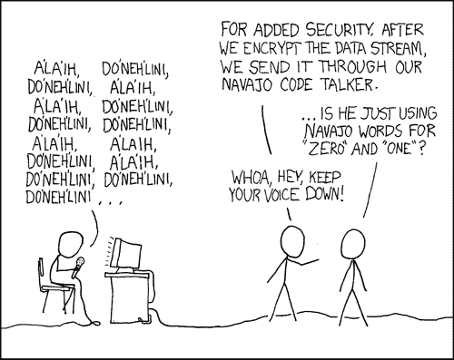

# 停止混淆:编码和加密是不一样的

> 原文：<https://dev.to/wagslane/stop-with-the-obfuscation-encoding-and-encryption-are-not-the-same-1b95>

这是一个已经被谈论了很多的话题，但是我认为这是一个需要向我们的用户重申的重要话题。

**编码不是加密！**

[加密](https://en.wikipedia.org/wiki/Encryption)是编码的一个特定子集，其中编码的消息只能由授权方(持有解密密钥的一方)访问。

[编码](https://en.wikipedia.org/wiki/Character_encoding)只是一种以特定格式表示数据的方式。例如，可以使用 ASCII 格式对原始二进制数据进行编码，以直观地显示英语文本。

[](https://res.cloudinary.com/practicaldev/image/fetch/s--pkWJk-0z--/c_limit%2Cf_auto%2Cfl_progressive%2Cq_66%2Cw_880/https://qvault.io/wp-content/uploads/2019/08/asciifull.gif)

在编程环境中，纯编码方案绝对不提供安全性。有时像 jwt 或 Base64 输出这样的格式会让初级程序员感到困惑，因为它们看起来是加密的… **它们不是！编码格式之所以有用，是因为它们为计算机和人类提供了以有意义的方式查看和处理原始二进制数据的协议。**

为了说明这一点，请尝试以下工具，看看对刚编码(未加密)的消息进行解码有多容易:

[https://jwt.io/](https://jwt.io/)

[https://www.base64encode.org](https://www.base64encode.org)

## 强制性 XKCD

<figure>[](https://res.cloudinary.com/practicaldev/image/fetch/s--Z_hNFS8O--/c_limit%2Cf_auto%2Cfl_progressive%2Cq_auto%2Cw_880/https://qvault.io/wp-content/uploads/2019/08/code_talkers.png)

<figcaption></figcaption>

</figure>

## 故事时间

在我过去工作的地方，一个在我之前的开发人员建立了他自己的编码方案。它将获取包含在消息中的原始二进制数据，并将特定的字节序列映射到特定的字符。完全是瞎编的，他在代码上留下的注释是:

```
// Obfuscation technique. Base53 encoding for security 
```

<svg width="20px" height="20px" viewBox="0 0 24 24" class="highlight-action crayons-icon highlight-action--fullscreen-on"><title>Enter fullscreen mode</title></svg> <svg width="20px" height="20px" viewBox="0 0 24 24" class="highlight-action crayons-icon highlight-action--fullscreen-off"><title>Exit fullscreen mode</title></svg>

虽然它可能会迷惑攻击者几分钟，但这种[混淆](https://hackernoon.com/what-is-obfuscation-30d8cc68b4d8)在不必要的复杂性方面提供了更多潜在的错误，而不是安全好处。有了所有主流编程语言都提供的免费且易于使用的加密库，现在就没有理由尝试自己动手了。

在上述情况下，应该使用 ECC、RSA、AES-256 或其他安全算法。具有讽刺意味的是，它也可能需要更少的时间来实现。

安全性可能很难做到，但是如果您花时间使用最佳实践，从长远来看，它将为您节省大量时间并减少麻烦。祝你好运，并保持安全！

莱恩·瓦格纳

帖子[止于混淆:编码和加密不一样](https://qvault.io/2019/08/14/stop-with-the-obfuscation-encoding-and-encryption-are-not-the-same/)最早出现在 [Qvault](https://qvault.io) 上。