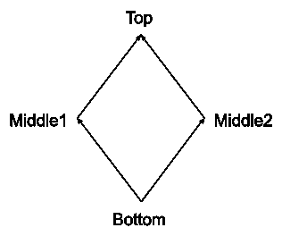

# 用状态编程:值和实体

> 原文：<https://dev.to/vorahsa/programming-with-state-values-and-entities-1hcp>

开发人员非常清楚程序中可变状态的危险。一个值从你下面改变，打乱了正在进行的计算。屏幕上两个不同的地方，表面上基于相同的信息，彼此并不一致。应用程序崩溃是因为没有在适当的时间更改某个值。

基于不可变值和构建新值而不是改变现有值的函数的函数式编程风格已经变得非常流行，因为当一切都可变时，管理状态是复杂的。但是假设我们发现用可变状态编程是有用的。例如，我的经验主要是在使用原生工具的移动应用程序开发中，整个平台是围绕可变状态构建的，很少有团队或公司愿意采用与大多数开发人员所实践的完全不同的应用程序架构或编程风格。那么主要的问题就变成了我们如何管理这种状态以保持我们的程序是可理解的。

## 值和实体

我发现一个有用的观点是将程序操纵的对象分为两种，*值*和*实体*。一个值在概念上类似于一个基本类型，一个不可变的对象，一个结构化的值只是它的各个部分的总和，没有隐藏的内容。相比之下，每个实体都是不同的对象，即使来自具有完全相同状态的实体。由于一个实体有一个独特的身份，它的状态可以是可变的。

| 价值 | 实体 |
| --- | --- |
| 基于国家的平等 | 独特的身份 |
| 不变的 | 内部可变状态 |
|  | 外部可观察状态 |
| “功能性” | “面向对象” |

这种观点把平等和易变混为一谈，但是在我看来，其他的可能性是不需要的。具有独特身份的不可变对象可以简单地是包含唯一标识符的值。根据我的经验，具有基于状态的等式的可变对象只是自找麻烦。

像 C#和 Swift 这样的语言在语言级别上有一些这种分离，将类型分为结构(值)和类(实体)。但是它们并不完全相同，因为两者都为它们的实体类型包含了一个可重写的等式，允许定义一个非基于身份的等式。我觉得这是“一切都是一个实体”的语言的遗留物，在一种适当的值-实体分离语言中没有位置。Clojure 的[“身份有状态”方法要好得多，但是我们不能总是用 Clojure 编程。](https://clojure.org/about/state)

我在上表中使用了“函数式”和“面向对象”这两个术语，因为这是主要基于一种类型的编程风格给我的感觉。函数式风格基于值，从现有值的纯计算中构建新值，而面向对象风格基于不同的实体，这些实体的内部状态由它们的外部接口修改。这篇文章的其余部分将重点关注基于可变状态的基于实体的面向对象风格，所以我不会多说纯函数风格。

## 状态

既然可变状态这个庞然大物已经被推入了这些我称之为实体的东西中，那么让我们来看看如何管理它。我将实体中的状态分为两种形式，内部和外部。如何管理内部状态并不重要，因为这是实体的局部问题，可以包含在一个足够小的区域内，通常是可以理解的。

对于外部状态，它应该是由实体公开的东西。很多时候，最好不要简单地把一个内部状态直接暴露为外部状态，而是提供一些对外界更有意义的东西。或者甚至只公开可以在实体上执行的调用，实体的实现依赖于内部状态，但是从来不公开特定的状态。

根据*不变量*来思考有助于保持实体的状态易于管理。不变量仅仅是一种在实体状态的不同部分都成立的属性。例如，在一个表示购物车的实体中，总价应该是各个商品价格的总和减去任何应用的折扣。当一个实体在修改自己时，不变量可能会暂时被违反，但外部观察者应该总是看到不变量保持不变。

我在上表中使用术语“可观察的”来描述外部状态。对我来说，这是正确管理应用程序状态所必需的。其他实体必须能够观察到实体状态的变化，并对这些变化做出反应。在有状态的应用程序中，状态的各个部分从来都不是完全相互独立的，因此保持整个应用程序状态的一致性需要同时修改它的许多部分。

## 依赖关系

可观察状态和对其变化的反应引入了一个实体的概念，以及它的状态，取决于另一个实体的状态。在内部，实体可以包含对它们所依赖的其他实体的引用。并且它们的状态可以依赖于其他实体的状态。所以有两种状态:*基态*和*派生态*，其中派生态是其他态的组合。

我发现处理这个问题的一个好方法是将一个实体的可观察状态表示为值。在此之后，派生状态可以被定义为其从属状态的纯函数。这就是电子表格的基本工作方式，对于理解由独立的基本状态和相关的派生状态组成的完整应用程序状态来说，这是一个非常有用的概念模型。实体可以包含其他实体作为内部状态，但是这些包含的实体从不作为外部状态公开。

为了正确地做到这一点，编程语言或环境需要支持某种形式的数据绑定。派生状态是通过绑定到它的所有依赖项来定义的，用一个纯函数来组成它。这样，系统保证整个应用程序中的所有状态总是一致的。这在理论上也可以用 Observer 模式来完成，但是由于 Observer 模式将状态的定义从更新中分离出来，所以在实践中，当关系变得复杂时，很容易忘记对派生状态的一些必要更新。

[Redux 架构](https://redux.js.org/introduction/three-principles)显示了类似的思路。状态改变是通过采用现有状态和已执行的状态改变动作的纯函数来执行的。Redux 本质上只有一个实体，即商店，这简化了派生状态的管理。当与 React 之类的东西结合使用时，状态管理的复杂性显著降低，React 中的[UI 是应用程序状态的纯函数。](https://reactjs.org/docs/components-and-props.html)

在鼓励多实体风格的平台中，派生状态管理在语言本身或它们的库中并没有得到很好的支持。数据绑定通常通过修改事件来处理，这在菱形依赖场景中效果不好:实体 Top 的状态依赖于实体 Middle1 和 Middle2 的状态，而这两个实体又依赖于实体 Bottom 的状态。修改状态的正确顺序是 Bottom -> (Middle1，Middle2) -> Top，随后是任何电子表格，但是基于修改事件的系统将执行 Bottom->(Middle1)-> Top，其中 Top 的新状态是基于 middle 1 的新状态而不是 Middle2 的旧状态计算的，这导致了不一致。

对于大块的状态，当一些小的变化发生时，从零开始重建所有依赖的状态并不是最好的主意。例如，如果州代表一个商店服务的整个产品目录，增加一个产品是一个非常小的变化，不应该触发大规模的重新计算。在这种情况下，我通常会包含一个额外的变更事件流。变更事件本质上只是前一状态和当前状态之间的差异，并且它具有足够的信息，使得任何派生状态都可以被修改以匹配新的依赖状态。因此，当第一次创建具有派生状态的实体时，会执行完整的计算，但是之后，派生状态会被就地修改，以反映通过变更事件传递的变更。