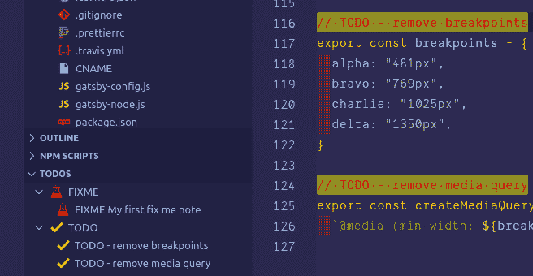

# 代码上的待办事项列表

> 原文：<https://dev.to/eclecticcoding/todo-list-in-vscode-2mnb>

*这篇文章的灵感来自于 [Twitter](https://twitter.com/thecaitcode/status/1160348409313652736) 上的一个帖子，由[凯特琳·格雷弗里](https://caitlyngreffly.com/)* 发起

所以，问题是当你编码时，你如何管理你的待办事项列表？您正在处理组件中的基本功能，并且有一个工作计划，无论是在工作流程图中还是在书面列表中。你怎么会想到要做的事情？有几个简单的选项:

*   一份手写的清单(谁还在写？)
*   项目目录中的降价文件
*   Trello of Board 是一个很好的视觉提醒，尤其是在与 Trello 移动应用程序结合使用时。

## VSCode 扩展

如果您正在使用 VSCode 作为您的 IDE，那么您已经知道几乎所有您需要的东西都有大量的扩展。几个月来，我一直在使用一个名为 [TODO Tree](https://marketplace.visualstudio.com/items?itemName=Gruntfuggly.todo-tree) 的扩展，它在 VSCode 的 explorer 窗格中显示一个树形视图。单击树中的待办事项将打开文件，并将光标放在包含待办事项的行上。

这是它的基本工作原理。安装上面链接中的扩展，并通过在源代码中添加一个 TODO 来测试它，如下所示:
`// TODO - todo note`

或者一个固定音符
`// FIXME - fix something`

现在让我们来探索一下界面

## 界面

[](https://res.cloudinary.com/practicaldev/image/fetch/s--FlPy0FFo--/c_limit%2Cf_auto%2Cfl_progressive%2Cq_66%2Cw_880/https://thepracticaldev.s3.amazonaws.com/i/uw5odwnsgfep9d56iczc.gif)

请注意，在侧边栏中，您现在有一个待办事项树框。有几个图标(见上文)为您提供了不同的选项来过滤和显示待办事项或修复事项列表。当你点击这些笔记中的任何一个时，源文件将会自动打开。

## 高亮显示

在我看来，最好的特性之一是能够突出源代码中的注释，并对 TODO 树中的图标进行颜色编码。这个特性在源代码中有很好的记录，我在下面提供了我的设置。复制到你的 VSCode settings.json:

```
 "todo-tree.customHighlight": {
    "TODO": {
      "icon": "check",
      "type": "line",
      "iconColour": "yellow",
      "foreground": "red",
      "background": "yellow",
    },
    "FIXME": {
      "icon": "beaker",
      "iconColour": "red",
      "foreground": "white",
      "background": "red"
    }
  }, 
```

Enter fullscreen mode Exit fullscreen mode

结果如下:

[](https://res.cloudinary.com/practicaldev/image/fetch/s--nSzQIUuK--/c_limit%2Cf_auto%2Cfl_progressive%2Cq_auto%2Cw_880/https://thepracticaldev.s3.amazonaws.com/i/vporbgidpzomglepojz2.png)

给托多树一个尝试，如果我能帮助你的配置信息给我。