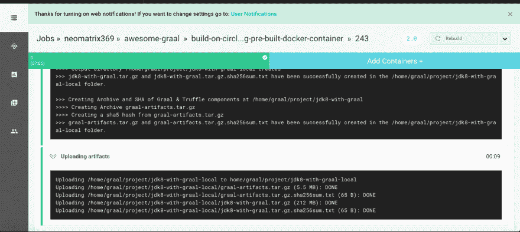
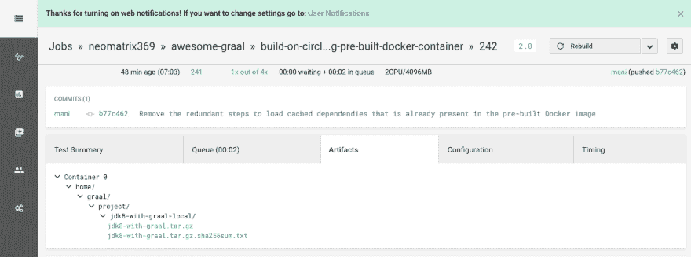

# 如何在 CircleCI 上构建支持 Graal 的 JDK8？

> 原文：<https://dev.to/neomatrix369/how-to-build-graal-enabled-jdk8-on-circleci-14ed>

GraalVM 编译器 T1 是 HotSpot 服务器端 T2 JIT 编译器 T3 的替代品，也就是广为人知的 T4 C2 编译器 T5。它是用 Java 编写的，目标是比 C2 编译器有更好的性能。从 Java 9 开始的新变化意味着我们现在可以将自己手写的 C2 编译器插入到 JVM 中，这要感谢 [JVMCI](https://openjdk.java.net/jeps/243) 。甲骨文实验室[的研究人员和工程师已经创建了一个支持 JVMCI 的 JDK8 变种，可以用来构建 [GraalVM 编译器](https://github.com/oracle/graal/tree/master/compiler)]([http://wikipedia.com/graal-compiler](http://wikipedia.com/graal-compiler))。 [GraalVM 编译器](https://github.com/oracle/graal/tree/master/compiler)是开源的，可以在 GitHub 上获得[(以及构建](http://github.com/oracle/graal) [GraalVM 编译器](https://github.com/oracle/graal/tree/master/compiler)所需的 [HotSpot JVMCI 源代码](https://github.com/graalvm/graal-jvmci-8))。这给了我们派生/克隆它并构建我们自己版本的 GraalVM 编译器的能力。

在这篇文章中，我们将在 CircleCI 上用 JDK8 构建 [GraalVM 编译器](https://github.com/oracle/graal/tree/master/compiler)。产生的工件将会是:

*   嵌入了 [GraalVM 编译器](https://github.com/oracle/graal/tree/master/compiler)的 JDK8，以及
*   包含 Graal & Truffle 模块/组件的 zip 存档。

***注意:我们不会在这篇文章中讨论如何构建整个 GraalVM 套件，这可以通过另一篇文章来完成。虽然这些脚本可以用来说明，并且存在一个*** [***分支，其中包含其余的步骤***](https://github.com/neomatrix369/awesome-graal/tree/build-graalvm-suite) ***。*T13】**

## 为什么要用 CI 工具来构建 [GraalVM 编译器](https://github.com/oracle/graal/tree/master/compiler)？

持续集成(CI)和持续部署(CD)工具有很多好处。其中最重要的是检查代码库健康状况的能力。了解构建失败的原因为您提供了一个更快修复的机会。对于这个项目，重要的是我们能够在本地和 Docker 容器中验证和确认为 Linux 和 macOS 构建 [GraalVM 编译器](https://github.com/oracle/graal/tree/master/compiler)所需的脚本。CI/CD 工具允许我们添加自动化测试，以确保当每个 PR 被合并时，我们从我们的脚本中获得期望的结果。除了确保我们的新代码不会引入重大变化之外，CI/CD 工具的另一个重要特性是，我们可以自动创建二进制文件并自动部署这些二进制文件，使它们可用于开源分发。

# 我们开始吧

在研究将 [CircleCI](http://circleci.com) 作为 CI/CD 解决方案来构建 [GraalVM 编译器](https://github.com/oracle/graal/tree/master/compiler)的过程中，我了解到我们可以通过两种不同的方法来运行构建，即:

*   带有标准 Docker 容器的 CircleCI 构建(更长的构建时间，更长的配置脚本)
*   CircleCI 构建，带有预构建、优化的 Docker 容器(更短的构建时间，更短的配置脚本)

我们现在将讨论上面提到的两种方法，看看它们各自的优缺点。

# 方法 1:使用标准 Docker 容器

对于这种方法，CircleCI 需要一个 docker 映像，该映像可以在 [Docker Hub](https://hub.docker.com/) 或它可以访问的另一个公共/私有注册表中获得。为了成功构建，我们必须在这个可用的环境中安装必要的依赖项。我们预计构建第一次运行的时间会更长，根据缓存的级别，它会加速。

为了理解这是如何做到的，我们将一节一节地浏览 CircleCI 配置文件(存储在`.circleci/circle.yml`中)，参见中的 [config.yml。circleci](https://github.com/neomatrix369/awesome-graal/blob/build-on-circleci/.circleci/config.yml) 查看完整列表，参见 commit [df28ee7](https://github.com/neomatrix369/awesome-graal/commit/df28ee78be289a364dcdf3bdd626bd4a40460a28) 查看源代码更改。

## 解释配置文件的各个部分

配置文件中的下面几行将确保我们安装的应用程序被缓存(指两个特定的目录)，这样我们就不必在每次构建时重新安装依赖项:

```
 dependencies:
      cache_directories:
        - "vendor/apt"
        - "vendor/apt/archives" 
```

Enter fullscreen mode Exit fullscreen mode

我们将引用 docker 图像的全名(在[http://hub.docker.com](http://hub.docker.com)中使用的帐户名- *adoptopenjdk* 下可用)。在这种情况下，这是一个包含 JDK8 的标准 docker 映像，由[采用 OpenJDK 构建场](http://ci.adoptopenjdk.net)背后的好人提供。理论上，我们可以使用任何图像，只要它支持构建过程。它将作为基础层，我们将在其上安装必要的依赖项:

```
 docker:
          - image: adoptopenjdk/openjdk8:jdk8u152-b16 
```

Enter fullscreen mode Exit fullscreen mode

接下来，在预`Install Os dependencies`步骤中，我们将恢复缓存，如果它已经存在，这可能看起来有点奇怪，但是对于唯一键标签，下面的实现是文档推荐的[:](https://circleci.com/docs/2.0/configuration-reference/#restore_cache) 

```
 - restore_cache:
              keys:
                - os-deps-{{ arch }}-{{ .Branch }}-{{ .Environment.CIRCLE_SHA1 }}
                - os-deps-{{ arch }}-{{ .Branch }} 
```

Enter fullscreen mode Exit fullscreen mode

然后，在`Install Os dependencies`步骤中，我们运行各自的 shell 脚本来安装所需的依赖项。如果操作完成时间超过 2 分钟，我们将该步骤设置为超时(参见[文档了解超时](https://discuss.circleci.com/t/how-to-increase-timeout-for-command-in-circle-2-0/20254) ):

```
 - run:
              name: Install Os dependencies
              command: ./build/x86_64/linux_macos/osDependencies.sh
              timeout: 2m 
```

Enter fullscreen mode Exit fullscreen mode

然后，在 then post- `Install Os dependencies`步骤中，我们保存上一步的结果——来自上面运行步骤的层(键名被格式化以确保唯一性，并且包含要保存的具体路径):

```
 - save_cache:
              key: os-deps-{{ arch }}-{{ .Branch }}-{{ .Environment.CIRCLE_SHA1 }}
              paths:
                - vendor/apt
                - vendor/apt/archives 
```

Enter fullscreen mode Exit fullscreen mode

然后，在预`Build and install make via script`步骤中，如果缓存已经存在，我们恢复缓存:

```
 - restore_cache:
              keys:
                - make-382-{{ arch }}-{{ .Branch }}-{{ .Environment.CIRCLE_SHA1 }}
                - make-382-{{ arch }}-{{ .Branch }} 
```

Enter fullscreen mode Exit fullscreen mode

然后，在`Build and install make via script`步骤中，我们运行 shell 脚本来安装特定版本的`make`，如果完成该步骤的时间超过 1 分钟，它将被设置为超时:

```
 - run:
              name: Build and install make via script
              command: ./build/x86_64/linux_macos/installMake.sh
              timeout: 1m 
```

Enter fullscreen mode Exit fullscreen mode

然后，在 post `Build and install make via script`步骤中，我们将上述操作的结果保存到缓存:

```
 - save_cache:
              key: make-382-{{ arch }}-{{ .Branch }}-{{ .Environment.CIRCLE_SHA1 }}
              paths:
                - /make-3.82/
                - /usr/bin/make
                - /usr/local/bin/make
                - /usr/share/man/man1/make.1.gz
                - /lib/ 
```

Enter fullscreen mode Exit fullscreen mode

然后，我们定义环境变量来在运行时更新`JAVA_HOME`和`PATH`。这里的环境变量是`source` d，这样我们就可以在接下来的步骤中记住它们，直到构建过程结束(请记住这一点):

```
 - run:
              name: Define Environment Variables and update JAVA_HOME and PATH at Runtime
              command: |
                echo '....'     <== a number of echo-es displaying env variable values
                source ${BASH_ENV} 
```

Enter fullscreen mode Exit fullscreen mode

然后，在到`Display Hardware, Software, Runtime environment and dependency versions`的步骤中，作为最佳实践，我们显示特定于环境的信息，并将其记录到日志中以备后用(在调试过程中出错时也很有用):

```
 - run:
              name: Display HW, SW, Runtime env. info and versions of dependencies
              command: ./build/x86_64/linux_macos/lib/displayDependencyVersion.sh 
```

Enter fullscreen mode Exit fullscreen mode

然后，我们运行到`setup MX`的步骤——从 [GraalVM 编译器](https://github.com/oracle/graal/tree/master/compiler) ( [mx](https://github.com/graalvm/mx) 是一个专门的构建系统，创建它是为了方便编译和构建 Graal/GraalVM 及其组件):
的角度来看，这很重要

```
 - run:
              name: Setup MX
              command: ./build/x86_64/linux_macos/lib/setupMX.sh ${BASEDIR} 
```

Enter fullscreen mode Exit fullscreen mode

然后，我们运行重要的步骤到`Build JDK JVMCI`(我们在这里构建启用了 JVMCI 的 JDK)并超时，如果该过程花费超过 15 分钟而没有任何输出，或者如果该过程总共花费超过 20 分钟来完成:

```
 - run:
              name: Build JDK JVMCI
              command: ./build/x86_64/linux_macos/lib/build_JDK_JVMCI.sh ${BASEDIR} ${MX}
              timeout: 20m
              no_output_timeout: 15m 
```

Enter fullscreen mode Exit fullscreen mode

然后，我们运行步骤`Run JDK JVMCI Tests`，它在构建 JDK JVMCI:
之后运行测试，作为健全性检查的一部分

```
 - run:
              name: Run JDK JVMCI Tests
              command: ./build/x86_64/linux_macos/lib/run_JDK_JVMCI_Tests.sh ${BASEDIR} ${MX} 
```

Enter fullscreen mode Exit fullscreen mode

然后，我们运行步骤`Setting up environment and Build GraalVM Compiler`，用必要的环境变量来设置构建环境，这些变量将被后面的步骤使用:

```
 - run:
              name: Setting up environment and Build GraalVM Compiler
              command: |
                echo ">>>> Currently JAVA_HOME=${JAVA_HOME}"
                JDK8_JVMCI_HOME="$(cd ${BASEDIR}/graal-jvmci-8/ && ${MX} --java-home ${JAVA_HOME} jdkhome)"
                echo "export JVMCI_VERSION_CHECK='ignore'" >> ${BASH_ENV}
                echo "export JAVA_HOME=${JDK8_JVMCI_HOME}" >> ${BASH_ENV}
                source ${BASH_ENV} 
```

Enter fullscreen mode Exit fullscreen mode

然后，我们运行步骤`Build the [GraalVM Compiler](https://github.com/oracle/graal/tree/master/compiler) and embed it into the JDK (JDK8 with JVMCI enabled)`，如果该过程花费超过 7 分钟而没有任何输出，或者总共超过 10 分钟才完成，则该步骤超时:

```
 - run:
              name: Build the [GraalVM Compiler](https://github.com/oracle/graal/tree/master/compiler) and embed it into the JDK (JDK8 with JVMCI enabled)
              command: |
                echo ">>>> Using JDK8_JVMCI_HOME as JAVA_HOME (${JAVA_HOME})"
                ./build/x86_64/linux_macos/lib/buildGraalCompiler.sh ${BASEDIR} ${MX} ${BUILD_ARTIFACTS_DIR}
              timeout: 10m
              no_output_timeout: 7m 
```

Enter fullscreen mode Exit fullscreen mode

然后，在归档工件之前，我们运行简单的健全性检查来验证构建完成后创建的工件的有效性:

```
 - run:
              name: Sanity check artifacts
              command: |
                ./build/x86_64/linux_macos/lib/sanityCheckArtifacts.sh ${BASEDIR} ${JDK_GRAAL_FOLDER_NAME}
              timeout: 3m
              no_output_timeout: 2m 
```

Enter fullscreen mode Exit fullscreen mode

然后，我们运行步骤`Archiving artifacts`(意味着将最终的工件压缩并复制到一个单独的文件夹中)，如果这个过程花费超过 2 分钟而没有任何输出，或者总共超过 3 分钟才完成，那么这个步骤就会超时:

```
 - run:
              name: Archiving artifacts
              command: |
                ./build/x86_64/linux_macos/lib/archivingArtifacts.sh ${BASEDIR} ${MX} ${JDK_GRAAL_FOLDER_NAME} ${BUILD_ARTIFACTS_DIR}
              timeout: 3m
              no_output_timeout: 2m 
```

Enter fullscreen mode Exit fullscreen mode

出于后代和调试的目的，我们从不同的文件夹中捕获生成的日志并存档:

```
 - run:
              name: Collecting and archiving logs (debug and error logs)
              command: |
                ./build/x86_64/linux_macos/lib/archivingLogs.sh ${BASEDIR}
              timeout: 3m
              no_output_timeout: 2m
              when: always
          - store_artifacts:
              name: Uploading logs
              path: logs/ 
```

Enter fullscreen mode Exit fullscreen mode

最后，我们将生成的工件存储在一个指定的位置——下面几行将使这个位置在 CircleCI 接口上可用(我们可以从这里下载工件):

```
 - store_artifacts:
              name: Uploading artifacts in jdk8-with-graal-local
              path: jdk8-with-graal-local/ 
```

Enter fullscreen mode Exit fullscreen mode

# 方法 2:使用预构建的优化 Docker 容器

对于方法 2，我们将使用预构建的 docker 容器，该容器已经在本地创建并构建了所有必要的依赖项，docker 映像被保存，然后被推送到远程注册表，例如 [Docker Hub](https://hub.docker.com/) 。然后我们将通过配置文件在 CircleCI 环境中引用这个 docker 映像。这节省了我们运行所有命令来安装必要的依赖项，从而为这种方法创建必要环境的时间和精力(参见方法 1 中的详细步骤)。

与之前的构建相比，我们预计构建运行的时间会更短，这种加速是预构建 docker 映像的结果(我们将在**中看到构建预构建 docker 映像的步骤**，以了解这是如何完成的)。额外的速度优势来自于 CircleCI 缓存 docker 图像层，这反过来导致构建环境的更快启动。

对于这种方法，我们将逐节查看 CircleCI 配置文件(存储在`.circleci/circle.yml`中),请参见。circleci 查看完整列表，参见 commit [e5916f1](https://github.com/neomatrix369/awesome-graal/commit/e5916f1ffbc6ca0b8f5cd2ed71a6883e5a2de031) 查看源代码更改。

## 解释配置文件的各个部分

这里，我们将再次使用 docker 图像的全名来引用它。这是由 [neomatrix369](https://hub.docker.com/u/neomatrix369) 提供的预建 docker 映像[neo matrix 369/graalvm-suite-JDK 8](https://hub.docker.com/r/neomatrix369/graalvm-suite-jdk8)。在 CircleCI 构建开始之前，它已经被提前构建并上传到 [Docker Hub](https://hub.docker.com/) 。它包含了将要构建的 [GraalVM 编译器](https://github.com/oracle/graal/tree/master/compiler)所必需的依赖项:

```
 docker:
          - image: neomatrix369/graal-jdk8:${IMAGE_VERSION:-python-2.7}
        steps:
          - checkout 
```

Enter fullscreen mode Exit fullscreen mode

下面的所有部分执行与方法 1 完全相同的任务(和相同的目的)，见**解释配置文件**的部分。

除此之外，我们删除了以下章节，因为**方法 2:**
不再需要这些章节

```
 - restore_cache:
              keys:
                - os-deps-{{ arch }}-{{ .Branch }}-{{ .Environment.CIRCLE_SHA1 }}
                - os-deps-{{ arch }}-{{ .Branch }}
          - run:
              name: Install Os dependencies
              command: ./build/x86_64/linux_macos/osDependencies.sh
              timeout: 2m
          - save_cache:
              key: os-deps-{{ arch }}-{{ .Branch }}-{{ .Environment.CIRCLE_SHA1 }}
              paths:
                - vendor/apt
                - vendor/apt/archives
          - restore_cache:
              keys:
                - make-382-{{ arch }}-{{ .Branch }}-{{ .Environment.CIRCLE_SHA1 }}
                - make-382-{{ arch }}-{{ .Branch }}
          - run:
              name: Build and install make via script
              command: ./build/x86_64/linux_macos/installMake.sh
              timeout: 1m
          - save_cache:
              key: make-382-{{ arch }}-{{ .Branch }}-{{ .Environment.CIRCLE_SHA1 }}
              paths:
                - /make-3.82/
                - /usr/bin/make
                - /usr/local/bin/make
                - /usr/share/man/man1/make.1.gz 
```

Enter fullscreen mode Exit fullscreen mode

在下一节中，我将介绍如何构建预构建的 docker 映像的步骤。它将涉及运行 bash 脚本- `./build/x86_64/linux_macos/osDependencies.sh`和`./build/x86_64/linux_macos/installMake.sh`来安装必要的依赖项，作为构建 docker 映像的一部分。最后，将映像推送到 [Docker Hub](https://hub.docker.com/) (可以推送到您选择的任何其他远程注册表)。

## 构建预建 docker 镜像的步骤

*   运行`build-docker-image.sh`(参见 bash 脚本源)，这取决于`Dockerfile`(参见 docker 脚本源)的存在。`Dockerfile`完成在容器内运行依赖项的所有必要任务，即运行 bash 脚本`./build/x86_64/linux_macos/osDependencies.sh`和`./build/x86_64/linux_macos/installMake.sh`:

```
 $ ./build-docker-image.sh 
```

Enter fullscreen mode Exit fullscreen mode

*   一旦成功构建了映像，在设置了`USER_NAME`和`IMAGE_NAME`之后运行`push-graal-docker-image-to-hub.sh`(参见源代码)，否则它将使用 bash 脚本中设置的默认值:

```
 $ USER_NAME="[your docker hub username]" IMAGE_NAME="[any image name]" \
        ./push-graal-docker-image-to-hub.sh 
```

Enter fullscreen mode Exit fullscreen mode

## CircleCI 配置文件统计:方法 1 与方法 2

| **感兴趣的领域** | **接近 1** | **接近 2** |
| --- | --- | --- |
| **配置文件(完整的源代码列表)** | [循环构建](https://github.com/neomatrix369/awesome-graal/blob/build-on-circleci/.circleci/config.yml) | [构建-使用-预构建-docker-image](https://github.com/neomatrix369/awesome-graal/blob/build-on-circleci-using-pre-built-docker-container/.circleci/config.yml) |
| **提交点(sha)** | [df28ee7](https://github.com/neomatrix369/awesome-graal/commit/df28ee78be289a364dcdf3bdd626bd4a40460a28) | [e5916f1](https://github.com/neomatrix369/awesome-graal/commit/e5916f1ffbc6ca0b8f5cd2ed71a6883e5a2de031) |
| **代码行(loc)** | 110 行 | 85 行 |
| **源行(sloc)** | 110 sloc | 85 sloc |
| **步骤(`steps:`节)** | Nineteen | Fifteen |
| **表演** **(参见表演部分)** | 由于缓存，速度有所加快，但是**比方法 2** 慢 | 由于预先构建的 docker 映像以及不同步骤的缓存，速度得到了提高。**快于接近 1**

*确保 DLC 分层被启用(其一个付费功能)* |

# 什么事情不能做？

*   **方法 1 问题**
    *   我遇到过最初无法工作的情况，但后来通过更改配置文件或脚本得到了解决:
        *   请确保`.circleci/config.yml`总是在文件夹的根目录下
        *   当在`.circleci/config.yml`文件设置中使用`store_artifacts`指令时，将值设置为一个固定的文件夹名，即`jdk8-with-graal-local/`——在我们的例子中，将`path`设置为`${BASEDIR}/project/jdk8-with-graal`并不会在构建完成后创建最终的工件，因此建议使用固定的路径名。
        *   环境变量:使用环境变量时，请记住每个命令都在自己的 shell 中运行，因此在 shell 执行环境中设置的环境变量的值在外部是不可见的，请遵循本文上下文中使用的方法。设置环境变量，以便所有命令都可以看到其所需的值，以避免在每个步骤结束时出现不正常的行为或意外的结果。
        *   缓存:阅读后使用缓存功能，关于 **CircleCI** 缓存的更多细节请参考[缓存文档](https://circleci.com/docs/2.0/caching/)。看看它是如何在这篇文章中实现的。这将有助于避免混淆，也有助于更好地利用 **CircleCI** 提供的功能。
*   **方法 2 问题**
    *   缓存:当尝试使用 [Docker 层缓存](https://circleci.com/docs/2.0/docker-layer-caching/) (DLC)选项时检查文档，因为这是一个付费功能，一旦知道了这一点，关于“为什么 CircleCI 在每次构建期间一直下载所有层”的疑问将会澄清，关于 Docker 层缓存的详细信息请参考[文档](https://circleci.com/docs/2.0/docker-layer-caching/)。这也可以解释为什么在非付费模式下，我的构建仍然没有我希望的那么快。

**一般说明:**

*   轻量级实例:为了避免认为我们可以运行重载构建的陷阱，请查看实例技术规范的文档。如果我们运行标准的 Linux 命令来探测实例的技术规格，我们可能会被误导，以为它们是高规格的机器。参见登记实例的硬件和软件详细信息的步骤(参见*显示硬件、软件、运行时环境)。依赖关系的信息和版本*。这些实例实际上是虚拟机或类似容器的环境，具有 2CPU/4096MB 等资源。这意味着我们不能运行长时间运行或像构建 GraalVM 套件这样的重载构建。也许有另一种方法来处理这些类型的构建，或者也许这样的构建需要被分解成更小的部分。
*   全局环境变量:由于`config.yml`中的每一行`run`都在自己的 shell 上下文中运行，因此在该上下文中，由其他执行上下文设置的环境变量不能访问这些值。因此为了克服这一点，我们采用了两种方法:
    *   将变量作为参数传递给调用 bash/shell 脚本，以确保脚本能够访问环境变量中的值
    *   使用`source`命令作为运行步骤，使环境变量可全局访问#最终结果和总结

在一个构建成功完成后，我们会看到下面的屏幕(最后一步，即更新工件，在工件被复制的地方登记):

[](https://res.cloudinary.com/practicaldev/image/fetch/s--9zSzHiSv--/c_limit%2Cf_auto%2Cfl_progressive%2Cq_auto%2Cw_880/https://d2mxuefqeaa7sj.cloudfront.net/s_0E00A6756F5EBCD8DBF748743849C06E4748E4E6CE0A05E774A3437A1D05267C_1546386222555_Screen%2BShot%2B2019-01-01%2Bat%2B23.43.04.png)

工件现在被放置在正确的文件夹中以供下载。我们主要关注的是`jdk8-with-graal.tar.gz`神器。

## 表现

在写这篇文章之前，我对这两种方法进行了多次测试，并记下了完成构建所需的时间，如下所示:

*   **方法 1:** 标准 CircleCI 构建(启用缓存)
    *   13 分 28 秒
    *   13 分 59 秒
    *   14 分 52 秒
    *   10 分 38 秒
    *   10 分 26 秒
    *   10 分 23 秒
*   **方法 2:** 使用预建的 docker 映像(启用缓存， [DLC](https://circleci.com/docs/2.0/docker-layer-caching/) 功能不可用)
    *   13 分 15 秒
    *   15 分 16 秒
    *   15 分 29 秒
    *   15 分 58 秒
    *   10 分 20 秒
    *   9 分 49 秒

**注意:** ** ***方法 2*** *在使用付费层时应该表现出更好的性能，因为* [*Docker 层缓存*](https://circleci.com/docs/2.0/docker-layer-caching/) *是此计划的一部分。*

## 理智检查

为了确保通过使用上述两种方法，我们实际上已经构建了一个嵌入了 [GraalVM 编译器](https://github.com/oracle/graal/tree/master/compiler)的有效 JDK，我们对创建的工件执行以下步骤:

*   首先，在 CircleCI 仪表盘的**工件选项卡**下下载`jdk8-with-graal.tar.gz`工件(需要登录):
    [](https://res.cloudinary.com/practicaldev/image/fetch/s--rP_Q3q-8--/c_limit%2Cf_auto%2Cfl_progressive%2Cq_auto%2Cw_880/https://d2mxuefqeaa7sj.cloudfront.net/s_0E00A6756F5EBCD8DBF748743849C06E4748E4E6CE0A05E774A3437A1D05267C_1546380812679_Screen%2BShot%2B2019-01-01%2Bat%2B22.13.06.png)

*   然后，解压`.tar.gz`文件并执行以下操作:

```
 tar xvf jdk8-with-graal.tar.gz 
```

Enter fullscreen mode Exit fullscreen mode

*   此后，运行以下命令检查 JDK 二进制文件是否有效:

```
 cd jdk8-with-graal
    ./bin/java -version 
```

Enter fullscreen mode Exit fullscreen mode

*   最后，检查我们是否得到下面的输出:

```
 openjdk version "1.8.0-internal"
    OpenJDK Runtime Environment (build 1.8.0-internal-jenkins_2017_07_27_20_16-b00)
    OpenJDK 64-Bit Graal:compiler_ab426fd70e30026d6988d512d5afcd3cc29cd565:compiler_ab426fd70e30026d6988d512d5afcd3cc29cd565 (build 25.71-b01-internal-jvmci-0.46, mixed mode) 
```

Enter fullscreen mode Exit fullscreen mode

*   类似地，为了确认 JRE 是否有效并且内置了 [GraalVM 编译器](https://github.com/oracle/graal/tree/master/compiler)，我们这样做:

```
 ./bin/jre/java -version 
```

Enter fullscreen mode Exit fullscreen mode

*   并检查我们是否得到与上面类似的输出:

```
 openjdk version "1.8.0-internal"
    OpenJDK Runtime Environment (build 1.8.0-internal-jenkins_2017_07_27_20_16-b00)
    OpenJDK 64-Bit Graal:compiler_ab426fd70e30026d6988d512d5afcd3cc29cd565:compiler_ab426fd70e30026d6988d512d5afcd3cc29cd565 (build 25.71-b01-internal-jvmci-0.46, mixed mode) 
```

Enter fullscreen mode Exit fullscreen mode

这样，我们成功地构建了嵌入了 [GraalVM 编译器](https://github.com/oracle/graal/tree/master/compiler)的 JDK8，并且将 Graal 和 Truffle 组件捆绑在一个归档文件中，这两个组件都可以通过 CircleCI 接口下载。

***注意:*** *你会注意到，作为构建步骤的一部分，我们在将构建好的二进制文件打包到压缩文档之前，会对它们进行完整性检查(见配置文件一节)。*

# 不错的徽章！

我们都喜欢炫耀，也喜欢知道我们构建工作的当前状态。绿色的构建状态图标是成功的一个很好的标志，它看起来像下面的 markdown 自述文件页面:

[](https://res.cloudinary.com/practicaldev/image/fetch/s--a2dAuNhl--/c_limit%2Cf_auto%2Cfl_progressive%2Cq_auto%2Cw_880/https://d2mxuefqeaa7sj.cloudfront.net/s_0E00A6756F5EBCD8DBF748743849C06E4748E4E6CE0A05E774A3437A1D05267C_1547758905612_Screen%2BShot%2B2019-01-17%2Bat%2B21.00.44.png)

我们可以非常容易地嵌入这两个状态徽章，显示我们在 CircleCI 上构建的项目的构建状态(分支特定的，即主分支或您创建的另一个分支)。

# 结论

我们探索了两种使用 CircleCI 环境构建 [GraalVM 编译器](https://github.com/oracle/graal/tree/master/compiler)的方法。它们是比较这两种方法的性能以及我们如何轻松实现它们的很好的实验。我们也看到了一些*要避免的事情*或者*不要做的事情*，也看到了 CircleCI 的一些特性是多么有用。文档和论坛在尝试构建工作或遇到困难时发挥了很好的作用。

一旦我们了解了 CircleCI 环境，它就很容易使用，并且每次运行它都会给我们完全相同的响应(一致的行为)。它短暂的本质意味着我们保证在每次运行前有一个干净的环境，并在运行结束后清理干净。我们还可以为构建的每个步骤设置构建时间检查，如果完成一个步骤所用的时间超过了阈值时间段，就中止构建。

在 CircleCI 上使用预构建的 docker 映像和 [Docker 层缓存](https://circleci.com/docs/2.0/docker-layer-caching/)的能力可以大幅提升性能(节省我们在每次构建时重新安装任何必要依赖项所需的构建时间)。CircleCI 还提供了额外的性能加速，包括构建步骤的缓存——这又一次节省了构建时间，因为如果它们没有改变，就不必重新运行相同的步骤。

CircleCI 上有很多有用的功能，有大量的文档，社区论坛上的每个人都很有帮助，问题很快就得到了解答。

接下来，让我们在另一个构建环境/构建场上构建相同的或更多的——提示，提示，你的想法和我一样吗？[采用 OpenJDK 构建农场](http://ci.adoptopenjdk.net)？我们可以试一试！

*感谢来自 [CircleCI](http://circleci.com/) 的 [Ron Powell](https://twitter.com/whyd0my3y3shurt?lang=en) 和来自 [Oracle Labs](https://labs.oracle.com/) 的[Oleg elajev](https://twitter.com/shelajev)的校对和建设性反馈。*

**请在下面的评论中留言或者发推文到 [@theNeomatrix369](http://twitter.com/@theNeomatrix369) 让我知道这是否有帮助，我也欢迎反馈，看看你如何[联系到我](https://neomatrix369.wordpress.com/about/)，最重要的是请查看上面提到的链接。**

# 有用的资源

*   链接到有用的 CircleCI 文档
    *   [关于入门](https://circleci.com/docs/2.0/getting-started/) | [视频](https://www.youtube.com/watch?v=otBELDgOo3o)
    *   [关于 Docker](https://circleci.com/docker/)
        *   [Docker 层缓存](https://circleci.com/docs/2.0/docker-layer-caching/)
    *   [关于缓存](https://circleci.com/docs/2.0/caching/)
    *   [关于通过 SSH 调试](https://circleci.com/docs/2.0/ssh-access-jobs/)
    *   [CircleCI cheatsheet](https://devhints.io/circle)
    *   [CircleCI 社区(讨论)](https://discuss.circleci.com/)
        *   [最新社区话题](https://discuss.circleci.com/c/community)
*   CircleCI 配置和支持文件
    *   **方法一:**[https://github . com/neo matrix 369/awesome-graal/tree/build-on-circle ci](https://github.com/neomatrix369/awesome-graal/tree/build-on-circleci)(配置文件和其他支持文件，即脚本、目录布局等……)
    *   **方法二:**[https://github . com/neo matrix 369/awesome-graal/tree/build-on-circle ci-using-pre-build-docker-container](https://github.com/neomatrix369/awesome-graal/tree/build-on-circleci-using-pre-built-docker-container)(配置文件和其他支持文件即脚本、目录布局等……)
*   [在 Linux、macOS 和 Docker 容器内部构建 Graal 的脚本](https://github.com/neomatrix369/awesome-graal/tree/master/build/x86_64/linux_macos)
*   [松露装在圣杯中:圣杯和松露用于 JVM 上的多语言解释](https://medium.com/p/d33f0d96b78?source=user_profile---------8------------------)
*   学习使用整个 GraalVM！
*   用块菌建造完整的 Graal！

## 关于我

Mani Sarkar 是一名充满激情的开发人员，主要从事 Java/JVM 领域的工作，目前作为一名自由软件工程师/数据/ml 工程师，他正在加强团队，并帮助他们在与小型团队和初创公司合作时加快速度。

**Twitter:**[@ the neomatrix 369](https://twitter.com/@theNeomatrix369)|**github:**[@ new matrix 369](https://github.com/neomatrix369)