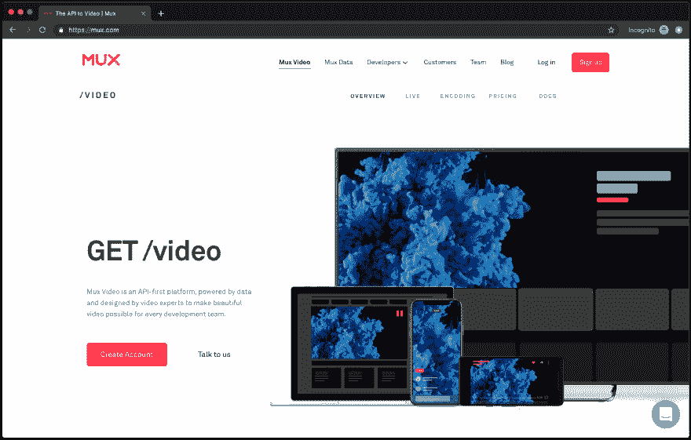
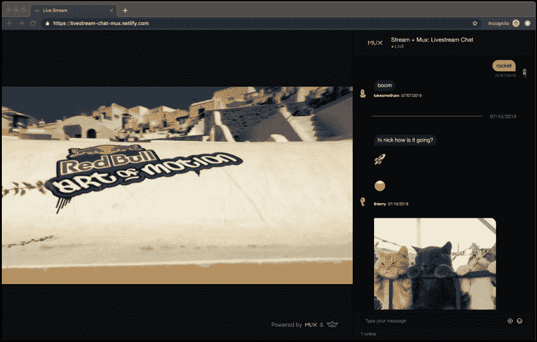
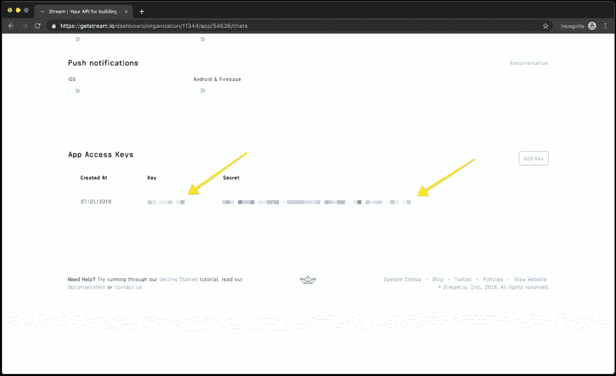
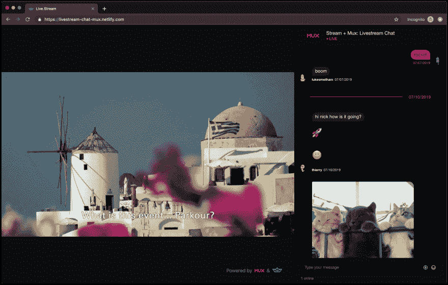
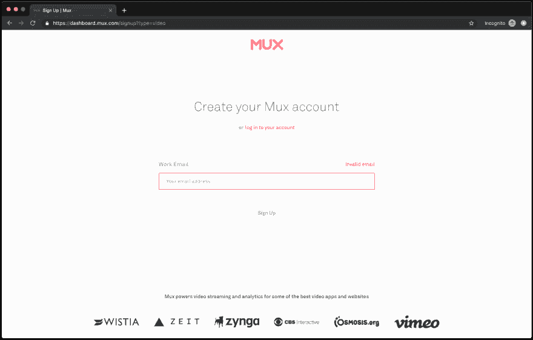
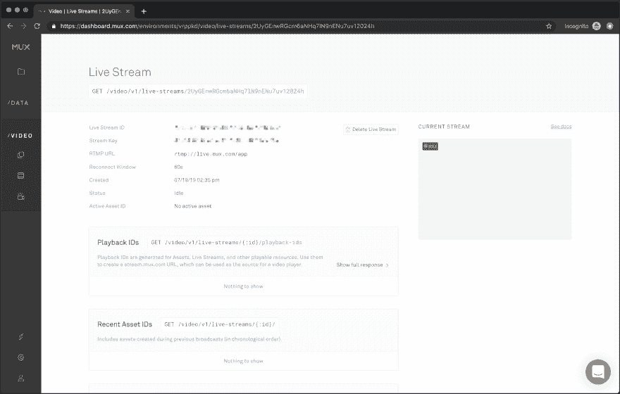
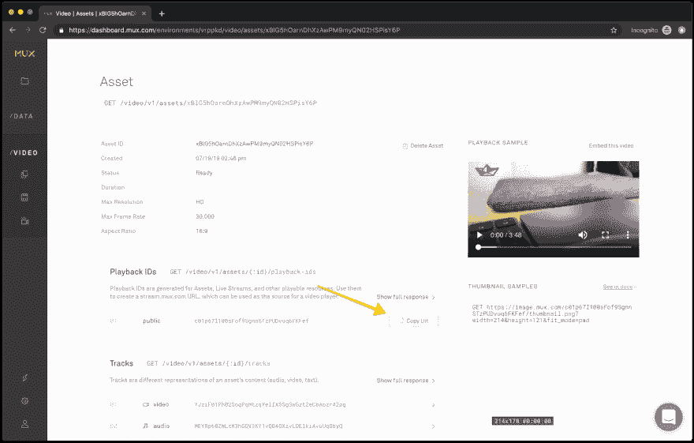

# 教程:使用 Mux 和流聊天进行实时流传输

> 原文：<https://dev.to/nickparsons/tutorial-live-streaming-with-mux-stream-chat-59fm>

[Mux](https://mux.com) 提供高质量的实时流媒体，可通过易于使用的 API 访问，因此您可以专注于开发您的产品。这是一个极其灵活的平台，甚至可以为最苛刻的实时流使用案例提供功能。

在 [Stream](https://getstream.io/) 这里，我们的团队专门研究实时 [Feeds](https://getstream.io/activity-feeds/) 和 [Chat](https://getstream.io/chat/) 技术，所以，很自然地，我们认为与 [Mux](https://mux.com) 合作并建立终极聊天和直播视频教程将是一个很好的主意。

[](https://res.cloudinary.com/practicaldev/image/fetch/s--8RXAgTK6--/c_limit%2Cf_auto%2Cfl_progressive%2Cq_auto%2Cw_880/https://i.imgur.com/q1mE7xQ.png)

*为了先睹为快，请点击[这个链接](https://livestream-chat-mux.netlify.com)并在聊天室添加表情符号。请务必使用“后备视频”，当然，除非您已经准备好了一个. m3u8 文件(HLS 格式)。*

[](https://res.cloudinary.com/practicaldev/image/fetch/s--_SshFqbT--/c_limit%2Cf_auto%2Cfl_progressive%2Cq_auto%2Cw_880/https://i.imgur.com/EUhMEc6.png)

## 先做第一件事

让我们讨论一下直播背后的协议，它们是如何工作的，以及它们需要什么。

### 什么是 RTMP？

[RTMP](https://en.wikipedia.org/wiki/Real-Time_Messaging_Protocol) 和 M3U8(也称为 [HLS](https://en.wikipedia.org/wiki/HTTP_Live_Streaming) )都是用于流媒体直播视频和音频的协议。

RTMP 在 Macromedia 时代就开始了，Macromedia 现在归 Adobe 所有。RTMP 是 Macromedia Flash 和服务器之间通过互联网传输音频、视频和数据的专有协议。由于其受欢迎程度以及在设备和服务器之间保持持久连接和低延迟通信的能力，它现在已经成为设备直播应用程序的事实上的标准。

### m3u 8/HLS 呢？

另一方面，M3U8，也称为 HLS，是由苹果公司开发的，目的是将视频和音频传输到 QuickTime，Safari，macOS 和 iOS 设备。自诞生以来，它已经成为一个得到广泛支持的协议，允许跨各种平台进行视频和音频的直播，甚至那些不是苹果专用的平台。

### 使用协议

简单来说，你用记录*的设备(如 iOS、Android 或桌面通过 OBS)会使用 RTMP 协议；而设备*回放*将使用 M3U8 或 HLS 格式。*

RTMP 直接进入服务器，在那里被转换成 M3U8/HLS 格式。从那里，它直接实时传输到您的设备。

术语“实时”是可变的，因为它取决于许多因素，其中一些因素包括:

*   网络连接
*   视频的大小(720p 对 1080p，等等。)
*   音频层
*   代码转换的速度

## 先决条件

*   Node.js (v11+)
*   纱线(首选)或 npm
*   Mux 的免费试用帐户
*   与 Stream 的免费聊天试用
*   对 git 的理解

***注意**:我们将在整个教程中使用纱线；然而，如果您想用 npm 安装您的依赖项，这完全没问题。*

## 入门

首先，我们将从 GitHub 克隆两个存储库。为了简单起见，我们将在您的机器上本地运行这两个项目；但是，您可以更进一步，部署到 Heroku 或您选择的其他主机提供商。

首先，在您的机器上创建一个名为 mux 的新目录。从那里，复制并粘贴下面的代码片段到您的终端来克隆前端:

```
$ cd mux
$ git clone https://github.com/GetStream/livestream-chat-mux.git web && cd web && yarn 
```

Enter fullscreen mode Exit fullscreen mode

现在您已经将 web repo 克隆到了您的`mux`目录中，让我们继续克隆后端 API。这尤其重要，因为您需要为进入聊天的用户生成一个令牌。退出 web 目录，进入主`mux`目录。在`mux`目录下，运行以下命令:

```
$ cd ../
$ git clone https://github.com/GetStream/livestream-chat-api.git api && cd api && yarn 
```

Enter fullscreen mode Exit fullscreen mode

一旦您克隆了两个存储库并安装了依赖项，我们就可以进入下一步，在这里我们将输入凭据。

## 1。收集流凭据

在我们开始之前，让我们从 [Stream Chat](https://getstream.io/chat/) 获取您的凭证。如果你还没有 Stream 的账户，你可以在 https://getstream.io/chat/的[创建一个——这包括 14 天的免费信用卡试用。](https://getstream.io/chat/)

接下来，您需要复制下图中概述的凭证，并将其保存在安全的地方(我们将在教程的后面使用它们)。

1.  转到流仪表板
2.  创建新的应用程序
3.  点击顶部导航栏中的聊天
4.  向下滚动到“应用访问密钥”并查看您的凭证

[](https://res.cloudinary.com/practicaldev/image/fetch/s--7wL5R0Ma--/c_limit%2Cf_auto%2Cfl_progressive%2Cq_auto%2Cw_880/https://i.imgur.com/FE9g6UF.png)

## 2。生成环境文件并添加您的凭据

在 web 目录的根目录下，创建一个名为`.env`的新文件，并添加以下值:

```
REACT_APP_API_ENDPOINT=http://localhost:8080
REACT_APP_STREAM_KEY=<YOUR_STREAM_API_KEY>
SASS_PATH=./node_modules 
```

Enter fullscreen mode Exit fullscreen mode

接下来，让我们处理 API。与上面类似，创建一个. env 文件，并在 api 目录中添加以下值:

```
NODE_ENV=development
PORT=8080
STREAM_API_KEY=<YOUR_STREAM_API_KEY>
STREAM_API_SECRET=<YOUR_STREAM_API_SECRET> 
```

Enter fullscreen mode Exit fullscreen mode

## 3。启动 Web 应用程序和 API

现在我们已经为 web 和 API 设置了环境变量，是时候启动它们了，看看我们要做些什么。

转到`api`目录并运行`yarn start`命令。您还需要打开一个新的终端，并使用`yarn start`命令启动 web 应用程序。一旦启动并运行，您的 API 将在端口`8080`上可用，web 将在端口`3000`上运行。两者都将于`http://localhost:<PORT>`在当地发售。

把 http://localhost:3000 放到你的浏览器中，享受一点乐趣。首先，唯一的选择将是使用“后备视频”；然而，聊天应该是有效的。尝试键入“rocket”或添加您选择的表情符号。

登录后，您的 web 应用程序应该如下所示:

[](https://res.cloudinary.com/practicaldev/image/fetch/s--fXOvPQme--/c_limit%2Cf_auto%2Cfl_progressive%2Cq_auto%2Cw_880/https://i.imgur.com/1sioF9E.png)

## 用 Mux 进行流式传输

既然您已经有了一个定制的应用程序并正在运行，那么让我们来享受一下 Mux 的乐趣吧！首先在这里创建一个免费的 Mux 帐户。

[](https://res.cloudinary.com/practicaldev/image/fetch/s--Q82-pMIl--/c_limit%2Cf_auto%2Cfl_progressive%2Cq_auto%2Cw_880/https://i.imgur.com/VaHfEof.png)

一旦你的帐户被设置，前往仪表板，点击“视频”，然后点击第三个选项(实时流)。

[](https://res.cloudinary.com/practicaldev/image/fetch/s--s3qVQGJO--/c_limit%2Cf_auto%2Cfl_progressive%2Cq_auto%2Cw_880/https://i.imgur.com/IGw7Us2.png)

单击页面右上角的“创建新的实时流”按钮。

[](https://res.cloudinary.com/practicaldev/image/fetch/s--iZEQAb8v--/c_limit%2Cf_auto%2Cfl_progressive%2Cq_auto%2Cw_880/https://i.imgur.com/f1BOWyi.png)

接下来，单击“运行请求”按钮来执行 API 调用，这将为您创建一个新的实时流。

[](https://res.cloudinary.com/practicaldev/image/fetch/s--_WfG2yTw--/c_limit%2Cf_auto%2Cfl_progressive%2Cq_auto%2Cw_880/https://i.imgur.com/6oJtWDl.png)

创建完成后，点击“查看实时流”。

[](https://res.cloudinary.com/practicaldev/image/fetch/s--ErCafG2m--/c_limit%2Cf_auto%2Cfl_progressive%2Cq_auto%2Cw_880/https://i.imgur.com/ayHFruo.png)

上面显示的页面包含了您需要的各种连接信息。获取“流密钥”值并将其存储在某个地方。您将需要此值来从您的设备进行实时传输。

在 iOS 上，下载“Broadcaster ”,这是一款适用于 iPhone 的 RTMP 应用程序——你可以在 iOS 的苹果商店找到它，它是 100%免费的。如果你运行的是安卓系统，有各种各样的 RTMP 应用可供选择。一旦下载，输入“RTMP 网址”作为主机，以及“流密钥”。在应用程序中单击“上线”,如果您使用的是不同的 RTMP 应用程序，则单击等效按钮。

[](https://res.cloudinary.com/practicaldev/image/fetch/s--4vH2WYZu--/c_limit%2Cf_auto%2Cfl_progressive%2Cq_auto%2Cw_880/https://i.imgur.com/ILgENsp.png)

既然您已经将视频从您的设备“实时流式传输”到 Mux，请使用播放 URL (HLS feed URL)更新您的 web 应用程序，以便您可以近乎实时地查看您的视频。

一旦您“上线”，就可以通过 Mux 仪表板访问“资产”。抓取“公共网址”,放入你的应用仪表板。

[](https://res.cloudinary.com/practicaldev/image/fetch/s--BisBNOxY--/c_limit%2Cf_auto%2Cfl_progressive%2Cq_auto%2Cw_880/https://i.imgur.com/q4k4iJ2.png)

URL 应该以`.m3u8`结尾，如果工作正常，您应该可以在应用程序中看到您的直播视频！

[](https://res.cloudinary.com/practicaldev/image/fetch/s--feGdpqM1--/c_limit%2Cf_auto%2Cfl_progressive%2Cq_auto%2Cw_880/https://i.imgur.com/QRJoUDH.png)

## 最后的想法

视频直播如今风靡一时。无论你是在 Twitch 上观看职业玩家在野兽模式下玩堡垒之夜，还是在老鹰筑巢，使用 Mux 进行实时观看都是一种方式。

通过组合使用 [Mux](https://mux.com) 和 [Stream Chat](https://getstream.io/chat/) ，你不仅可以观看现场发生的事情，还可以就现场视频中发生的事情进行实时聊天。它不仅有趣，而且有用，最重要的是，功能强大。使用指导您完成上述步骤的教程作为起点，您现在可以在您选择的任何应用程序中创建自己的体验。

有关 Mux 和该平台各种产品的更多信息，请访问他们的网站[https://mux.com](https://mux.com)。如果你对[流聊天](https://getstream.io/chat/)感兴趣，可以试试互动 [API 之旅](https://getstream.io/chat/get_started/)。

如果你有兴趣构建一个完全定制的版本，Stream Chat 提供了用于 iOS[和](https://getstream.io/tutorials/ios-chat/) [React Native](https://getstream.io/chat/react-native-chat/tutorial/) 的 SDK(以及其他[SDK](https://github.com/GetStream/stream-sdks)),此外还有用于 React 组件的 SDK，以便于集成。

编码快乐！✌️