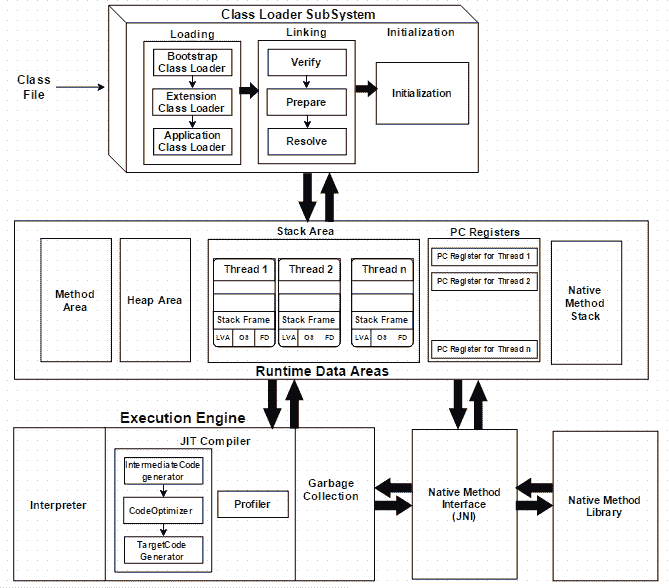

# 简而言之，JVM 架构

> 原文：<https://dev.to/hrishi2710/jvm-architecture-in-a-nutshell-2jj1>

我们在 IDE 中写了一个代码，它是如何被执行的？它如何显示我们想要的输出(不总是这样！)?这个问题困扰了许多初学者以及一些高级程序员。在这里，我将尝试在某种程度上回答这些相对于 JAVA 的问题。

因此，众所周知，所有编译、执行代码的脏活都是由 Java 虚拟机(JVM)完成的。但是 JVM 到底是由什么组成的呢？它是如何执行代码的？

我们在 IDE 上写的任何东西都存在于 java 源文件中。java 文件)。然后使用 Java 编译器对其进行编译(通过 javac 命令)。java 类文件(。类文件),然后将其提供给类加载器子系统。

整个 JVM 架构如下所示:

### **类加载器子系统**

这需要。类文件，并对其执行三项操作:

**加载**

所有核心 Java API 类都由引导类加载器加载。扩展文件夹中的类，比如 jdk 和 jrk 文件，是由扩展类加载器加载的。进一步的应用程序类加载器从应用程序级加载类，并将其加载到类路径中。

**链接**

这里，加载的类文件是为执行准备的。验证操作验证语法。静态变量在 prepare 块中被分配内存，这些变量也被初始化(注意:-这里变量用默认值初始化)。此外，在执行 resolve 块时，所有符号引用都被替换为方法区域中的原始引用。

**初始化**

最后，静态变量用指定的初始值初始化，所有静态块都被执行。每个文件和操作在运行时都需要一个内存区域。JVM 提供了各种运行时数据区域。

### **运行期数据区**

**方法区**

全部。类文件被转储到这里。它还包含所有静态变量。

**堆区**

它由所有实例变量或对象数据组成。

**堆栈区域**

对于每个线程，将创建单独的运行时堆栈，驻留在堆栈区域。并且对于每个被调用的方法，一个条目将被存储在堆栈中，该条目被称为**堆栈帧**。

每个堆栈框架由 3 部分组成:

**局部变量数组:-** 顾名思义，一个方法的所有局部变量及其值都存储在这里。

**上端堆栈:-** 该内存区域用于方法中的任何中间操作。

**帧数据:-** 该方法中使用的所有符号都存储在这里。此外，如果发生任何异常，catch 块存储在这里。

**PC 寄存器**

对于每个线程，在该区域创建单独的 PC 寄存器。PC 寄存器包含该线程下一条执行指令的地址。

最后，本机方法区保存所有本机方法指令。

在这里，我们可以很容易地看到，对于每个线程，一个单独的运行时堆栈被分配在堆栈区，这意味着堆栈区是线程安全的。而对于整个 JVM，只有一个方法区域和堆区域，这意味着上述两个区域都不是线程安全的。

### **执行引擎**

到目前为止，这个类被分配了内存并被加载。执行代码的所有脏活都是由这个引擎完成的。就像 CPU 一样，它逐行执行程序。它也由不同的部分组成。

**解释器**

它逐行读取、解释并执行代码。

**JIT 编译器**

它只有在有重复要求的方法时才起作用，而不是对所有的方法都起作用。分析器负责识别重复需要的方法或热点方法。

然后是垃圾收集器，它收集代码中无法访问的变量或方法，并释放内存。

最后，还有本地方法接口或 Java 本地接口(JNI ),它简单地提供了一个在运行时加载本地方法库的接口。
所以，这就是 JVM 及其功能的组成。

希望，它给你一个基本的概念，什么样的魔法正在机器里进行！！享受吧。