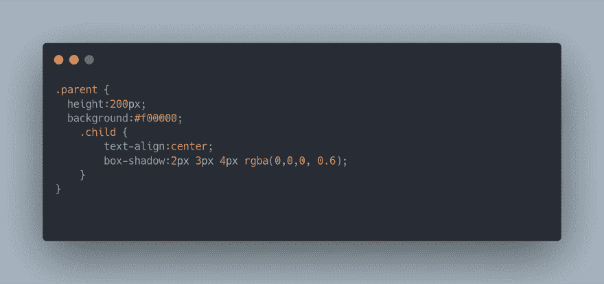
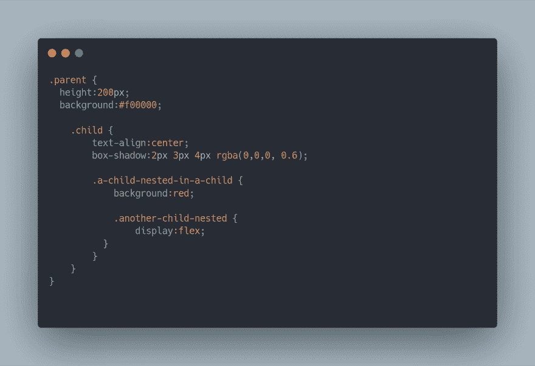
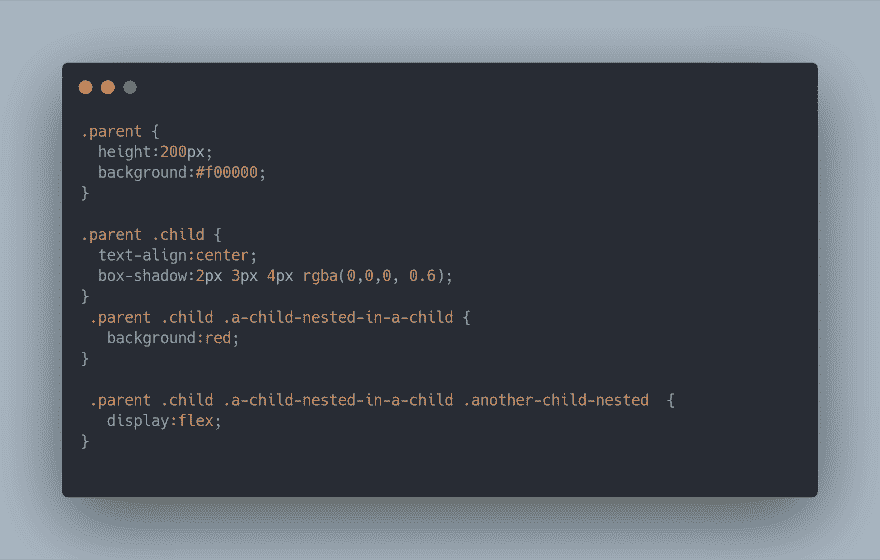
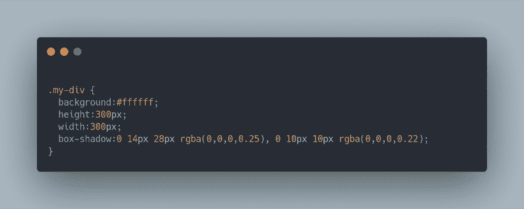

# SASS 中嵌套和变量的概念

> 原文：<https://dev.to/ogurinkaben/concept-of-nesting-in-variables-in-sass-3ee0>

首先让我们问问自己什么是 SASS？SASS 代表语法上令人敬畏的样式表，它是 CSS 的扩展。它有很多令人兴奋的特性，比如变量、嵌套、混合、内嵌导入、内置函数来操纵颜色和其他值等等。为了这篇文章的目的，我们将关注嵌套和变量。

还需要注意的是，您不能在浏览器上直接使用 SASS，因为浏览器不是为解释 SASS 而设计的。要让浏览器理解 SASS，需要使用 SASS 预处理器将 SASS 代码翻译成标准 CSS。
你可以在 SASS 官方网站[上阅读更多关于这是如何工作的信息！](https://sass-lang.com/install)

## 什么是嵌套？

在这篇文章的范围之外，你可能以前肯定听说过这个术语，用简单的英语来说，它是允许具有相似特征的物品能够被放置或存储在另一个里面。差不多就是这样。在 SASS 中，这个概念也没什么不同。 ***嵌套*** 是将选择器放置在另一个选择器范围内的过程( *CSS 选择器用来选择你想要样式的内容。选择器是 CSS 规则集的一部分。CSS 选择器根据 id、类、类型、属性等选择 HTML 元素。*)。

通常在 CSS 中，如果你想设计一个父元素和它的子元素的样式，你应该像这样

但是有了 SASS，这就简化了，并且大大减少了 CSS 中的重复。使用嵌套的概念，上面的内容看起来会有点不同，坦率地说会更令人兴奋。这更像是

当然，浏览器不会理解这一点，但在 SASS 预处理器的帮助下，这可以被转换(从 SASS 转换为 CSS 的过程)为看起来像常规的标准 CSS，因此浏览器可以更好地理解它。上述文件传送至

 。

继续，注意嵌套的数量没有限制也很重要。这是什么意思？这仅仅意味着你可以根据需要多次嵌套。看一下这张图片

从上图可以看出*。子*嵌套在*中。母*和*。子嵌套子*嵌套在*中。子*和子*。另一个子嵌套*嵌套在*中。子元素嵌套子元素*等等。
上面的代码可以移植到你的标准 CSS 中，看起来更像

在 SASS 的帮助下，我们已经能够消除编写重复代码的需要，并且我们已经能够成功地将更多的精力放在我们正在做的事情上，而不是花时间在我们的 CSS 中为我们的 HTML 中的嵌套元素创建一个结构。

我们只能嵌套选择器吗？

哦，不！我们也可以嵌套属性...是啊！CSS 属性可以使用 SASS 嵌套。
看看下面的图片

我们已经能够通过嵌套属性来简化 CSS。
上面会变薄成什么样子

## 什么是变量？

这是指易于变化或改变元素、特征或因素。变量是编程中最流行和最广泛使用的特性之一。事实上，我怀疑有哪种编程语言不支持变量的使用。变量可以被看作是占位符或容器，用来存储或保存某一段数据。在 SASS 中，变量用于存储样式表中属性可重用值。尽管这个特性不是 SASS 所独有的(因为它最近被添加到了标准 CSS 中)，但是声明和使用的方法仍然各不相同。
SASS 中的变量允许您将自己选择的标识符赋给一个特定的值。通常使用美元符号($)后跟您的标识符名称来实现，即 *$my_unique_identifier* 。

让我们假设您想要定义一个特定的框阴影值，您需要在整个样式表中重用它，或者定义一个特定的颜色代码，它将在样式表中多次使用，通常您必须在需要使用它的地方重写它，但是使用变量时，您只需要声明它一次，并使用它的唯一标识符来引用它。

这将传送到

## 总结

SASS 通过它的许多特性使 CSS 更加结构化，它创造了一个真正有趣和无压力的体验，让你专注于你正在做的事情。