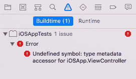

# 为什么 iOS 测试中的模拟可能不会完全停止网络和数据库活动

> 原文：<https://dev.to/essentialdeveloper/why-mocking-in-ios-tests-may-not-stop-network-and-db-activity-entirely-1nj7>

一个优秀的 iOS 测试套件是[快速、可靠、精确和可重复的](https://www.essentialdeveloper.com/articles/why-mocking-in-ios-tests-may-not-stop-network-and-db-activity-entirely)。使 iOS 中的自动化测试变得缓慢和不可靠的一个常见问题是在单元测试的执行过程中出现意想不到的副作用和工件。

例如，意外的状态/工件会导致:

*   运行应用程序后，一些测试会失败
*   一些测试在未完成的测试运行后会失败
    *   即使您清除了`tearDown`中的状态，如果测试套件由于某种原因没有正确完成(例如，断点或手动停止)，`tearDown`可能永远不会被执行(因此状态永远不会被清除)
*   一些测试由于运行时的时间耦合而失败:
    *   随机排列
    *   孤立地
    *   整个测试套件

上面的例子会让你的 iOS 测试套件变得缓慢、不可靠、不准确、不可重复。这就是为什么在单元测试期间运行真实的网络请求和/或将状态保存到磁盘是不可取的。

为了使您的 iOS 测试套件快速、可靠、精确且可重复，每个测试运行都应该以干净的状态开始，以干净的状态结束(没有留下副作用/工件)。

为了解决这个问题，iOS 开发者将正确地用某种测试替身来替换网络客户端和数据库。然而，这可能无法完全解决问题。

这是我们收到的一个常见问题:

“我在嘲笑我的 HTTP APIClient，但是当运行我的测试时，我仍然可以在日志中看到网络请求被触发。它降低了我的测试速度，有时我会遇到意想不到的错误。

*例如，如果我运行我的应用程序并登录(例如，手动或在 UI 测试上)，我在我的单元测试目标中得到一堆失败和网络请求，因为登录的用户状态是持久的，我们在 AppDelegate 中触发一堆请求来更新登录的用户数据。*

如果我在测试中嘲笑我的 HTTP APIClient，这怎么会发生呢？

我可以在每次运行前清理模拟器，但这也确实会减慢我的测试过程(重置需要几秒甚至几分钟)。

我做错了什么，我该如何解决？"

当运行测试套件时，真实的网络请求将被触发(即使 HTTP `APIClient`被模仿)的原因是可能有一个主机应用程序连接到测试目标。

如果您的测试目标有一个宿主应用程序，那么每当您运行您的测试时，应用程序也将与它们一起运行。例如，如果您在运行测试的同时观看模拟器，您将会看到根据应用程序的状态呈现的初始 UI。

因此,`AppDelegate`正在被实例化，它通过真正的`APIClient`触发 API 请求，就像您只是运行应用程序一样。端到端 UI 测试目标可能需要这样的行为，但隔离/单元测试目标不需要这样的行为。

如果这是你的情况，不要调整 Xcode 的参数来清理启动状态或指责你的应用程序的架构，考虑以下解决方案(按照我们的偏好排列):

1.  将测试配置为在没有宿主应用程序的情况下运行。
2.  为没有宿主应用程序的独立于应用程序的测试创建新的测试目标。
3.  通过创建一个`main.swift`文件来改变应用程序的入口点，而不用实例化应用程序的委托。

## 1。在没有宿主应用程序的情况下运行测试

根据我们的经验，将您的测试从宿主应用程序中分离出来的最好和最干净的方法是移动您的独立于宿主应用程序的代码(您编写的大部分代码！)转化成框架。

框架目标不需要宿主应用程序，默认情况下也不会有。作为额外的好处，将应用程序分解成框架将帮助您创建模块化系统，这些系统更容易维护、扩展、测试、替换、重用以及独立开发和部署。

或者，您可以从任何现有的测试目标中删除主机应用程序，如下所示。

在 Xcode 中，在测试目标的“常规”标签中，您可以将主机应用程序选项更改为“无”通过这样做，测试将在没有应用程序运行的情况下运行。

删除主机应用程序还可以使测试更快启动，并且不需要对生产目标进行任何更改(例如检查“IS_TESTING”启动参数)。

然而，如果您想要测试的组件驻留在一个*应用程序目标*中，您将无法在测试目标中访问它们:

如果你不想将你的代码从*应用目标*转移到*框架*中，你将不得不手动地将你的组件添加到测试目标中。您可以通过勾选目标成员资格窗格中的复选框来实现:

注意，如果你的组件或者测试依赖于一个正在运行的`UIApplication`，这个解决方案不会为你削减它。例如，如果测试任何直接引用`UIApplication.shared`的组件，测试将会失败，因为没有主机应用程序，共享的`UIApplication`实例将不会存在。

但这是一件好事，因为它有助于您避免不良实践，例如在整个应用程序中访问隐式依赖关系、可变全局状态和像`UIApplication.shared`这样的单例，而是使用适当的依赖注入。

## 2。创建一个没有宿主应用程序的新测试目标

如果您在一个测试目标上工作，并且对一个正在运行的应用程序有太多纠缠不清的依赖，那么在没有宿主应用程序的情况下运行测试的成本可能会太高。如果是这种情况，你可以采取小步骤，而不是重大的重构。

在 Xcode 中，创建一个新的测试目标，并将所有与应用程序无关的测试转移到一个更快、更可靠的隔离/单元测试目标，而不需要宿主应用程序。这样，当您独立运行这些测试时，应用程序将不会加载。

逐渐地，通过将尽可能多的组件从主机应用程序中分离出来，并将它们转移到新的测试目标，向第一个解决方案前进。

在将代码合并到主分支之前，确保将所有测试目标作为持续集成管道的一部分运行。

## 3。运行测试时替换您的 AppDelegate 类

第三种选择是对上述方法的补充。虽然您不能将您的测试目标从宿主应用程序中完全分离，或者如果您想防止您的应用程序创建真正的`AppDelegate`，您可以在运行测试时替换`AppDelegate`类。

要替换`AppDelegate`，您需要为您的应用程序创建一个定制的起点。

无论你是在执行测试套件还是运行你的 iOS 应用，每次执行都有一个起点。

从历史上看，在 Objective-C 中，iOS 应用程序的主入口点是在`main.m`文件中定义的主函数，在这里您可以用`AppDelegate`类创建`UIApplication`实例。