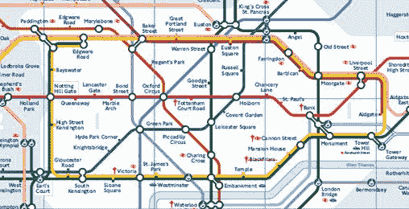
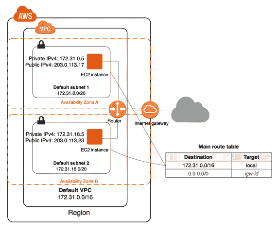
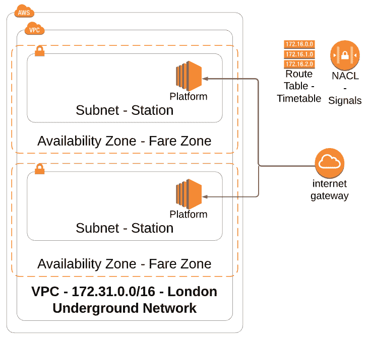

# 为什么 VPC 像伦敦地铁

> 原文：<https://dev.to/helenanders26/aws-series-why-a-vpc-is-like-the-london-underground-k7p>

人脉很难。

如果你没有传统的 IT 背景，AWS 认证培训的 VPC 部分会很棘手。人们在谈论 CIDR 区块、子网和意大利面条式的混乱图表。

有点像伦敦地铁。这让我开始思考。当我搬到伦敦时，地铁系统似乎真的不堪重负。但是没多久就想通了。四年后，我可以告诉你从哪个门上车，这样你就可以避开人群，在另一端快速下车。

事实证明这两者有很多相似之处。如果我能弄清楚地铁地图上所有的区域、车站、站台和行话，我当然也能弄清楚 VPC。

* * *

*Mind the Gap*

* * *

> [简介](#chapter-1)
> [**VPC** -伦敦地铁网](#chapter-2)
> [**可用区** -票价区](#chapter-3)
> [**子网** -车站](#chapter-4)
> [**路由表** -时刻表](#chapter-5)
> [**网络访问控制列表** -信号](#chapter-6)
> [**VPC 对等** -继续行驶](#chapter-6)

* * *

## 简介

这是来自 [AWS 文档](https://docs.aws.amazon.com/vpc/latest/userguide/what-is-amazon-vpc.html)的示例网络图。这篇文章希望分解这个图表中的所有组件，并从伦敦地铁网络中得出一些相似之处。

*Not the spaghetti mess I once thought it was*

* * *

## **VPC** -伦敦地铁网

简单来说， [VPC](https://docs.aws.amazon.com/vpc/latest/userguide/what-is-amazon-vpc.html) 是你的 AWS 账户中的一个网络，保存着你的 AWS 服务。把它想象成你自己的数据中心。您可以通过分配一个 IP 地址范围来决定它需要多大。这被称为 [CIDR 块](https://whatismyipaddress.com/cidr)(无类域间路由)，它允许我们跟踪和限制访问我们实例的流量和用户的种类。

需要了解的关键事项:

*   默认情况下，VPC 与其他 VPC 是隔离的，除非我们将它们“对等”在一起。
*   每个区域有五个 VPC 的限制，但可以增加。
*   VPC 跨越一个区域内的所有可用性区域。

* * *

## **可用区** -票价区

创建 VPC 后，您可以开始在每个可用性分区中添加[个子网](https://docs.aws.amazon.com/vpc/latest/userguide/VPC_Subnets.html?shortFooter=true)。把这想象成收费区内的一个车站。每个站或子网都与周围其他站或子网的故障隔离开来。

需要了解的关键事项:

*   VPC 跨越一个区域中的所有可用性区域。
*   在单独的可用性区域中启动实例可以防止应用程序在单个位置出现故障。

* * *

## **子网** -站

子网就像一个站。可以是公有的，也可以是私有的。就像在伦敦地铁网络上一样，那里有公共车站和公共通道。有废弃站，TFL 职工培训站，邮政站。那种公众在平常日子里无法收听的私人电台。

需要了解的关键事项:

*   每个 VPC 最多可以有 200 个子网。如果您想增加这一数量，您需要通过 AWS 支持部门提出请求。伦敦地铁网络目前有 270 个车站，尽管他们可能不需要提交车票就可以增加。
*   您可以通过附加公共 IP 地址来定义要向 internet 公开的子网。

* * *

## **路线表** -时刻表

每个子网都附有路由表。这创建了一组规则，允许流量在一组指导原则内流动。这意味着流量会一直留在子网内，直到创建了一条路由，允许它到达网络上的下一站。

需要了解的关键事项:

*   路由表告诉流量需要走哪条路才能到达目的地。
*   互联网网关允许公共子网上的设备连接到互联网。
*   相反，网络地址转换网关(NAT 网关)有助于私有子网和互联网之间的连接。类似于[工程股票](https://www.citymetric.com/transport/literally-just-guide-all-different-types-train-london-underground-3040)如何在下班后从私人站点通过公共站点传播。

* * *

## **网络访问控制列表** -信号

网络访问控制列表(NACL)允许我们限制流量，以防止错误和事故。使用 NACLs，就像伦敦地铁上的信号一样，意味着我们可以使用一套规则来控制交通流量。

需要了解的关键事项:

*   入站和出站流量都有规则，因此必须为每个方向设置规则。
*   它们是无状态的，这意味着对传入流量的响应依赖于传出流量。同样的，如果前方隧道里有一列火车，你可能要等它开走。
*   您可以创建一个自定义 NACL，但需要添加规则，因为默认情况下它会拒绝所有流量。

* * *

## **VPC 对等** -在不同的服务上旅行

VPC 对等连接允许流量在两个 VPC 之间路由，就像它们在同一个网络中一样。

需要了解的关键事项:

*   不允许传递对等，这意味着您必须直接访问才能允许流量通过。
*   VPC 可以与其他帐户对等。同样的方式，你可以从伦敦地铁区内访问国家铁路服务。

* * *

这并不是一个完美的类比，但是通过给这些概念一些背景，我离理解 VPC 是如何工作的又近了一步。这也给了我一个借口去重温伦敦地铁所有有趣的事情，这总是好的。

当你向初学者解释 VPC 概念时，你是如何把所有的组成部分放在一起的？德夫兰还有其他地铁爱好者吗？

* * *

## 有用链接:

*   什么是亚马逊 VPC？
*   [场景和示例](https://docs.aws.amazon.com/vpc/latest/userguide/VPC_Scenarios.html)
*   [亚马逊 VPC 限制](https://docs.aws.amazon.com/vpc/latest/userguide/amazon-vpc-limits.html)
*   [VPC 凝视着](https://docs.aws.amazon.com/vpc/latest/peering/what-is-vpc-peering.html)

* * *

这篇文章最初出现在[helenanderson.co.nz](http://www.helenanderson.co.nz/vpc-london-underground/)