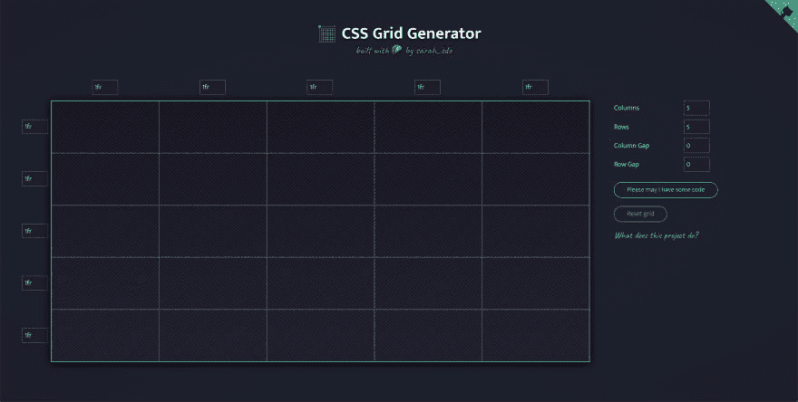
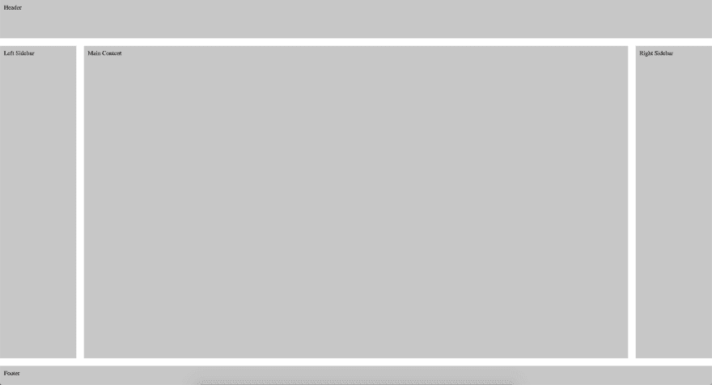
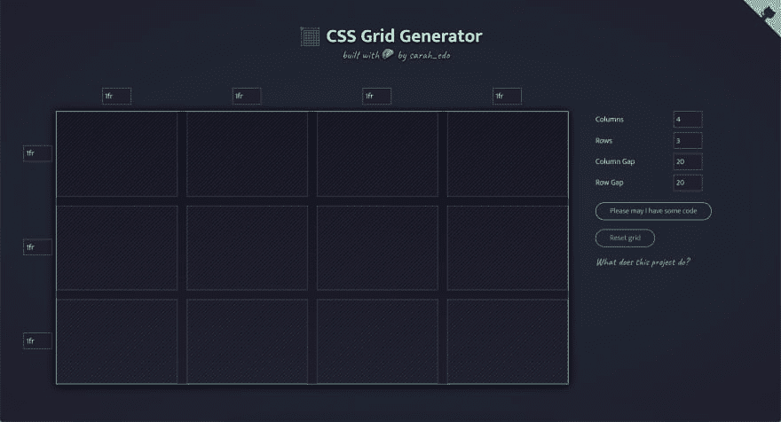
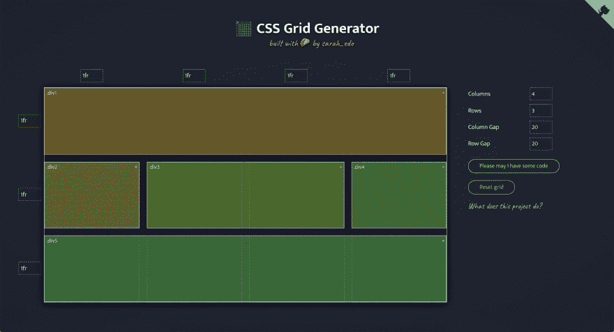

# 了解如何使用 CSS 网格与一个免费的工具 CSS 网格生成器

> 原文：<https://dev.to/therealdanvega/learn-how-to-use-css-grid-with-a-free-tool-css-grid-generator-26lm>

作为一个已经开发 web 应用程序将近 20 年的人，我已经看到了这一切。我从 FrontPage 开始，转到 Dreamweaver，在表格中嵌套表格，并学习如何浮动和清除修复一切。

虽然你不会在我的书架上看到任何我设计的奖项，但我能够创造一些非常好的简单而干净的布局。也就是说，我从来没有真正享受过它，因为它一直是一个巨大的痛苦。我总是觉得我只是在不停地修改，直到我的布局看起来和我想的差不多。

这就是为什么当像[CSS Grid](https://css-tricks.com/snippets/css/complete-guide-grid/)&[Flexbox](https://css-tricks.com/snippets/css/a-guide-to-flexbox/)这样的工具出现时，我对创建整洁布局的可能性兴奋不已。我认为如果你把这两种技术结合起来，再加上 JavaScript 已经走了多远，这才是这些天来真正让我对前端开发感到兴奋的。

虽然在这一点上我对 CSS Grid 有了很好的理解，但是我知道开始时可能会有点混乱。这就是为什么我真的很高兴与你分享我遇到的一个新工具，我真的认为如果你试图理解 CSS Grid，它可以帮助你。

[](https://res.cloudinary.com/practicaldev/image/fetch/s--jlqvyvbG--/c_limit%2Cf_auto%2Cfl_progressive%2Cq_auto%2Cw_880/https://thepracticaldev.s3.amazonaws.com/i/dejgtogde2on4hdl1a8f.png)

## CSS 网格生成器

CSS 网格生成器是由超级天才[莎拉·德拉斯纳](https://twitter.com/sarah_edo)创造的免费工具。它是一个可视化设计工具，允许您创建一个基本的网格布局，然后复制用于创建它的代码。当你第一次打开这个工具时，你会看到一个默认的布局，但是在这里你可以很容易地定制你需要的布局。

[](https://res.cloudinary.com/practicaldev/image/fetch/s--XlSFh2xN--/c_limit%2Cf_auto%2Cfl_progressive%2Cq_auto%2Cw_880/https://thepracticaldev.s3.amazonaws.com/i/rzwgnls7kmv26osi88rq.png)

### CSS 网格布局示例

当我学习的时候，我发现最好的学习方法是用我闪亮的新玩具做一些实用的东西。在本文中，您将采用一个非常简单的布局，然后使用 CSS Grid Generator 来创建在实际项目中使用的代码。这是完成的布局，有一点点的风格，所以每个部分都很明显。

[](https://res.cloudinary.com/practicaldev/image/fetch/s--OOVGwsum--/c_limit%2Cf_auto%2Cfl_progressive%2Cq_auto%2Cw_880/https://thepracticaldev.s3.amazonaws.com/i/r429t1u1xrz63kn4og85.png)

现在你知道我们的目标是什么，我们可以开始构建它的布局。首先，将右侧更新为以下内容。

*   列:4
*   行数:3
*   列间距:20
*   排距:20

这些间隙允许我们在内容之间留有一些空白。我可以只使用列间距，但我希望在页眉之后和页脚之前有一些空白，所以这就是行间距所做的。

[](https://res.cloudinary.com/practicaldev/image/fetch/s--A04F2c-H--/c_limit%2Cf_auto%2Cfl_progressive%2Cq_auto%2Cw_880/https://thepracticaldev.s3.amazonaws.com/i/vqejqxt6zk92w2lbcpyx.png)

接下来，您将需要定义应用程序的不同区域。在 CSS 网格生成器中，您可以单击并拖动来创建一个区域。您希望标题跨越整个网格，侧栏占据一个单元格，主要内容区域跨越 2 列，页脚跨越 4 列。如果你做的一切都是正确的，你应该会得到类似这样的结果。

[](https://res.cloudinary.com/practicaldev/image/fetch/s--xnHMkGLk--/c_limit%2Cf_auto%2Cfl_progressive%2Cq_auto%2Cw_880/https://thepracticaldev.s3.amazonaws.com/i/lbgcfx65zlwd7wemo5hj.png)

这开始看起来更像我们的布局，但你仍然需要定义一些不同的东西的大小。您会注意到每行和每列旁边都有一个输入框，您可以使用它来设置特定的大小。

*   页眉:100 像素高
*   侧栏:200 像素宽
*   页脚:50px 高度

[](https://res.cloudinary.com/practicaldev/image/fetch/s--0U4m3OPU--/c_limit%2Cf_auto%2Cfl_progressive%2Cq_auto%2Cw_880/https://thepracticaldev.s3.amazonaws.com/i/nshspqx0iq6hcnx7vghb.png)

这开始看起来更像我们想要的布局，但是你可能会问那个`1fr`单元是什么。

> 可以使用任何长度单位来定义轨迹。网格还引入了一个额外的长度单位来帮助我们创建灵活的网格轨迹。新的 fr 单元表示网格容器中可用空间的一部分。

第二行中的`1fr`将告诉该区域占用剩余的可用空间。如果将容器设置为`100vh`，那么内容可以占据整个页面，列也是如此。

### CSS 网格生成代码

如果您查看右侧的列和行输入，您会看到一个按钮，上面写着“请给我一些代码”，单击它。您应该会看到一些生成的代码，如下所示。单击 copy 按钮复制代码，然后进入文本编辑器。

```
.parent {
  display: grid;
  grid-template-columns: 200px 1fr 1fr 200px;
  grid-template-rows: 100px 1fr 50px;
  grid-column-gap: 20px;
  grid-row-gap: 20px;
  .div1 { grid-area: 1 / 1 / 2 / 5; }
  .div2 { grid-area: 2 / 1 / 3 / 2; }
  .div3 { grid-area: 2 / 2 / 3 / 4; }
  .div4 { grid-area: 2 / 4 / 3 / 5; }
  .div5 { grid-area: 3 / 1 / 4 / 5; }
} 
```

创建一个新文档`simple-layout.htm`并添加以下代码，该代码将重置正文的边距和填充。

```
<!DOCTYPE html>
<html lang="en">
<head>
  <meta charset="UTF-8">
  <meta name="viewport" content="width=device-width, initial-scale=1.0">
  <meta http-equiv="X-UA-Compatible" content="ie=edge">
  <title>Simple Layout</title>
  <style>
    body {
      margin: 0;
      padding: 0;
    }
  </style>
</head>
<body>

</body>
</html> 
```

接下来添加 CSS(复制的代码在 SASS 中，但是你可以把 div 拿出来)

```
<!DOCTYPE html>
<html lang="en">
<head>
  <meta charset="UTF-8">
  <meta name="viewport" content="width=device-width, initial-scale=1.0">
  <meta http-equiv="X-UA-Compatible" content="ie=edge">
  <title>Simple Layout</title>
  <style>
    body {
      margin: 0;
      padding: 0;
    }
    .parent {
      display: grid;
      grid-template-columns: 200px 1fr 1fr 200px;
      grid-template-rows: 100px 1fr 50px;
      grid-column-gap: 20px;
      grid-row-gap: 20px;
      height: 100vh;
    }

    .div1 {
      grid-area: 1 / 1 / 2 / 5;
    }

    .div2 {
      grid-area: 2 / 1 / 3 / 2;
    }

    .div3 {
      grid-area: 2 / 2 / 3 / 4;
    }

    .div4 {
      grid-area: 2 / 4 / 3 / 5;
    }

    .div5 {
      grid-area: 3 / 1 / 4 / 5;
    }
  </style>
</head>
<body>

</body>
</html> 
```

这个工具给你的是创建这个布局所需的 css。你需要添加所需的标记，通过查看 CSS，这只是一个嵌套了 5 个`.div`的`.parent`。我添加文本只是为了让您可以看到每个部分。

```
<body>
  <div class="parent">
    <div class="div1">
      Header
    </div>
    <div class="div2">
      Left Sidebar
    </div>
    <div class="div3">
      Main Content
    </div>
    <div class="div4">
      Right Sidebar
    </div>
    <div class="div5">
      Footer
    </div>
  </div>

</body> 
```

最后添加下面的 CSS，只是为`.div1` - `.div5`
添加一些填充背景色

```
div:not(.parent) {
  padding: 10px;
  background-color: rgb(199, 199, 199);
} 
```

如果你运行这个，你会得到如下结果。

[](https://res.cloudinary.com/practicaldev/image/fetch/s---ENftGRv--/c_limit%2Cf_auto%2Cfl_progressive%2Cq_auto%2Cw_880/https://thepracticaldev.s3.amazonaws.com/i/c6hi2mlpjaw67fseytn9.png)

这看起来很不错，但是你希望它占据整个浏览器窗口。解决这个问题的一个简单方法是将`height: 100vh`添加到`.parent`类
中

```
.parent {
  display: grid;
  grid-template-columns: 200px 1fr 1fr 200px;
  grid-template-rows: 100px 1fr 50px;
  grid-column-gap: 20px;
  grid-row-gap: 20px;
  height: 100vh;
} 
```

这样，你就有了你一直在寻找的布局！

[](https://res.cloudinary.com/practicaldev/image/fetch/s--dtojj7pd--/c_limit%2Cf_auto%2Cfl_progressive%2Cq_auto%2Cw_880/https://thepracticaldev.s3.amazonaws.com/i/rhvltwrph1210jlvmsjn.png)

这个工具是为了帮助你在 CSS 网格中快速创建一个基本的布局。从这里开始，你可以出去学习更多关于 CSS Grid 的知识，这样你就可以开始定制和创建高级布局了。

## 结论

CSS 网格生成器的用户界面美观，干净，易于使用。我喜欢整个项目都是用 Vue 编写的，并放在我最喜欢的技术[网上。](https://www.netlify.com/)

如果你想知道这样一个项目是如何构建的，你可以打开源代码看一看(谢谢 Sarah！).在右上角有一个漂亮的 SVG 动画，它会带你去 [Github 仓库](https://github.com/sdras/cssgridgenerator)。我希望您发现这个工具和我一样有用，一如既往...

快乐编码

丹

*这篇文章最初是在 https://www.danvega.dev/blog 的[发表在我的博客上的。如果你觉得这篇文章有趣，请考虑](https://www.danvega.dev/blog)[订阅我的时事通讯](https://www.danvega.dev/signup/)或者在 [Twitter](http://twitter.com/therealdanvega) 上关注我。*