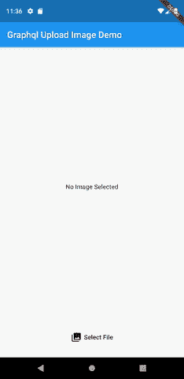

# 如何上传文件

> 原文：<https://dev.to/mainawycliffe/flutter-and-graphql-how-to-upload-files-46d4>

在这篇文章中，我将向你展示如何使用 GraphQL 和 flutter 上传文件。为了在 flutter 中使用 GraphQL，我们将使用 [graphql_flutter](https://github.com/zino-app/graphql-flutter) 包，该包在 GitHub 上有超过 1000 颗星星，我经常为其贡献内容。

所以，事不宜迟，我们开始吧。

### 我们的 GraphQL 模式

为了上传文件，我们将使用一个非常简单的模式。我们的变种将接受一个文件，然后返回该文件的下载 URL。我们不会看服务器端的实现。

```
scalar  Upload  type  Mutation  {  upload(file:  Upload!):  String!  } 
```

<svg width="20px" height="20px" viewBox="0 0 24 24" class="highlight-action crayons-icon highlight-action--fullscreen-on"><title>Enter fullscreen mode</title></svg> <svg width="20px" height="20px" viewBox="0 0 24 24" class="highlight-action crayons-icon highlight-action--fullscreen-off"><title>Exit fullscreen mode</title></svg>

> **NB:** 如果你有兴趣，你可以在这里找到这篇文章的演示[的 GraphQL 服务器。](https://github.com/mainawycliffe/flutter-graphql-upload-example/tree/master/backend)

### 演示及源代码

下面是我们的应用程序将如何工作:

[](https://res.cloudinary.com/practicaldev/image/fetch/s--KLQj-Iav--/c_limit%2Cf_auto%2Cfl_progressive%2Cq_66%2Cw_880/https://codinglatte.com/posts/flutter/flutter-and-graphql-how-to-upload-files/demo.gif)

你可以在 GitHub 的[这里找到这篇文章的附带回购。](https://github.com/mainawycliffe/flutter-graphql-upload-example)

### 依赖和导入

对于这篇文章的演示，我们将需要我们的 flutter 项目的以下依赖项——[graph QL _ flutter](https://github.com/zino-app/graphql-flutter)和 [image_picker](https://pub.dev/packages/image_picker) 。

让我们将它们添加到我们的项目`pubspec`文件中。

```
graphql_flutter: ^2.0.0
image_picker: ^0.6.0 
```

<svg width="20px" height="20px" viewBox="0 0 24 24" class="highlight-action crayons-icon highlight-action--fullscreen-on"><title>Enter fullscreen mode</title></svg> <svg width="20px" height="20px" viewBox="0 0 24 24" class="highlight-action crayons-icon highlight-action--fullscreen-off"><title>Exit fullscreen mode</title></svg>

我们将导入以下包:

```
import 'dart:io';
import 'package:flutter/material.dart';
import 'package:graphql_flutter/graphql_flutter.dart';
import 'package:http/http.dart';
import 'package:http_parser/http_parser.dart';
import 'package:image_picker/image_picker.dart'; 
```

<svg width="20px" height="20px" viewBox="0 0 24 24" class="highlight-action crayons-icon highlight-action--fullscreen-on"><title>Enter fullscreen mode</title></svg> <svg width="20px" height="20px" viewBox="0 0 24 24" class="highlight-action crayons-icon highlight-action--fullscreen-off"><title>Exit fullscreen mode</title></svg>

随意添加任何额外的依赖项和导入来使你的 UI 看起来更好。

### 关于我们的演示应用

对于这篇文章的演示，我们将使用 [image_picker](https://pub.dev/packages/image_picker) 包来选择一个图像。然后，挑选的图像可以上传到我们的服务器。我们将为我们的演示应用程序构建一个非常简单的 UI，其中我们将有一个简单的按钮来选择图像。当一个图像被选中时，它将显示在一个图像小工具内，并显示一个上传按钮。然后，用户可以单击上传按钮来上传图像。

首先，让我们定义我们的 GraphQL 变异-`uploadImage`-它将接受类型为`Upload`的变量`$file`。`$file`变量将是使用 image_picker 选择的图像，并将被传递给`upload`突变。

```
const uploadImage = r"""
mutation($file: Upload!) {
  upload(file: $file)
}
"""; 
```

<svg width="20px" height="20px" viewBox="0 0 24 24" class="highlight-action crayons-icon highlight-action--fullscreen-on"><title>Enter fullscreen mode</title></svg> <svg width="20px" height="20px" viewBox="0 0 24 24" class="highlight-action crayons-icon highlight-action--fullscreen-off"><title>Exit fullscreen mode</title></svg>

然后，在我们的`StatefulWidget`中，让我们添加一个`selectImage`方法和一个名为`_image`的私有[文件](https://api.flutter.dev/flutter/dart-io/File-class.html)属性。当调用`select image`方法时，它将调用`ImagePicker.pickImage`方法，显示一个文件选择器对话框，用户在其中选择一个图像。在用户选择一个图像后，我们将设置结果文件(图像)的`_image`属性。

```
Future selectImage() async {
  var image = await ImagePicker.pickImage(source: ImageSource.gallery);

  setState(() {
    _image = image;
  });
} 
```

<svg width="20px" height="20px" viewBox="0 0 24 24" class="highlight-action crayons-icon highlight-action--fullscreen-on"><title>Enter fullscreen mode</title></svg> <svg width="20px" height="20px" viewBox="0 0 24 24" class="highlight-action crayons-icon highlight-action--fullscreen-off"><title>Exit fullscreen mode</title></svg>

接下来，让我们使用:
创建我们的 UI

```
@override
Widget build(BuildContext context) {
  return Container(
    child: Column(
      // mainAxisAlignment: MainAxisAlignment.center,
      mainAxisSize: MainAxisSize.max,
      children: <Widget>[
        if (_image != null)
          Flexible(
            flex: 9,
            child: Image.file(_image),
          )
        else
          Flexible(
            flex: 9,
            child: Center(
              child: Text("No Image Selected"),
            ),
          ),
        Flexible(
          child: Row(
            mainAxisAlignment: MainAxisAlignment.center,
            mainAxisSize: MainAxisSize.max,
            children: <Widget>[
              FlatButton(
                child: Row(
                  mainAxisAlignment: MainAxisAlignment.center,
                  mainAxisSize: MainAxisSize.min,
                  children: <Widget>[
                    Icon(Icons.photo_library),
                    SizedBox(
                      width: 5,
                    ),
                    Text("Select File"),
                  ],
                ),
                onPressed: () => selectImage(),
              ),
              // Mutation Widget Here
            ],
          ),
        )
      ],
    ),
  );
} 
```

<svg width="20px" height="20px" viewBox="0 0 24 24" class="highlight-action crayons-icon highlight-action--fullscreen-on"><title>Enter fullscreen mode</title></svg> <svg width="20px" height="20px" viewBox="0 0 24 24" class="highlight-action crayons-icon highlight-action--fullscreen-off"><title>Exit fullscreen mode</title></svg>

现在，我们缺少的是 GraphQL 的上传实现。这有两种方法，我们将在下面逐一介绍:

### 使用`Mutation`小工具

软件包提供了一些易于使用的部件，你可以将它们放入你的 flutter 应用程序中。其中一个小部件是突变小部件，您可以使用它来运行突变。但是在使用`Mutation`小部件之前，我们需要一个 [GraphQLClient](https://pub.dev/documentation/graphql/latest/graphql/GraphQLClient-class.html) 。 [GraphQLClient](https://pub.dev/documentation/graphql/latest/graphql/GraphQLClient-class.html) 需要在我们的小部件树上的某个地方提供，最好是在最开始的时候。

您可以通过创建一个 [GraphQLClient](https://pub.dev/documentation/graphql/latest/graphql/GraphQLClient-class.html) 来实现这一点，然后使用 [`GraphQLProvider`](https://pub.dev/documentation/graphql_flutter/latest/#graphql-provider) 小部件将它传递到小部件树中。首先，让我们创建一个用 [ValueNotifier](https://api.flutter.dev/flutter/foundation/ValueNotifier-class.html) :
包装的 [GraphQLClient](https://pub.dev/documentation/graphql/latest/graphql/GraphQLClient-class.html)

```
final httpLink = HttpLink(
  uri: 'http://$host:8080/query',
);

var client = ValueNotifier(
  GraphQLClient(
    cache: InMemoryCache(),
    link: httpLink,
  ),
); 
```

<svg width="20px" height="20px" viewBox="0 0 24 24" class="highlight-action crayons-icon highlight-action--fullscreen-on"><title>Enter fullscreen mode</title></svg> <svg width="20px" height="20px" viewBox="0 0 24 24" class="highlight-action crayons-icon highlight-action--fullscreen-off"><title>Exit fullscreen mode</title></svg>

> **NB:** 主机指向 localhost，IOS 和 Android 模拟器不同:

```
String get host => Platform.isAndroid ? '10.0.2.2' : 'localhost'; 
```

<svg width="20px" height="20px" viewBox="0 0 24 24" class="highlight-action crayons-icon highlight-action--fullscreen-on"><title>Enter fullscreen mode</title></svg> <svg width="20px" height="20px" viewBox="0 0 24 24" class="highlight-action crayons-icon highlight-action--fullscreen-off"><title>Exit fullscreen mode</title></svg>

接下来，我们需要使用 [`GraphQLProvider`](https://pub.dev/documentation/graphql_flutter/latest/#graphql-provider) 小部件将上述客户端向下传递到小部件树。在我们的例子中，我们将用它来包装 Scaffold 小部件，如果您愿意，也可以用它来包装 MaterialApp。

```
return MaterialApp(
  title: 'Flutter Demo',
  theme: ThemeData(
    primarySwatch: Colors.blue,
  ),
  home: GraphQLProvider(
    client: client,
    child: Scaffold(
      appBar: AppBar(
        title: Text("Graphql Upload Image Demo"),
      ),
      body: MyHomePage(),
    ),
  ),
); 
```

<svg width="20px" height="20px" viewBox="0 0 24 24" class="highlight-action crayons-icon highlight-action--fullscreen-on"><title>Enter fullscreen mode</title></svg> <svg width="20px" height="20px" viewBox="0 0 24 24" class="highlight-action crayons-icon highlight-action--fullscreen-off"><title>Exit fullscreen mode</title></svg>

现在我们已经准备好使用突变小部件了。要使用突变小部件，您只需要传递`MutationOptions`、一个小部件构建器方法和一个`onCompleted`和/或更新回调。当一个变异完成时，最后两个回调被调用。用`onCompleted`回调传递变异结果的结果数据。而传递 [QueryResults](https://pub.dev/documentation/graphql/latest/graphql/QueryResult-class.html) 对象的`update`可以用来检查错误。

要使用突变小部件，我们将把它添加到选择图像按钮旁边。我们还将在显示小部件之前检查是否设置了`_image`属性。

```
if (_image != null)

  Mutation(
    options: MutationOptions(
      document: uploadImage,
    ),
    builder: (RunMutation runMutation, QueryResult result) {
      return FlatButton(
        child: _isLoadingInProgress(),
        onPressed: () {},
      );
    },
    onCompleted: (d) {},
    update: (cache, results) {},
  ), 
```

<svg width="20px" height="20px" viewBox="0 0 24 24" class="highlight-action crayons-icon highlight-action--fullscreen-on"><title>Enter fullscreen mode</title></svg> <svg width="20px" height="20px" viewBox="0 0 24 24" class="highlight-action crayons-icon highlight-action--fullscreen-off"><title>Exit fullscreen mode</title></svg>

突变小部件将返回一个上传按钮，用户可以按下该按钮来上传图像。让我们实现按钮的`onPressed`方法，以便它在被按下时上传图像。首先，我们将把图片转换成 [`MultipartFile`](https://pub.dev/documentation/http/latest/http/MultipartFile-class.html) ，为上传做准备。然后，当调用从构建器传递来的`runMutation`方法时，我们可以传递产生的[多文件](https://pub.dev/documentation/http/latest/http/MultipartFile-class.html)变量作为我们变异的变量。

```
var byteData = _image.readAsBytesSync();

var multipartFile = MultipartFile.fromBytes(
  'photo',
  byteData,
  filename: '${DateTime.now().second}.jpg',
  contentType: MediaType("image", "jpg"),
);

runMutation(<String, dynamic>{
  "file": multipartFile,
}); 
```

<svg width="20px" height="20px" viewBox="0 0 24 24" class="highlight-action crayons-icon highlight-action--fullscreen-on"><title>Enter fullscreen mode</title></svg> <svg width="20px" height="20px" viewBox="0 0 24 24" class="highlight-action crayons-icon highlight-action--fullscreen-off"><title>Exit fullscreen mode</title></svg>

然后，我们可以使用更新回调来检查上传是否成功完成，并显示响应。

```
update: (cache, results) {
  var message = results.hasErrors
      ? '${results.errors.join(", ")}'
      : "Image was uploaded successfully!";

  final snackBar = SnackBar(content: Text(message));
  Scaffold.of(context).showSnackBar(snackBar);
}, 
```

<svg width="20px" height="20px" viewBox="0 0 24 24" class="highlight-action crayons-icon highlight-action--fullscreen-on"><title>Enter fullscreen mode</title></svg> <svg width="20px" height="20px" viewBox="0 0 24 24" class="highlight-action crayons-icon highlight-action--fullscreen-off"><title>Exit fullscreen mode</title></svg>

当 GraphQL 操作成功完成时，将显示一条成功消息，否则将使用 [snackbar](https://flutter.dev/docs/cookbook/design/snackbars) 显示结果错误消息。

### 没有使用变异部件

出于各种原因，有很多人不喜欢使用突变小部件。您也可以使用 graphql_flutter 来完成这项工作。我们将用一个简单的按钮替换上面的突变小部件，当按下这个按钮时，它将调用一个方法-`_uploadImage`。我们将把`_uploadImage`方法放在 StatefulWidget 中。

```
if (_image != null)
  FlatButton(
    child: _isLoadingInProgress(),
    onPressed: () => _uploadImage(context),
  ), 
```

<svg width="20px" height="20px" viewBox="0 0 24 24" class="highlight-action crayons-icon highlight-action--fullscreen-on"><title>Enter fullscreen mode</title></svg> <svg width="20px" height="20px" viewBox="0 0 24 24" class="highlight-action crayons-icon highlight-action--fullscreen-off"><title>Exit fullscreen mode</title></svg>

然后在我们的`_uploadImage`方法中，我们将首先把图像转换成一个`MultipartFile`，就像我们之前做的那样。

```
var byteData = _image.readAsBytesSync();

var multipartFile = MultipartFile.fromBytes(
  'photo',
  byteData,
  filename: '${DateTime.now().second}.jpg',
  contentType: MediaType("image", "jpg"),
); 
```

<svg width="20px" height="20px" viewBox="0 0 24 24" class="highlight-action crayons-icon highlight-action--fullscreen-on"><title>Enter fullscreen mode</title></svg> <svg width="20px" height="20px" viewBox="0 0 24 24" class="highlight-action crayons-icon highlight-action--fullscreen-off"><title>Exit fullscreen mode</title></svg>

然后为我们的变异创建[变异选项](https://pub.dev/documentation/graphql/latest/graphql/MutationOptions-class.html)变量，传递上面的文档和多部分文件。

```
var opts = MutationOptions(
  document: uploadImage,
  variables: {
    "file": multipartFile,
  },
); 
```

<svg width="20px" height="20px" viewBox="0 0 24 24" class="highlight-action crayons-icon highlight-action--fullscreen-on"><title>Enter fullscreen mode</title></svg> <svg width="20px" height="20px" viewBox="0 0 24 24" class="highlight-action crayons-icon highlight-action--fullscreen-off"><title>Exit fullscreen mode</title></svg>

然后，创建我们的 GraphQLClient:

```
final httpLink = HttpLink(
  uri: 'http://$host:8080/query',
);

var client = GraphQLClient(
  cache: InMemoryCache(),
  link: httpLink,
); 
```

<svg width="20px" height="20px" viewBox="0 0 24 24" class="highlight-action crayons-icon highlight-action--fullscreen-on"><title>Enter fullscreen mode</title></svg> <svg width="20px" height="20px" viewBox="0 0 24 24" class="highlight-action crayons-icon highlight-action--fullscreen-off"><title>Exit fullscreen mode</title></svg>

最后，通过调用返回[查询结果](https://pub.dev/documentation/graphql/latest/graphql/QueryResult-class.html)的`Future`的`client.Mutation`函数来运行变异，您可以用它来显示最终的响应:

```
var results = await client.mutate(opts);

var message = results.hasErrors
    ? '${results.errors.join(", ")}'
    : "Image was uploaded successfully!";

final snackBar = SnackBar(content: Text(message));
Scaffold.of(context).showSnackBar(snackBar); 
```

<svg width="20px" height="20px" viewBox="0 0 24 24" class="highlight-action crayons-icon highlight-action--fullscreen-on"><title>Enter fullscreen mode</title></svg> <svg width="20px" height="20px" viewBox="0 0 24 24" class="highlight-action crayons-icon highlight-action--fullscreen-off"><title>Exit fullscreen mode</title></svg>

有了它，你可以将它与范围模型、块或任何你喜欢的状态管理解决方案一起使用。

#### 提示

> 如果你对使用 [flutter_graphql](https://pub.dev/packages/graphql_flutter) 小部件不感兴趣，你可以直接使用 [graphql](https://pub.dev/packages/graphql) 包，它是 [flutter_graphql](https://pub.dev/packages/graphql_flutter) 的核心，由同一个[团队](https://github.com/zino-app/graphql-flutter)维护。