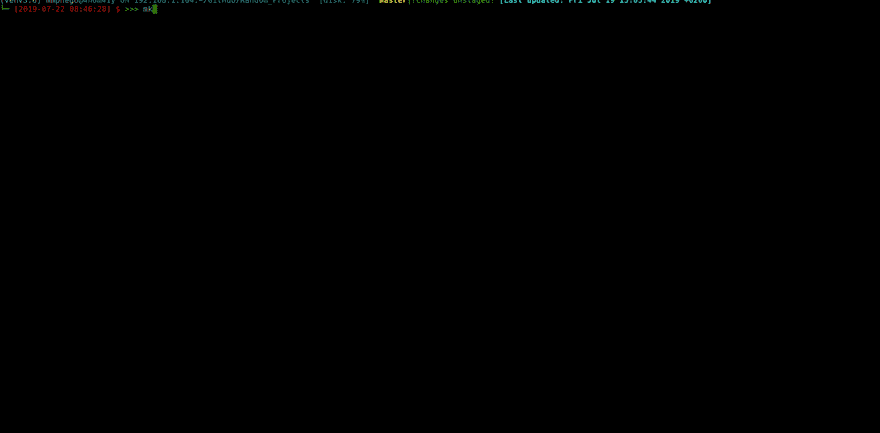
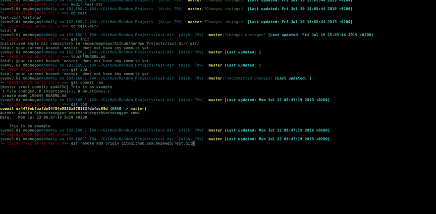
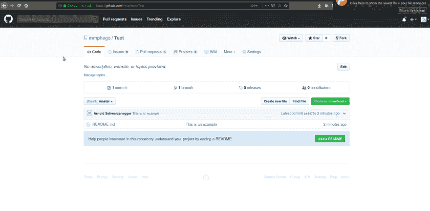
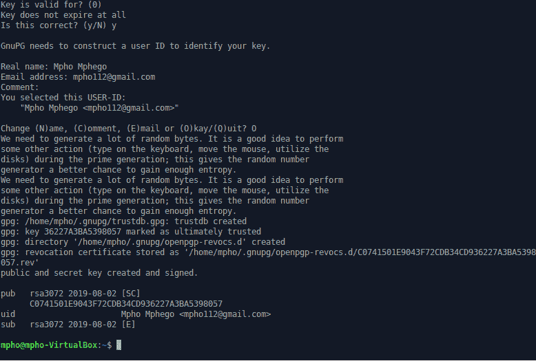
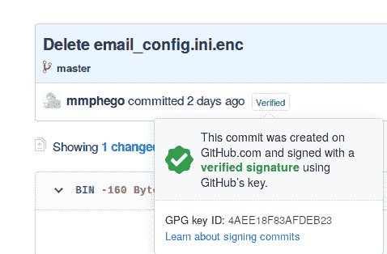

# 如何在 GitHub 上与 GPG 签署您的承诺？

> 原文：<https://dev.to/mmphego/how-to-sign-your-commits-on-github-with-gpg-37nj>

[](https://res.cloudinary.com/practicaldev/image/fetch/s--GD-lNoq_--/c_limit%2Cf_auto%2Cfl_progressive%2Cq_auto%2Cw_880/https://blog.mphomphego.co.za/assets/2019-07-18-How-to-sign-your-commits-on-GitHub-with-GPG.jpg)

*最初发布于[blog.mphomphego.co.za](https://blog.mphomphego.co.za/blog/2019/07/18/How-to-sign-your-commits-on-GitHub-with-GPG.html)2019 年 7 月 18 日。*

* * *

# TL；速度三角形定位法(dead reckoning)

这篇文章详细介绍了如何设置 GPG 来签署你的提交/标签，以及将你的 GPG 公钥添加到你的 GitHub 帐户。

# 故事

在这篇博文中，我将详细介绍如何设置他们的系统，以便他们可以使用 GPG 密钥来签署 git 提交/标签，以及为什么需要这样做。

从这篇文章的标题来看，你可能想知道，我为什么要签署我的承诺，或者什么是 GPG，这有什么区别。你也可能会想，我已经将代码推送到 GitHub 很久了，为什么我现在需要签署我的提交...

**GPG 是什么？**

根据他们的[网站](https://gnupg.org/):

> GnuPG 允许你对你的数据和通信进行加密和签名；它具有一个多功能的密钥管理系统，以及各种公钥目录的访问模块。GnuPG，也称为 GPG，是一个命令行工具，具有易于与其他应用程序集成的特性。

有一点需要注意的是 [GPG(Gnu 隐私卫士)](http://www.gnupg.org/)和 [PGP(相当好的隐私)](http://en.wikipedia.org/wiki/Pretty_Good_Privacy)之间的区别，大多数人混淆了这两者。
参见[PGP 与 GPG 的区别](http://bit.ly/3392RfW)链接了解区别。
注意，这不是关于两者的区别。

## 我为什么要签署我的提交？

我在 [stackexchange](https://softwareengineering.stackexchange.com/a/212216) 上找到的一个很好的答案是:

> git 存储库有几种可能被破坏的方式(这不是一个安全缺陷，只是一个不应该因此而避免使用 git 的事实)。例如，有人可能会推送到您的存储库，声称是您。或者就此而言，有人可能会推送到其他人的存储库，声称自己是你(有人可能会推送到他们的存储库，声称自己也是你)。这只是[分布式版本控制系统](https://en.wikipedia.org/wiki/Distributed_version_control)中生活的一部分。

作为一个例子，我将向您展示一个人的提交是如何被破坏的:

在提交和推送之前，让我们更改我的姓名和电子邮件。

```
$ git config --global user.name 'Arnold Schwarzenegger'
$ git config --global user.email 'terminator@schwarzenegger.com' 
```

<svg width="20px" height="20px" viewBox="0 0 24 24" class="highlight-action crayons-icon highlight-action--fullscreen-on"><title>Enter fullscreen mode</title></svg> <svg width="20px" height="20px" viewBox="0 0 24 24" class="highlight-action crayons-icon highlight-action--fullscreen-off"><title>Exit fullscreen mode</title></svg>

向回购添加一个简单的`README.md`，提交和推送。
[](https://res.cloudinary.com/practicaldev/image/fetch/s--qt2IP72P--/c_limit%2Cf_auto%2Cfl_progressive%2Cq_66%2Cw_880/https://blog.mphomphego.co.za/assets/git-commit-example.gif)

在那里，我改变了我的 git 配置，假装我是阿诺德·施瓦辛格。
T3T5】

现在我可以提交了，想象这些提交以某种方式进入生产系统。
[T3】](https://res.cloudinary.com/practicaldev/image/fetch/s--aSXynvFA--/c_limit%2Cf_auto%2Cfl_progressive%2Cq_66%2Cw_880/https://blog.mphomphego.co.za/assets/Github-Terminator.gif)

这是一个简单的例子，想象一下如果有人冒充你，对生产系统进行危险的修改。

然而，这可以通过简单的 GPG 签名你的提交来避免，你可以证明某些提交最初是由你完成的(并且没有签名的东西不应该进入产品构建)。这是一切的关键，通过签署提交，你已经添加了一个批准的印记- *确认这是你的作品*。

关于是否应该签署每个提交，存在一些争论。从 [GPG 签署 git 提交？](http://git.661346.n2.nabble.com/GPG-signing-for-git-commit-td2582986.html)(早在 09 年)，莱纳斯·托沃兹写道:

> 签署每项承诺是愚蠢的。这只是意味着你把它自动化了，你让签名变得毫无价值。它也没有增加任何真正的价值，因为按照 SHA1 的 git DAG 链的工作方式，你只需要一个签名就可以使所有可到达的提交被那个签名有效地覆盖。所以签署每一个提交都没有意义。

我发现签署每一个承诺是一件好事。这样，我就放心了，因为我知道有我签名的提交是我自己做的，最终签署每一个提交也不会太贵。另外，另一件事是，在与`master`或`production`分支合并之前，可以选择将所有提交压缩成一个。

## SSH 按键 vs GPG 按键

当您使用您的 *SSH 密钥*向 Github 认证时需要注意的是，认证不会以任何有意义或持久的方式成为存储库的一部分。这只是让 Github 暂时允许你访问，但这并不能向任何不是 Github 的人证明任何事情。

然而，当您 *GPG 签名*一个 git 提交时，该提交成为存储库的一部分，并且可以被推送到存储库的其他副本。因此，克隆该存储库的其他人可以验证签名的提交，假设他们可以访问您的公钥并有理由信任它。

**注意:**使用 GPG 签署 Git 提交在大多数项目中并不是一个要求，但是它给了其他人/贡献者/合作者一些想法，让他们知道他们可以相信**你**提交了项目中的变更。

**注意:**本指南将假设你还没有设置你的 GPG 密匙，并运行 **Debian** 。

# 该如何如何

在这一节中，我们将安装所有的依赖项，并解决您在生成 GPG 密钥时可能会遇到的一些挑战。

## 安装

在我们继续之前，我们需要安装一些包，运行下面的命令(假设你在 Debian 上):

`sudo apt install --install-suggests gnupg2 pinentry-curses pinentry-gtk2 rng-tools`

根据`man-page`:

> pinentry 是一个允许安全输入 pin 或密码的程序。这意味着它会尽力确保输入的信息不会被交换到磁盘或临时存储在任何地方。当使用加密软件(如 GnuPG)或使用加密软件的电子邮件客户端时，此功能对于输入密码短语特别有用。它使用开放的协议，因此不依赖于特定的软件。
> 
> **gpg** 是 GNU 隐私卫士(GnuPG)的 OpenPGP 部分。它是一个使用 OpenPGP 标准提供数字加密和签名服务的工具。
> 
> **rngd:** 这个守护进程从随机数生成器向内核的随机数熵池提供数据，首先检查数据以确保它是适当随机的。

* * *

## 生成足够的`Entropy`用于 GPG 密钥生成过程。

如果您的系统上没有足够的 [`Entropy`](http://bit.ly/2LTV4Nz) ，GPG 密钥生成通常需要更长时间，这可能会导致您的系统挂起，或者您会收到如下消息:

> 没有足够的随机字节可用。请做一些其他工作，让操作系统有机会收集更多的熵！(还需要 283 字节)

一个简单的解决方法是产生足够的熵。安装完上面的包之后，运行下面的命令来获得足够的[熵](http://bit.ly/338YhxZ):

`sudo rngd -r /dev/urandom`

重复上面的命令，直到你得到足够的熵(至少> 3000)，然后再创建一个 GPG 键。

要检查可用熵的字节数，请运行命令:
`cat /proc/sys/kernel/random/entropy_avail`

[](https://res.cloudinary.com/practicaldev/image/fetch/s--fFH0-S1m--/c_limit%2Cf_auto%2Cfl_progressive%2Cq_auto%2Cw_880/https://blog.mphomphego.co.za/assets/entropy-gen.png)

# 走查

在本节中，我们将生成密钥，通过网站或使用 Python 脚本的 API 将它们上传到 Github，最后签署我们的提交消息并确认它已通过验证。

## 生成 GPG 密钥

一旦您在系统中安装了所有的依赖项，我们就可以生成 GPG 密钥。

现在，让我们尝试生成 GPG 键，然后将它们导出到一个文件(`gpg_keys.txt`)中，我们稍后会用到它。运行下面的命令并按照提示进行操作。

**注意:**环境变量 GPG_TTY 应该保存当前交互 shell 的 TTY 设备的路径，例如在`~/.bashrc`中:

**不要忘记您输入的密码**

```
gpg --full-generate-key
MY_GPG_KEY=$(gpg --list-secret-keys --keyid-format LONG | grep ^sec | tail -1 | cut -f 2 -d "/" | cut -f 1 -d " ")
gpg --armor --export "${MY_GPG_KEY}" > gpg_keys.txt
echo "export GPG_TTY=$(tty)" >> ~/.bashrc 
```

<svg width="20px" height="20px" viewBox="0 0 24 24" class="highlight-action crayons-icon highlight-action--fullscreen-on"><title>Enter fullscreen mode</title></svg> <svg width="20px" height="20px" viewBox="0 0 24 24" class="highlight-action crayons-icon highlight-action--fullscreen-off"><title>Exit fullscreen mode</title></svg>

[](https://res.cloudinary.com/practicaldev/image/fetch/s--EaQf4R6q--/c_limit%2Cf_auto%2Cfl_progressive%2Cq_auto%2Cw_880/https://blog.mphomphego.co.za/assets/gpg-generation.png)

## 给 GitHub 添加 PGP 密钥

### 通过 GitHub 页面

将您的新密钥添加到 GitHub 相当简单直接。你可以按照这里的指示去做。

**TL；DR** 选择后面的选项，使用下面的 Python 脚本。

### 通过 GitHub API

我创建了一个 [Python 脚本](https://raw.githubusercontent.com/mmphego/new-computer/master/github_gpg.py)，它使用 GitHub 的 API 将 GPG 密钥添加到认证用户的 GitHub 帐户中。该文件需要你的 GitHub 的用户名，密码(**注:**你的信息永远不会被存储。)和一个包含您的 GPG 密钥的文件。

```
#!/usr/bin/env python 
# Script assumes you have requests installed.
# Usage:
#    python github_gpg.py -u `github-username` -p `github-password` -f gpg_keys.txt 
import argparse
import json
import requests
import sys

api_url = 'https://api.github.com/user/gpg_keys'

def main():
    parser = argparse.ArgumentParser()
    parser.add_argument('-u', '--username', required=True, help="GitHub Username")
    parser.add_argument('-p', '--password', required=True, help="GitHub Password")
    parser.add_argument('-f', '--key_file', required=True, help="File containing PGP Pub Key")
    args = vars(parser.parse_args())
    session = requests.Session()
    session.auth = (args.get('username'), args.get('password'))

    with open(args.get('key_file')) as f:
        gpg_key = f.readlines()

    json_data_dump = json.dumps({'armored_public_key': ''.join(gpg_key)})
    resp = session.post(api_url, data=json_data_dump)
    sys.exit(0) if resp.status_code == 201 else sys.exit(1)

if __name__ == "__main__":
    main() 
```

<svg width="20px" height="20px" viewBox="0 0 24 24" class="highlight-action crayons-icon highlight-action--fullscreen-on"><title>Enter fullscreen mode</title></svg> <svg width="20px" height="20px" viewBox="0 0 24 24" class="highlight-action crayons-icon highlight-action--fullscreen-off"><title>Exit fullscreen mode</title></svg>

## 签署您的提交。

谜题的最后一部分是告诉您的本地`git`命令使用您的密钥签署提交。这可以用`--global`标志按存储库设置，也可以跨您计算机的当前用户中的所有存储库全局设置，或者您可以签署单独的提交。

要签署单个提交，在提交更改时添加`-S`选项。

`git commit -S -m "Signed commit"`

或者，

使用 git config `user.signingkey`选项来指定上面刚刚生成的供 git 使用的密钥 ID。您还可以使用`commit.gpgsign`选项要求 Git 对所有提交进行签名。

```
git config --global commit.gpgsign true git config --global user.signingkey "${MY_GPG_KEY}" 
```

<svg width="20px" height="20px" viewBox="0 0 24 24" class="highlight-action crayons-icon highlight-action--fullscreen-on"><title>Enter fullscreen mode</title></svg> <svg width="20px" height="20px" viewBox="0 0 24 24" class="highlight-action crayons-icon highlight-action--fullscreen-off"><title>Exit fullscreen mode</title></svg>

## **注意**，您需要将您的密钥添加到您用于签署提交的任何计算机/登录名中。

现在，当您进行任何提交时，Git 将尝试用您的密钥对它们进行签名。它可能会要求您使用生成密钥时输入的`passphrase`来解锁密钥。

[](https://res.cloudinary.com/practicaldev/image/fetch/s--QDTMiRle--/c_limit%2Cf_auto%2Cfl_progressive%2Cq_auto%2Cw_880/https://blog.mphomphego.co.za/assets/gpg-passphrase.png)

在推送到 GitHub 之后，您应该会在 commit 上看到一个漂亮的**“Verified”**徽章...

任何来自你的电脑或用户的未来承诺都将是`verified`，证明你是你作品的作者。

[](https://res.cloudinary.com/practicaldev/image/fetch/s--DaHPg5CS--/c_limit%2Cf_auto%2Cfl_progressive%2Cq_auto%2Cw_880/https://blog.mphomphego.co.za/assets/verified-commit.png)

**注意:**签署 git 提交不会阻止人们冒充你，但是它将提供你真实提交的保证，因此它们可以被正确地验证。

就这样...

# 引用

*   [GNU 隐私卫士](https://gnupg.org/)
*   [签名提交](https://help.github.com/en/articles/signing-commits)
*   [签署 Git 提交](https://www.linuxjournal.com/content/signing-git-commits)
*   [使用你的 GPG 密钥签署 Git 提交和标记](https://jasonrogena.github.io/2016/09/14/osx-signing-off-git-using-gpg.html)
*   [Git 恐怖故事:带签名提交的存储库完整性](https://mikegerwitz.com/2012/05/a-git-horror-story-repository-integrity-with-signed-commits)
*   [在 Git 中对提交和标签进行加密签名的优缺点是什么？](https://softwareengineering.stackexchange.com/questions/212192/what-are-the-advantages-and-disadvantages-of-cryptographically-signing-commits-a)
*   [与 GPG 的自动 Git 提交签名](https://gist.github.com/bmhatfield/cc21ec0a3a2df963bffa3c1f884b676b)
*   [延伸阅读:将 GPG 密钥导出到 SSH](https://lists.gnupg.org/pipermail/gnupg-devel/2016-January/030682.html)